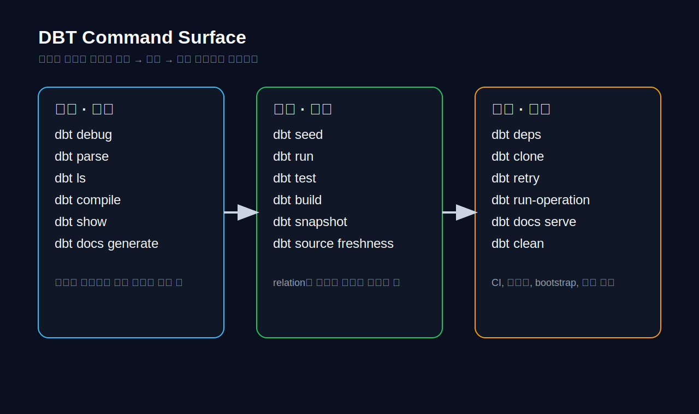
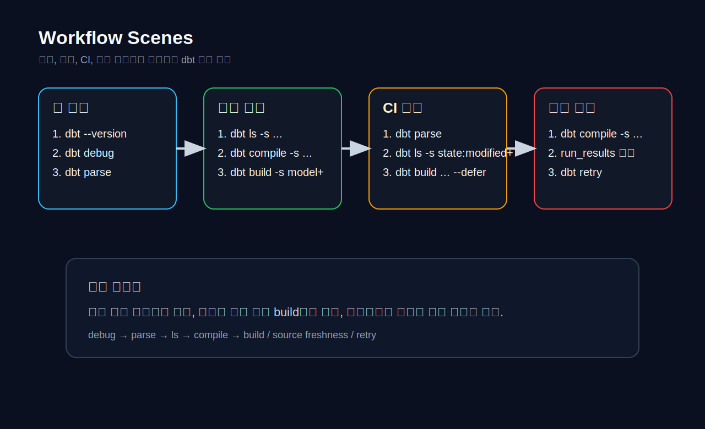
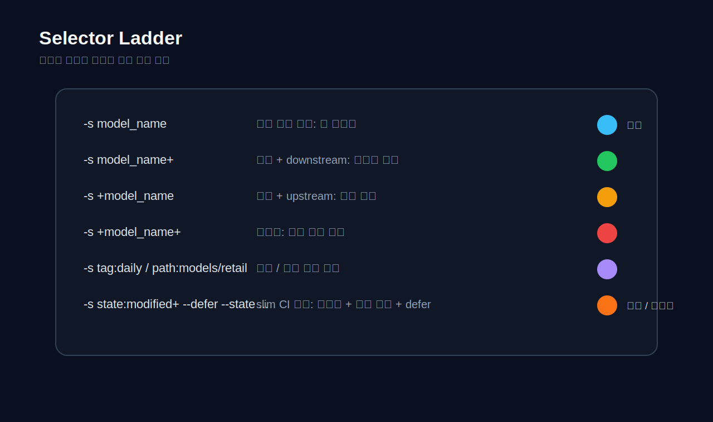

# APPENDIX B · DBT 명령어 레퍼런스

> 이 부록은 dbt 명령어를 단순 치트시트가 아니라 **실행 순서와 운영 장면** 기준으로 다시 묶은 reference chapter다.  
> Chapter 02의 첫 실행, Chapter 05의 디버깅, Chapter 06의 CI/CD, Chapter 18의 Trino 운영형 예시까지 다시 연결하는 **명령어 중심 부록**으로 읽으면 된다.



## B.1. 이 부록을 어떻게 읽을까

많은 입문자는 `dbt run`, `dbt test`, `dbt build` 정도만 기억하고 시작한다.  
하지만 책 전체를 따라오다 보면 실제로 더 자주 쓰는 것은 `dbt debug`, `dbt parse`, `dbt ls`, `dbt compile`, `dbt show`, `dbt source freshness`, `dbt clone`, `dbt retry`, `dbt run-operation` 같은 명령들이다.

이 부록은 명령어를 세 층으로 나눈다.

1. **관찰과 확인**
   - `dbt debug`
   - `dbt parse`
   - `dbt ls`
   - `dbt compile`
   - `dbt show`
   - `dbt docs generate`

2. **관계를 만들고 검증하는 실행**
   - `dbt seed`
   - `dbt run`
   - `dbt test`
   - `dbt build`
   - `dbt snapshot`
   - `dbt source freshness`

3. **운영과 복구**
   - `dbt deps`
   - `dbt clone`
   - `dbt retry`
   - `dbt run-operation`

핵심은 명령 하나를 외우는 것이 아니라, **어떤 장면에서 어떤 순서로 호출하는가**를 익히는 것이다.  
예를 들어 YAML을 수정했을 때는 `run`보다 `parse`가 먼저고, Jinja를 손댔을 때는 `compile`이 먼저며, 실패한 배치를 복구할 때는 처음부터 다시 `build`하는 대신 `retry`나 `clone`이 더 적합할 수 있다.

## B.2. 명령어를 기능이 아니라 실행 흐름으로 이해하기

### B.2.1. 가장 먼저 잡아야 할 기본 루프



dbt 프로젝트의 기본 루프는 다음과 같이 기억하면 편하다.

```text
설치/연결 확인
  ↓
구조 확인
  ↓
선택 범위 확인
  ↓
컴파일/미리보기
  ↓
실행
  ↓
검증
  ↓
문서/아티팩트 확인
```

이 루프를 명령으로 바꾸면 대개 아래와 같다.

```bash
dbt --version
dbt debug
dbt parse
dbt ls -s ...
dbt compile -s ...
dbt show --select ...
dbt build -s ...
dbt docs generate
```

이 순서는 입문자에게도 중요하지만, 실무 운영에서도 그대로 통한다.  
전체 프로젝트를 매번 `dbt build`로 밀어붙이기보다, **문제 범위를 줄이고 관찰한 뒤 실행하는 습관**이 장기적으로 훨씬 안정적이다.

### B.2.2. read 계열과 write 계열을 구분하자

| 구분 | 명령 | 무엇을 하나 | 언제 먼저 쓰는가 |
| --- | --- | --- | --- |
| read 중심 | `debug`, `parse`, `ls`, `compile`, `show`, `docs generate` | 현재 상태를 관찰하거나 산출물을 만든다 | 고치기 전, 범위를 확인할 때 |
| write 중심 | `seed`, `run`, `test`, `build`, `snapshot`, `clone`, `run-operation` | relation, 테스트 결과, snapshot, 운영 대상에 영향을 준다 | dev/prod 대상과 schema를 확인한 뒤 |
| hybrid | `source freshness`, `retry` | freshness 결과 계산, 실패 범위 재실행 | 운영 중 체크·복구 장면 |

특히 `show`는 관계를 새로 materialize하지 않고 **선택한 노드의 결과를 미리 보기**하는 데 유용하고, `source freshness`는 source SLA를 점검하면서 `sources.json` artifact를 남기는 흐름으로 이해하면 좋다.

## B.3. 설치·연결·프로젝트 준비 명령

### B.3.1. `dbt --version`

가장 먼저 adapter가 인식되는지 확인한다.

```bash
dbt --version
```

이 명령으로 확인할 것:

- 현재 dbt Core / adapter 버전
- 원하는 가상환경이 활성화되어 있는지
- 여러 Python 환경이 섞이지 않았는지

### B.3.2. `dbt init`

새 프로젝트의 가장 작은 시작점이다.

```bash
dbt init retail_dbt_lab
```

이 부록에서는 새 프로젝트 생성 자체보다, **초기화 후 어떤 파일을 먼저 보는가**가 더 중요하다.

1. `dbt_project.yml`
2. `profiles.yml`
3. `models/`
4. `packages.yml`

### B.3.3. `dbt deps`

패키지를 설치하거나 갱신한다.

```bash
dbt deps
```

이 명령이 필요한 대표 장면:

- `packages.yml`을 처음 추가했을 때
- package 버전을 올렸을 때
- 새 개발 환경에서 프로젝트를 처음 띄울 때

package를 많이 쓰는 팀일수록 `dbt deps`를 환경 bootstrap 루틴에 포함시키는 편이 안정적이다.

### B.3.4. `dbt debug`

프로젝트/설치/연결의 1차 헬스체크다.

```bash
dbt debug
dbt debug --config-dir
```

`dbt debug`는 “SQL이 틀렸는가?”보다 앞 단계의 질문에 답한다.

- profile 이름이 맞는가
- adapter가 설치되어 있는가
- 연결이 실제로 되는가
- `profiles.yml` 위치가 맞는가

Trino처럼 서비스가 떠 있지 않으면 SQL이 맞아도 이 단계에서 막힌다.  
업무 메모에 있던 `localhost:8080 Connection refused` 사례는 모델 오류가 아니라 **Trino 프로세스/권한 문제**였고, 이런 유형은 반드시 `debug` 관점에서 먼저 분리해서 봐야 한다.

## B.4. 구조와 범위를 확인하는 명령

### B.4.1. `dbt parse`

연결 없이 graph와 YAML 구조를 빠르게 확인한다.

```bash
dbt parse
dbt parse --warn-error
```

언제 좋은가:

- `sources.yml`을 고쳤을 때
- `schema.yml` 들여쓰기를 수정했을 때
- tests, exposures, semantic 설정을 바꿨을 때
- CI에서 최소 정적 검사를 하고 싶을 때

### B.4.2. `dbt ls`

실행 전에 **무엇이 선택되는지** 나열한다.

```bash
dbt ls -s +fct_orders+
dbt ls -s path:models/retail
dbt ls -s state:modified+
dbt ls -s source:raw_retail.orders
```

실무에서 `dbt ls`는 사소해 보이지만 아주 중요하다.  
특히 selector가 복잡해질수록 바로 `build`를 날리기보다 `ls`로 노드 범위를 먼저 확인하는 편이 훨씬 안전하다.

### B.4.3. `dbt compile`

Jinja, `ref()`, `source()`, macro가 어떤 SQL로 풀리는지 확인한다.

```bash
dbt compile -s stg_orders
dbt compile -s case03_branch_query
```

좋은 장면:

- `run_query()` 분기나 loop를 손댔을 때
- `incremental merge`가 어떤 SQL로 생성되는지 보고 싶을 때
- `dbt_internal_source` / `dbt_internal_dest` 관련 오류를 재현할 때
- custom materialization이나 macro override를 손댔을 때

### B.4.4. `dbt show`

작은 결과를 빠르게 확인한다.

```bash
dbt show --select stg_orders
dbt show --select fct_orders --limit 20
```

`show`는 “이미 만들어진 테이블을 그냥 읽는 도구”라기보다, **선택한 노드를 기준으로 결과를 preview하는 명령**으로 이해하는 편이 정확하다.  
작게 데이터를 훑어보는 장면에서는 `run`보다 훨씬 가볍고 안전하다.

## B.5. 모델을 만들고 검증하는 명령

### B.5.1. `dbt seed`

작은 참조 데이터를 프로젝트 안에서 relation로 올린다.

```bash
dbt seed
dbt seed -s country_codes
```

대표 장면:

- 국가 코드, 상태 코드, 매핑 테이블 적재
- 학습용 초기 참조 데이터 복원
- Day 1 bootstrap의 일부

### B.5.2. `dbt run`

선택한 모델을 materialize한다.

```bash
dbt run -s stg_orders
dbt run -s int_order_lines+
dbt run -s tag:daily
```

가장 많이 쓰는 개발 루틴:

```bash
dbt run -s stg_orders
dbt run -s fct_orders
```

하지만 모델을 하나 고쳤을 때도 무조건 `run`만 쓰는 건 아쉽다.  
테스트까지 같이 보고 싶다면 보통 `build`가 더 자연스럽다.

### B.5.3. `dbt test`

generic, singular, unit test를 실행한다.

```bash
dbt test
dbt test -s test_type:generic
dbt test -s test_type:singular
dbt test -s test_type:unit
```

좋은 습관:

- key / grain / relationships 확인용 generic test
- 도메인 규칙 확인용 singular test
- 계산 로직 확인용 unit test

### B.5.4. `dbt build`

가장 자주 쓰는 “실행 + 검증” 명령이다.

```bash
dbt build -s fct_orders+
dbt build -s +events_daily+
dbt build -s state:modified+ --defer --state path/to/prod_artifacts
```

`build`는 model / test / snapshot 등 buildable resource를 한 흐름에서 실행한다.  
입문자에게는 `run + test`를 손으로 연결하는 습관을 만들어 주고, 실무자에게는 CI의 기본 명령이 된다.

### B.5.5. `dbt snapshot`

상태 이력을 남긴다.

```bash
dbt snapshot
dbt snapshot -s orders_status_snapshot
```

대표 장면:

- 주문 상태 변화
- 구독 상태 변화
- slowly changing dimension 유사 이력 보존

### B.5.6. `dbt source freshness`

raw source의 freshness SLA를 확인한다.

```bash
dbt source freshness
dbt source freshness -s source:raw_retail.orders
```

이 명령은 source freshness 결과를 계산하고 `sources.json`을 남긴다.  
source freshness는 `dbt build`의 자동 일부라기보다 **별도의 운영 확인 루틴**으로 기억하는 편이 좋다.

## B.6. selector와 옵션을 제대로 이해하기



### B.6.1. 가장 자주 쓰는 표현

| 표현 | 뜻 | 빠른 기억법 |
| --- | --- | --- |
| `-s model_name` | 그 모델만 | 가장 좁은 범위 |
| `-s model_name+` | 현재 + downstream | 소비처 확인 |
| `-s +model_name` | 현재 + upstream | 원인 추적 |
| `-s +model_name+` | 양방향 | 전체 영향 확인 |
| `-s tag:daily` | 태그 선택 | 배치 주기 |
| `-s path:models/retail` | 경로 선택 | 트랙 단위 |
| `-s source:raw_retail.orders` | source 선택 | raw 중심 |
| `-s state:modified+` | 변경분 + 영향 범위 | slim CI 핵심 |

### B.6.2. `--exclude`

넓게 잡은 뒤 일부를 뺄 때 쓴다.

```bash
dbt build -s marts --exclude tag:slow
```

### B.6.3. `--defer --state`

운영/CI에서 upstream를 이전 상태로 참조하게 한다.

```bash
dbt build -s state:modified+ --defer --state path/to/prod_artifacts
```

이 패턴은 slim CI의 핵심이다.  
내 PR에서 바뀐 부분만 계산하고, 나머지 upstream는 이미 배포된 상태를 참조하게 한다.

### B.6.4. `--vars`

실행 시 파라미터를 주입한다.

```bash
dbt run -s case05_use_parameter --vars '{"from_date":"20260101","to_date":"20260102"}'
dbt run -s case01_truncate_insert --vars '{"airflow_run_id":"123456","from_dt":"2026-04-02","end_dt":"2026-04-08"}'
```

업무 메모에 있던 Trino/Airflow 샘플처럼, `--vars`는 날짜 범위나 외부 배치 ID를 dbt 실행에 싣는 데 자주 쓰인다.  
다만 너무 많은 제어를 vars에 몰아넣으면 SQL보다 실행 명령이 더 복잡해지므로, **반복되는 제어는 macro나 control table로 옮길지** 함께 판단해야 한다.

## B.7. 운영과 복구 명령

### B.7.1. `dbt clone`

기준 state의 노드를 빠르게 복제한다.

```bash
dbt clone -s state:modified+ --state path/to/prod_artifacts
```

큰 테이블이 많은 CI에서 유용하다.  
특히 프로덕션의 큰 relation을 그대로 참조하거나 복제해, CI 시간을 줄이는 데 도움이 된다.

### B.7.2. `dbt retry`

직전 실행의 실패 범위를 다시 시도한다.

```bash
dbt retry
```

대표 장면:

- 네트워크/warehouse 일시 실패
- 배치 중간에 일부만 실패
- 전체를 처음부터 다시 돌리기 아까운 경우

### B.7.3. `dbt run-operation`

관리용 macro를 실행한다.

```bash
dbt run-operation backfill_partition --args '{"from_date":"2026-04-01","to_date":"2026-04-07"}'
dbt run-operation register_upstream_external_models
```

이 명령은 모델을 materialize하는 것이 아니라 **운영 매크로를 직접 호출**하는 장면에서 쓴다.  
정리 작업, bootstrap, catalog 등록, 보조 메타데이터 작업에 자주 쓴다.

### B.7.4. `dbt clean`

로컬 산출물 정리에 쓴다.

```bash
dbt clean
```

`target/`, `dbt_packages/` 같은 산출물을 정리한 뒤 다시 `deps`/`compile`을 해 보는 것도 디버깅에 유용하다.

## B.8. docs와 semantic 계열 명령

### B.8.1. `dbt docs generate`

문서 artifact를 만든다.

```bash
dbt docs generate
```

무엇이 갱신되는가:

- `manifest.json`
- `catalog.json`
- lineage, description, column metadata

### B.8.2. `dbt docs serve`

로컬에서 문서 사이트를 확인한다.

```bash
dbt docs serve
```

책 전체에서는 docs generate를 더 자주 쓰지만, 로컬에서 lineage를 빠르게 확인할 때는 serve도 여전히 유용하다.

### B.8.3. semantic 관련 명령

Semantic Layer를 쓰는 팀이라면 아래 흐름을 별도 운영 루틴으로 둔다.

```bash
dbt parse
dbt sl list metrics
dbt sl validate
dbt sl query --metrics gross_revenue --group-by order__order_date
```

semantic 기능을 아직 도입하지 않은 팀은 이 루틴을 나중으로 미루고, 먼저 `parse → build → docs` 루프를 굳히는 편이 낫다.

## B.9. 장면별 추천 명령 시나리오

### B.9.1. 설치 직후 첫 확인

```bash
dbt --version
dbt debug
dbt parse
```

### B.9.2. YAML을 고친 직후

```bash
dbt parse
dbt ls -s source:raw_retail.orders
```

### B.9.3. Jinja/macro를 고친 직후

```bash
dbt compile -s case03_branch_query
dbt show --select case03_branch_query
```

### B.9.4. 모델 하나를 고친 직후

```bash
dbt build -s model_name+
```

### B.9.5. source SLA를 확인할 때

```bash
dbt source freshness -s source:raw_events.app_events
```

### B.9.6. PR에서 변경분만 확인할 때

```bash
dbt build -s state:modified+ --defer --state path/to/prod_artifacts
```

### B.9.7. 실패 후 복구할 때

```bash
dbt retry
```

## B.10. 세 casebook를 명령어로 다시 보기

### B.10.1. Retail Orders

```bash
dbt seed -s country_codes
dbt build -s +fct_orders+
dbt source freshness -s source:raw_retail.orders
dbt snapshot -s orders_status_snapshot
```

Retail Orders는 fanout, grain, fact/dim, snapshot, contract starter를 가장 먼저 훈련하기 좋은 트랙이다.

### B.10.2. Event Stream

```bash
dbt build -s stg_events+
dbt build -s events_sessions+
dbt source freshness -s source:raw_events.app_events
dbt build -s state:modified+ --defer --state path/to/prod_artifacts
```

Event Stream은 late-arriving data, daily/session grain, microbatch, semantic-ready surface가 중심이다.

### B.10.3. Subscription & Billing

```bash
dbt build -s stg_subscriptions+
dbt snapshot -s subscription_status_snapshot
dbt build -s fct_mrr+
dbt source freshness -s source:raw_billing.invoices
```

Subscription & Billing은 state change, snapshot, versioned public surface, finance/BI 소비면의 차이를 다루기에 좋다.

## B.11. Trino 운영형 예시를 명령어 관점으로 다시 읽기

업무 메모에서 가져온 사례를 명령어 관점으로 다시 요약하면 이렇다.

### B.11.1. Trino 서비스가 안 떠 있을 때

```bash
dbt debug
```

여기서 `localhost:8080` connection refused가 나면, 모델 로직을 보기 전에 Trino 프로세스/권한부터 확인해야 한다.

### B.11.2. `merge + unique_key` 오류를 재현할 때

```bash
dbt compile -s case03_branch_query
dbt run -s case03_branch_query
```

이 장면에서 봐야 하는 것:

1. compiled SQL
2. source 쪽 key 존재 여부
3. target 쪽 key 존재 여부
4. `dbt_internal_source` / `dbt_internal_dest` alias가 어떤 merge SQL로 만들어졌는지

### B.11.3. Airflow run id와 날짜 범위를 넘길 때

```bash
dbt run -s case01_truncate_insert --vars '{"airflow_run_id":"{{ run_id }}","from_dt":"2026-04-02","end_dt":"2026-04-08"}'
```

명령어 레벨에서 중요한 건 **vars는 실행 계약의 일부**라는 점이다.  
같은 모델이라도 배치 context가 다르면 명령행도 함께 버전 관리 대상으로 봐야 한다.

## B.12. 자주 하는 실수

1. `dbt debug`를 건너뛰고 바로 `run`부터 시작한다.
2. 복잡한 selector를 `dbt ls` 없이 바로 실행한다.
3. `compile`을 생략한 채 macro/Jinja 오류를 SQL 오류로 오해한다.
4. source freshness를 build 일부로 오해한다.
5. `retry`나 `clone` 대신 무조건 전체 build를 다시 실행한다.
6. `--vars`를 너무 많이 쌓아 두고 실행 계약을 문서화하지 않는다.
7. Trino나 Snowflake처럼 환경 문제가 흔한 플랫폼에서 target/schema/warehouse를 확인하지 않는다.

## B.13. 가장 많이 참조하게 될 미니 치트시트

| 장면 | 먼저 칠 명령 | 다음 명령 |
| --- | --- | --- |
| 연결이 의심될 때 | `dbt debug` | `dbt parse` |
| YAML/source가 의심될 때 | `dbt parse` | `dbt ls -s ...` |
| macro/Jinja가 의심될 때 | `dbt compile -s ...` | `dbt show --select ...` |
| 모델 하나를 검증할 때 | `dbt build -s model+` | `dbt docs generate` |
| source SLA 확인 | `dbt source freshness` | `dbt build -s ...` |
| PR slim CI | `dbt build -s state:modified+ --defer --state ...` | 필요 시 `dbt retry` |
| 운영용 macro 호출 | `dbt run-operation ...` | 로그/산출물 확인 |

## B.14. 코드 인덱스

이 부록과 함께 제공되는 snippet:

- `codes/04_chapter_snippets/app_b/local_dev_loop.sh`
- `codes/04_chapter_snippets/app_b/ci_slim_loop.sh`
- `codes/04_chapter_snippets/app_b/trino_airflow_vars_examples.sh`
- `codes/04_chapter_snippets/app_b/semantic_cli_examples.sh`
- `codes/04_chapter_snippets/app_b/selector_examples.sh`

필요할 때 이 부록은 “한 번에 다 읽는 장”보다 **실행 중 옆에 띄워 두는 레퍼런스**처럼 쓰는 편이 더 좋다.
