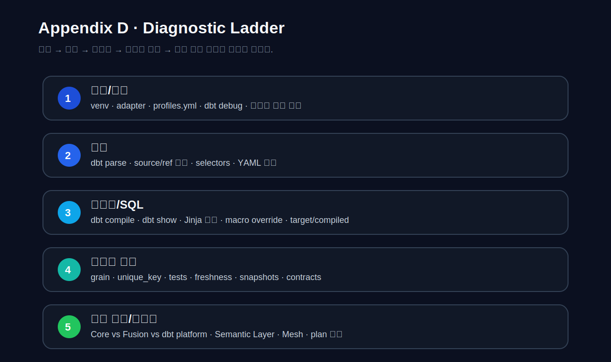
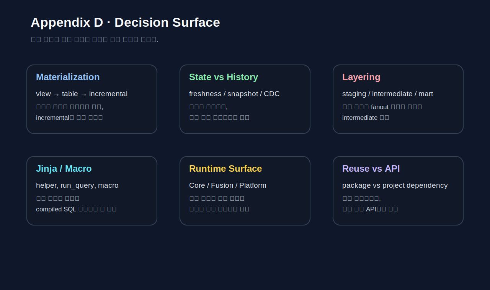
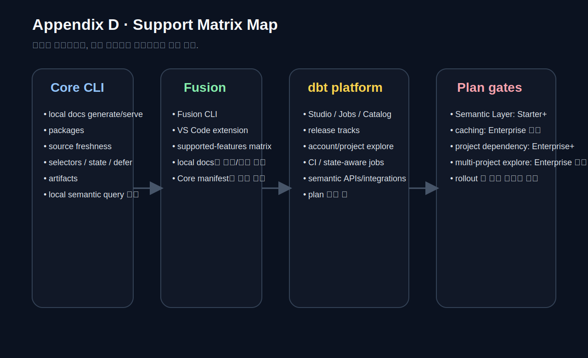

# APPENDIX D · Troubleshooting, Decision Guides, Glossary, Official Sources, Support Matrix

실무에서 자주 꺼내 보는 정보는 두 가지다.  
첫째는 **지금 어디가 고장 났는지 빠르게 좁히는 정보**다.  
둘째는 **지금 하려는 선택이 구조적으로 맞는지 판별하는 기준**이다.

이 부록은 그 두 가지를 한 곳에 모은다.  
앞선 본문이 개념과 사례를 설명했다면, 이 부록은 그 개념과 사례를 다시 꺼내 쓸 때 필요한 **백맵(back map)** 역할을 한다.

핵심 원칙은 단순하다.

1. 전체 실행을 반복하기 전에 **문제 범위를 줄인다**.
2. SQL만 다시 쓰기 전에 **compiled SQL, artifacts, selector 결과**를 먼저 본다.
3. 지금 고민이 “오류 해결”인지 “설계 선택”인지 먼저 구분한다.
4. platform/plan/engine 차이가 개입되는 기능은 **가용성부터 확인**한다.

---

## D.1. 이 부록을 어떻게 쓰면 좋은가

이 부록은 처음부터 끝까지 읽는 장이 아니다.  
문제가 생겼을 때는 **D.2 Troubleshooting**, 설계 판단이 필요할 때는 **D.3 Decision Guides**, 용어가 헷갈릴 때는 **D.4 Glossary**, 최신성 확인이 필요할 때는 **D.5 Official Sources**, 기능 가용성이 궁금할 때는 **D.6 Support Matrix**로 바로 가면 된다.

세 casebook를 다시 연결할 때는 아래를 기준으로 생각하면 된다.

- **Retail Orders**: grain / fanout / status 기반 KPI 규칙
- **Event Stream**: freshness / incremental / late-arriving / microbatch
- **Subscription & Billing**: 상태 이력 / snapshot / 공용 API surface / versioning

아래 그림은 이 부록의 성격을 요약한다.



---

## D.2. Troubleshooting · 실패를 좁히는 진단 사다리

### D.2.1. 가장 먼저 구분할 것: 연결 문제인가, 구조 문제인가, 데이터 문제인가

dbt에서 실패는 얼핏 비슷해 보여도 성격이 다르다.  
성격을 구분하지 못하면 가장 느린 방법인 “전체 재실행”을 반복하게 된다.

문제를 크게 다섯 층으로 나누면 빠르게 좁힐 수 있다.

1. **로컬/연결 층**
   - 가상환경
   - adapter 설치
   - profile
   - database connection
   - 네트워크, 권한, 서비스 기동 상태

2. **프로젝트 구조 층**
   - `dbt_project.yml`
   - `profiles.yml`
   - YAML 파싱
   - `source()` / `ref()` 이름 불일치
   - selector 오해

3. **컴파일 층**
   - Jinja 분기
   - macro override
   - compiled SQL
   - `is_incremental()`
   - `run_query()` side effect

4. **데이터 계약 층**
   - `unique_key`
   - `grain`
   - source freshness
   - relationships
   - contract / constraints
   - snapshot strategy

5. **운영/가용성 층**
   - Core vs Fusion
   - dbt platform plan 제한
   - Semantic Layer availability
   - project dependency / Mesh availability
   - docs / Catalog / Studio 차이

문제를 볼 때는 “어느 층인가?”를 먼저 묻는다.

---

### D.2.2. 기본 진단 루프

#### 1단계. 연결과 설치를 분리한다

```bash
dbt --version
dbt debug
```

여기서 막히면 아직 모델 SQL로 넘어가면 안 된다.

#### 2단계. 구조를 본다

```bash
dbt parse
dbt ls -s my_model+
```

이 단계는 YAML, selector, DAG 범위를 검증한다.

#### 3단계. SQL을 본다

```bash
dbt compile -s my_model
dbt show --select my_model
```

Jinja, `source()`, `ref()`, macro 결과를 확인한다.

#### 4단계. 최소 범위만 실행한다

```bash
dbt build -s my_model+
```

필요한 upstream/downstream만 포함한다.

#### 5단계. artifacts로 원인을 남긴다

확인 순서:

1. `target/compiled/`
2. `target/run/`
3. `target/run_results.json`
4. `target/manifest.json`
5. `target/sources.json`
6. `logs/dbt.log`

---

### D.2.3. Trino 연결 오류 카드 · `localhost:8080 connection refused`

이 오류는 SQL이 틀린 것이 아니라 **Trino coordinator에 연결하지 못한 경우**에 가깝다.  
업로드된 실제 장애 기록에서는 `./launcher run`으로 띄운 Trino가 죽어 있었고, `launcher.pid` 권한 문제 때문에 `sudo ./launcher run`으로 재기동해야 했다.

대표 증상:

```text
HTTPConnectionPool(host='localhost', port=8080): Max retries exceeded
Failed to establish a new connection: [Errno 111] Connection refused
```

먼저 볼 것:

1. Trino coordinator가 떠 있는가
2. `host`, `port`, `method`, `database`, `schema`가 profile과 일치하는가
3. `dbt debug`가 통과하는가
4. `curl http://localhost:8080/v1/info` 같은 health check가 되는가
5. PID/권한 문제는 없는가

Trino preflight 예시는 companion snippet에 포함되어 있다.

```bash
bash codes/04_chapter_snippets/app_d/trino_connection_preflight.sh
```

---

### D.2.4. Trino incremental merge 오류 카드 · `dbt_internal_source.id cannot be resolved`

이 오류는 대개 `incremental_strategy='merge'`와 `unique_key='id'`를 설정해 두고, **source 쪽 SELECT 결과에 `id` 컬럼이 없을 때** 발생한다.

대표 증상:

```text
Column 'dbt_internal_source.id' cannot be resolved
```

이럴 때 묻는 질문:

1. 최종 SELECT에 `id`가 진짜 존재하는가
2. alias 때문에 이름이 바뀌진 않았는가
3. 분기 SQL(`if/elif/else`)의 모든 경로에서 `id`를 반환하는가
4. `run_query()` 결과에 따라 빈 경로나 다른 컬럼명이 나오지 않는가

빠른 확인:

```bash
dbt compile -s case03_branch_query
```

그리고 `target/compiled/.../case03_branch_query.sql`에서 최종 SELECT 컬럼을 직접 본다.

---

### D.2.5. Trino incremental merge 오류 카드 · `dbt_internal_dest.id cannot be resolved`

이번엔 반대다.  
source SELECT에는 `id`가 있지만 **타겟 테이블에 `id` 컬럼이 없을 때** 난다.

대표 증상:

```text
Column 'dbt_internal_dest.id' cannot be resolved
```

확인 순서:

1. 기존 테이블 스키마를 직접 조회한다.
2. target relation이 예전 구조로 남아 있지는 않은가
3. full refresh가 필요한 구조 변경이었는가
4. merge가 아니라 append/table로 가야 하는 모델은 아닌가

빠른 확인 예시:

```sql
DESCRIBE iceberg.sample_db.case03_branch_query;
```

또는 companion snippet의 precheck SQL을 사용한다.

```sql
-- codes/04_chapter_snippets/app_d/trino_merge_unique_key_precheck.sql
```

---

### D.2.6. `run_query()`가 compile/docs generate에서도 실행되는 문제

`run_query()`는 Jinja helper지만, live connection이 있으면 **`dbt compile`이나 `dbt docs generate` 중에도 실제로 SQL을 날릴 수 있다**.  
그래서 다음 원칙을 지켜야 한다.

1. `if execute`로 감싼다.
2. side effect가 있는 DML/DDL은 model body보다 `run-operation`이나 hook로 뺀다.
3. compile 시점 기본값을 명시한다.
4. 결과가 0행일 때 fallback을 둔다.

안전한 패턴:

```jinja

    select country_code
    from {{ source('ops', 'country') }}



    
    

    

```

---

### D.2.7. source freshness가 안 맞을 때

대표 증상:

- source freshness가 stale
- 배치는 성공했는데 대시보드 수치가 어제 값
- `dbt build --select source_status:fresher+`가 기대만큼 안 좁혀짐

먼저 볼 것:

1. source YAML의 `loaded_at_field`
2. freshness 기준 (`warn_after`, `error_after`)
3. source raw table의 실제 적재 시각
4. `target/sources.json`
5. upstream batch의 실패/지연 여부

이 문제는 Event Stream casebook에서 가장 자주 드러난다.

---

### D.2.8. docs, Catalog, Studio, VS Code extension 혼동

현재 운영 표면은 비슷해 보여도 서로 다르다.

- **Core CLI**: `dbt docs generate`, `dbt docs serve`
- **Fusion**: VS Code extension, Fusion CLI, supported-features matrix
- **dbt platform**: Studio, Catalog, environments, jobs

자주 생기는 오해:

1. Core 프로젝트에 VS Code extension을 붙이려고 한다.
2. Fusion에서 Core와 똑같이 local docs를 기대한다.
3. Catalog와 `dbt docs`를 같은 것으로 본다.

이건 “오류”라기보다 **실행 표면을 잘못 선택한 문제**다.

---

### D.2.9. 문제 해결 체크리스트 20

아래는 실무에서 가장 자주 쓰는 체크리스트다.

1. 가상환경이 활성화되어 있는가  
2. `dbt --version`에 adapter가 함께 보이는가  
3. `dbt debug`가 통과하는가  
4. profile 이름과 `profiles.yml` 최상위 키가 같은가  
5. `dbt parse`로 YAML 구조를 먼저 검증했는가  
6. `dbt ls -s ...`로 selector 결과를 보았는가  
7. 실패 범위를 `-s model_name`까지 줄였는가  
8. `dbt compile -s ...`로 compiled SQL을 보았는가  
9. `target/compiled`와 `target/run`을 구분해서 보고 있는가  
10. `logs/dbt.log`를 열어 보았는가  
11. `run_results.json`으로 실패 지점을 확인했는가  
12. `sources.json`으로 freshness 상태를 확인했는가  
13. `source()` / `ref()` 이름이 실제 정의와 같은가  
14. relation 이름을 직접 하드코딩하지 않았는가  
15. `unique_key`가 source와 target 양쪽에 존재하는가  
16. `grain`을 문장으로 설명할 수 있는가  
17. 문제를 데이터 품질과 로직 오류로 분리했는가  
18. hook / `run_query()`가 compile 시점에도 실행될 수 있음을 고려했는가  
19. platform/plan/engine 제약이 없는지 확인했는가  
20. full refresh가 필요한 구조 변경인지 판단했는가  

---

## D.3. Decision Guides · 설계 선택을 위한 질문 순서



### D.3.1. materialization 선택표

| 상황 | 추천 | 이유 | 지금 보류해야 할 경우 |
| --- | --- | --- | --- |
| 모델이 아직 자주 바뀌고 빠르게 확인해야 한다 | `view` | 수정-재실행 루프가 빠르다 | 조회 비용/지연이 이미 문제라면 `table` 검토 |
| downstream 조회가 많고 결과를 안정적으로 재사용해야 한다 | `table` | 읽기 속도와 예측 가능성이 높다 | 전체 재생성 비용이 너무 크면 incremental 고민 |
| append 중심 대용량이고 `unique_key`와 재처리 기준이 명확하다 | `incremental` | 전체 재생성 비용을 줄인다 | late-arriving / lookback 규칙이 비어 있으면 아직 금지 |
| 아주 작은 helper 로직을 인라인해도 충분하다 | `ephemeral` | relation을 만들지 않고 SQL만 재사용 | 재사용/디버깅 포인트가 필요하면 view/table |

한 문장 규칙:  
**정확한 모델 구조와 테스트가 먼저고, incremental은 그다음 최적화다.**

---

### D.3.2. snapshot을 언제 쓰는가

| 질문 | snapshot | 다른 대안 |
| --- | --- | --- |
| 현재 상태만 있는 테이블에서 과거 상태 이력이 필요하다 | 예 | snapshot |
| 원천이 이미 CDC / history table을 제공한다 | 아니오 | 그 이력 source를 그대로 모델링 |
| 작은 코드 매핑이나 상태 사전이다 | 아니오 | seed |
| 상태 변화 시점을 나중에 분석해야 한다 | 예 | check / timestamp strategy 검토 |

Subscription & Billing casebook에서는 status history가 필요할 때 snapshot이 자연스럽다.

---

### D.3.3. intermediate를 언제 만드는가

| 징후 | intermediate로 올릴까? | 설명 |
| --- | --- | --- |
| 같은 join이 mart 두세 곳에 반복된다 | 예 | 재사용 가능한 join/logic을 한 번으로 모은다 |
| line grain 계산이 있고 여러 최종 모델이 소비한다 | 예 | mart마다 fanout 설명을 줄인다 |
| 한 mart 안에서만 한 번 쓰이고 다시 설명할 필요가 없다 | 아니오 | 파일 수만 늘 수 있다 |
| staging이 giant SQL처럼 길어지고 rename·join·집계가 섞인다 | 예 | 책임 경계를 다시 나눌 신호다 |

Retail Orders의 `int_order_lines`, Event Stream의 `int_sessions`, Subscription의 `int_subscription_status_daily`가 대표 예다.

---

### D.3.4. macro를 언제 묶는가

| 질문 | macro로 묶기 | 그냥 SQL로 둔다 |
| --- | --- | --- |
| 같은 SQL 조각이 세 번 이상 반복되고 함께 바뀌어야 하는가 | 예 | 반복 제거와 변경 일관성 |
| 모델 로직보다 템플릿 문법이 더 많이 보이는가 | 아니오 | 가독성이 먼저 |
| 팀원이 compiled SQL 없이 읽기 어려운가 | 아니오 | 추상화가 과한 신호 |
| 환경 변수 주입이나 가벼운 포맷 변환 정도인가 | 예 | macro가 잘 맞는다 |

---

### D.3.5. `run_query()`를 쓸까, operation으로 뺄까

| 상황 | 추천 | 이유 |
| --- | --- | --- |
| 조회 결과로 분기할 뿐이고 side effect가 없다 | `run_query()` + `if execute` | model/Jinja 안에서 안전하게 제어 가능 |
| DDL/DML을 직접 실행해야 한다 | `dbt run-operation` / hook | compile/docs generate 중 side effect 방지 |
| 반복 실행·로깅·배치 파라미터가 중요하다 | hook + `var()` + operation | 운영형 실행 흐름과 잘 맞는다 |

업로드된 Trino 예시의 logging macro와 `case02~06`은 이 기준으로 읽으면 된다.

---

### D.3.6. package dependency vs project dependency

| 질문 | package dependency | project dependency |
| --- | --- | --- |
| 다른 프로젝트의 전체 소스코드를 함께 설치해도 되는가 | 예 | package로 충분 |
| cross-project ref와 메타데이터 서비스가 필요한가 | 아니오 | project dependency 검토 |
| dbt platform Enterprise / Enterprise+가 있는가 | 없어도 됨 | 있어야 의미 있음 |
| “코드 재사용”이 중심인가 “공개 모델 API”가 중심인가 | 코드 재사용 | 공개 모델 API |

---

### D.3.7. Core / Fusion / dbt platform 중 어디를 쓸까

| 지금 목적 | 추천 표면 | 이유 |
| --- | --- | --- |
| 로컬에서 CLI와 파일 중심으로 배우고 싶다 | Core CLI | 가장 직관적이고 교재와 잘 맞다 |
| Fusion 기반 개발 경험과 extension을 쓰고 싶다 | Fusion + VS Code extension | extension은 Fusion 전용 |
| jobs / Catalog / Studio / account-level 운영이 필요하다 | dbt platform | 운영 표면과 메타데이터 경험이 다르다 |

---

### D.3.8. state / defer / clone을 언제 쓰나

| 상황 | 먼저 볼 것 | 이유 |
| --- | --- | --- |
| PR CI에서 수정 범위만 빠르게 검증하고 싶다 | `state:modified+` | 변경된 노드와 downstream만 좁힐 수 있다 |
| 개발 환경에 없는 upstream relation 때문에 CI가 실패한다 | `--defer` | applied state relation을 참조 |
| 반복 개발에서 relation 준비 비용이 크다 | `dbt clone` | zero-copy clone 계열 플랫폼에서 유리 |
| 실패 지점부터 다시 이어가고 싶다 | `dbt retry` | 직전 `run_results.json` 기준 재시도 |

---

## D.4. Glossary · 용어집

### D.4.1. 핵심 용어

| 용어 | 설명 |
| --- | --- |
| adapter | dbt가 데이터플랫폼과 통신하기 위해 쓰는 플러그인 |
| artifact | dbt 실행 후 남는 JSON 산출물. `manifest.json`, `run_results.json`, `sources.json` 등이 있다 |
| contract | 모델이 반환해야 하는 컬럼 형태와 타입에 대한 약속 |
| defer | 현재 환경에 없는 upstream 리소스를 기준 환경의 relation로 참조하는 기능 |
| exposure | 대시보드·앱 등 downstream 사용처를 DAG에 연결하는 정의 |
| freshness | 원천 또는 모델이 얼마나 최근 상태인지 측정하는 기준 |
| grain | 모델 한 행이 무엇을 대표하는지에 대한 약속 |
| hook | 실행 전후에 추가 SQL/동작을 붙이는 config |
| invocation_id | dbt run 한 번을 식별하는 실행 단위 ID |
| materialization | 모델 결과를 어떤 형태로 남길지 정하는 설정 |
| metric | 질문 가능한 지표 정의 |
| node | 모델·테스트·seed·snapshot 등 DAG를 구성하는 리소스 하나 |
| relation | warehouse에 실제로 존재하는 table / view 같은 객체 |
| saved query | semantic surface 위에서 미리 정의한 질의 |
| selector | 실행할 노드를 고르는 문법 (`--select`, tags, state 등) |
| singular test | 자유 SQL로 작성하는 테스트 |
| source | 프로젝트 외부 입력으로 선언된 원천 테이블 |
| state | 이전 실행/기준 환경의 metadata 상태 |
| unique_key | incremental / snapshot에서 레코드를 식별하는 키 |
| unit test | 작은 입력/기대 출력으로 로직을 검증하는 테스트 |

---

## D.5. Official Sources · 공식 자료를 어떤 순서로 볼까

### D.5.1. 추천 조회 순서

1. **현재 표면이 Core인지 Fusion인지 platform인지 먼저 확인**
2. **설치/가용성/plan 제약 문서를 먼저 확인**
3. 그다음 개별 기능 문서로 들어간다.
4. 마지막에 changelog / release track / support matrix를 본다.

### D.5.2. 주제별 공식 문서 지도

| 주제 | 문서 키워드 | 왜 먼저 봐야 하나 |
| --- | --- | --- |
| 설치와 실행 표면 | `Install dbt`, `Install dbt extension`, `Fusion quickstart` | Core / Fusion / extension 혼동 방지 |
| source와 freshness | `Add sources to your DAG`, `Source freshness` | lineage와 freshness는 source 계약의 출발점 |
| tests | `Add data tests to your DAG`, `Unit tests` | generic / singular / unit 역할 분리 |
| snapshots | `Add snapshots to your DAG`, `Snapshot configurations` | YAML snapshot 권장 흐름과 이력 해석 |
| artifacts | `About dbt artifacts`, `run_results.json`, `manifest.json` | state / docs / failure triage 기준 |
| selectors | `Graph operators`, `node selection`, `selectors` | CI와 디버깅 범위를 줄이는 핵심 |
| 운영 | `Defer`, `clone`, `retry`, `continuous integration` | slim CI와 applied state 운영 |
| packages / mesh | `Packages`, `Project dependencies`, `Mesh` | 코드 재사용과 cross-project ref 구분 |
| governance | `Model governance`, `Model access`, `Model versions` | public surface와 안정성 관리 |
| semantic | `dbt Semantic Layer`, `saved queries`, `exports`, `cache` | metric surface와 plan/engine 제약 |
| release / support | `Release tracks`, `About dbt versions`, `Fusion supported features` | 최신 가용성 확인 |

---

## D.6. Support Matrix · Core / Fusion / dbt platform / Plan 차이를 한눈에 보기



아래 표는 책을 읽는 관점에서의 **실무형 요약표**다.  
정확한 rollout 전에는 반드시 공식 문서를 다시 확인해야 한다.

| 기능/표면 | Core CLI | Fusion local | dbt platform | 주의점 |
| --- | --- | --- | --- | --- |
| 로컬 CLI 실행 (`run`, `build`, `test`) | 예 | 예 | 일부는 Studio/Jobs로 대체 | 실행 표면이 다르다 |
| `dbt docs generate/serve` 로컬 docs | 예 | 제한/미지원 구간 있음 | Catalog가 기본 경험 | local docs가 꼭 필요하면 Core가 안전 |
| VS Code extension | 아니오 | 예 | 해당 없음 | extension은 Fusion 전용 |
| packages (`dbt deps`) | 예 | 예 | 예 | package와 project dependency는 다르다 |
| source freshness | 예 | 예 | 예 | `sources.json` artifact 확인 |
| state / defer / clone | 예 | 예 | CI/Jobs와 함께 더 자주 씀 | applied state 운영이 중요 |
| model governance (access, contracts, versions) | 예 | 예 | 예 | plan/표면별 차이 존재 |
| project dependency / cross-project ref | package 방식만 일반적 | 일부/메타데이터 연동 | Enterprise / Enterprise+ 중심 | package와 혼동 금지 |
| Semantic Layer API / integrations | 제한적(local query 중심) | 예 | Starter+ / Enterprise+ 기능 차이 | caching/exports는 plan 차이 큼 |
| Catalog / multi-project explore | 아니오 | 아니오 | platform 기능 | Starter와 Enterprise 범위 차이 |
| Copilot / MCP / Studio AI surface | 아니오 | Fusion/platform 중심 | platform 중심 | 빠르게 변하는 영역 |

### D.6.1. 지원 매트릭스를 읽는 법

1. **엔진 표면**과 **플랜 가용성**을 분리한다.
2. “Core에서 전혀 못 쓴다”와 “Core에선 다른 형태로만 쓴다”를 구분한다.
3. Semantic, Mesh, Catalog, Copilot처럼 빠르게 변하는 영역은 rollout 직전에 공식 문서를 다시 본다.
4. 교재 예제는 우선 Core-compatible 경로를 중심으로 따라가고, platform 기능은 나중에 확장한다.

---

## D.7. 현업 시나리오 실전 지도

### D.7.1. 요청을 dbt 작업으로 바꾸는 4단계

| 단계 | 질문 | 예시 | 산출물 |
| --- | --- | --- | --- |
| 1 | 요청문이 바꾸려는 규칙은 무엇인가? | “취소 주문은 총액에서 빼 주세요” | rule memo |
| 2 | 그 규칙은 어느 grain에서 정의돼야 하는가? | order grain / line grain / customer grain | 수정 레이어 후보 |
| 3 | 가장 가까운 모델은 어디인가? | `stg_orders`, `int_order_lines`, `fct_orders` | 편집 대상 SQL/YML |
| 4 | 무엇으로 검증하고 남길 것인가? | unit test, data test, docs, PR 설명 | review-ready 변경 묶음 |

가장 중요한 질문은 이것이다.

> 이 규칙이 어디서 살아야 가장 재사용 가능하고, 가장 덜 놀라운가?

---

### D.7.2. 시나리오 카드 1 · “취소 주문을 매출에서 제외해 주세요”

| 항목 | 실무 해석 |
| --- | --- |
| 보통 수정 위치 | staging이 아니라 `fct_orders` 같은 mart 집계 규칙 |
| 먼저 실행할 명령 | `dbt build -s fct_orders+` / `dbt show --select fct_orders` |
| 같이 바꿔야 할 것 | unit test, docs, PR 설명 |
| 리뷰어에게 남길 한 줄 | “주문 grain 집계 규칙만 바꾸고 staging의 status 표준화는 유지했다.” |

---

### D.7.3. 시나리오 카드 2 · “오늘 매출이 두 배로 나왔어요”

이 경우는 “SQL 어디가 틀렸지?”보다 먼저 **grain이 바뀌었나 / fanout이 생겼나**를 본다.

빠른 확인:

```sql
select count(*) as rows_all,
       count(distinct order_id) as rows_distinct_order
from {{ ref('int_order_lines') }};
```

문제 해결 루프:

1. `dbt ls -s +fct_orders+`
2. `dbt compile -s fct_orders`
3. join 직후 row 수 확인
4. mart에서 다시 grain을 묶는지 확인
5. singular test / unit test로 재발 방지

---

### D.7.4. 시나리오 카드 3 · “새 raw 원천을 추가해 주세요”

안전한 순서:

1. `sources.yml`에 추가
2. staging에서 타입/상태만 정리
3. 필요하면 intermediate로 재사용 join 분리
4. mart로 KPI surface 올리기
5. docs / tests / selector 갱신

---

### D.7.5. 시나리오 카드 4 · “오늘은 필요한 범위만 다시 돌리고 싶어요”

| 상황 | 먼저 할 일 | 왜 이 순서인가 |
| --- | --- | --- |
| source 적재가 늦어 일부 모델만 다시 돌리고 싶다 | `dbt source freshness` | freshness 기준을 먼저 갱신 |
| fresher source downstream만 다시 빌드하고 싶다 | `dbt build --select source_status:fresher+` | 비용과 시간을 함께 줄인다 |
| PR CI에서 upstream relation이 없다 | `state:modified+` 와 `--defer` 확인 | 적용된 기준 relation을 참조하게 한다 |
| 반복 개발에서 relation 준비 비용이 크다 | `dbt clone` 검토 | zero-copy clone 계열 플랫폼에서 유리 |

---

## D.8. 팀 규칙 템플릿 초안

아래는 책 전반의 운영 원칙을 팀 규칙으로 옮긴 초안이다.

1. 원천을 읽는 첫 모델은 반드시 `source()`에서 시작한다.
2. join 전에 각 모델의 grain을 문장으로 남긴다.
3. fact 계열 모델에는 최소 `not_null`, `unique`, `relationships` 중 필요한 테스트를 붙인다.
4. incremental 도입 전에는 `unique_key`, late-arriving data, full-refresh 기준을 리뷰에서 확인한다.
5. `run_query()`는 `if execute`와 fallback 없이 쓰지 않는다.
6. hook / operation은 compile 시점 side effect를 고려해 분리한다.
7. PR 설명에는 변경된 business rule, 영향 받는 모델, 확인한 selector 범위를 적는다.
8. platform/plan/engine 제약이 있는 기능은 rollout 전에 공식 문서를 다시 확인한다.

---

## D.9. 직접 해보기

### D.9.1. Diagnostic quickstart

```bash
bash codes/04_chapter_snippets/app_d/diagnostic_quickstart.sh
```

### D.9.2. Trino connection preflight

```bash
bash codes/04_chapter_snippets/app_d/trino_connection_preflight.sh
```

### D.9.3. merge unique key precheck

```sql
-- codes/04_chapter_snippets/app_d/trino_merge_unique_key_precheck.sql
```

### D.9.4. state/defer/clone 예시

```bash
bash codes/04_chapter_snippets/app_d/state_defer_clone_examples.sh
```

### D.9.5. vars / Airflow 실행 예시

```bash
bash codes/04_chapter_snippets/app_d/vars_airflow_examples.sh
```

---

## D.10. 마지막 조언

이 부록의 목적은 모든 문제의 답을 외우는 것이 아니다.  
답보다 먼저 **질문 순서**를 익히는 데 있다.

- 지금 이건 연결 문제인가?
- 구조 문제인가?
- 데이터 계약 문제인가?
- 운영 표면을 잘못 고른 문제인가?
- 아니면 단순히 더 좁은 selector부터 봐야 하는 문제인가?

이 질문 순서가 몸에 들어오면, dbt 프로젝트는 훨씬 덜 무너지고 훨씬 빨리 회복된다.
