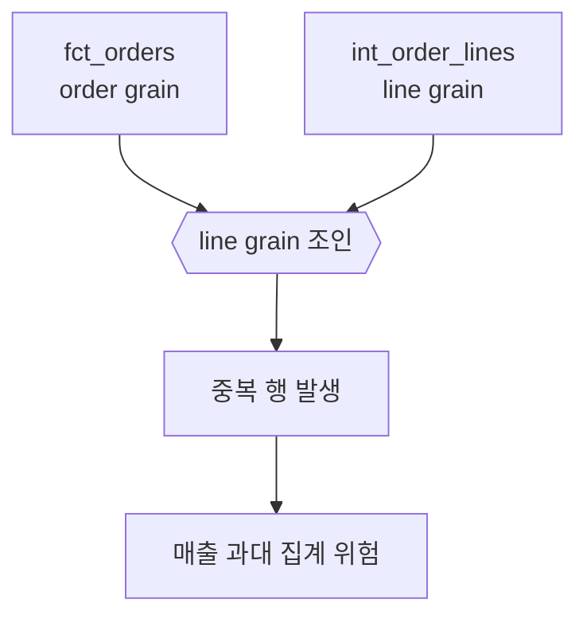

CHAPTER D

Troubleshooting, Decision Guides, Glossary, Official Sources, Support Matrix

실패를 좁히는 체크리스트부터 공식 자료, 용어집, 의사결정 표, 지원 매트릭스까지 책의 백맵 역할을 하는 부록.

| 핵심 개념 → 사례 → 운영 기준 | 설명을 먼저 충분히 풀고, 이후 장에서 예제 케이스북과 플랫폼 플레이북으로 다시 가져간다. |
| --- | --- |

실무에서 자주 꺼내 보는 정보는 대체로 두 종류다. 막혔을 때 어디부터 볼지 알려 주는 정보와, 지금 하려는 선택이 맞는지 판별하는 기준이다. 마지막 부록은 그 두 종류를 하나로 모아 책 전체를 다시 참조할 수 있게 구성했다.

문제 해결 체크리스트

1. 가상환경이 활성화되어 있는가

2. dbt --version에서 adapter가 함께 보이는가

3. dbt debug가 통과하는가

4. profile 이름과 profiles.yml 최상위 키가 같은가

5. 실패 범위를 -s model_name까지 좁혔는가

6. dbt ls -s...로 선택 결과를 확인했는가

7. dbt parse로 구조 오류를 먼저 확인했는가

8. dbt compile -s...로 compiled SQL을 보았는가

9. target/run과 target/compiled를 구분해서 보고 있는가

10. logs/dbt.log를 열어 보았는가

11. 직접 relation 이름 하드코딩으로 lineage를 깨뜨리지 않았는가

12. 테스트 실패를 데이터 품질 문제와 로직 문제로 분리해서 보고 있는가

| 중요한 원칙 전체 실행을 반복하기 전에, 문제 범위를 줄이고 compiled SQL과 관련 artifacts를 보는 것이 가장 큰 시간 절약이다. |
| --- |

용어집

| 용어 | 짧은 설명 |
| --- | --- |
| adapter | dbt가 각 데이터플랫폼과 통신하기 위해 쓰는 플러그인 |
| artifact | dbt 실행 후 남는 JSON 산출물. manifest.json, run_results.json, sources.json 등이 있다 |
| contract | 모델이 반환해야 하는 컬럼 형태와 타입에 대한 약속 |
| defer | 현재 환경에 없는 upstream 리소스를 기준 환경의 relation로 참조하는 기능 |
| exposure | 대시보드·앱 등 downstream 사용처를 DAG에 연결하는 정의 |
| freshness | 원천 또는 모델이 얼마나 최근 상태인지 측정하는 기준 |
| grain | 모델 한 행이 무엇을 대표하는지에 대한 약속 |
| materialization | 모델 결과를 어떤 형태(view/table/incremental 등)로 남길지 정하는 설정 |
| node | 모델·테스트·seed·snapshot 등 DAG를 구성하는 리소스 하나 |
| relation | 데이터플랫폼에 실제로 존재하는 table/view 등의 객체 |
| selector | 실행할 노드를 고르는 문법(--select, tags, state 등) |

공식 자료와 추가 학습 순서

| 공식 문서 제목(검색 키워드) | 왜 중요한가 |
| --- | --- |
| Install dbt / Install and configure the dbt VS Code extension | Core·Fusion·extension의 현재 공식 설치 흐름 확인 |
| Add sources to your DAG / Source freshness | source 계약과 freshness 운영 기준 |
| Add data tests to your DAG / About data tests property | generic·singular test와 data_tests 구조 |
| Unit tests | 작은 입력/기대 출력 방식의 로직 검증 |
| Add snapshots to your DAG / Snapshot configurations | YAML 기반 snapshot과 이력 해석 |
| About dbt artifacts / Manifest JSON / Run results JSON | docs, state, freshness, 실행 결과 이해 |
| About state in dbt / Defer / About dbt clone command | slim CI와 환경 defer 흐름 |
| Packages / About dbt deps command | 패키지 설치와 버전 관리 |
| Model contracts / Add Exposures to your DAG | 팀 운영 확장과 downstream 연결 |
| About dbt show command / dbt command reference | 개발 루틴과 명령 참조 |

| 추천 학습 순서 기본기 → 모델링 → 테스트 → 디버깅 → 운영 → 플랫폼별 최적화 순서로 가면 가장 덜 흔들린다. 처음부터 platform-specific 고급 최적화를 파고들기보다 공통 개념을 먼저 몸에 익히자. |
| --- |

현업 시나리오 실전 지도

| 이 appendix를 이렇게 쓰세요 • 요청 문장을 그대로 믿기보다, 먼저 “어느 grain에서 어떤 business rule을 바꾸라는 말인가?”로 다시 번역한다. • 수정 후보는 가능하면 mart → intermediate → staging 순으로 가깝게 찾는다. 원천 정리 문제면 staging, 재사용 조인이면 intermediate, KPI 규칙이면 marts 쪽일 확률이 높다. • 수정 전후에는 모델 SQL만 보지 말고 test, docs, PR 설명까지 같이 바꿔야 팀 규칙으로 남는다. 아래 시나리오들은 companion ZIP의 field_guide/ 폴더와 1:1로 맞춰 두었다. |
| --- |

H-1. 요청을 dbt 작업으로 바꾸는 4단계

| 단계 | 질문 | 예시 | 산출물 |
| --- | --- | --- | --- |
| 1 | 요청문이 바꾸려는 규칙은 무엇인가? | “취소 주문은 총액에서 빼 주세요” | rule memo 한 줄 |
| 2 | 그 규칙은 어느 grain에서 정의되어야 하나? | order grain / line grain / customer grain | 수정할 레이어 후보 |
| 3 | 가장 가까운 모델은 어디인가? | stg_orders / int_order_lines / fct_orders | 편집 대상 SQL/YML |
| 4 | 무엇으로 검증하고 남길 것인가? | unit test, data test, docs, PR 설명 | review-ready 변경 묶음 |

가장 중요한 질문은 “이 규칙이 어디서 살아야 가장 재사용 가능하고, 가장 덜 놀라운가?”다.

시나리오 카드 1 - “취소 주문을 매출에서 제외해 주세요”

| 항목 | 실무 해석 |
| --- | --- |
| 요청 | “매출 계산에서 취소 주문을 제외해 주세요.” |
| 보통 수정 위치 | staging에서는 status 정리만 하고, 최종 집계 규칙은 fct_orders 같은 mart에 둔다. |
| 먼저 실행할 명령 | dbt build -s fct_orders+dbt test -s fct_orders+dbt show --select fct_orders |
| 같이 바꿔야 할 것 | 취소 주문 예외를 검증하는 unit test, gross_revenue / order_amount 설명, PR 메모 |
| 리뷰어에게 남길 한 줄 | “주문 grain 집계 규칙만 바꾸고 staging의 status 표준화는 유지했다.” |

| 헷갈리기 쉬운 지점 • status 값 자체를 고치는 일과 status를 이용해 KPI를 다르게 계산하는 일은 같은 변경이 아니다. • 취소 규칙이 여러 mart에서 재사용된다면 intermediate에 공통 flag를 올리고, 집계 자체는 marts에서 한다. |
| --- |

시나리오 카드 2 - “오늘 매출이 두 배로 나왔어요”

이 경우는 “어디 SQL이 틀렸지?”보다 먼저 “grain이 바뀌었나? join fanout이 생겼나?”를 의심하는 편이 훨씬 빠르다.

*그림 H-1. order grain 모델이 line grain 조인을 그대로 합치면 금액이 두 배처럼 보일 수 있다.*

| 먼저 볼 것 | 왜 보나 | 빠른 확인 |
| --- | --- | --- |
| int_order_lines row 수 | line grain이 얼마나 늘어났는지 본다 | count(*) / count(distinct order_id) |
| fct_orders 집계 방식 | order grain으로 다시 묶였는지 확인한다 | group by order_id, customer_id |
| line_amount vs total_amount | 같은 금액을 두 번 더하고 있지 않은지 본다 | gross_revenue 와 order_amount 비교 |
| relationships / singular test | 키 누락인지, 집계 규칙 문제인지 구분한다 | 테스트 실패 메시지와 쿼리 함께 확인 |

| 복구 루틴 • dbt ls -s +fct_orders+ 로 범위를 먼저 좁힌다. • dbt compile -s fct_orders 로 최종 SQL을 보고, join 직후 row 수와 group by 위치를 확인한다. • 필요하면 intermediate에서 line grain을 유지하고 mart에서 order grain으로 다시 집계한다. |
| --- |

시나리오 카드 3 - “새 원천 테이블 reviews 를 추가해 주세요”

| 항목 | 실무 해석 |
| --- | --- |
| 요청 | “product_reviews raw 테이블이 추가됐어요. 별점 평균과 리뷰 수를 보고 싶어요.” |
| 먼저 바꿀 파일 | models/sources.yml → models/staging/stg_reviews.sql → intermediate 또는 marts |
| 안전한 첫 단계 | 리뷰 원천을 source로 선언하고 staging에서 타입 / null / 상태값만 정리한다. |
| 그다음 질문 | 리뷰는 주문과 1:1인가, 상품과 1:N인가, 일자별 분석이 필요한가? |
| 권장 검증 | not_null(review_id), relationships(product_id), accepted_values(review_status) |
| 권장 실행 | dbt parse → dbt build -s stg_reviews+ → dbt docs generate |

시나리오 카드 4 - “오늘은 필요한 범위만 다시 돌리고 싶어요”

| 상황 | 먼저 할 일 | 왜 이 순서인가 |
| --- | --- | --- |
| 소스 적재가 늦어 일부 모델만 다시 돌리고 싶다 | dbt source freshness | freshness 기준을 먼저 갱신해야 fresher source를 고를 수 있다 |
| fresher source downstream만 다시 빌드하고 싶다 | dbt build --select source_status:fresher+ | 필요한 범위만 다시 돌려 비용과 시간을 줄인다 |
| source freshness 결과를 확인하고 싶다 | target/sources.json 확인 | 어느 source가 fresher / stale 인지 artifact로 남는다 |
| PR CI에서만 upstream relation이 없어 실패한다 | state:modified+ 와 --defer 적용 여부 확인 | 개발 환경에 없는 upstream을 applied state로 참조하게 해 준다 |
| zero-copy clone이 가능한 플랫폼에서 반복 비용이 크다 | dbt clone 검토 | 개발용 relation 준비 시간을 줄이는 선택지다 |

| 팀 규칙 템플릿 초안 • 원천을 읽는 첫 모델은 반드시 source()에서 시작한다. • join 전에 각 모델의 grain을 문장으로 남긴다. • fct 계열 모델에는 최소 not_null / unique / relationships 중 필요한 테스트를 붙인다. • incremental 도입 전에는 unique_key, late-arriving data, full-refresh 기준을 리뷰에서 확인한다. • PR 설명에는 변경된 business rule, 영향 받는 모델, 확인한 selector 범위를 적는다. companion ZIP의 templates/team_dbt_rules_template.md에 같은 문장을 바로 수정 가능한 형태로 넣어 두었다. |
| --- |

의사결정 가이드

| 답을 외우기보다 질문 순서를 익히세요 • 이 모델은 아직 자주 바뀌는가, 아니면 이미 안정화됐는가? • 한 행이 대표하는 grain은 무엇인가? • 나중에 다시 설명해야 할 규칙인가, 지금 한 번만 필요한 로직인가? • 전체를 돌려도 되는가, 아니면 selector를 줄여야 비용과 시간이 맞는가? |
| --- |

I-1. materialization 선택표

| 상황 | 추천 | 이유 | 지금 보류해야 할 경우 |
| --- | --- | --- | --- |
| 모델이 아직 자주 바뀌고 빠르게 눈으로 확인해야 한다 | view | 수정-재실행 루프가 빠르다 | 조회 비용/지연이 이미 문제라면 table 검토 |
| downstream 조회가 많고 결과를 안정적으로 재사용해야 한다 | table | 읽기 속도와 예측 가능성이 높다 | 전체 재생성 비용이 너무 크면 incremental 고민 |
| append 중심 대용량이고 unique_key 와 재처리 기준이 명확하다 | incremental | 전체 재생성 비용을 줄인다 | late-arriving data 규칙이 비어 있으면 아직 금지 |
| 아주 작은 helper 로직을 한 번만 인라인해도 충분하다 | ephemeral | 파일은 나누되 별도 relation은 만들지 않는다 | 재사용/디버깅 포인트가 필요하면 view/table |

| 한 문장 규칙 • 정확한 모델 구조와 테스트가 먼저고, incremental은 그다음 최적화다. |
| --- |

I-2. snapshot을 언제 쓰나

| 질문 | snapshot | 대안 |
| --- | --- | --- |
| 현재 상태만 있는 테이블에서 과거 상태 이력이 필요하다 | 예 | snapshot으로 row version 보존 |
| 원천이 이미 CDC / history table을 제공한다 | 아니오 | 그 이력 source를 그대로 모델링 |
| 작은 코드 매핑이나 상태 사전이다 | 아니오 | seed 사용 |
| 변경 빈도가 낮지만 상태 변화 시점을 나중에 분석해야 한다 | 예 | check / timestamp 전략 검토 |

I-3. intermediate를 언제 만든다

| 징후 | intermediate로 올릴까? | 설명 |
| --- | --- | --- |
| 같은 join 이 mart 두세 곳에 반복된다 | 예 | 재사용 가능한 join/logic을 한 번으로 모은다 |
| line grain 계산이 있고 그 결과를 여러 최종 모델이 소비한다 | 예 | mart마다 중복 집계와 fanout 설명을 줄인다 |
| 해당 로직이 한 mart 안에서만 한 번 쓰이고 다시 설명할 필요가 없다 | 아니오 | 오히려 파일 수만 늘릴 수 있다 |
| staging이 giant SQL처럼 길어지고 rename·join·집계가 섞인다 | 예 | 책임 경계를 다시 나누는 신호다 |

I-4. macro를 언제 묶나

| 질문 | macro로 묶기 | 그냥 SQL로 둔다 |
| --- | --- | --- |
| 같은 SQL 조각이 세 번 이상 반복되고 함께 바뀌어야 하는가? | 예 | 반복 제거와 변경 일관성 |
| 모델 로직보다 템플릿 문법이 더 많이 보이기 시작하는가? | 아니오 | 가독성이 먼저 |
| 팀원이 compiled SQL 없이 읽기 어려운가? | 아니오 | 추상화가 과한 신호 |
| 환경 변수 주입이나 가벼운 포맷 변환 정도인가? | 예 | macro가 잘 맞는다 |

I-5. 테스트 범위를 어디까지 붙일까

| 모델 종류 | 최소 권장 | unit test를 특히 붙일 때 | docs에 적을 것 |
| --- | --- | --- | --- |
| staging | 핵심 키 not_null, accepted_values | 상태 표준화 규칙이 복잡할 때 | 원천 컬럼 → 표준 컬럼 대응 |
| dimension | unique, not_null, relationships | SCD/상태 해석 로직이 있을 때 | business key, 제외 규칙 |
| fact | unique key, relationships, singular revenue checks | 합계/할인/취소 규칙이 섬세할 때 | grain, KPI 정의, 제외 기준 |
| intermediate | 필요 최소 테스트 + downstream fact unit test 보강 | fanout / 분기 로직이 있을 때 | 왜 이 join이 reusable인지 |

I-6. 비용·속도까지 고려한 명령 선택

| 지금 목적 | 먼저 쓸 명령 | 전체 build로 바로 가지 않는 이유 |
| --- | --- | --- |
| 설치/연결 확인 | dbt debug | 연결 문제와 SQL 문제를 섞지 않기 위해 |
| selector 범위 미리 확인 | dbt ls -s ... | 잘못된 범위를 오래 돌리지 않기 위해 |
| 모델 SQL만 보고 싶다 | dbt compile -s model | Jinja/ref 결과를 먼저 확인하기 위해 |
| 한 모델과 downstream 테스트까지 보고 싶다 | dbt build -s model+ | 필요한 영향 범위만 검증하기 위해 |
| 소스 변화분만 다시 돌리고 싶다 | dbt source freshness → dbt build --select source_status:fresher+ | 비용과 시간을 함께 줄이기 위해 |

장별 1분 복습 퀴즈와 자기 점검

| 이 부록의 목표 • 정답을 길게 적는 것이 목표가 아니다. 장마다 핵심 키워드가 바로 떠오르면 충분하다. • 모르는 문항은 해당 장으로 즉시 돌아가고, 다시 읽은 뒤 한 줄로 설명해 보는 것이 가장 빠른 복습이다. |
| --- |

J-1. 01~05장 1분 퀴즈

| 장 | 질문 | 정답 키워드 |
| --- | --- | --- |
| 01 | dbt는 어디에 있는 도구인가? | 변환 계층 / 프로젝트 관리 / lineage |
| 02 | 왜 이 책은 Core + DuckDB로 시작하나? | 재현성 / 설치 단순화 / 비용 없음 |
| 03 | dbt_project.yml 과 profiles.yml 의 차이는? | 운영 규칙 vs 연결 정보 |
| 04 | 첫 완주 루틴의 다섯 단계는? | source → run/build → test → docs |
| 05 | source() 와 ref() 의 차이는? | 외부 입력 vs 내부 산출물 |

J-2. 06~10장 1분 퀴즈

| 장 | 질문 | 정답 키워드 |
| --- | --- | --- |
| 06 | model+ 와 +model 의 차이는? | downstream 포함 vs upstream 포함 |
| 07 | join 전에 꼭 적어야 하는 한 문장은? | 각 모델의 grain |
| 08 | incremental 전에 먼저 정해야 하는 세 가지는? | unique_key / 재처리 기준 / full-refresh 전략 |
| 09 | generic · singular · unit test 는 각각 무엇을 보나? | 품질 / 자유 검증 / 로직 |
| 10 | snapshot은 언제 유용한가? | 현재 상태만 있는 테이블의 과거 변화 추적 |

J-3. 11~15장 1분 퀴즈

| 장 | 질문 | 정답 키워드 |
| --- | --- | --- |
| 11 | macro를 너무 빨리 쓰면 왜 어려워지나? | 가독성·디버깅 저하 |
| 12 | 막혔을 때 기본 루틴은? | debug → parse → ls → compile → run/build |
| 13 | dev / prod 분리가 필요한 이유는? | 안전한 개발·배포 / 권한·검증 분리 |
| 14 | 플랫폼을 옮겨도 거의 그대로 남는 공통 개념은? | source/ref/test/docs/lineage |
| 15 | 예제 프로젝트를 자기 조직에 옮길 때 제일 먼저 정할 것은? | grain 과 business key |

J-4. 최종 자기 점검

| 나는 지금 이것을 할 수 있는가? | 예 / 아직 | 다시 볼 장 |
| --- | --- | --- |
| source freshness 결과를 보고 downstream만 다시 돌릴 수 있다 | □ 예   □ 아직 | 05, 13 |
| fanout이 의심될 때 line grain과 order grain을 구분해서 설명할 수 있다 | □ 예   □ 아직 | 07, 12 |
| incremental 도입 전 체크리스트를 말할 수 있다 | □ 예   □ 아직 | 08 |
| generic / singular / unit test를 언제 붙일지 고를 수 있다 | □ 예   □ 아직 | 09 |
| snapshot이 필요한 경우와 seed로 충분한 경우를 구분할 수 있다 | □ 예   □ 아직 | 10, I |
| state:modified, --defer, dbt clone이 왜 나오는지 큰 그림을 설명할 수 있다 | □ 예   □ 아직 | 13, H |
| 새 raw 테이블이 들어오면 source → staging → mart까지 어디를 바꿔야 하는지 안다 | □ 예   □ 아직 | 15, H |

| 마지막 캡스톤 미션 • 예제 프로젝트에 source freshness 기준을 하나 추가하고, fresher source만 다시 도는 명령을 직접 적어 본다. • fct_orders 에 singular test 하나와 unit test 하나를 더 붙이고, 왜 두 테스트가 다른지 설명해 본다. • 팀 규칙 템플릿에서 우리 팀에 꼭 필요한 규칙 3개를 골라 PR 설명 예시와 함께 적어 본다. 이 세 가지를 손으로 해보면, 책의 개념이 거의 전부 “내 프로젝트에 옮길 수 있는 단위”로 바뀐다. |
| --- |

올인원 기능 지도와 버전·엔진 체크포인트

기능별 체크 포인트

| 기능 영역 | 실무에서 무엇을 확인할까 | 버전/엔진/플랜 메모 |
| --- | --- | --- |
| Source freshness | loaded_at_field, warn_after/error_after, source_status selector | source freshness는 sources.json과 downstream build 전략에 직접 연결된다 |
| Incremental / microbatch | unique_key, incremental_strategy, event_time, lookback | microbatch와 event_time은 최신 버전/track에서 특히 중요하다 |
| Snapshot | YAML-based snapshot config, hard delete 정책 | 신규 snapshot은 YAML 구성이 권장된다 |
| State / defer / clone | prod artifact 보관, slim CI selector, clone 대상 태그 | 대규모 프로젝트일수록 가치가 커진다 |
| Contracts / constraints | public model부터 enforced contract 적용 | constraint 지원 범위는 플랫폼마다 다르다 |
| Access / groups / versions | 누가 ref할 수 있는가, owner는 누구인가, v1/v2 이행 전략 | mesh나 다팀 협업에서 급격히 중요해진다 |
| Semantic layer | semantic model, metrics, saved queries, exposures 연결 | spec과 소비 도구 연동 범위는 엔진/버전에 민감할 수 있다 |
| Python models / functions | 지원 adapter, materialization, execution framework | Python models와 Python UDF는 adapter 지원 범위를 반드시 확인한다 |
| Packages / dependencies | dbt Hub package인지, cross-project dependency인지 구분 | packages.yml과 dependencies.yml은 목적이 다르다 |
| Platform tuning | BigQuery 비용, ClickHouse engine, Snowflake warehouse, Postgres MV | 같은 개념도 최적화 포인트는 플랫폼마다 달라진다 |

이 표는 “기능 전체 지도” 역할을 한다. 처음에는 왼쪽 열만 보아도 좋고, 실제 도입 단계에서는 가운데 열을 체크리스트처럼 활용하면 된다. 오른쪽 열은 최신 버전과 엔진 차이에 민감한 기능을 표시한 것이므로, 실제 배포 전에 공식 문서를 다시 확인하는 기준점으로 삼자.

기능 가용성 배지와 지원 매트릭스

L-1. 이 책에서 쓰는 배지를 먼저 정리

올인원 책이 되면서 “기능을 아는 것”만큼 “그 기능이 어디서 되는가”를 구분하는 일이 중요해졌다. 같은 YAML을 본다고 해도 local Core에서 바로 실행되는 경우와, dbt platform 계정·특정 plan·특정 adapter가 있어야 체감되는 경우가 분명히 다르다.

| 배지 | 뜻 | 대표 예시 |
| --- | --- | --- |
| Core | 로컬 dbt Core CLI에서 이해·실행 가능한 축 | models, tests, docs, selectors, packages |
| Fusion | Fusion CLI 또는 Fusion-powered editor에서 직접 체감되는 축 | VS Code extension, supported features matrix |
| dbt platform | Studio IDE, jobs, Catalog, dbt CLI와 연결될 때 가치가 커지는 축 | environments, CI jobs, Catalog, state-aware orchestration |
| Starter+ | Starter, Enterprise, Enterprise+에서 주로 쓰는 기능 | Semantic Layer exports, Catalog, Copilot |
| Enterprise+ | Enterprise 또는 Enterprise+에서 주로 쓰는 기능 | project dependencies, advanced CI, Canvas 일부 기능 |
| Adapter-specific | warehouse 구현 차이를 반드시 확인해야 하는 기능 | Python UDF, materialized_view, dynamic table, ClickHouse physical design |

L-2. 자주 헷갈리는 기능을 한눈에 비교

| 기능 | 로컬 Core | 로컬 Fusion | dbt platform | 플랜/제약 |
| --- | --- | --- | --- | --- |
| VS Code extension | 직접 사용 불가 | 예 | 보통 platform 계정/토큰과 함께 사용 | Fusion 전용, preview 성격 |
| dbt Docs 정적 사이트 | 예 | 예 | 예 | Catalog와 목적이 다름 |
| Catalog | 아니오 | 아니오 | 예 | Starter+ |
| Semantic YAML 정의 | 예 | 예 | 예 | 정의 자체는 코드에 남길 수 있음 |
| MetricFlow local query | mf 명령 | mf 또는 dbt sl(연결 시) | dbt sl | Universal SL·exports·cache는 Starter+ 체감 |
| Project dependencies | 아니오 | 아니오 | 예 | Enterprise 또는 Enterprise+ |
| Python UDF | v1.11+/지원 adapter | 지원 adapter/track 확인 | release track·adapter 확인 | BigQuery/Snowflake 중심 |
| Canvas | 아니오 | 아니오 | 예 | Enterprise 계열 |
| Copilot | 아니오 | 아니오 | 예 | Starter+ |
| Local MCP | 예 | 예 | 예(로컬 연결형) | uvx dbt-mcp |
| Remote MCP | 아니오 | 아니오 | 예 | Starter+ beta 성격 |

L-3. 본문 16~22장을 읽을 때의 체크포인트

| 장 | 먼저 확인할 배지 | 이유 |
| --- | --- | --- |
| 16 | Core · Fusion · dbt platform | state/defer는 로컬에서도 중요하지만, state-aware orchestration과 job metadata는 platform에서 더 강해진다. |
| 17 | Core · dbt platform | vars/env/hooks/packages는 공통이지만 CLI 인증 방식과 platform CLI 사용 흐름이 달라진다. |
| 18 | Core · dbt platform · Enterprise+ | governance는 공통, project dependencies는 Enterprise tier 기능이다. |
| 19 | Core · Fusion · Starter+ | semantic 정의와 local MetricFlow는 가능하지만 Universal Semantic Layer, exports, cache는 platform 계정 가치가 크다. |
| 20 | Adapter-specific | Python model/UDF는 지원 adapter, 버전, release track을 먼저 확인해야 한다. |
| 21 | Enterprise+ | mesh를 진짜 cross-project ref까지 확장하려면 project dependencies와 metadata service를 함께 봐야 한다. |
| 22 | Adapter-specific | materialized_view, dynamic table, refresh 전략이 플랫폼마다 다르다. |

Semantic Layer 운영 Runbook

M-1. 기본 흐름: define → validate → query → save → export → cache

• Retail 트랙에서는 gross_revenue, order_count, average_order_value 같은 metric부터 시작한다.

• Event 트랙에서는 dau, wau, session_count처럼 time spine과 grain이 중요한 metric을 먼저 만든다.

• Subscription 트랙에서는 mrr, expansion_mrr, churned_accounts처럼 상태 변화와 SCD 감각이 필요한 metric을 만든다.

• semantic model은 marts를 다시 쓰는 레이어가 아니라, “어떤 질문이 허용되는가”를 명시하는 정의층이라고 생각하면 훨씬 덜 헷갈린다.

M-2. 명령어 기준으로 보면

| 목적 | dbt platform/Fusion 연결형 | local Core 또는 local-only | 언제 쓰나 |
| --- | --- | --- | --- |
| metric 목록 보기 | dbt sl list metrics | mf list metrics | 새 metric이 Catalog/IDE에서 보이는지 확인할 때 |
| dimension 보기 | dbt sl list dimensions --metrics <metric> | mf list dimensions --metrics <metric> | 질문 가능한 slice를 빠르게 확인할 때 |
| entity 보기 | dbt sl list entities --metrics <metric> | mf list entities --metrics <metric> | join path를 점검할 때 |
| saved query 목록 | dbt sl list saved-queries --show-exports | mf list saved-queries | export/caching 연결 상태를 볼 때 |
| metric 질의 | dbt sl query --metrics ... --group-by ... | mf query --metrics ... --group-by ... | BI 연결 전, CLI에서 질문을 검증할 때 |
| saved query 질의 | dbt sl query --saved-query <name> | mf query --saved-query <name> | 반복 질문을 안정적으로 재현할 때 |
| semantic 검증 | dbt sl validate | mf validate-configs | PR 또는 deploy 전에 semantic node를 먼저 막을 때 |
| export 실행 | dbt sl export | 해당 없음/환경 의존 | 개발 환경에서 export 정의를 시험할 때 |

M-3. saved query, export, caching을 어디까지 다르게 봐야 할까

saved query는 “반복해서 묻는 질문”을 이름 붙여 저장하는 장치다. export는 그 saved query를 실제 테이블/뷰로 써 주는 장치이고, declarative caching은 같은 입력 조건의 질의를 더 빠르게 반환하기 위한 운영 최적화다. 세 개는 경쟁 관계가 아니라, 정의 → 배포 → 성능 최적화의 순서다.

| 실전 메모• saved query만으로도 BI 팀과의 대화가 훨씬 쉬워진다.• export는 “metric을 물리 테이블처럼 소비하고 싶다”는 요구가 생길 때 붙인다.• cache는 쿼리 패턴이 반복되고 비용·응답속도 압박이 커질 때 붙인다.• CI에서는 dbt sl validate --select state:modified+ 같은 좁은 검증 루틴을 먼저 고민한다. |
| --- |

M-4. 세 트랙에 바로 붙이는 semantic starter

# retail_metrics.yml

metrics:

- name: gross_revenue

label: Gross revenue

type: simple

type_params:

measure:

name: gross_revenue

saved_queries:

- name: daily_revenue_by_status

query_params:

metrics: [gross_revenue]

group_by: [order__order_date, order__order_status]

같은 패턴을 Event 트랙에서는 dau / session_count, Subscription 트랙에서는 mrr / churn_rate로 바꾸면 된다. 이 책의 세 트랙은 semantic layer를 “새로운 세계”로 다루지 않고, 기존 marts를 조금 더 잘 소비하게 만드는 층으로 다룬다.

dbt platform 작업환경 가이드

N-1. environment는 세 가지를 정한다

| environment가 정하는 것 | 설명 | 초보자 메모 |
| --- | --- | --- |
| dbt 실행 버전/엔진 | 어떤 dbt version 또는 release track, 어떤 engine으로 실행할지 | 로컬과 플랫폼 결과가 다르면 여기부터 본다. |
| warehouse 연결 정보 | database/schema/role/credentials 등 실행 대상 | dev/prod 분리의 핵심이다. |
| 실행할 코드 버전 | 어느 branch/commit의 프로젝트를 실행할지 | CI와 배포에서 중요하다. |

dbt platform에서는 Development 환경과 Deployment 환경을 구분해서 생각하는 것이 중요하다. Deployment 환경 안에서도 production / staging / general 성격이 갈릴 수 있으므로, “잡(job)이 어떤 환경을 바라보는가”를 먼저 이해해야 한다.

N-2. 어떤 인터페이스를 언제 쓸까

| 도구 | 가장 잘하는 일 | 주의점 |
| --- | --- | --- |
| Studio IDE | 브라우저에서 바로 build/test/run, Catalog와의 왕복, platform-native 개발 | 로컬 편집기와의 습관 차이를 인정해야 한다. |
| dbt CLI | 로컬 터미널에서 dbt 명령과 MetricFlow 명령을 동일한 리듬으로 실행 | dbt_cloud.yml 또는 profiles.yml 등 인증 흐름을 먼저 맞춘다. |
| VS Code extension | Fusion 기반 LSP, 인라인 오류, 리팩터링, hover 정보 | Fusion 전용이며 Core CLI 단독과는 다르다. |
| Catalog | 동적 문서/lineage/협업 메타데이터 탐색 | dbt Docs 정적 사이트와 목적이 다르다. |
| dbt Docs | 정적 사이트 생성·호스팅이 쉬운 문서 출력 | 최신 메타데이터 경험은 Catalog 쪽이 더 풍부하다. |
| Canvas | 시각적 모델 작성과 빠른 초안 제작 | Enterprise 계열 기능이며 모든 팀에 필수는 아니다. |

N-3. job 설계는 “얼마나 자주, 얼마나 넓게, 누가 소비하나”로 정한다

• CI job: PR 변경분과 downstream만 좁게 build/test한다.

• Deploy job: production metadata를 남기며 안정적으로 전체 또는 상태 기준 범위를 실행한다.

• Documentation/metadata job: Catalog를 더 풍부하게 쓰려면 job에서 문서 metadata를 남기는 습관이 필요하다.

• Semantic export/cache job: saved query exports와 caching을 운영하려면 주기와 freshness를 함께 본다.

| 선택 기준• local-only: 비용 제어와 자유도가 가장 크지만, 문서/CI/공유 메타데이터는 직접 구축해야 한다.• hybrid: 로컬 개발 + platform 배포/문서/CI를 섞는 가장 현실적인 형태다.• platform-first: Studio/Catalog/Jobs/Canvas를 한 흐름으로 쓰는 팀에 잘 맞는다. |
| --- |

고급 테스트·문서화·메타데이터

O-1. 테스트는 실패 여부만이 아니라 “어떻게 실패를 남길지”까지 설계한다

| 설정 | 무엇을 바꾸나 | 언제 유용한가 |
| --- | --- | --- |
| severity | warn / error | 배포를 막을지, 경고로만 남길지 구분할 때 |
| error_if / warn_if | 실패 임계치 | 실패 건수가 1건이면 error, 특정 비율 이상이면 warn처럼 다르게 둘 때 |
| where | 테스트 범위 제한 | 최근 n일 데이터만 점검하거나 활성 행만 볼 때 |
| store_failures | 실패 행 저장 여부 | 문제 행을 triage 테이블로 남기고 싶을 때 |
| store_failures_as | view / table / ephemeral | 실패 결과를 어떤 relation으로 남길지 정할 때 |
| fail_calc / limit | 실패 계산식·샘플 제한 | 대용량 테스트 결과를 현실적으로 다룰 때 |

O-2. selectors.yml과 indirect_selection은 팀 규칙을 코드화한다

selectors:

- name: ci_core

definition:

union:

- method: state

value: modified+

indirect_selection: buildable

- method: tag

value: critical

indirect_selection을 eager, cautious, buildable 중 무엇으로 두느냐에 따라 “연결된 테스트를 얼마나 공격적으로 함께 고를지”가 달라진다. 개인 개발에서는 eager가 편하지만, CI에서는 buildable이나 cautious가 더 예측 가능한 경우가 많다.

O-3. 문서화는 description만이 아니다

| 기능 | 핵심 역할 | 메모 |
| --- | --- | --- |
| docs block + doc() | 긴 설명과 공통 설명 조각 재사용 | 모델/컬럼 설명을 더 DRY하게 관리할 수 있다. |
| persist_docs | warehouse comments로 설명 남기기 | 지원 여부와 mixed-case 주의사항을 adapter별로 확인한다. |
| meta | manifest에 팀 메타데이터 남기기 | owner, pii, domain, sla 같은 태그를 코드로 남길 때 좋다. |
| query-comment | 실행 쿼리에 메타데이터 태그 남기기 | 특히 BigQuery에서는 job labels와 함께 비용 추적에 유용하다. |

| 품질 운영 루틴1) 핵심 model에 기본 data test를 붙인다.2) 실패가 자주 나는 test에는 warn/error 임계치를 설계한다.3) store_failures로 triage 테이블을 남긴다.4) meta와 query-comment로 owner·도메인·비용 추적 정보를 함께 남긴다. |
| --- |

업그레이드·릴리스 트랙·행동 변화 체크리스트

P-1. 먼저 support 상태를 읽는 법

| 상태 | 뜻 | 운영 메모 |
| --- | --- | --- |
| Active | 일반 버그 수정과 보안 패치가 이어지는 지원 구간 | 가능하면 이 구간을 기준으로 학습/운영한다. |
| Critical | 보안·설치 이슈 중심의 제한적 지원 구간 | 당장 못 올리더라도 업그레이드 계획을 세워야 한다. |
| Deprecated | 문서는 남아 있어도 유지보수 기대치가 크게 떨어지는 구간 | 새 기능을 기대하지 말고 마이그레이션을 준비한다. |
| End of Life | 패치가 더 이상 나오지 않는 구간 | 실운영 장기 유지 대상으로는 피해야 한다. |

P-2. dbt platform release track을 고르는 기준

| release track | 성격 | 누가 먼저 고려하나 |
| --- | --- | --- |
| Latest Fusion | 새 엔진의 최신 build를 가장 먼저 받는 축 | Fusion 실험과 최신 기능 추적이 중요한 팀 |
| Latest | dbt platform의 최신 기능을 가장 빠르게 받는 축 | 새 기능을 빨리 쓰고 싶은 팀 |
| Compatible | 최근 dbt Core 공개 버전과의 호환성을 더 중시하는 월간 cadence | Core와 platform을 함께 쓰는 hybrid 팀 |
| Extended | Compatible보다 한 단계 더 완만한 cadence | 변화 흡수가 느린 엔터프라이즈 팀 |
| Fallback | 가장 느린 cadence 계열 | 변경 리스크를 최소화해야 하는 팀 |

P-3. behavior changes와 deprecations는 같은 것이 아니다

behavior change flags는 새 기본 동작으로 넘어가기 전의 이행 창구에 가깝고, deprecations는 앞으로 제거될 문법/행동을 경고하는 신호에 가깝다. 둘 다 “나중에 보자”로 미루기 쉬운데, 실제로는 버전 업그레이드 품질의 절반이 여기서 갈린다.

# dbt_project.yml

flags:

require_generic_test_arguments_property: true

state_modified_compare_more_unrendered_values: true

• 업그레이드는 dev 환경에서 먼저 시도하고, selectors로 범위를 좁혀 smoke test를 돈다.

• deprecation 경고는 릴리스 직전이 아니라 분기 초반에 정리해야 팀 전체 비용이 낮다.

• packages와 adapter의 require-dbt-version 조건도 함께 확인한다.

AI · Copilot · MCP 빠른 안내

Q-1. 어떤 AI 기능을 어디에 쓰면 좋은가

| 기능 | 잘하는 일 | 주의점 |
| --- | --- | --- |
| Copilot | 문서, 테스트, metric, semantic model, SQL 초안 생성 | 생성 결과를 바로 merge하지 말고 프로젝트 규칙으로 다시 리뷰한다. |
| Local MCP | 로컬 코드·모델·문서 컨텍스트를 에이전트에 제공 | 로컬 환경 권한과 tool access를 최소화한다. |
| Remote MCP | Semantic Layer, Discovery, SQL 등 원격 서비스형 MCP 사용 | plan/preview 상태와 데이터 접근 범위를 먼저 점검한다. |
| Studio agent / Canvas AI | 브라우저 기반 초안 생성과 리팩터링 보조 | 생성 편의성과 최종 품질 검증은 별개다. |

| 실무 권장 순서• 먼저 source/ref/test/docs 규칙을 사람 기준으로 고정한다.• 그 다음 Copilot이나 MCP를 붙여 속도를 높인다.• AI가 만든 산출물도 결국 contracts, tests, CI, owners 같은 인간 규칙 아래에 있어야 한다. |
| --- |

Trino와 NoSQL + SQL Layer 실전 메모

Trino는 단일 저장소라기보다 다양한 원천 위에서 SQL을 실행하고 조합하는 query engine에 가깝다. dbt 입장에서는 write 가능한 catalog와 schema를 고르고, materialization이 실제로 만들어질 위치를 명확히 하는 것이 첫 번째 과제다.

V-1. Trino를 어디에 쓰면 좋은가

| 상황 | 장점 | 주의점 |
| --- | --- | --- |
| 여러 원천을 한 SQL로 조합하고 싶을 때 | catalog를 넘나드는 federation과 cross-source join | 모든 connector가 write를 지원하는 것은 아니다 |
| 팀이 이미 Trino/Starburst를 운영할 때 | dbt-trino로 동일한 SQL 워크플로 유지 | catalog/schema 권한을 미리 정리해야 한다 |
| 빠른 local trial이 필요할 때 | memory catalog로 작은 예제를 즉시 실험 가능 | 재시작 시 데이터와 메타데이터가 사라진다 |
| NoSQL 원천을 SQL로 보고 싶을 때 | MongoDB/Elasticsearch connector로 SQL layer를 만들 수 있다 | type mapping과 predicate pushdown 한계를 이해해야 한다 |

V-2. dbt-trino profile 예시

| trino_lab: target: dev outputs: dev: type: trino method: none user: trino host: localhost port: 8080 database: memory schema: raw_retail threads: 4 |
| --- |

YAML

여기서 database는 Trino의 catalog 이름이고 schema는 그 catalog 안의 schema다. 따라서 “어느 connector 위에 relation을 만들 것인가”를 먼저 정해야 한다.

V-3. memory catalog를 이용한 가장 빠른 실험

| # Trino catalog file connector.name=memory memory.max-data-per-node=128MB # day1 raw bootstrap trino -f 03_platform_bootstrap/retail/trino/setup_day1.sql # dbt-trino build dbt build -s retail+ |
| --- |

BASH

memory catalog는 빠른 실험에는 좋지만, 재시작 시 데이터가 사라진다는 점을 항상 기억하자.

V-4. NoSQL + SQL Layer 패턴: MongoDB를 예로

이 책에서 NoSQL + SQL Layer는 “원천을 문서형으로 유지하되, 분석 변환은 SQL 계층에서 수행한다”는 뜻으로 사용한다. companion pack은 MongoDB JSONL과 Trino MongoDB connector 설정 예시를 같이 제공한다.

| # 1) MongoDB에 raw 문서 적재 bash 03_platform_bootstrap/nosql_sql_layer_mongodb_via_trino/subscription/setup_day1_mongodb.sh # 2) Trino catalog 설정 connector.name=mongodb mongodb.connection-url=mongodb://localhost:27017/ # 3) dbt는 SQL layer에 연결 type: trino database: mongodb schema: raw_billing |
| --- |

BASH

같은 발상은 Elasticsearch/OpenSearch에도 적용된다. 다만 search index는 relation처럼 단순하지 않기 때문에, source 레벨에서 타입과 키를 더 보수적으로 모델링하는 편이 안전하다.

V-5. Trino/NoSQL에서 특히 조심할 점

• write가 필요한 dbt 모델은 write-capable connector 위에 materialize해야 한다.

• federation join은 편하지만, cost와 latency가 플랫폼 단일 실행보다 커질 수 있다.

• 문서형 원천은 키 누락과 nested field 타입 차이가 흔하므로 staging에서 flatten 규칙을 먼저 정한다.

• Trino profile의 database/catalog와 실제 source schema 이름을 혼동하지 말아야 한다.
