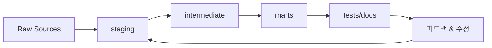

CHAPTER 01

DBT의 전체 그림과 세 가지 연속 예제

도구 소개가 아니라 구조와 책임, 예제 트랙, 플랫폼 범주부터 이해한다.

| 핵심 개념 → 사례 → 운영 기준 | 설명을 먼저 충분히 풀고, 이후 장에서 예제 케이스북과 플랫폼 플레이북으로 다시 가져간다. |
| --- | --- |

이 책의 첫 목표는 명령어를 외우기 전에 dbt를 어디에 놓아야 하는지부터 분명하게 만드는 것이다. dbt는 적재된 데이터를 분석 가능한 구조로 바꾸는 변환 계층이면서, 그 변환을 모델·테스트·문서·계약으로 다루게 만드는 프로젝트 계층이다. 따라서 dbt를 잘 배운다는 것은 SQL만 잘 쓰는 것이 아니라, 분석 로직을 반복 가능하고 설명 가능한 형태로 운영하는 법을 배우는 일에 가깝다.

또 하나의 축은 예제다. 이 책은 Retail Orders, Event Stream, Subscription & Billing 세 개의 연속 예제를 앞장에서 소개하고 뒤의 예제 케이스북과 플랫폼 플레이북에서 다시 완주한다. 앞쪽 장에서는 기능의 일반 원리를 충분히 설명하고, 뒤쪽 장에서는 그 원리가 세 예제와 여덟 가지 플랫폼에서 실제로 어떻게 작동하는지 사례로 연결한다.

dbt 기본 순환을 그림으로 먼저 보기

왜 dbt를 쓰는가

| 필수 | 처음 읽는 사람은 장 끝의 ‘직접 해보기’를 반드시 해 본다. 이해가 아니라 손의 감각을 남기는 것이 목표다. |
| --- | --- |

| 이 장에서 배우는 것 • dbt가 데이터 스택에서 맡는 역할과 맡지 않는 역할을 구분한다. • source(), ref(), test, docs가 왜 함께 움직여야 하는지 이해한다. • ‘큰 쿼리 하나’보다 ‘작은 모델 여러 개’가 유리한 이유를 설명한다. | 완료 기준 • dbt를 단순 SQL 실행기가 아니라 프로젝트 관리 도구로 설명할 수 있다. • 기존 SQL 파일 운영과 dbt 프로젝트 운영의 차이를 비교할 수 있다. • 원천 → staging → intermediate → marts → tests/docs 흐름을 그릴 수 있다. |
| --- | --- |

1-1. dbt는 어디에 있는가

dbt는 이미 저장소나 웨어하우스에 적재된 데이터를 분석 가능한 형태로 바꾸는 ‘변환 계층’에 있다. 수집 자체를 담당하는 ETL/EL, 대시보드 도구, 전체 오케스트레이터를 모두 대체하지는 않지만, 그 사이를 연결하는 분석용 SQL을 프로젝트처럼 관리하게 만든다.

dbt가 잘하는 일과 그렇지 않은 일

| 구분 | 대표 기능 | 왜 중요한가 |
| --- | --- | --- |
| dbt가 잘하는 일 | 모델 정의, ref()/source() 의존성, 테스트, 문서화, lineage | 분석용 SQL이 개인 파일이 아니라 팀 자산이 된다 |
| dbt가 직접 하지 않는 일 | 원천 수집, BI 시각화, 복잡한 외부 시스템 제어 | 다른 도구와 역할을 분리해야 전체 파이프라인이 단순해진다 |
| 초보자가 먼저 익힐 것 | 모델 분리, 선택 실행, 테스트, docs | 실무에서 가장 빠르게 효과가 난다 |

1-2. 왜 dbt가 필요한가

기존 분석 환경에서는 잘 만든 SQL 하나가 팀의 표준처럼 복사되기 쉽다. 처음에는 빠르지만 시간이 지나면 로직이 조용히 갈라지고, 변경 영향 범위를 자신 있게 말할 사람이 없어지고, 지표 정의가 사람마다 조금씩 달라진다. dbt는 이 문제를 줄이기 위해 모델 사이의 관계와 품질 가정을 프로젝트 안으로 끌어온다.

기존 SQL 파일 운영과 dbt 프로젝트 운영의 차이

| 관점 | 기존 SQL 파일 운영 | dbt 프로젝트 운영 |
| --- | --- | --- |
| 실행 순서 | 사람이 기억하거나 문서에 적어 둔다 | ref()와 source()가 DAG를 만들고 순서를 정한다 |
| 재사용 | 복사·붙여넣기가 많다 | 모델을 작은 단위로 나눠 재사용한다 |
| 품질 검증 | 눈으로 결과를 확인하기 쉽다 | tests가 반복 실행 가능한 규칙이 된다 |
| 문서화 | 위키나 메신저에 흩어지기 쉽다 | docs와 YAML이 모델과 함께 간다 |
| 변경 영향 | 누가 어디서 쓰는지 추적이 어렵다 | lineage와 selector로 범위를 좁힌다 |

*그림 1-1. 초보자가 먼저 익혀야 하는 dbt 기본 순환*

1-3. 초보자에게 더 중요한 사고방식

• 직접 스키마와 테이블명을 적는 습관을 줄이고, 가능하면 source()와 ref()를 쓴다.

• 한 모델에 너무 많은 역할을 넣지 않는다. 정리, 조인, 집계를 한 파일에 모두 섞으면 디버깅이 급격히 어려워진다.

• 전체 build보다 선택 실행으로 빠르게 검증한다. 작은 성공과 작은 실패를 많이 만들어 보는 편이 훨씬 빠르다.

• 문제가 생기면 SQL을 새로 쓰기 전에 compiled SQL과 DAG 범위를 먼저 본다.

| 핵심 문장 dbt는 분석용 SQL을 ‘코드처럼’ 다루게 만드는 도구다. 잘 쓰는 핵심은 화려한 문법보다 구조를 나누고 작은 단위로 검증하는 습관에 있다. |
| --- |

| 안티패턴 하나의 거대한 SQL 안에 rename, join, 집계, KPI 계산, 예외 처리까지 모두 넣고 ‘잘 돌아가니 됐다’고 생각하는 것. 처음에는 빨라도 수정 비용이 빠르게 폭증한다. |
| --- |

| 직접 해보기 1. 지금까지 하던 분석 쿼리 하나를 떠올리고, 그 쿼리를 source → staging → mart 세 단계로 나눠 본다. 2. 각 단계에서 어떤 테스트를 붙일 수 있는지 한 줄씩 적는다. 3. 마지막으로 ‘이걸 giant SQL로 유지했을 때 어떤 문제가 생길까’를 적어 본다. 정답 확인 기준: 정답은 하나가 아니지만, 최소한 원천 정리와 최종 KPI를 별도의 모델로 분리했는지 확인한다. |
| --- |

| 완료 체크리스트 • □ dbt가 어디에 있는 도구인지 설명할 수 있다. • □ source·ref·tests·docs가 왜 함께 가야 하는지 말할 수 있다. • □ 작은 모델 여러 개가 giant SQL보다 유리한 이유를 예로 들 수 있다. |
| --- |

| 세 가지 연속 예제를 어떻게 읽을까 앞쪽 장은 기능을 일반 원리로 설명하고, 뒤쪽의 케이스북은 그 원리가 실제 도메인에서 어떤 순서로 자리를 잡는지 보여 준다. Retail Orders는 레이어 설계와 grain을, Event Stream은 incremental과 비용을, Subscription & Billing은 snapshot·contracts·metric의 가치를 가장 선명하게 보여 주는 트랙이다. |
| --- |

세 예제가 책 전체에서 자라는 방식

세 예제의 역할을 한 번에 잡기

Retail Orders는 가장 기본적인 source → staging → intermediate → marts 구조를 몸에 익히기 위한 트랙이다. 고객·주문·주문상세·상품이라는 익숙한 엔터티 덕분에 source/ref, grain, fanout, tests, snapshot의 흐름을 설명하기 좋다. Event Stream은 append-only 이벤트가 중심이어서 incremental, late-arriving data, session, DAU, cache, cost-aware selector 이야기를 꺼내기 좋다. Subscription & Billing은 상태 변화와 정의의 일관성이 핵심이어서 contracts, versions, semantic metric, governed sharing 이야기를 가장 깊게 가져가기 좋다.

| 예제 | 초기 질문 | 후반 확장 질문 |
| --- | --- | --- |
| Retail Orders | 주문 한 건은 어떻게 mart까지 바뀌나? | 주문 metric을 팀 공용 API처럼 어떻게 공개하나? |
| Event Stream | append-only 이벤트에서 session과 DAU를 어떻게 만들까? | 증가하는 데이터량과 비용을 어떻게 통제하나? |
| Subscription & Billing | 구독 상태 변화와 MRR을 어떻게 안정적으로 정의할까? | contracts·versions·semantic으로 어떻게 공유하나? |
