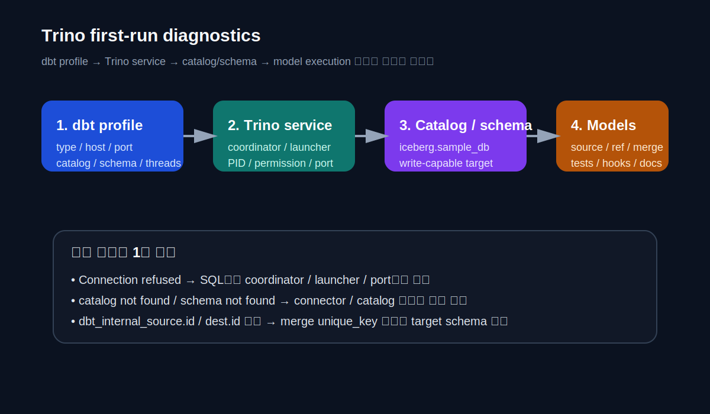

# CHAPTER 02 · 개발 환경, 프로젝트 구조, DBT 명령어와 Jinja, 첫 실행

> 환경 구성, 파일 구조, 명령 흐름, 템플릿 문법을 한 장 안에서 연결한다.  
> 이 장의 목적은 설치 명령을 외우는 것이 아니라, **dbt 프로젝트가 실제로 어떻게 움직이는지**를 손에 잡히게 만드는 데 있다.

Chapter 01이 “dbt를 왜 쓰는가”를 설명했다면, 이 장은 “그래서 dbt 프로젝트를 어떻게 세우고 움직이는가”를 설명한다. 많은 초보자가 모델링보다 먼저 무너지는 곳은 환경과 워크플로다. adapter가 안 잡히고, `profile:` 이름이 어긋나고, `dbt run`과 `dbt build`를 언제 쓰는지 모르면 아주 작은 실습도 바로 흔들린다. 그래서 이 장은 **환경 → 구조 → 명령 흐름 → Jinja → 첫 완주** 순서로 잡는다.

중요한 점은, 이 장이 단지 DuckDB 설치 장이 아니라는 것이다. 이 책은 DuckDB를 기본 실습 환경으로 시작하지만, 뒤에서 다루는 MySQL, PostgreSQL, BigQuery, ClickHouse, Snowflake, Trino, 그리고 NoSQL + SQL Layer까지 모두 같은 구조를 공유한다. 즉, 이 장에서 배워야 하는 것은 특정 DBMS 명령이 아니라 **dbt 프로젝트를 읽는 눈**이다. 연결 정보는 바뀔 수 있어도, `profiles.yml`, `dbt_project.yml`, `source()`, `ref()`, `debug → parse → ls → compile → run/build → test`의 흐름은 그대로 남는다.

또한 이 장은 Chapter 03 이후를 위한 기초를 세운다. layered modeling, tests, snapshots, docs, packages, governance, semantic layer, mesh 같은 고급 기능도 결국은 모두 **환경이 먼저 안정적이고**, **프로젝트 구조가 읽히고**, **명령 흐름과 Jinja를 해석할 수 있을 때** 비로소 제대로 이해된다. 따라서 이 장에서는 기능을 얕게 많이 훑기보다, 환경과 구조와 흐름의 기본기를 끝까지 잡는 쪽을 택한다.


*그림 2-1. 개발 환경은 코드·연결·엔진·실행 경로의 조합이다.*

## 2.1. 개발 환경을 잡기 전에 먼저 이해해야 할 것

### 2.1.1. 개발 환경은 “코드 + 연결 + 엔진 + 실행 경로”의 조합이다

초보자는 개발 환경을 “패키지 설치” 정도로 생각하기 쉽다. 하지만 dbt 프로젝트의 실제 개발 환경은 네 층으로 이루어진다.

1. **코드와 메타데이터**  
   `models/`, `tests/`, `snapshots/`, `macros/`, `selectors.yml`, `dbt_project.yml`처럼 프로젝트를 이루는 파일들이다.

2. **연결 정보**  
   `profiles.yml`에 들어가는 target, host, warehouse, dataset, schema, 인증 정보처럼 “어디에 연결할 것인가”를 결정하는 층이다.

3. **실행 엔진**  
   dbt Core CLI인지, Fusion engine인지, dbt platform의 job인지에 따라 실행 경험과 일부 지원 기능이 달라진다.

4. **실행 경로와 관찰 경로**  
   `dbt debug`, `dbt parse`, `dbt compile`, `dbt run`, `dbt build`, `dbt test`, `dbt docs generate` 같은 명령과, `target/`, `logs/` 아래 artifacts를 읽는 흐름이다.

이 네 층 중 하나라도 빠지면 프로젝트는 불안정해진다. 예를 들어 코드가 있어도 `profiles.yml`이 없으면 연결이 안 되고, 연결이 돼도 `dbt_project.yml`이 흔들리면 materialization과 schema가 제멋대로 흩어진다. 반대로 설치만 되어 있어도 `debug → parse → compile` 순서를 모르면 문제를 SQL 오류와 연결 오류로 나눌 수 없다.

### 2.1.2. 왜 이 책은 Core CLI + DuckDB에서 시작하는가

입문자에게 가장 큰 적은 기능 부족이 아니라 **환경 복잡도**다. 계정 발급, 권한, 과금, 네트워크, keyfile, warehouse 설정이 한꺼번에 들어오면 dbt의 핵심을 배우기도 전에 지친다. 그래서 이 책은 로컬에서 곧바로 재현 가능한 **Core CLI + DuckDB**를 기본값으로 잡는다.

이 선택의 장점은 분명하다.

- 로컬에서 바로 시작할 수 있다.
- 데이터 적재와 실험을 빠르게 반복할 수 있다.
- 회사 계정이나 과금 정책에 묶이지 않고도 예제를 끝까지 완주할 수 있다.
- `source()`, `ref()`, tests, docs, snapshot, incremental, selector 같은 핵심 개념을 대부분 그대로 연습할 수 있다.

하지만 이 선택이 DuckDB만을 위한 책이라는 뜻은 아니다. 오히려 반대다. DuckDB는 **개념과 구조를 가장 낮은 마찰로 배울 수 있는 출발점**이고, 그 후반부에 MySQL, PostgreSQL, BigQuery, ClickHouse, Snowflake, Trino, NoSQL + SQL Layer로 옮겨 갈 때도 같은 프로젝트 관점을 유지하게 해 준다.

### 2.1.3. Core CLI, Fusion engine, VS Code extension은 어떻게 구분해야 하는가

현재 dbt 생태계에서는 “dbt”라고 말할 때 적어도 세 가지를 구분해야 한다.

- **dbt Core CLI**  
  로컬에서 명령어로 실행하는 가장 전통적인 방식이다. 프로젝트 내부 동작을 또렷하게 볼 수 있어서 학습과 디버깅에 강하다.

- **dbt Fusion engine**  
  더 빠른 파싱과 SQL comprehension을 제공하는 최신 엔진 계열이다. authoring experience와 일부 도구 통합이 더 좋아질 수 있다.

- **공식 VS Code extension**  
  편집기 안에서 진단, 맥락 이해, 자동완성 경험을 제공하지만, 현재 공식 확장은 Fusion engine 기준으로 설계되어 있다.

학습 관점에서는 Core CLI가 여전히 중요하다. 이유는 간단하다. Core CLI는 `profiles.yml`, `dbt_project.yml`, 명령어, artifacts, compiled SQL을 가장 명시적으로 보여 준다. 반면 Fusion과 확장 기능은 생산성 측면에서 유리할 수 있지만, 초보자에게는 내부 동작이 덜 보일 수도 있다. 따라서 이 장은 Core CLI를 기준으로 설명하고, 후반부에서 Fusion과 platform 환경으로 옮겨 갈 때 무엇이 달라지는지 별도로 연결한다.

### 2.1.4. 설치와 버전 고정 원칙

설치에서 제일 먼저 해야 할 일은 **가상환경 분리**다. dbt는 adapter마다 별도 패키지가 필요하고, 여러 프로젝트를 오가다 보면 버전이 금방 섞인다. 그래서 프로젝트별 가상환경을 기본 원칙으로 잡는 것이 안전하다.

```bash
python3 -m venv .venv
source .venv/bin/activate
python -m pip install --upgrade pip wheel setuptools
python -m pip install "dbt-core==1.11.*" "dbt-duckdb==1.11.*"
dbt --version
```

이 장과 companion 예시는 재현성을 위해 1.11 계열을 기준으로 적었다. 실제 회사 환경에서는 adapter 호환성과 release track 정책을 먼저 정한 뒤 버전을 핀하는 것이 좋다. 중요한 것은 “최신 버전이면 무조건 좋다”가 아니라, **팀이 재현할 수 있는 버전 조합을 고정하고 문서화하는 것**이다.

예시 파일은 여기에도 정리해 두었다.

- [`profiles.example.yml`](../codes/04_chapter_snippets/ch02/profiles.example.yml)
- [`dbt_project.skeleton.yml`](../codes/04_chapter_snippets/ch02/dbt_project.skeleton.yml)

### 2.1.5. `profiles.yml`과 `dbt debug`가 먼저다

`profiles.yml`은 “이 프로젝트가 어디에 연결되는가”를 정의한다. 반면 `dbt_project.yml`은 “이 프로젝트가 어떻게 동작하는가”를 정의한다. 초보자가 가장 자주 하는 실수는 둘을 같은 종류의 파일처럼 다루는 것이다.

가장 단순한 DuckDB profile은 아래와 같다.

```yaml
dbt_all_in_one_lab:
  target: dev
  outputs:
    dev:
      type: duckdb
      path: ./lab.duckdb
      threads: 4
```

여기서 중요한 것은 `dbt_project.yml`의 `profile:` 값과 `profiles.yml`의 최상위 키가 **문자 하나까지** 같아야 한다는 점이다. 이 조건이 맞지 않으면 모델 SQL이 아무리 멀쩡해도 프로젝트는 시작조차 하지 못한다.

그래서 설치가 끝나면 바로 `dbt run`을 하지 말고, 먼저 아래 명령으로 연결과 설정부터 확인해야 한다.

```bash
dbt debug
```

`dbt debug`는 연결, 설치된 adapter, 프로젝트 파일, 의존 패키지 유효성 등 “SQL 이전 단계”의 문제를 걸러 준다. 이 순서를 무시하면 설치 오류, profile 오류, 경로 오류, SQL 오류가 한 번에 뒤섞여 초보자에게 가장 비싼 실패가 된다.

### 2.1.6. 설치 단계에서 자주 만나는 실패

| 증상 | 흔한 원인 | 가장 먼저 확인할 것 |
| --- | --- | --- |
| `Profile not found` | `dbt_project.yml`의 `profile:`과 `profiles.yml` 최상위 키 불일치 | 두 이름이 문자 하나까지 같은지 본다 |
| `Could not find adapter type duckdb` | 가상환경 미활성화 또는 adapter 미설치 | `dbt --version`, `pip list`, 현재 셸의 venv 활성화 여부를 본다 |
| `dbt` 명령을 찾지 못함 | PATH와 venv가 안 맞음 | 현재 셸을 다시 열고 `.venv`를 활성화한다 |
| DuckDB 파일 권한 오류 | 쓰기 권한 없는 경로 사용 | 프로젝트 루트나 홈 디렉터리 아래의 단순 경로로 바꾼다 |
| BigQuery/Snowflake/Postgres 연결 오류 | 자격 증명 또는 네트워크 설정 누락 | SQL보다 먼저 `profiles.yml`, keyfile, secret, network path를 점검한다 |

설치 단계의 안티패턴은 명확하다. **문제가 생겼는데 곧바로 `dbt run`부터 시도하는 것**이다. 설치와 연결 단계에서 막힌 프로젝트는 SQL을 건드려도 해결되지 않는다.

## 2.2. 프로젝트 구조를 “운영 규칙 / 연결 정보 / 변환 로직 / 메타데이터”로 읽기

Chapter 01에서 dbt를 프로젝트 계층이라고 설명했다면, 이제는 그 프로젝트를 실제 디렉터리 구조로 읽어야 한다. 초보자는 폴더가 많아 보이면 겁을 먹기 쉽지만, 실제로는 역할이 꽤 뚜렷하다. 처음에는 아래 네 축으로만 보면 충분하다.

1. **운영 규칙** — `dbt_project.yml`, `selectors.yml`, `packages.yml`
2. **연결 정보** — `profiles.yml`
3. **변환 로직** — `models/`, `tests/`, `snapshots/`, `macros/`, `seeds/`
4. **관찰 결과와 산출물** — `target/`, `logs/`, docs artifacts


*그림 2-2. companion 프로젝트를 네 축으로 읽는 방법.*

### 2.2.1. 이 책의 companion 프로젝트는 어떻게 생겼는가

아래 구조는 이 책의 실행 가능한 DuckDB 프로젝트를 기준으로 한 핵심 골격이다. 처음에는 모든 파일을 다 보려 하지 말고, 역할별로 읽는 연습을 하는 편이 훨씬 빠르다.

```text
codes/01_duckdb_runnable_project/
├─ bootstrap/
│  └─ load_duckdb.py
├─ raw_csv/
├─ expected/
└─ dbt_all_in_one_lab/
   ├─ dbt_project.yml
   ├─ packages.yml
   ├─ selectors.yml
   ├─ macros/
   ├─ models/
   │  ├─ retail/
   │  ├─ events/
   │  └─ subscription/
   ├─ snapshots/
   └─ tests/
```

이 구조를 읽을 때 가장 먼저 기억할 것은 “모든 파일이 같은 비중이 아니다”라는 점이다. 초보자에게는 `dbt_project.yml`, `models/`, `tests/`, `snapshots/`, `macros/`, 그리고 `target/`만 먼저 읽혀도 상당한 진전이다.

### 2.2.2. `dbt_project.yml`은 프로젝트의 운영 규칙이다

`dbt_project.yml`은 이 디렉터리가 dbt 프로젝트라는 선언이자, 프로젝트 전반의 기본 규칙을 정하는 파일이다. 여기에는 다음과 같은 정보가 들어간다.

- 프로젝트 이름과 버전
- 사용할 profile 이름
- models, seeds, snapshots, macros, tests 디렉터리 위치
- 폴더별 기본 materialization
- 폴더별 schema와 tags
- vars 같은 프로젝트 전역 변수

companion 프로젝트의 실제 설정도 이 원칙을 따른다.

```yaml
name: dbt_all_in_one_lab
version: 1.0.0
config-version: 2
profile: dbt_all_in_one_lab

models:
  dbt_all_in_one_lab:
    retail:
      staging:
        +materialized: view
      intermediate:
        +materialized: view
      marts:
        +materialized: table
    events:
      staging:
        +materialized: view
      marts:
        +materialized: incremental
    subscription:
      staging:
        +materialized: view
      marts:
        +materialized: table
```

이런 구조를 보면 Chapter 03에서 배울 layered modeling이 벌써 설정 파일 안에 반영되어 있다는 것을 알 수 있다. 즉, 프로젝트 구조와 모델링 원칙은 따로 노는 것이 아니라 처음부터 연결되어 있다.

### 2.2.3. `profiles.yml`은 연결 정보다

반대로 `profiles.yml`은 어떤 플랫폼에 어떤 방식으로 연결할지를 정의한다. 데이터베이스명, dataset, warehouse, host, account, password, keyfile, schema, target이 여기에 들어간다. 가장 중요한 원칙은 간단하다.

- `dbt_project.yml`은 커밋되는 프로젝트 규칙
- `profiles.yml`은 로컬/환경별 연결 정보
- 민감한 값은 `env_var()`로 분리

이 역할 구분을 지키지 않으면 두 가지 문제가 생긴다. 첫째, 비밀번호와 토큰이 Git에 남는다. 둘째, 프로젝트 규칙과 환경별 차이가 한 파일 안에서 뒤엉켜 dev/stg/prod 관리가 곧바로 꼬인다.

### 2.2.4. `models/`, `tests/`, `snapshots/`, `macros/`, `seeds/`는 각각 무엇을 담는가

| 위치 | 담는 것 | 초보자 관점의 핵심 |
| --- | --- | --- |
| `models/` | 변환 SQL과 설명/테스트 YAML | 모델은 한 파일, 한 책임 원칙으로 작게 유지한다 |
| `tests/` | singular tests, custom generic tests | “품질 규칙”을 SQL이나 macro로 남긴다 |
| `snapshots/` | 상태 이력 보존 규칙 | 현재 상태만 있는 원천에서 과거 상태 변화를 보존한다 |
| `macros/` | Jinja 재사용 함수 | 같은 SQL 조각이 반복될 때만 신중하게 올린다 |
| `seeds/` | 작은 정적 CSV | 작고 안정적인 참조 데이터를 프로젝트 안에 둔다 |

중요한 것은 “어디에 무엇을 둬야 하는가”보다 “왜 분리하는가”다. 예를 들어 tests를 모델 옆에 두지 않고 별도 디렉터리나 YAML에 두는 이유는, 품질 검증 규칙이 모델 로직과 별도의 논리 축을 가지기 때문이다. 마찬가지로 macros를 분리하는 이유는, Jinja 템플릿을 독립적인 재사용 함수처럼 취급하기 위해서다.

### 2.2.5. 설정 우선순위는 ‘공통 규칙 vs 개별 예외’로 기억하면 된다

초보자가 설정 우선순위를 너무 일찍 외우려고 하면 오히려 더 헷갈린다. 대신 아래 원칙으로 기억하면 충분하다.

- **공통 규칙**은 `dbt_project.yml`
- **개별 리소스에 가까운 설정**은 해당 모델 YAML
- **특정 모델 하나만 예외 처리**는 SQL 안의 `config()`

예를 들어 “events marts는 기본적으로 incremental”이라는 규칙은 프로젝트 파일에 두는 편이 자연스럽다. 반면 “`fct_sessions` 하나만 특수한 `unique_key`를 쓴다”는 설정은 모델 가까이에 두는 것이 더 읽기 쉽다.

### 2.2.6. `target/`, `logs/`, `packages.yml`, `selectors.yml`은 언제 떠올려야 하는가

- `target/`  
  compiled SQL, `manifest.json`, `run_results.json` 같은 artifacts가 생기는 곳이다. 디버깅과 state selection의 출발점이다.

- `logs/`  
  `dbt.log`를 통해 오류의 시간순 흐름과 상세 메시지를 확인할 수 있다.

- `packages.yml`  
  외부 dbt package를 가져오는 파일이다. 반복되는 tests, macros, utilities를 끌어오고 싶을 때 등장한다.

- `selectors.yml`  
  반복해서 쓰는 selector 식에 이름을 붙인다. 예를 들어 배포 전 핵심 marts만 묶는 규칙을 만들 수 있다.

초보자 입장에서는 이 파일들이 “나중에 보는 파일”처럼 느껴질 수 있다. 하지만 프로젝트가 조금만 커져도 바로 중요해진다. 특히 `target/`과 `logs/`는 Chapter 05의 디버깅 파트로 넘어가기 전에 이미 익숙해져 있어야 한다.

### 2.2.7. companion repo에서 어디를 먼저 열어야 하는가

이 책의 repository에서는 아래 경로부터 보면 된다.

1. `chapters/` — 교재 본문
2. `codes/01_duckdb_runnable_project/dbt_all_in_one_lab/` — 실행 가능한 기본 프로젝트
3. `codes/03_platform_bootstrap/<example>/<platform>/` — DBMS별 초기 데이터 적재 스크립트
4. `codes/02_reference_patterns/` — 고급 기능과 플랫폼 예시
5. `assets/` — 그림 파일

즉, **본문 → DuckDB 프로젝트 → 플랫폼별 부트스트랩 → 고급 레퍼런스** 순서로 보는 것이 가장 안정적이다.

## 2.3. 프로젝트를 실제로 움직이는 명령 흐름

dbt 명령어는 단순한 CLI 목록이 아니다. 실제로는 **프로젝트를 관찰하고, 구조를 검증하고, SQL을 확인하고, 필요한 범위만 실행하고, 테스트하고, 문서화하는 워크플로 언어**에 가깝다. 그래서 초보자는 명령어를 개별 기능으로 외우기보다, 아래 순서를 하나의 루틴으로 익혀야 한다.


*그림 2-3. 초보자가 먼저 익혀야 하는 명령 흐름.*

### 2.3.1. 왜 `debug → parse → ls → compile → run/build → test → docs` 순서가 좋은가

이 순서를 쓰면 문제를 단계별로 분리할 수 있기 때문이다.

- `dbt debug`는 연결과 설치 문제를 본다.
- `dbt parse`는 YAML/Jinja/프로젝트 구조 문제를 본다.
- `dbt ls`는 selector가 정확히 무엇을 잡는지 보여 준다.
- `dbt compile`은 `source()`, `ref()`, Jinja가 실제 SQL로 어떻게 풀리는지 보여 준다.
- `dbt run`과 `dbt build`는 실제로 relation을 만들고 test까지 실행한다.
- `dbt test`는 품질 가정을 확인한다.
- `dbt docs generate`는 lineage와 문서를 탐색 가능한 형태로 만든다.

이 순서를 익히면 “설치 문제인지, 구조 문제인지, SQL 문제인지, 데이터 품질 문제인지”를 한 번에 맞히려고 하지 않아도 된다. 문제를 좁혀 가는 것이 핵심이다.

### 2.3.2. 핵심 명령어는 어떻게 서로 다른가

| 명령 | 무엇을 보는가 | 초보자가 가장 먼저 익혀야 할 쓰임 |
| --- | --- | --- |
| `dbt debug` | 연결, 설치, project/profile 유효성 | SQL보다 먼저 환경 문제를 걸러낸다 |
| `dbt parse` | 프로젝트 구조, YAML/Jinja 문법 | 실행 없이 구조를 검증한다 |
| `dbt ls -s ...` | selector가 잡는 노드 범위 | “무엇이 실행될지”를 먼저 눈으로 확인한다 |
| `dbt compile -s ...` | compiled SQL | Jinja와 `ref()`가 실제 SQL로 어떻게 바뀌는지 본다 |
| `dbt run -s ...` | 선택한 모델을 materialize | 좁은 범위 개발 실행에 적합하다 |
| `dbt build -s ...` | 선택한 리소스 + 관련 tests | 배포 전 검증이나 소규모 end-to-end 확인에 유리하다 |
| `dbt test -s ...` | data test, unit test | 로직과 품질 가정을 검증한다 |
| `dbt docs generate` | docs artifacts 생성 | lineage와 설명을 한 번에 확인한다 |
| `dbt seed` | 작은 CSV 적재 | 참조용 코드표/매핑 테이블에 적합하다 |

이 장에서는 위 명령을 모두 깊게 다루기보다, **처음 보는 프로젝트를 안정적으로 움직이는 최소 루틴**에 초점을 둔다. 더 긴 명령어 레퍼런스는 Appendix B에서 따로 다룬다.

### 2.3.3. 전체 build보다 좁은 범위 실행이 중요한 이유

초보자는 자꾸 “전체를 돌려 보고 싶다”는 유혹을 느낀다. 하지만 실제 개발에서는 이 습관이 가장 느리고 비싼 루틴이 된다. 작은 모델 하나를 바꾸고도 전체 프로젝트를 매번 재실행하면, 실패 원인을 찾는 속도도 느려지고 BigQuery나 Snowflake 같은 플랫폼에서는 비용 감각도 금방 무뎌진다.

처음 몇 주 동안은 아래 루틴만 익혀도 충분하다.

```bash
dbt ls -s stg_orders+
dbt compile -s stg_orders
dbt run -s stg_orders
dbt test -s stg_orders
```

이 작은 반복을 계속하다 보면, 어떤 변화가 현재 모델에서 끝나는지, 어떤 변화가 downstream marts까지 번지는지 감각이 생긴다. 이후 장에서 state selection이나 `--defer`를 배울 때도 이 감각이 바탕이 된다.

### 2.3.4. 첫 번째 완주 루틴: DuckDB 기준

이 repository에서 가장 빠른 실습 경로는 `codes/01_duckdb_runnable_project/`를 이용하는 것이다. 기본 실행 예시는 아래 파일에도 담아 두었다.

- [`first_run_commands.sh`](../codes/04_chapter_snippets/ch02/first_run_commands.sh)

핵심 흐름은 다음과 같다.

```bash
cd codes/01_duckdb_runnable_project/dbt_all_in_one_lab

python ../bootstrap/load_duckdb.py --db ./lab.duckdb --variant day1 --raw-dir ../raw_csv
dbt debug
dbt seed
dbt ls -s stg_orders+
dbt compile -s stg_orders
dbt run -s stg_orders
dbt test -s stg_orders
dbt docs generate
```

이 짧은 루틴만 제대로 돌려 봐도 아래가 한 번에 연결된다.

- raw CSV가 raw schema에 적재된다.
- `source()` 선언이 실제 입력과 연결된다.
- `stg_orders`가 raw를 downstream 친화적 구조로 정리한다.
- tests가 기본 품질 가정을 검증한다.
- docs artifacts가 source → model lineage를 노출한다.

### 2.3.5. `target/`과 artifacts는 언제 보기 시작해야 하는가

입문 단계에서도 `target/`은 일찍 익혀 두는 편이 좋다. 이유는 Jinja와 `ref()`가 들어간 모델은 **원본 SQL보다 compiled SQL을 봐야** 실제 동작을 정확히 이해할 수 있기 때문이다.

처음부터 전부 외울 필요는 없다. 아래 세 가지만 먼저 기억하면 된다.

- `target/compiled/`  
  Jinja가 풀린 SQL을 본다.
- `target/manifest.json`  
  프로젝트 그래프와 메타데이터를 담는다.
- `target/run_results.json`  
  어떤 노드가 어떻게 실행되었는지를 요약한다.

즉, “dbt는 SQL만 실행하는 도구”가 아니라 “SQL을 컴파일하고, 그래프로 이해하고, artifacts로 남기는 도구”라는 감각이 여기서 시작된다.

### 2.3.6. 실패를 만났을 때의 기본 루틴

아래 순서를 몸에 익혀 두면 초반 실습 대부분은 스스로 정리할 수 있다.

1. `dbt debug`로 환경과 연결을 먼저 분리한다.
2. `dbt parse`로 구조와 YAML/Jinja 문법을 본다.
3. `dbt ls -s ...`로 selector 범위가 맞는지 본다.
4. `dbt compile -s ...`로 compiled SQL을 본다.
5. 그 다음에야 `dbt run` 또는 `dbt build`를 실행한다.
6. 실패한 test가 있다면 데이터 품질 문제인지 모델 로직 문제인지 분리한다.

이 순서가 중요한 이유는, 문제를 한 번에 해결하기 때문이 아니라 **문제의 종류를 좁혀 가기 때문**이다.

## 2.4. Jinja를 “SQL을 덮는 마법”이 아니라 “프로젝트 문맥을 여는 문법”으로 이해하기

Jinja는 dbt 초보자에게 가장 쉽게 과장되거나 과소평가되는 영역이다. 어떤 사람은 Jinja를 “SQL을 자동으로 써 주는 마법”처럼 생각하고, 어떤 사람은 “고급자용이니 나중에 보면 된다”고 생각한다. 둘 다 정확하지 않다. Jinja는 dbt에서 **SQL에 프로젝트 문맥을 연결하는 얇은 층**이다. 너무 적게 알아도 `source()`와 `ref()`를 이해하기 어렵고, 너무 과하게 쓰면 오히려 가독성과 디버깅이 나빠진다.

### 2.4.1. 먼저 익혀야 할 delimiter 세 가지

입문 단계에서는 아래 세 가지만 정확히 구분해도 큰 도움이 된다.

- `{{ ... }}`  
  값을 출력하거나 함수 결과를 삽입한다. `ref()`, `source()`, `env_var()`가 여기에 들어간다.

- ``  
  제어 흐름이다. `if`, `for`, `macro`, `set` 같은 문법이 여기에 들어간다.

- `{# ... #}`  
  Jinja 주석이다. compiled SQL에는 남지 않는다.

이 세 가지를 구분하지 못하면 모델 SQL, macro, `dbt_project.yml` 예시를 읽을 때 곧바로 막히게 된다.

### 2.4.2. 초보자가 먼저 익혀야 할 함수

Chapter 02에서 먼저 익히면 좋은 함수는 많지 않다.

- `source()` — 프로젝트 바깥 원천 입력
- `ref()` — 프로젝트 안의 다른 모델
- `config()` — 특정 모델 설정
- `var()` — 프로젝트 변수 주입
- `env_var()` — 환경 변수 주입
- `target` — 현재 실행 target에 대한 정보

이 여섯 개만 이해해도 `models/`, `profiles.yml`, `dbt_project.yml`, macro의 대부분을 읽을 수 있다.

### 2.4.3. 가장 기본적인 Jinja 예시

아래 예시는 raw retail orders를 staging 모델로 바꾸는 가장 기본적인 패턴이다.

```sql
with source_data as (
    select *
    from {{ source('raw_retail', 'orders') }}
),
renamed as (
    select
        order_id,
        customer_id,
        cast(order_ts as timestamp) as order_ts,
        cast(order_ts as date) as order_date,
        lower(status) as order_status,
        cast(total_amount as double) as total_amount
    from source_data
)
select *
from renamed
```

이 예시에는 화려한 Jinja가 없다. 하지만 핵심은 이미 다 들어 있다.

- raw 테이블명을 직접 쓰지 않고 `source()`를 쓴다.
- 타입 캐스팅과 이름 정리를 staging에서 한다.
- compiled SQL을 보면 실제 relation 이름으로 풀린다.

추가 예시는 아래 파일에도 담아 두었다.

- [`jinja_basics_examples.sql`](../codes/04_chapter_snippets/ch02/jinja_basics_examples.sql)

### 2.4.4. `profiles.yml`, `dbt_project.yml`에서도 Jinja가 등장한다

Jinja는 모델 안에서만 쓰이지 않는다. 예를 들어 `profiles.yml`에서는 `env_var()`로 비밀값을 주입할 수 있고, `dbt_project.yml`에서는 `vars:`를 통해 실행 시점에 달라지는 값을 프로젝트 전반에 넣을 수 있다.

```yaml
password: "{{ env_var('DBT_ENV_SECRET_PG_PASSWORD') }}"
```

이 패턴은 DuckDB 예시에서는 덜 중요해 보여도, Postgres, Snowflake, BigQuery, Trino로 갈수록 중요해진다. 따라서 Jinja를 “SQL 파일에서만 보이는 문법”으로 생각하면 프로젝트 전체 문맥을 놓치게 된다.

### 2.4.5. macro는 언제부터 쓰는가

macro는 반복되는 SQL 조각을 재사용 함수처럼 묶는 방식이다. 하지만 초보자가 너무 이르게 macro 추상화에 빠지면, 오히려 SQL 자체를 읽는 힘이 약해진다. 따라서 Chapter 02에서는 아래 기준만 기억하면 충분하다.

- 같은 SQL 조각이 여러 모델에서 반복될 때
- 바뀔 때 함께 바뀌어야 하는 규칙일 때
- 모델보다 macro가 더 읽기 쉬울 정도로 패턴이 명확할 때

즉, “매크로를 쓰면 있어 보인다”가 아니라, **반복과 변경 비용을 줄이는가**를 기준으로 판단해야 한다.

### 2.4.6. Jinja를 읽을 때는 항상 compiled SQL을 함께 본다

Jinja의 위험은 문법 자체보다, **원래 실행되는 SQL이 무엇인지 감을 잃기 쉽다**는 데 있다. 그래서 `dbt compile -s ...`는 Jinja를 이해하는 데에도 필수다. 특히 `source()`, `ref()`, `config()`, macro가 함께 들어가기 시작하면, 원본 모델 파일만 보지 말고 compiled 결과를 함께 보는 습관을 들이는 편이 좋다.

## 2.5. 세 예제에서 Chapter 02의 내용을 실제로 적용하기

이제 공통 원리를 세 예제 안에서 연결해 보자. 여기서 중요한 것은 “예제별로 환경이 완전히 다르다”가 아니라, **같은 원리가 세 다른 도메인에서 어떻게 시작되는가**다. Chapter 09 이후의 케이스북에서는 이 예제들을 더 길게 끌고 가지만, Chapter 02에서는 가장 첫 실행 지점에만 집중한다.

### 2.5.1. Retail Orders — raw → staging의 감각을 제일 빨리 익히는 트랙

Retail Orders는 처음 배우는 사람이 가장 쉽게 이해할 수 있는 트랙이다. 고객, 주문, 주문상세, 상품이라는 익숙한 엔터티 덕분에 source 선언, staging rename, grain, fanout 위험을 빨리 눈으로 확인할 수 있다.

이 장에서 Retail Orders로 꼭 해 볼 일은 세 가지다.

1. `raw_retail.orders`를 먼저 적재한다.
2. `stg_orders`만 선택 실행한다.
3. `order_id = 5003`이 raw에서 staging으로 어떻게 바뀌는지 확인한다.

DuckDB 실습에서는 아래 파일이 시작점이다.

```text
codes/03_platform_bootstrap/retail/duckdb/setup_day1.sql
codes/03_platform_bootstrap/retail/duckdb/apply_day2.sql
```

### 2.5.2. Event Stream — append-only 원천을 다루는 감각을 익히는 트랙

Event Stream은 주문 테이블보다 구조가 덜 친숙하지만, dbt가 왜 “계속 성장하는 프로젝트”여야 하는지를 잘 보여 준다. append-only 이벤트 원천을 다룰 때는 Day 1에서는 단순 staging으로 시작해도, 이후에 session, DAU, incremental, 비용 문제로 금방 확장된다.

이 장에서 Event Stream으로 확인할 포인트는 다음이다.

1. raw 이벤트는 종종 컬럼 수가 많고, 의미가 느슨하다.
2. `stg_events`는 이름 정리와 타입 표준화부터 시작한다.
3. 처음부터 sessionization을 넣기보다, 먼저 안정적인 staging을 만드는 편이 좋다.

DuckDB 실습 경로는 아래와 같다.

```text
codes/03_platform_bootstrap/events/duckdb/setup_day1.sql
codes/03_platform_bootstrap/events/duckdb/apply_day2.sql
```

### 2.5.3. Subscription & Billing — 상태 변화와 이력 관리를 준비하는 트랙

Subscription & Billing은 Chapter 02 시점에서는 아직 비교적 단순해 보인다. 하지만 이 트랙은 곧바로 snapshot, contracts, metrics, semantic layer, versions로 이어질 가능성이 크다. 그래서 초기 환경을 잡을 때부터 “상태 변화가 뒤에 나온다”는 감각을 갖고 출발하는 편이 좋다.

이 장에서 Subscription & Billing으로 확인할 포인트는 다음이다.

1. raw subscriptions와 invoices를 먼저 분리해서 본다.
2. `stg_subscriptions`가 상태값과 날짜 컬럼을 어떻게 표준화하는지 본다.
3. Day 2 데이터가 들어왔을 때 어떤 변화가 생길지를 미리 상상해 본다.

DuckDB 실습 경로는 아래와 같다.

```text
codes/03_platform_bootstrap/subscription/duckdb/setup_day1.sql
codes/03_platform_bootstrap/subscription/duckdb/apply_day2.sql
```

### 2.5.4. 각 DBMS에서 시작하는 경로는 다르지만, 구조는 같다

이 repository에서는 세 예제를 대부분의 주요 DBMS에서 시험해 볼 수 있도록 부트스트랩 스크립트를 나눠 두었다. 구조는 공통이다.

```text
codes/03_platform_bootstrap/
├─ retail/
│  ├─ duckdb/ | mysql/ | postgres/ | bigquery/ | clickhouse/ | snowflake/ | trino/
├─ events/
│  ├─ duckdb/ | mysql/ | postgres/ | bigquery/ | clickhouse/ | snowflake/ | trino/
├─ subscription/
│  ├─ duckdb/ | mysql/ | postgres/ | bigquery/ | clickhouse/ | snowflake/ | trino/
└─ nosql_sql_layer_mongodb_via_trino/
   ├─ retail/
   ├─ events/
   └─ subscription/
```

여기서 꼭 기억할 점은 두 가지다.

- **Trino는 별도의 SQL 실행 계층**이다. Trino용 playbook은 Trino catalog와 connector 전제를 기준으로 본다.
- **NoSQL + SQL Layer는 또 다른 축**이다. MongoDB JSONL을 먼저 적재하고, Trino를 통해 SQL 계층으로 읽는 흐름을 따로 본다.

즉, Chapter 02에서 배워야 할 것은 “MySQL은 이렇게 적재하고 Snowflake는 저렇게 적재한다”를 전부 외우는 것이 아니라, **어떤 플랫폼이든 raw 데이터를 준비하고 profile을 맞추고 첫 staging 모델을 검증하는 절차는 같다**는 점이다. 자세한 차이는 뒤의 Platform Playbook 챕터에서 별도로 다룬다.

## 2.6. 직접 해보기

1. 가상환경을 만들고 `dbt-core`, `dbt-duckdb`를 설치한다.
2. `profiles.example.yml`을 참고해 `~/.dbt/profiles.yml`을 만든다.
3. `dbt debug`를 실행해 연결과 설정을 먼저 통과시킨다.
4. `codes/01_duckdb_runnable_project/dbt_all_in_one_lab/`로 이동해 `first_run_commands.sh`의 순서를 따라 해 본다.
5. `dbt ls -s stg_orders+`, `dbt compile -s stg_orders`, `dbt run -s stg_orders`의 차이를 직접 기록한다.
6. `jinja_basics_examples.sql`을 열어 `source()`, `ref()`, `config()`, `var()`, `env_var()`가 각각 어떤 문맥에서 쓰이는지 정리한다.
7. 세 예제 중 하나를 골라 해당 플랫폼 bootstrap 경로를 직접 열어 보고, Day 1 적재 스크립트 이름을 적는다.

정답 확인 기준은 간단하다. **“설치했다”가 아니라 “문제를 분리해서 설명할 수 있다”**가 목표다. 다시 말해, 아래 질문에 답할 수 있으면 이 장의 핵심은 잡은 것이다.

- 왜 `dbt debug`가 `dbt run`보다 먼저인가?
- `dbt_project.yml`과 `profiles.yml`은 어떻게 다른가?
- `dbt compile`은 왜 Jinja를 이해하는 데 중요한가?
- Retail / Events / Subscription 세 예제에서 Chapter 02의 시작점은 각각 어디인가?

## 2.7. 이 장에서 반드시 남겨야 하는 감각

Chapter 02의 핵심은 명령어 개수를 늘리는 것이 아니다. 아래 네 문장을 몸에 남기는 것이 더 중요하다.

1. **개발 환경은 설치만으로 끝나지 않는다.**  
   코드, 연결, 엔진, 실행 경로를 함께 이해해야 한다.

2. **프로젝트 구조는 파일 나열이 아니라 역할 분리다.**  
   운영 규칙, 연결 정보, 변환 로직, 메타데이터를 구분해야 한다.

3. **명령어는 순서가 중요하다.**  
   `debug → parse → ls → compile → run/build → test → docs`의 흐름을 몸에 익혀야 한다.

4. **Jinja는 SQL을 덮는 마법이 아니라 프로젝트 문맥을 여는 얇은 층이다.**  
   `source()`, `ref()`, `config()`, `env_var()`를 읽을 수 있어야 다음 장으로 편하게 넘어간다.

Chapter 03부터는 이 기초 위에서 `source()`, `ref()`, selectors, layered modeling, grain, materializations를 더 깊게 다룬다. 하지만 그 모든 내용도 결국은 이 장에서 배운 환경과 구조, 명령 흐름, Jinja 감각 위에서만 제대로 서게 된다.


## 2.8. Trino + Iceberg를 첫 실습 환경으로 가져올 때 꼭 알아야 하는 현실 차이

DuckDB 기준으로 dbt를 익혔다면, Trino는 같은 SQL 중심 경험처럼 보여도 실제로는 훨씬 더 많은 실행 표면을 가진다.  
로컬 파일 하나로 끝나는 엔진이 아니라, **coordinator / catalog / connector / write-capable storage / 권한 / 네트워크**가 함께 맞아야 움직이는 query engine이기 때문이다.

이 차이를 초반에 분명히 이해하지 않으면, 독자는 `profiles.yml` 문법은 맞는데 `dbt run`이 실패하는 상황을 “dbt 설정이 틀렸다”로 오해하기 쉽다. 실제로는 **dbt profile 문제**, **Trino 서비스 상태 문제**, **catalog 구성 문제**, **connector 쓰기 지원 문제**가 섞여 나타나는 경우가 많다.



### 2.8.1. Trino는 “dbt + SQL”이 아니라 “dbt + 분산 쿼리 엔진 + 저장소”라는 감각으로 봐야 한다

Trino를 학습용 환경으로 쓸 때는 다음 세 층을 따로 생각하는 것이 좋다.

1. **dbt 계층**: `profiles.yml`, `dbt_project.yml`, target, vars, models, macros
2. **Trino 계층**: coordinator 실행 상태, catalog 이름, schema, connector 옵션, 세션 속성
3. **저장소 계층**: Iceberg/Parquet/객체 스토리지/메타스토어처럼 실제 데이터가 남는 위치

이 세 층이 섞이면 문제를 잘못 진단하게 된다.  
예를 들어 `Connection refused`는 SQL 문법 문제도, model 설계 문제도 아니다. 보통은 **Trino coordinator가 떠 있지 않거나**, 실행 파일 권한/서비스 방식이 꼬여 있는 문제다. 반대로 `unique_key='id'` 오류는 네트워크 문제가 아니라 **incremental merge 계약이 깨진 모델 설계 문제**다.

### 2.8.2. 최소 profile은 단순하지만, 단순하다고 해서 쉬운 것은 아니다

아래는 업무 메모에서 가져온 실무형 최소 Trino profile 예시를 교재형으로 정리한 것이다.

```yaml
trino_test:
  target: dev
  outputs:
    dev:
      type: trino
      method: none
      user: dbt
      host: localhost
      port: 8080
      database: iceberg
      schema: sample_db
      threads: 1
      prepared_statements_enabled: true
      retries: 3
      timezone: Asia/Seoul
```

이 profile에서 특히 혼동하기 쉬운 점은 다음과 같다.

- `database`는 일반적인 RDBMS의 database라기보다 **Trino catalog**에 가깝다.
- `schema`는 그 catalog 아래 schema다.
- `source()`에서 `database/schema/table`을 어떻게 선언하는지는 결국 **Trino catalog + schema + table**의 조합으로 해석된다.
- write가 필요한 model은 Trino가 연결한 connector 중 **실제로 쓰기를 지원하는 catalog**에 materialize되어야 한다.

### 2.8.3. `dbt debug`와 `dbt run` 사이에는 “서비스 상태”라는 간격이 있다

실무에서 자주 나오는 오해는 “profile 문법이 맞으니 이제 model만 보면 된다”는 생각이다.  
하지만 Trino에서는 실제 서비스 상태와 launcher 권한이 끼어든다. 업무 로그에 나온 예시를 정리하면 다음과 같다.

```text
HTTPConnectionPool(host='localhost', port=8080): Failed to establish a new connection: [Errno 111] Connection refused
```

이 오류는 `SELECT` 문법 문제라기보다, 로컬 Trino launcher가 내려가 있거나 PID 파일 권한 때문에 coordinator가 뜨지 않은 경우에 더 가깝다.  
따라서 첫 실행 때는 아래 순서가 좋다.

1. `dbt debug`로 profile/adapter를 확인한다.
2. Trino coordinator가 실제로 떠 있는지 확인한다.
3. catalog(`iceberg`)와 schema(`sample_db`)가 보이는지 확인한다.
4. 그 다음에 `dbt run -s ...`로 model을 돌린다.

실습 환경 점검용 명령 예시는 `../codes/04_chapter_snippets/ch02/trino/trino_service_first_run.sh`에 넣어 두었다.

### 2.8.4. Trino에서는 source 계약을 더 일찍 세우는 편이 좋다

Trino 환경에서는 catalog/schema/table 조합이 길어지고, 여러 저장소를 federation하기 쉬운 대신 하드코딩 위험도 커진다.  
그래서 `sources.yml`을 늦게 만드는 것보다, **raw 입력을 공식 source로 먼저 선언하는 편**이 유지보수에 훨씬 유리하다.

아래와 같은 source 정의는 단순한 YAML이 아니라, 다음 세 가지를 동시에 해결한다.

- lineage에 raw 입력이 보인다.
- database/schema가 바뀌었을 때 model SQL을 전부 수정하지 않아도 된다.
- source-level test와 freshness로 확장할 수 있다.

```yaml
version: 2

sources:
  - name: my_source
    database: iceberg
    schema: sample_db
    tables:
      - name: raw_data
      - name: raw_sales
      - name: raw_sales2
      - name: country
```

### 2.8.5. 세 예제 트랙을 Trino로 옮길 때 가장 먼저 바뀌는 것

#### Retail Orders
Retail Orders는 DuckDB에선 단순한 fact/dim 흐름처럼 보이지만, Trino에서는 **source catalog와 write catalog를 어디에 둘지**가 먼저 정해져야 한다. Iceberg catalog에 최종 mart를 남길 것인지, 다른 connector를 읽고 Iceberg에 쓸 것인지가 먼저다.

#### Event Stream
Event Stream은 append 성격이 강하므로, Trino에서는 **incremental + partition 관점**보다 먼저 connector write 성능과 file layout 특성을 확인해야 한다.

#### Subscription & Billing
Subscription & Billing은 snapshot과 merge형 갱신이 많아서, Trino/Iceberg 조합에서 **merge 대상 key가 실제로 source와 target 양쪽에 존재하는지**를 더 엄격하게 봐야 한다.

### 2.8.6. Trino 첫 실행 체크리스트

- profile의 `type`, `host`, `port`, `database`, `schema`가 맞는가
- coordinator가 실제로 떠 있는가
- catalog와 schema를 사람이 직접 SQL로 열어 볼 수 있는가
- `sources.yml`로 raw 입력을 선언했는가
- write-capable catalog에 model을 materialize하고 있는가
- merge를 쓸 때 `unique_key`가 source/target 양쪽에 있는가

### 2.8.7. 같이 보면 좋은 코드 경로

- `../codes/04_chapter_snippets/ch02/trino/profiles.trino.sample.yml`
- `../codes/04_chapter_snippets/ch02/trino/trino_service_first_run.sh`
