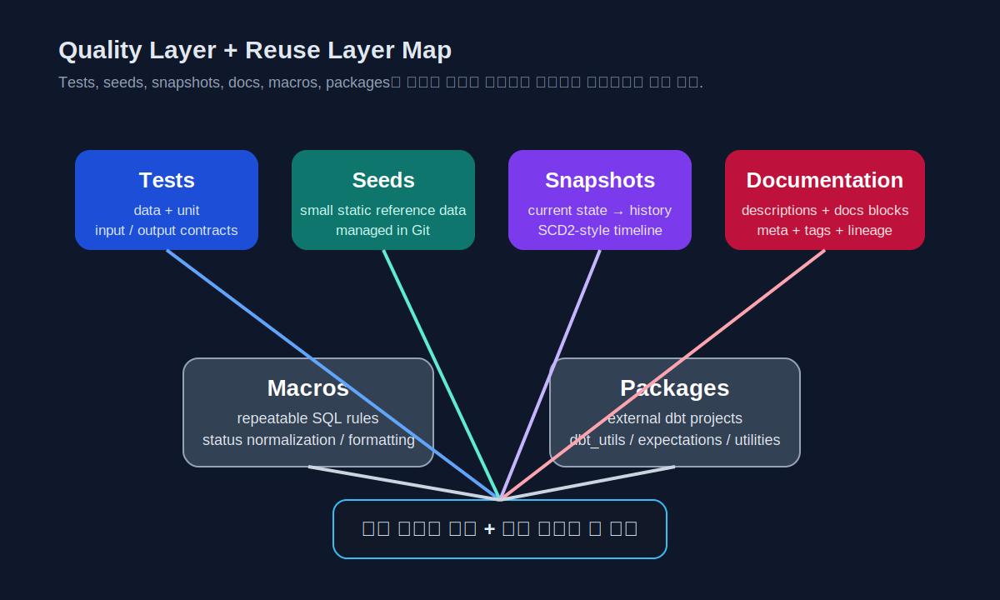
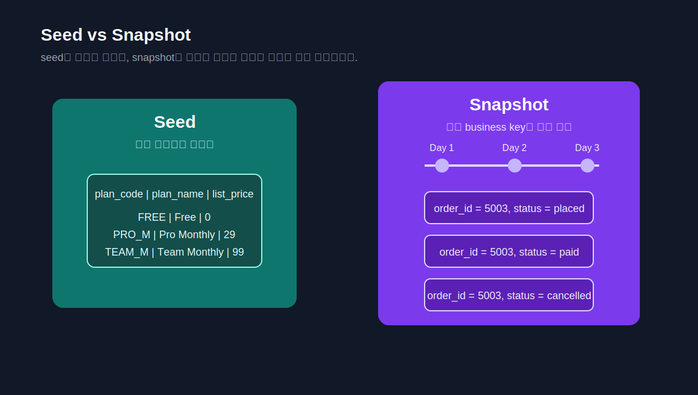

# CHAPTER 04 · Tests, Seeds, Snapshots, Documentation, Macros, Packages

> 신뢰 가능한 dbt 프로젝트를 만드는 **품질 계층과 재사용 계층**을 한 장에서 정리한다.

Chapter 03에서 우리는 `source()`와 `ref()`로 입력과 산출물의 계약을 세우고, selectors로 실행 범위를 좁히고, layered modeling과 grain으로 모델의 구조를 설계했다.  
그 다음 단계에서 반드시 따라오는 질문은 이것이다.

> **“좋다. 이제 이 모델을 믿어도 되는가? 그리고 이 프로젝트를 어떻게 반복 가능하게 유지할 것인가?”**

이 질문에 답하는 장치가 바로 이 장의 여섯 주제다.

- **tests**는 데이터와 로직에 대한 가정을 반복 가능하게 검증한다.
- **seeds**는 프로젝트 안에서 작은 기준표를 버전 관리 가능하게 만든다.
- **snapshots**는 현재 상태만 남는 입력에 대해 시간 축을 복원한다.
- **documentation**은 설명, lineage, metadata를 사람과 도구 모두가 읽을 수 있게 만든다.
- **macros**는 반복되는 SQL을 프로젝트 규칙으로 추상화한다.
- **packages**는 이미 검증된 패턴을 프로젝트에 가져오는 방법이다.

이 여섯 가지는 서로 따로 있는 기능이 아니다.  
테스트 없는 모델은 신뢰하기 어렵고, 문서가 없는 모델은 이해하기 어렵고, macro와 package가 없는 팀은 반복을 코드로 흡수하기 어렵다. seed와 snapshot은 프로젝트 밖의 데이터를 프로젝트 안으로 다룰 수 있는 형태로 바꿔 준다. 그래서 이 장은 기능 목록이 아니라 **품질과 재사용의 설계 장**으로 읽는 편이 맞다.



*그림 4-1. 모델을 “만드는 것”과 “믿을 수 있게 만드는 것” 사이를 연결하는 여섯 장치를 하나의 지도로 본다.*

## 4.1. 왜 이 여섯 주제를 한 장에서 묶는가

초보자는 보통 테스트, 문서화, macro, package를 각각 독립 기능으로 배운다.  
그렇게 배우면 각각의 문법은 익힐 수 있지만, 실제 프로젝트에서 **언제 어떤 장치를 써야 하는지**는 잘 보이지 않는다.

이 장의 관점은 다르다.  
질문을 기능 중심이 아니라 운영 중심으로 바꾼다.

1. 모델의 입력과 출력이 신뢰 가능한가?
2. 반복되는 기준표와 매핑값을 프로젝트 안에 넣을 수 있는가?
3. 상태 변화 이력을 현재 상태 테이블만으로 복원해야 하는가?
4. 팀원이 이 모델의 목적과 규칙을 바로 이해할 수 있는가?
5. 같은 SQL 조각이 반복될 때 어디까지 추상화해야 하는가?
6. 이미 커뮤니티와 팀이 검증한 패턴을 다시 만들 필요가 있는가?

이 질문들에 대한 답이 각각 tests, seeds, snapshots, docs, macros, packages로 이어진다.

### 4.1.1. 이 장에서 남아야 하는 감각

이 장을 읽고 나면 최소한 아래 감각은 남아야 한다.

- **generic / singular / unit test를 어떤 상황에 쓰는지 설명할 수 있다.**
- **seed와 source의 차이를 말할 수 있다.**
- **snapshot이 필요한 상황과 필요 없는 상황을 구분할 수 있다.**
- **문서화와 metadata를 “부가 작업”이 아니라 모델의 일부로 볼 수 있다.**
- **macro를 언제 만들고 언제 만들지 말아야 하는지 판단할 수 있다.**
- **package를 가져오는 것과 직접 구현하는 것의 trade-off를 이해할 수 있다.**

### 4.1.2. 이 장을 읽는 순서

이 장은 아래 순서를 따른다.

1. 테스트: 모델을 믿는 최소 기준을 세운다.
2. seeds: 프로젝트 안 기준표와 매핑표를 만든다.
3. snapshots: 시간에 따라 바뀌는 상태를 추적한다.
4. documentation: 사람이 이해할 수 있게 설명과 메타데이터를 붙인다.
5. macros: 반복을 프로젝트 규칙으로 추상화한다.
6. packages: 잘 검증된 패턴을 외부에서 가져온다.
7. 세 예제 적용: Retail Orders / Event Stream / Subscription & Billing에서 이 장의 기능이 어떻게 자란는지 본다.

---

## 4.2. Tests — 데이터와 로직을 고정하는 첫 번째 안전망

### 4.2.1. 테스트는 모델의 일부다

dbt에서 테스트는 “나중에 붙이는 QA 작업”이 아니다.  
오히려 모델의 목적을 가장 명확하게 드러내는 장치다.

예를 들어 `fct_orders`가 주문 단위 fact 모델이라면, 최소한 다음은 질문할 수 있어야 한다.

- `order_id`는 null이 아닌가?
- `order_id`는 중복되지 않는가?
- `customer_id`는 차원 모델에 존재하는가?
- 취소 주문의 금액 집계 규칙은 기대한 대로 계산되는가?
- 미래 시점의 이벤트나 음수 금액이 들어오지 않았는가?

즉, 테스트는 “이 모델이 어떤 가정을 전제로 존재하는가”를 문장 대신 실행 가능한 규칙으로 남긴다.

### 4.2.2. dbt의 테스트 축: generic, singular, unit

| 축 | 무엇을 검증하나 | 어디에 두나 | 대표 상황 |
| --- | --- | --- | --- |
| generic data test | 컬럼 또는 테이블 수준의 반복 가능한 가정 | `models/*.yml`, `sources.yml`, `snapshots/*.yml`, `seeds/*.yml` | `not_null`, `unique`, `relationships`, `accepted_values` |
| singular data test | 실패 행을 직접 정의하는 자유 SQL | `tests/*.sql` | 음수 금액 금지, 미래 타임스탬프 금지 |
| unit test | 작은 입력 행 → 기대 출력 행 | `models/*.yml` | 할인 계산, 취소 주문 처리, 세션 분할 로직 |

현재 dbt 문서에서는 “tests”를 더 명확히 구분하기 위해 **data tests**와 **unit tests**라는 용어를 사용한다. YAML 키로는 `data_tests:`가 기본이고, `tests:`는 alias로 여전히 지원된다.  
이 차이를 일찍 이해해 두면 Chapter 07의 contracts와 Chapter 08의 semantic validation까지 더 자연스럽게 이어진다.

### 4.2.3. generic data tests — 가장 먼저 붙이는 안전망

generic test는 같은 검증 패턴을 여러 모델에 재사용할 수 있게 만드는 방식이다.  
입문 단계에서 가장 먼저 붙일 네 가지는 아래다.

- `not_null`
- `unique`
- `relationships`
- `accepted_values`

Retail Orders 예시에서는 `fct_orders.order_id`와 `dim_customers.customer_id`가 가장 먼저 generic test 대상이 된다.

> 파일: [`../codes/04_chapter_snippets/ch04/models/marts_tests_and_unit_tests.yml`](../codes/04_chapter_snippets/ch04/models/marts_tests_and_unit_tests.yml)

```yaml
version: 2

models:
  - name: fct_orders
    description: "주문 단위 fact 모델"
    columns:
      - name: order_id
        description: "주문의 비즈니스 키"
        data_tests:
          - not_null
          - unique

      - name: customer_id
        description: "주문을 발생시킨 고객"
        data_tests:
          - not_null
          - relationships:
              arguments:
                to: ref('dim_customers')
                field: customer_id

      - name: order_status
        description: "표준화된 주문 상태"
        data_tests:
          - accepted_values:
              arguments:
                values: ['placed', 'paid', 'cancelled', 'shipped', 'delivered']
              config:
                where: "order_date >= current_date - interval '30 day'"
                severity: warn

unit_tests:
  - name: fct_orders_cancellation_rule
    model: fct_orders
    given:
      - input: ref('int_order_lines')
        rows:
          - {order_id: 5003, customer_id: 102, order_date: '2026-01-05', order_status: 'cancelled', line_amount: 16.0, quantity: 1}
    expect:
      rows:
        - {order_id: 5003, customer_id: 102, order_date: '2026-01-05', gross_revenue: 0.0, item_count: 0}
```

여기서 중요한 포인트는 두 가지다.

1. 기본 검증은 generic test로 먼저 덮는다.
2. business rule은 unit test로 명시한다.

### 4.2.4. singular data tests — 실패 행을 SQL로 직접 정의한다

generic test로는 다 표현되지 않는 규칙이 있다.  
예를 들어 Event Stream 트랙에서 “미래 시각의 이벤트는 금지” 같은 규칙은 자유 SQL이 더 적합하다.

> 파일: [`../codes/04_chapter_snippets/ch04/tests/assert_no_future_event_timestamp.sql`](../codes/04_chapter_snippets/ch04/tests/assert_no_future_event_timestamp.sql)

```sql
select *
from {{ ref('fct_events_daily') }}
where event_timestamp > current_timestamp
```

singular test는 `select`가 **실패 행을 반환**하도록 만든다.  
0행이면 통과, 1행 이상이면 실패다.

이 방식은 아래 경우에 특히 강하다.

- generic test로 표현하기 어색한 business rule
- 여러 컬럼을 동시에 보는 금지 조건
- 특정 시점 범위나 예외 규칙을 넣고 싶은 경우

### 4.2.5. unit tests — 계산 로직을 작은 입력으로 고정한다

unit test는 “full build를 돌려 보기 전에” 계산 규칙을 작게 검증한다.  
특히 아래 조건이 있으면 unit test 가치가 크다.

- CASE WHEN 분기가 많다.
- 취소/환불/중복/경계값 처리 규칙이 있다.
- window function이나 세션화처럼 로직이 복잡하다.
- semantic metric의 기반이 되는 핵심 intermediate 모델이다.

Subscription & Billing 트랙에서는 unit test가 특히 강력하다.  
예를 들어 `mrr` 계산, trial 전환, pause 상태 제외, refund 분개 규칙은 단순 data test보다 unit test가 훨씬 직접적이다.

### 4.2.6. 테스트 운영에서 초보자가 놓치기 쉬운 것

테스트는 붙이는 것만큼 **어떻게 운영할지**가 중요하다.

| 운영 포인트 | 왜 중요한가 |
| --- | --- |
| `test_type:data`, `test_type:unit` 분리 실행 | 개발 중에는 unit test 위주로 빠르게 확인하고, 배포 전에는 핵심 data test까지 묶기 쉽다 |
| `where` | 최근 30일 데이터처럼 관심 구간만 테스트할 수 있다 |
| `severity`, `warn_if`, `error_if` | 실패를 무조건 error로 다루지 않고 운영 민감도에 맞게 경고/실패를 분리할 수 있다 |
| `store_failures` | 실패 행을 남겨서 triage와 운영 분석에 쓸 수 있다 |

### 4.2.7. 테스트 안티패턴

- 결과를 한 번 눈으로 보고 “맞는 것 같다”고 끝낸다.
- 모든 규칙을 singular test로만 작성한다.
- unit test가 더 적합한 계산 규칙을 data test로 우회한다.
- key 컬럼에 `not_null`, `unique`조차 붙이지 않는다.
- 테스트 실패를 무조건 “데이터 문제”라고 생각하고 upstream 로직을 안 본다.

---

## 4.3. Seeds — 프로젝트 안 기준표와 매핑표를 버전 관리한다

### 4.3.1. seed는 작은 기준표를 프로젝트 안으로 가져오는 장치다

seed는 CSV를 relation로 적재해 쓰는 기능이다.  
source가 프로젝트 바깥 입력이라면, seed는 **프로젝트 안에서 관리하는 정적 혹은 저변화 참조 데이터**라고 보면 된다.

대표적인 seed 예시는 아래와 같다.

- 국가 코드표
- 상태값 매핑표
- 이벤트명 표준화 매핑표
- 구독 요금제 기준표
- 내부 실험용 작은 dimension 테이블

중요한 점은 seed가 “작고 안정적이며, Git으로 버전 관리할 가치가 있는 데이터”에 적합하다는 것이다.

### 4.3.2. seed와 source를 헷갈리지 말자

| 질문 | source | seed |
| --- | --- | --- |
| 데이터의 원래 소유자는 누구인가? | 외부 시스템 / EL 파이프라인 | 현재 dbt 프로젝트 |
| 데이터가 어디서 왔나? | raw schema, lake, warehouse 외부 입력 | repo 안의 CSV |
| 변경 주기는 어떤가? | 시스템에 따라 다름 | 보통 작고 느림 |
| 버전 관리의 중심은 어디인가? | 데이터 플랫폼과 파이프라인 | Git |

### 4.3.3. seed는 YAML로만 설정한다

현재 dbt 기준에서 seed는 CSV 안에서 config를 설정할 수 없고, **YAML 혹은 `dbt_project.yml`에서만 설정**한다. 이 점을 기억해 두면 model config와 seed config의 차이가 헷갈리지 않는다.

> 파일: [`../codes/04_chapter_snippets/ch04/seeds/reference_seed_properties.yml`](../codes/04_chapter_snippets/ch04/seeds/reference_seed_properties.yml)

```yaml
version: 2

seeds:
  - name: country_codes
    description: "국가 코드 기준표"
    config:
      column_types:
        country_code: varchar(2)
        country_name: varchar(100)
    columns:
      - name: country_code
        data_tests: [not_null, unique]

  - name: event_name_map
    description: "이벤트명 표준화 매핑표"
    config:
      quote_columns: false
    columns:
      - name: raw_event_name
        data_tests: [not_null, unique]

  - name: subscription_plan_catalog
    description: "구독 요금제 기준표"
    columns:
      - name: plan_code
        data_tests: [not_null, unique]
```

### 4.3.4. 세 예제에서 seed가 맡는 역할

#### A. Retail Orders
국가 코드, 고객 세그먼트 기준표, 채널 코드 매핑표처럼 **작고 안정적인 참조 데이터**가 잘 맞는다.

> 파일: [`../codes/04_chapter_snippets/ch04/seeds/country_codes.csv`](../codes/04_chapter_snippets/ch04/seeds/country_codes.csv)

```csv
country_code,country_name
KR,South Korea
US,United States
JP,Japan
SG,Singapore
```

#### B. Event Stream
raw event 이름은 운영 시스템마다 제각각일 수 있다. seed를 두면 `view_item`, `ViewItem`, `view-item` 같은 값을 표준 이벤트명으로 정리하기 쉽다.

> 파일: [`../codes/04_chapter_snippets/ch04/seeds/event_name_map.csv`](../codes/04_chapter_snippets/ch04/seeds/event_name_map.csv)

```csv
raw_event_name,canonical_event_name,event_group
ViewItem,view_item,commerce
view-item,view_item,commerce
AddToCart,add_to_cart,commerce
Purchase,purchase,commerce
```

#### C. Subscription & Billing
요금제명, billing cadence, list price, feature bundle 같은 값은 seed로 관리하면 문서화와 변경 이력 추적에 좋다.

> 파일: [`../codes/04_chapter_snippets/ch04/seeds/plan_tiers.csv`](../codes/04_chapter_snippets/ch04/seeds/plan_tiers.csv)

```csv
plan_code,plan_name,billing_cadence,list_price_usd
FREE,Free,monthly,0
PRO_M,Pro Monthly,monthly,29
PRO_Y,Pro Yearly,yearly,290
TEAM_M,Team Monthly,monthly,99
```

### 4.3.5. seed 안티패턴

- 원천 시스템에서 계속 바뀌는 운영 데이터를 seed에 넣는다.
- 대용량 데이터를 seed로 올리려 한다.
- CSV는 repo에 있는데 설명/테스트가 없다.
- 같은 기준표를 seed와 source 양쪽에서 이중 관리한다.

---

## 4.4. Snapshots — 현재 상태 테이블에 시간 축을 붙인다

### 4.4.1. snapshot은 언제 필요한가

snapshot은 “현재 상태만 남는 입력”에 과거 변경 이력을 붙이고 싶을 때 쓴다.  
즉, source 자체가 CDC나 history table을 제공하지 않을 때 dbt가 SCD2 스타일의 이력 테이블을 만든다고 이해하면 된다.

대표적인 상황:

- 주문 상태가 `placed → paid → cancelled`로 바뀌는데 source는 마지막 상태만 준다.
- 구독 상태가 `trialing → active → past_due → churned`로 바뀐다.
- 고객 세그먼트나 상품 분류가 수정되지만 변경 이력이 필요하다.

### 4.4.2. snapshot을 쓰지 않아도 되는 경우

아래 경우에는 snapshot보다 다른 해법이 낫다.

- 이미 source가 CDC/history table을 제공한다.
- 이력 분석이 불필요하고 현재 상태만 있으면 된다.
- 로직이 사실상 event log라 append-only raw 테이블이 이미 시간축을 담고 있다.

### 4.4.3. 현재 권장 방식: YAML 기반 snapshot 정의

최근 dbt 문서에서는 snapshot 속성을 YAML로 정의하는 방식을 권장한다.  
즉, snapshot의 select 대상과 config를 YAML에 모으고, legacy Jinja snapshot block 방식은 기존 프로젝트 호환 관점으로만 보는 편이 좋다.

> 파일: [`../codes/04_chapter_snippets/ch04/snapshots/orders_status_snapshot.yml`](../codes/04_chapter_snippets/ch04/snapshots/orders_status_snapshot.yml)

```yaml
version: 2

snapshots:
  - name: orders_status_snapshot
    relation: ref('stg_orders')
    description: "주문 상태와 금액 변화를 추적하는 snapshot"
    config:
      strategy: check
      unique_key: order_id
      check_cols:
        - order_status
        - total_amount
      updated_at: updated_at
      target_schema: snapshots
      dbt_valid_to_current: "to_date('9999-12-31')"
    columns:
      - name: order_id
        data_tests: [not_null]
```

구독 트랙에서도 비슷한 방식으로 `subscription_status_snapshot`을 둘 수 있다.

> 파일: [`../codes/04_chapter_snippets/ch04/snapshots/subscription_status_snapshot.yml`](../codes/04_chapter_snippets/ch04/snapshots/subscription_status_snapshot.yml)

```yaml
version: 2

snapshots:
  - name: subscription_status_snapshot
    relation: ref('stg_subscriptions')
    description: "구독 상태 변화 이력을 저장한다"
    config:
      strategy: timestamp
      unique_key: subscription_id
      updated_at: updated_at
      target_schema: snapshots
    columns:
      - name: subscription_id
        data_tests: [not_null]
```

### 4.4.4. `timestamp`와 `check`를 어떻게 고르나

| 전략 | 잘 맞는 상황 | 주의할 점 |
| --- | --- | --- |
| `timestamp` | 신뢰 가능한 `updated_at` 컬럼이 있다 | source의 갱신 타임스탬프 품질이 중요하다 |
| `check` | 비교할 컬럼은 있지만 믿을 만한 `updated_at`이 없다 | `check_cols`가 많아질수록 비용과 복잡도가 커질 수 있다 |

Retail Orders 트랙은 상태와 금액만 보면 되므로 `check`가 이해하기 쉽다.  
Subscription & Billing은 보통 `updated_at`이 더 중요하므로 `timestamp` 전략이 자연스럽다.



*그림 4-2. seed는 정적인 기준표이고, snapshot은 시간이 흐르며 여러 버전이 쌓이는 이력 테이블이다.*

### 4.4.5. snapshot을 읽는 감각

snapshot 결과를 처음 보면 같은 `order_id`가 여러 줄 보여서 “중복”처럼 느껴진다.  
하지만 snapshot의 핵심은 바로 그 중복처럼 보이는 버전들이다.

- 현재 row만 보고 싶으면 `dbt_valid_to`가 current sentinel이거나 null인 행을 본다.
- 특정 날짜 시점의 상태를 보고 싶으면 `dbt_valid_from <= as_of < dbt_valid_to` 범위를 본다.
- 변경 이력을 보고 싶으면 같은 business key의 여러 버전을 시간 순으로 읽는다.

### 4.4.6. snapshot 안티패턴

- source가 이미 event log인데 snapshot까지 중복으로 만든다.
- `updated_at`이 믿을 수 없는데 무조건 `timestamp` 전략을 쓴다.
- 현재 row와 이력 row를 downstream에서 구분하지 않는다.
- snapshot을 매 분마다 돌리면서 의미 없는 버전을 과도하게 쌓는다.

---

## 4.5. Documentation — 설명, lineage, metadata를 모델 옆에 둔다

### 4.5.1. 문서화는 꾸미기 작업이 아니다

문서화는 프로젝트가 커질수록 더 중요해진다.  
왜냐하면 dbt 프로젝트에서 실제로 사람을 혼란스럽게 만드는 것은 SQL 문법보다 **이 모델이 왜 존재하는지, 어떤 규칙을 따르는지, 어떤 예외가 있는지**이기 때문이다.

문서화는 최소한 아래 세 층을 가져야 한다.

1. 모델 설명
2. 컬럼 설명
3. 운영 메타데이터 (`meta`, `tags`, owner, sensitivity 등)

### 4.5.2. description과 docs block

작은 설명은 YAML 문자열로 충분하지만, 길고 구조적인 설명은 docs block이 훨씬 낫다.

> 파일: [`../codes/04_chapter_snippets/ch04/docs/orders_docs.md`](../codes/04_chapter_snippets/ch04/docs/orders_docs.md)

```md

`fct_orders`는 주문 단위 매출 fact 모델이다.

이 모델은 다음 규칙을 따른다.

1. 주문 grain은 `order_id` 기준이다.
2. 취소 주문은 `gross_revenue = 0`으로 집계한다.
3. `order_status`는 staging에서 표준화된 상태값만 허용한다.

```

그리고 properties 파일에서는 `doc()`로 연결한다.

> 파일: [`../codes/04_chapter_snippets/ch04/models/orders_documented.yml`](../codes/04_chapter_snippets/ch04/models/orders_documented.yml)

```yaml
version: 2

models:
  - name: fct_orders
    description: '{{ doc("fct_orders_long_description") }}'
    config:
      tags: ['mart', 'finance']
      meta:
        owner: 'data-platform'
        maturity: 'production'
        pii: false
    columns:
      - name: gross_revenue
        description: "주문 라인 금액 합계에서 취소 규칙을 반영한 주문 매출"
```

### 4.5.3. `persist_docs`, `meta`, `tags`를 같이 보자

- `persist_docs`: warehouse object comment까지 설명을 밀어 넣고 싶을 때 사용
- `meta`: owner, maturity, sensitivity, semantic hint 같은 자유 metadata 저장
- `tags`: 실행 선택, 배치 분리, 그룹화에 유용

이 셋은 문서화가 “읽기용 텍스트”를 넘어서 운영 데이터가 되는 지점이다.

### 4.5.4. 세 예제에서 문서화가 달라지는 포인트

- **Retail Orders**: KPI 정의와 grain을 명확히 남기는 것이 핵심
- **Event Stream**: event taxonomy와 sessionization 규칙을 설명해야 한다
- **Subscription & Billing**: 상태 정의, 환불/취소/재활성화 규칙이 문서 없이는 유지되기 어렵다

### 4.5.5. 문서화 안티패턴

- “이 모델은 주문 정보를 담는다” 같은 너무 일반적인 설명만 남긴다.
- 계산 규칙은 SQL 안에만 있고 설명에는 없다.
- 컬럼 설명이 비어 있어 downstream 소비자가 코드를 읽어야 한다.
- `meta`와 `tags` 없이 운영 분류를 모두 사람 기억에 의존한다.

---

## 4.6. Macros — 반복되는 SQL을 프로젝트 규칙으로 추상화한다

### 4.6.1. macro는 언제 만들어야 하나

macro는 반복되는 SQL 조각을 함수처럼 재사용하게 해 준다.  
하지만 macro는 항상 좋은 것이 아니라, **반복 + 규칙성 + 여러 곳에서 함께 바뀔 가능성**이 있어야 가치가 있다.

macro를 만들기 좋은 경우:

- 상태값 표준화 규칙이 여러 staging 모델에 반복된다.
- cents → currency 변환 로직이 계속 나온다.
- cross-platform safe cast나 surrogate key 생성이 자주 반복된다.

macro를 만들지 말아야 하는 경우:

- 아직 한 번만 쓴 SQL 조각
- 팀이 이해하기 어려운 추상화
- 모델의 핵심 business logic를 지나치게 숨기는 경우

### 4.6.2. 예시 macro

> 파일: [`../codes/04_chapter_snippets/ch04/macros/normalize_status.sql`](../codes/04_chapter_snippets/ch04/macros/normalize_status.sql)

```sql

  case
    when lower({{ column_name }}) in ('placed', 'created', 'new') then 'placed'
    when lower({{ column_name }}) in ('paid', 'captured') then 'paid'
    when lower({{ column_name }}) in ('cancelled', 'canceled') then 'cancelled'
    when lower({{ column_name }}) in ('shipped', 'in_transit') then 'shipped'
    when lower({{ column_name }}) in ('delivered', 'complete') then 'delivered'
    else 'unknown'
  end

```

이 macro는 Retail Orders에서는 주문 상태 표준화에, Subscription & Billing에서는 subscription status나 invoice status 정리에도 응용할 수 있다.

### 4.6.3. macro 안티패턴

- 간단한 CASE 하나를 위해 지나치게 일찍 macro를 만든다.
- macro 이름만 보고 무엇을 하는지 알 수 없다.
- Jinja 레이어가 많아져 compiled SQL이 읽기 어려워진다.
- 플랫폼별 분기 로직을 한 macro에 끝없이 넣는다.

---

## 4.7. Packages — 잘 검증된 패턴을 가져온다

### 4.7.1. package는 독립된 dbt 프로젝트다

dbt package는 단순한 유틸 함수 모음이 아니라, models, macros, tests, docs를 포함할 수 있는 **독립된 dbt 프로젝트**다.  
`dbt deps`를 실행하면 package가 설치되고, 그 안의 macro나 test를 현재 프로젝트에서 사용할 수 있다.

### 4.7.2. package를 쓸 때 먼저 생각할 것

1. 이 패턴을 우리가 직접 구현할 이유가 있는가?
2. 팀원이 이 package를 이해하고 유지할 수 있는가?
3. 버전 pinning과 upgrade 계획이 있는가?
4. package에서 가져오는 범위가 너무 큰 것은 아닌가?

### 4.7.3. 예시 packages.yml

> 파일: [`../codes/04_chapter_snippets/ch04/packages.yml`](../codes/04_chapter_snippets/ch04/packages.yml)

```yaml
packages:
  - package: dbt-labs/dbt_utils
    version: [">=1.3.0", "<2.0.0"]

  - package: calogica/dbt_expectations
    version: [">=0.10.0", "<0.11.0"]
```

그리고 설치는 아래처럼 한다.

```bash
dbt deps
```

`dbt_utils`는 surrogate key, date spine, union_relations 같은 반복 패턴에서 자주 쓰이고, `dbt_expectations`는 richer test 패턴을 빠르게 붙일 때 유용하다.  
다만 package를 붙인다고 설계 문제까지 해결되지는 않는다.

### 4.7.4. package 안티패턴

- package를 너무 많이 넣어 dependency graph를 불투명하게 만든다.
- 버전 범위를 너무 느슨하게 둔다.
- 팀이 읽지 못하는 macro를 무조건 가져다 쓴다.
- package가 있으면 직접 설계 원리를 이해할 필요가 없다고 생각한다.

---

## 4.8. 세 예제 트랙 안에서 이 장이 어떻게 이어지는가

앞 절까지는 공통 개념과 판단 기준을 설명했다.  
이제 그 개념이 세 트랙 안에서 실제로 어떻게 진행되는지 정리한다.

### 4.8.1. Retail Orders

Retail Orders에서는 이 장의 기능들이 가장 “교과서적”으로 보인다.

- **tests**: `order_id`, `customer_id`, `order_status`, `gross_revenue`에 기본 검증을 붙인다.
- **seed**: 국가 코드, 고객 세그먼트, 채널 매핑 같은 기준표를 seed로 둔다.
- **snapshot**: 주문 상태와 금액 변경을 이력으로 남긴다.
- **documentation**: 주문 grain, 취소 규칙, KPI 정의를 명확히 문서화한다.
- **macro**: 주문 상태 표준화, 금액 반올림, null-safe 계산을 macro로 추출한다.
- **package**: surrogate key나 calendar spine 같은 반복 패턴을 가져올 수 있다.

이 트랙은 “정형화된 분석 mart를 어떻게 신뢰 가능하게 만드는가”를 연습하기에 좋다.

### 4.8.2. Event Stream

Event Stream에서는 data volume과 append-only 성격 때문에 아래 포인트가 중요해진다.

- **tests**: 미래 시각 금지, session boundary 규칙, canonical event name 검증
- **seed**: raw event name → canonical event name 매핑표
- **snapshot**: 보통 핵심은 아니다. event log 자체가 시간 축을 이미 가진 경우가 많기 때문이다.
- **documentation**: event taxonomy, device/channel 표준화 규칙, 세션 정의를 길게 설명해야 한다.
- **macro**: event normalization, device parsing, URL cleaning 같은 반복 로직이 잘 맞는다.
- **package**: 날짜 spine, regex 유틸, generic expectations류가 유용하다.

이 트랙은 “event raw를 바로 metric으로 만들지 않고, taxonomy와 품질 규칙을 어떻게 먼저 고정하는가”를 보여 준다.

### 4.8.3. Subscription & Billing

Subscription & Billing은 이 장의 기능을 가장 깊게 요구한다.

- **tests**: subscription_id uniqueness, invoice 관계성, refund/credit 처리 규칙
- **seed**: 요금제 catalog, billing cadence, currency mapping
- **snapshot**: subscription status history, plan migration history
- **documentation**: MRR 정의, active 기준, churn 기준, 재활성화 규칙을 문서로 남겨야 한다.
- **macro**: 기간 정규화, 금액 환산, 상태 표준화
- **package**: rich expectations와 date dimension 유틸이 특히 자주 쓰인다.

이 트랙은 “현재 상태 + 이력 + business rule”이 동시에 중요하다는 점에서 Chapter 04의 기능을 가장 종합적으로 연습하게 만든다.

---

## 4.9. 직접 해보기

1. **Retail Orders**
   - `fct_orders`에 generic test 세 개를 붙인다.
   - `order_amount < 0` 금지 singular test를 만든다.
   - `5003 cancelled` 규칙을 unit test로 고정한다.

2. **Event Stream**
   - `event_name_map.csv` seed를 만들고 `dbt seed`로 적재한다.
   - `stg_events`에서 seed를 join해 canonical event name을 붙인다.
   - 미래 이벤트 금지 singular test를 추가한다.

3. **Subscription & Billing**
   - `subscription_plan_catalog` seed를 만든다.
   - `subscription_status_snapshot` YAML을 작성한다.
   - MRR 계산 규칙 하나를 unit test로 고정한다.

### 4.9.1. 정답 확인 기준

아래 네 문장을 스스로 설명할 수 있으면 이 장의 핵심을 잡은 것이다.

- “generic test와 singular test는 모두 data test지만 쓰는 방식이 다르다.”
- “seed는 프로젝트 내부 기준표이고 source는 프로젝트 외부 입력이다.”
- “snapshot은 현재 상태 테이블에 시간 축을 붙일 때 쓴다.”
- “macro와 package는 모두 재사용을 돕지만, package는 외부 프로젝트를 가져오는 방식이다.”

---

## 4.10. 완료 체크리스트

- [ ] generic / singular / unit test의 차이를 말할 수 있다.
- [ ] `where`, `severity`, `store_failures` 같은 운영형 test config의 의미를 안다.
- [ ] seed와 source의 차이를 알고, seed를 YAML로 설정할 수 있다.
- [ ] `timestamp`와 `check` snapshot 전략을 구분할 수 있다.
- [ ] docs block과 `meta`를 함께 활용할 수 있다.
- [ ] macro를 언제 만들고 언제 만들지 말아야 하는지 설명할 수 있다.
- [ ] `dbt deps`와 package version pinning의 의미를 안다.

---

## 4.11. 다음 장으로 이어지는 연결

이 장에서 우리는 모델을 **믿을 수 있게 만드는 장치**를 배웠다.  
다음 장에서는 관점을 한 번 더 바꿔서, 문제가 생겼을 때 **어디를 보고 어떻게 좁혀 들어가야 하는지**를 다룬다.

즉,

- Chapter 03이 “어떻게 설계할 것인가”라면,
- Chapter 04는 “어떻게 믿을 것인가”이고,
- Chapter 05는 “문제가 생겼을 때 어떻게 찾아낼 것인가”다.
