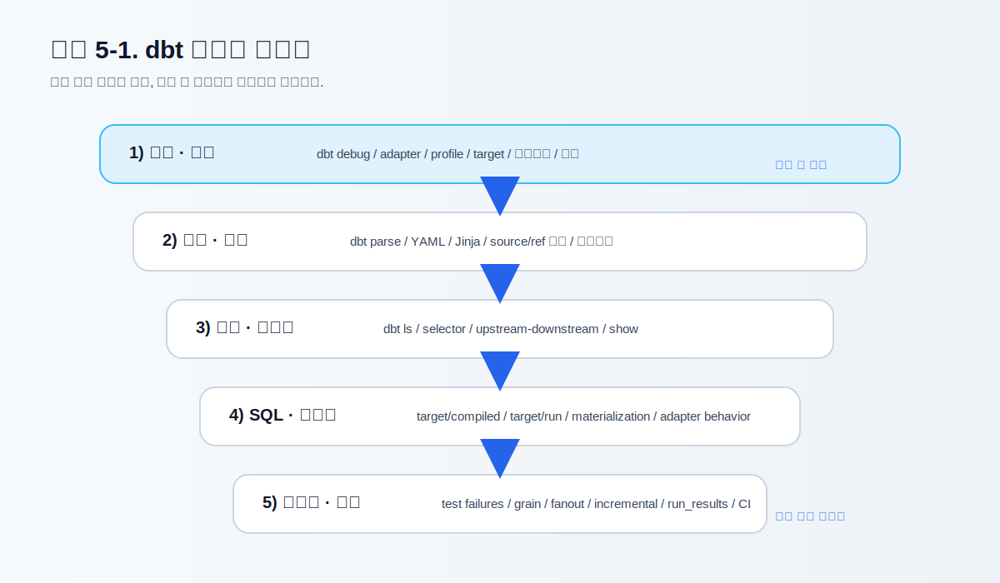
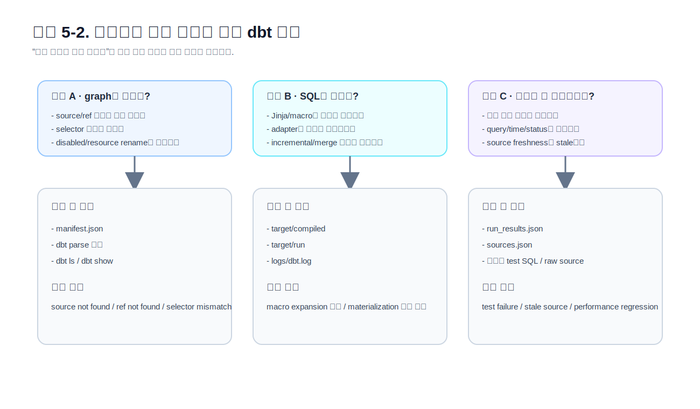

# CHAPTER 05 · 디버깅, artifacts, runbook, anti-patterns

> 문제를 빨리 좁히는 순서, dbt가 남기는 관찰 흔적, 실패를 재현하고 고치는 훈련, 반복되는 안티패턴을 한 장에 묶는다.

실무에서 차이를 만드는 것은 “처음부터 정답을 맞히는 능력”보다 **문제를 빠르게 좁히는 순서**를 갖고 있는가에 가깝다.  
dbt는 `debug`, `parse`, `ls`, `show`, `compile`, `build`, `retry` 같은 명령을 따로 제공하고, `target/`, `logs/`, JSON artifacts를 통해 **실행 전·중·후의 상태**를 서로 다른 흔적으로 남긴다. 이 구조를 이해하면 같은 실패를 더 적은 재실행으로 해결할 수 있다.

이 장의 목표는 세 가지다.

1. dbt 디버깅을 **명령 순서**와 **관찰 파일**의 관점에서 이해한다.
2. 실패를 일부러 만들어 보고, 왜 실패했는지 **원인-증상-관찰 포인트**를 연결한다.
3. Retail Orders / Event Stream / Subscription & Billing 세 트랙이 같은 원리를 각각 어떻게 활용하는지 확인한다.

---

## 5.1. 왜 디버깅은 별도 장으로 배워야 하는가

많은 초보자가 디버깅을 “에러가 났을 때 하는 뒷수습”으로 생각한다. 하지만 dbt에서는 디버깅이 곧 **프로젝트를 읽는 기술**이다.  
왜냐하면 dbt 프로젝트는 단일 SQL 파일이 아니라, YAML 설정, Jinja, resource graph, materialization, adapter 동작, 테스트, 문서화 metadata가 함께 엮여 있기 때문이다. 같은 에러 문구라도 실제 원인은 다음처럼 완전히 다를 수 있다.

| 문제 유형 | 흔한 증상 | 먼저 볼 것 |
|---|---|---|
| 설치/환경 | `dbt` 명령 인식 실패, adapter 미인식 | 가상환경, `dbt --version`, `dbt debug` |
| 연결/권한 | 스키마 생성 실패, 로그인 오류 | `profiles.yml`, 환경변수, target schema 권한 |
| 구조/파싱 | YAML parse error, model/source 인식 실패 | `dbt parse`, 파일명, 리소스 이름, 들여쓰기 |
| 의존성/선택 | `ref not found`, 예상보다 많은 노드 실행 | `dbt ls`, `selector`, graph 범위 |
| SQL/매크로 | 컴파일된 SQL이 예상과 다름 | `target/compiled`, `target/run`, macro expansion |
| 데이터 품질 | test 실패, row count 이상, revenue mismatch | 실패한 테스트 SQL, upstream 데이터, grain |
| 운영/성능 | 느린 build, CI에서만 실패, state mismatch | `run_results.json`, state artifact, 환경 차이 |

디버깅을 잘한다는 말은 결국 다음 세 문장을 몸으로 아는 상태를 뜻한다.

1. **무엇을 고치기 전에 무엇을 먼저 봐야 하는가**
2. **실패가 구조 문제인지, 데이터 문제인지, 실행 환경 문제인지**
3. **한 번에 전체를 다시 돌리지 않고도 어디까지 좁힐 수 있는가**

### 5.1.1. 관찰이 수정보다 먼저다

dbt에서 가장 흔한 안티패턴은 에러가 나자마자 SQL을 다시 쓰기 시작하는 것이다.  
하지만 dbt는 이미 많은 단서를 남긴다. `source()` 인자가 틀렸는지, graph에 노드가 빠졌는지, compiled SQL이 달라졌는지, 테스트가 어떤 행을 실패로 잡았는지, 실행 시간이 어느 노드에서 급증했는지 모두 로그와 artifact로 남는다.

이 장에서는 디버깅의 기본 원칙을 **observe before mutate**로 둔다.  
즉, 고치기 전에 먼저 본다.

- 먼저 증상을 정의한다.
- 그 증상이 어느 계층에 속하는지 분류한다.
- 가장 싼 관찰부터 시작한다.
- 마지막에만 실제 수정과 전체 재실행으로 넘어간다.

### 5.1.2. “실패 재현”이 중요한 이유

눈으로 읽는 디버깅 설명은 쉽게 잊힌다.  
반대로 실패를 일부러 만들어 보면 “어디를 열어야 하는지”가 기억에 남는다. 그래서 이 장은 설명만 하지 않고 `codes/04_chapter_snippets/ch05/labs/` 아래에 **망가진 예제**를 함께 둔다.  
실패를 피하는 법보다, 실패를 빠르게 복구하는 법이 더 오래간다.



### 5.1.3. 디버깅 사다리: 가장 싼 관찰부터 시작하기

디버깅 순서는 보통 아래처럼 잡는 것이 가장 효율적이다.

1. **환경 확인**  
   가상환경, adapter, profile 이름, target을 확인한다.
2. **구조 확인**  
   YAML/Jinja/리소스 이름이 프로젝트에서 정상 인식되는지 본다.
3. **그래프 범위 확인**  
   지금 실행 대상이 정확히 무엇인지 확인한다.
4. **컴파일 결과 확인**  
   Jinja와 macro가 풀린 SQL을 본다.
5. **실행 결과 확인**  
   실제 실패 노드, 실행 시간, 테스트 실패 행을 본다.
6. **데이터 원인 확인**  
   grain, joins, duplicates, late-arriving records를 본다.
7. **운영 원인 확인**  
   환경 차이, state artifact, CI 설정, version mismatch를 본다.

이 순서를 무시하고 곧바로 `dbt build` 전체를 반복하면, 실패는 계속 재현되지만 **원인 파악 속도는 거의 늘지 않는다**.

---

## 5.2. 디버깅에 쓰는 핵심 명령을 다시 정리하기

디버깅 장에서 명령은 “실행 도구”보다 **관찰 도구**로 봐야 한다.  
다음 표는 Chapter 02와 03에서 배운 명령을 디버깅 관점으로 다시 재배치한 것이다.

| 명령 | 무엇을 확인하는가 | 언제 먼저 쓰나 |
|---|---|---|
| `dbt debug` | 연결, adapter, project/profile 유효성 | 설치/연결이 의심될 때 |
| `dbt parse` | YAML/Jinja/graph 파싱 성공 여부 | 구조 오류가 의심될 때 |
| `dbt ls -s ...` | 선택된 노드 목록 | 실행 범위가 불분명할 때 |
| `dbt show -s ...` | 모델/seed/source preview | SQL 전체 build 전에 빠르게 확인할 때 |
| `dbt compile -s ...` | compiled SQL | macro, `ref()`, conditional logic가 의심될 때 |
| `dbt build -s ...` | run + test + snapshot + seed | 수정한 범위를 실제 검증할 때 |
| `dbt retry` | 마지막 invocation의 실패 지점 이후 재시도 | 긴 실행 중 일부만 다시 돌리고 싶을 때 |

### 5.2.1. `dbt debug`: 설치와 연결은 여기서 끊어낸다

`dbt debug`는 문제를 모델 SQL까지 가져가지 않게 해 준다.  
연결, adapter, project/profile 이름, 필수 의존성의 기본 상태를 한 번에 확인할 수 있기 때문에, 초보자가 제일 먼저 익혀야 하는 명령이다.

```bash
dbt debug
dbt debug --target dev
dbt debug --profiles-dir ~/.dbt
```

**이 명령에서 해결해야 하는 것**
- profile 이름 불일치
- adapter 미설치
- 자격 증명/환경변수 누락
- schema 생성 권한 부족
- target 오기

**이 명령에서 해결하지 않는 것**
- SQL 문법 오류
- `source()` / `ref()` 이름 실수
- test failure
- fanout / grain 문제

즉, `dbt debug`는 **연결과 환경을 분리하는 1차 관문**이다.

### 5.2.2. `dbt parse`: 구조 문제를 실행 없이 걸러낸다

`dbt parse`는 프로젝트를 파싱하고 유효성을 검증한다.  
YAML 들여쓰기 문제, 리소스 이름 누락, Jinja 블록 파손처럼 **실행 전에 잡을 수 있는 구조 오류**를 찾기에 적합하다.

```bash
dbt parse
dbt parse --target dev
```

이 명령은 특히 아래 경우에 유용하다.

- `source not found`가 실제로 source 정의 누락인지 확인하고 싶을 때
- `ref not found`가 이름 변경 때문인지 확인하고 싶을 때
- selector가 선택하는 graph가 기대와 다른지 확인하기 전에 노드가 살아 있는지 보고 싶을 때
- PR에서 SQL을 실행할 수 없는 환경에서도 최소한의 구조 검증을 하고 싶을 때

### 5.2.3. `dbt ls`와 `dbt show`: 범위를 줄이는 개발 감각

많은 사람이 `dbt ls`를 목차 확인용으로만 쓰지만, 디버깅에서는 훨씬 중요하다.  
`dbt ls`는 “내가 지금 무엇을 실행하려는가”를 명확하게 만든다. `dbt show`는 full materialization 없이 **미리 미리 모델 모양을 확인**할 수 있다.

```bash
dbt ls -s fct_orders+
dbt ls -s tag:nightly
dbt show -s stg_orders --limit 20
dbt show -s fct_orders
```

이 둘을 쓰면 다음과 같은 실수를 줄일 수 있다.

- 생각보다 훨씬 넓은 graph를 build하는 실수
- downstream까지 엮였는데 upstream만 보고 끝내는 실수
- 모델이 실제로 어떤 컬럼을 내는지 build 이후에야 보는 실수

### 5.2.4. `dbt compile`: 컴파일 결과를 보면 원인이 보인다

`compile`은 단순 문법 체크가 아니다.  
`ref()`, `source()`, macro, conditional Jinja, adapter-specific SQL이 **실제로 어떤 SQL로 풀렸는지** 보여 준다. 모델 파일만 읽어서는 안 보이는 문제가 `target/compiled`에서 드러나는 경우가 많다.

```bash
dbt compile -s stg_orders
dbt compile -s fct_orders
dbt compile -s tag:nightly
```

특히 아래 상황에서 강력하다.

- macro 확장 결과가 예상과 다를 때
- `if is_incremental()` 가지치기가 실제 어떤 WHERE 조건으로 풀리는지 보고 싶을 때
- `adapter.dispatch` 결과가 플랫폼별로 어떻게 달라지는지 보고 싶을 때
- 동일 모델이 dev와 prod에서 relation 이름이 어떻게 달라지는지 확인하고 싶을 때

### 5.2.5. `dbt retry`: 긴 실행에서 유용한 복구 습관

실행이 길고 실패 지점이 뒤쪽에 있을수록, 처음부터 다시 돌리는 것은 비싸다.  
`dbt retry`는 마지막 invocation의 실패 지점 이후를 다시 시도하는 데 유용하다.  
특히 대형 프로젝트나 CI 파이프라인에서 “다시 처음부터”를 줄이는 데 의미가 있다.

---

## 5.3. target, logs, artifacts를 한 번에 읽는 법

dbt 디버깅이 강력한 이유는 **실행 흔적을 구조화해서 남긴다**는 데 있다.  
이 흔적을 읽는 법을 알면 같은 오류 메시지라도 훨씬 많은 맥락을 얻는다.



### 5.3.1. `target/compiled`: dbt가 이해한 SQL

`target/compiled`는 Jinja가 풀린 compiled SQL이다.  
매크로나 조건문이 많은 프로젝트일수록 “내가 쓴 SQL”보다 “dbt가 이해한 SQL”이 더 중요해진다.

여기를 먼저 보는 질문:
- relation 이름이 왜 이렇게 나왔지?
- macro가 어떤 SQL 조각으로 바뀌었지?
- `is_incremental()` 안쪽과 바깥쪽이 실제로 어떻게 풀렸지?
- `ref('model_name')`가 어떤 physical relation을 가리키지?

### 5.3.2. `target/run`: 실제 실행에 사용된 SQL

`target/run`에는 materialization, adapter behavior가 반영된 실행 SQL이 남는다.  
예를 들어 `table`, `incremental`, `snapshot`, `materialized_view` 계열은 compiled SQL과 실제 실행 SQL 사이에 차이가 생길 수 있다.

여기를 먼저 보는 질문:
- 실행 시점에 CREATE / MERGE / INSERT OVERWRITE가 어떻게 나갔지?
- adapter가 relation을 어떻게 만들었지?
- DDL과 DML이 섞여서 어떤 순서로 실행됐지?

### 5.3.3. `logs/dbt.log`: 콘솔보다 풍부한 맥락

콘솔 출력은 짧고 잘린다.  
반면 `logs/dbt.log`에는 같은 에러라도 더 긴 문맥, adapter가 던진 메시지, query-level 정보가 남는다.  
특히 CI나 배치 환경에서는 콘솔 로그보다 이 파일이 훨씬 유용할 수 있다.

여기를 먼저 보는 질문:
- 데이터베이스가 실제로 무슨 에러를 냈지?
- 재시도/경고/이벤트가 어떤 순서로 나왔지?
- 로컬과 CI에서 어느 지점부터 달라졌지?

### 5.3.4. JSON artifacts: 실행 후의 메타데이터

dbt는 실행할 때 여러 artifact를 남긴다.  
이 장에서는 디버깅에 가장 많이 쓰는 다섯 가지를 먼저 익히자.

| 파일 | 무엇을 담나 | 언제 유용한가 |
|---|---|---|
| `manifest.json` | 프로젝트 전체 graph와 설정 | state, lineage, config 비교 |
| `run_results.json` | 이번 invocation에서 실행된 노드의 status와 timing | 실패 노드 확인, 느린 모델 찾기 |
| `sources.json` | freshness 결과 | source freshness triage |
| `catalog.json` | warehouse metadata | docs/column type 비교 |
| `semantic_manifest.json` | semantic layer graph | metric/semantic debugging |

#### manifest.json
전체 리소스 graph를 담는다. 실행하지 않은 노드도 대부분 들어 있다.  
state comparison, config diff, docs generation, lineage 확인의 기준선으로 쓰기 좋다.

#### run_results.json
이번 실행에서 **실제로 돌린 노드만** 들어 있다.  
어떤 노드가 failed/skipped/success였는지, timing이 얼마나 걸렸는지 추적할 때 좋다.

#### sources.json
freshness를 돌렸을 때 source 상태를 기록한다.  
“upstream source가 stale인데 downstream 모델이 이상하다” 같은 문제를 다룰 때 도움이 된다.

#### catalog.json
문서 사이트의 컬럼 타입/통계와 연결되는 artifact다.  
컬럼이 기대와 다른 타입으로 materialize됐는지 볼 때 유용하다.

#### semantic_manifest.json
후반 장의 semantic models / metrics를 다루게 되면 등장한다.  
이 장에서는 “semantic도 결국 artifact를 남긴다”는 점만 기억해 두자.

### 5.3.5. artifacts를 너무 쉽게 덮어쓰지 말기

`target/`은 다음 실행에서 쉽게 덮어써진다.  
중요한 실패를 분석할 때는 전체 build를 다시 돌리기 전에 **현재 상태의 target과 logs를 보존**해 두는 습관이 좋다.  
특히 state-aware CI, 성능 분석, flaky failure 재현에서는 이전 invocation의 `manifest.json`, `run_results.json`, `dbt.log`가 중요하다.

---

## 5.4. Failure Lab: 일부러 망가뜨리고 고쳐 보기

이 절은 companion code의 `codes/04_chapter_snippets/ch05/labs/`와 함께 읽는다.  
각 랩은 **증상 → 먼저 볼 것 → 왜 그런가 → 어떻게 고치는가** 순서로 전개한다.

### 5.4.1. Lab 01 · `source not found`

**증상**  
모델에서 `source('rawish', 'orders')`처럼 존재하지 않는 source를 참조한다.

**왜 자주 일어나는가**
- source 이름 변경 후 SQL을 같이 안 바꿨을 때
- source YAML 파일을 옮기면서 경로/이름이 달라졌을 때
- schema/table 이름과 source name을 혼동했을 때

**먼저 볼 것**
1. `dbt parse`
2. source YAML의 `name`, `schema`, `tables`
3. 모델 SQL 안의 `source()` 인자
4. `manifest.json`에 해당 source 노드가 있는지

**핵심 교훈**  
이 문제는 warehouse 데이터가 틀린 것이 아니라 **프로젝트 graph가 끊긴 것**이다.

### 5.4.2. Lab 02 · `ref not found`

**증상**  
모델 이름을 바꾼 뒤 `ref('old_name')`를 그대로 둔다.

**왜 자주 일어나는가**
- 파일명만 바꾸고 `name:` override를 잊었을 때
- disabled 모델을 참조할 때
- package/project dependency를 잘못 가리킬 때

**먼저 볼 것**
1. `dbt ls -s old_name`
2. 실제 파일명과 모델 `name`
3. disabled 여부
4. compiled graph

**핵심 교훈**  
`ref()` 오류는 대부분 “SQL이 틀렸다”보다 **graph 이름이 틀렸다**에 가깝다.

### 5.4.3. Lab 03 · YAML parse error

**증상**  
들여쓰기, 리스트 위치, `version: 2` 블록 구조가 잘못돼 parse 자체가 실패한다.

**왜 자주 일어나는가**
- tabs 사용
- list indent 잘못됨
- `columns:` 아래 `data_tests:` 위치가 어긋남

**먼저 볼 것**
1. `dbt parse`
2. YAML 파일 최소화
3. 최근 수정한 줄의 들여쓰기
4. 같은 종류의 정상 YAML과 비교

**핵심 교훈**  
YAML 실패는 조급하게 보면 SQL 문제처럼 느껴지지만, 사실은 **문서/메타데이터 계층의 구조 문제**다.

### 5.4.4. Lab 04 · singular test failure

**증상**  
주문 매출이 음수인 행을 잡는 singular test가 실패한다.

**왜 자주 일어나는가**
- upstream source에 취소/환불 로직이 섞였는데 필터가 빠졌을 때
- 할인/환불 컬럼을 잘못 합산했을 때
- intermediate 단계에서 sign convention을 통일하지 않았을 때

**먼저 볼 것**
1. 실패한 singular test SQL
2. 실패 행의 raw source
3. intermediate grain
4. mart aggregation 로직

**핵심 교훈**  
test failure는 SQL을 갈아엎으라는 신호가 아니라 **깨진 가정이 무엇인지 읽으라는 신호**다.

### 5.4.5. Lab 05 · fanout bug

**증상**  
`orders`와 `order_items`를 잘못 조인해 `gross_revenue`가 두 배, 세 배로 튄다.

**왜 자주 일어나는가**
- order grain과 order_item grain을 구분하지 않았을 때
- `sum(total_amount)`를 join 뒤에 그대로 더했을 때
- intermediate에서 line-level을 먼저 만들지 않고 mart에서 한 번에 해결하려 했을 때

**먼저 볼 것**
1. `count(*)`와 `count(distinct order_id)` 비교
2. join 전후 row count
3. line-level intermediate 유무
4. aggregate 위치

**핵심 교훈**  
fanout은 SQL 문법 문제가 아니라 **grain 설계 문제**다.

### 5.4.6. Lab 06 · incremental backfill 누락

**증상**  
`updated_at`만 보고 incremental filter를 걸었더니, 늦게 도착한 과거 데이터나 소급 수정이 누락된다.

**왜 자주 일어나는가**
- append-only라고 믿었지만 실제 소스가 update를 허용했을 때
- backfill 정책 없이 incremental을 도입했을 때
- `full_refresh` 전략을 미리 정하지 않았을 때

**먼저 볼 것**
1. `is_incremental()` 내부 필터
2. 소스의 실제 업데이트 패턴
3. `unique_key`, merge 전략
4. backfill 범위 재계산 기준

**핵심 교훈**  
incremental은 성능 최적화 수단이지, 모호한 데이터 모델을 덮어 주는 마법이 아니다.

---

## 5.5. 세 예제 트랙 안에서 디버깅이 어떻게 달라지는가

이 책은 같은 dbt 원리를 세 개의 도메인에 반복 적용한다.  
디버깅도 마찬가지다. 명령 순서는 같지만, **문제가 드러나는 방식과 먼저 의심할 포인트**는 다르다.

### 5.5.1. Retail Orders: order_id 5003을 끝까지 추적하기

Retail Orders에서는 order grain이 비교적 명확하다.  
그래서 가장 좋은 훈련은 **특정 주문 하나를 끝까지 추적**해 보는 것이다. 이 책에서는 `order_id = 5003`을 추천 기준 행으로 둔다.

주로 보는 지점은 다음과 같다.

1. `raw.orders` 에서 5003이 실제로 어떤 상태/금액으로 들어왔는가
2. `stg_orders` 에서 타입/상태값이 어떻게 정리됐는가
3. `int_order_lines` 에서 line grain으로 어떻게 풀렸는가
4. `fct_orders` 에서 왜 최종 gross_revenue가 그렇게 계산됐는가
5. snapshot에서 왜 두 개 이상의 버전이 생겼는가

Retail Orders 디버깅의 핵심 질문은 보통 이렇다.

- revenue가 틀린가?
- row count가 늘었는가?
- source freshness가 stale인가?
- snapshot에서 현재 버전과 과거 버전을 잘못 읽고 있지 않은가?

### 5.5.2. Event Stream: volume, ordering, duplication을 의심하기

Event Stream에서는 주문 데이터보다 “행이 많은 것”보다 “행이 너무 많거나 너무 적은 것”이 먼저 문제를 만든다.  
이 트랙에서 자주 부딪히는 문제는 아래와 같다.

- duplicate events
- out-of-order arrival
- session boundary 잘못 계산
- user_id/device_id 매핑 지연
- partition pruning 실패로 인한 성능 급락

그래서 Event Stream 디버깅은 다음을 먼저 본다.

1. source row volume가 평소와 얼마나 다른가
2. sessionization 이전/이후 row count가 어떻게 변하는가
3. event_time과 ingest_time 차이가 얼마나 큰가
4. incremental window가 늦게 도착한 이벤트를 놓치지 않는가

Retail Orders가 “정답 행 1개 추적”에 가깝다면, Event Stream은 “분포와 window를 읽는 디버깅”에 가깝다.

### 5.5.3. Subscription & Billing: 상태 전이와 snapshot 해석

Subscription & Billing은 단순 매출 합계보다 **상태 변화 해석**이 중요하다.  
특히 다음 문제는 실무에서 자주 보인다.

- plan upgrade / downgrade 처리 누락
- effective date와 booking date 혼동
- active subscription 기준 시점 불일치
- MRR 재산출 로직 누락
- snapshot current row와 history row를 혼동

이 트랙에서는 다음을 먼저 본다.

1. source의 상태 전이 규칙
2. snapshot의 `dbt_valid_from`, `dbt_valid_to`
3. “현재 활성”을 정의하는 WHERE 조건
4. MRR를 계산하는 기준 날짜
5. late corrections가 incremental로 누락되지 않는지

즉, Subscription & Billing의 디버깅은 “정답 SQL 찾기”보다 **시간 축 해석**에 가깝다.

---

## 5.6. Runbook: 문제가 생겼을 때 실제로 어떻게 움직일까

디버깅은 지식보다 루틴이 중요하다.  
아래 runbook은 로컬 개발, PR 리뷰, 배포 후 이상 징후 세 가지 상황을 기준으로 구성했다.

### 5.6.1. 로컬 개발 중 실패

```bash
# 1) 환경 확인
dbt debug

# 2) 구조 확인
dbt parse

# 3) 실행 범위 확인
dbt ls -s fct_orders+

# 4) SQL 미리 보기
dbt compile -s fct_orders
dbt show -s fct_orders --limit 20

# 5) 최소 범위 검증
dbt build -s fct_orders+
```

로컬에서는 **가장 작은 범위**를 먼저 돌리는 것이 핵심이다.

### 5.6.2. PR 리뷰 중 이상 징후

PR에서는 “내 로컬에서 됐다”가 충분한 답이 아니다.  
이때는 아래 질문이 중요하다.

- 변경된 모델과 downstream 영향 범위는 어디까지인가?
- 테스트가 추가/변경되었는가?
- artifact 기준으로 state가 어떻게 달라지는가?
- hard-coded relation name이 새로 들어오지 않았는가?

PR 설명에 최소한 다음 세 줄은 들어가는 것이 좋다.

1. 변경된 모델/테스트 목록
2. 영향 downstream 범위
3. 로컬 검증 명령

### 5.6.3. 배포 후 이상 징후

배포 후 문제는 “전체를 다시 돌리자”보다 **증상을 좁히는 것**이 먼저다.

- run_results에서 실패 노드와 timing을 본다.
- source freshness가 stale인지 확인한다.
- 특정 fact/dim이 이상하면 정답 행/정답 기간을 정한다.
- 그 다음에만 범위를 좁혀 재실행한다.
- 긴 배치의 경우 `dbt retry`를 검토한다.

---

## 5.7. 안티패턴 아틀라스

디버깅 장의 핵심은 “이렇게 하라”뿐 아니라 “이렇게 하지 말라”를 아는 것이다.

### 5.7.1. 안티패턴 1 · 전체 build 반복
에러가 날 때마다 `dbt build` 전체를 다시 돌린다.  
문제는 계속 재현되지만 원인은 더 늦게 보인다.

**대신**  
`debug → parse → ls/show → compile → build(minimal scope)` 순서를 고정한다.

### 5.7.2. 안티패턴 2 · relation 이름 하드코딩
`source()`와 `ref()`를 안 쓰고 물리 relation을 직접 적는다.  
이러면 lineage가 끊기고 환경별 차이가 숨어 버린다.

**대신**  
입력은 `source()`, 내부 산출물은 `ref()`를 원칙으로 유지한다.

### 5.7.3. 안티패턴 3 · compiled SQL을 안 보고 추측
macro, config, adapter-specific behavior가 있는 모델을 원본 SQL만 보고 판단한다.

**대신**  
`target/compiled`와 `target/run`을 먼저 연다.

### 5.7.4. 안티패턴 4 · fanout을 SQL 문법 문제로 오해
조인 이후 숫자가 틀리면 WHERE나 CAST를 먼저 의심한다.

**대신**  
grain과 row count부터 다시 본다.

### 5.7.5. 안티패턴 5 · 테스트 실패를 무시
build가 green이면 괜찮다고 생각한다.

**대신**  
green build는 시작일 뿐이고, 실패 테스트는 깨진 가정을 말해 주는 문서라고 생각한다.

### 5.7.6. 안티패턴 6 · incremental을 너무 일찍 도입
느려 보인다는 이유로 곧바로 incremental로 옮긴다.

**대신**  
정확한 grain, unique key, backfill policy가 먼저다.

### 5.7.7. 안티패턴 7 · artifact를 덮어쓰며 디버깅
실패 원인을 보기 전에 다른 실행으로 `target/`을 덮어쓴다.

**대신**  
분석이 필요한 실패는 `target/`과 `logs/`를 먼저 보존한다.

---

## 5.8. 직접 해보기

1. `labs/01_source_not_found`를 재현하고 `dbt parse`로 실패를 먼저 확인한다.
2. `labs/02_ref_not_found`에서 `dbt ls`로 graph 이름을 다시 찾는다.
3. `labs/03_fanout_bug`에서 bad/good 모델의 row count와 revenue 합계를 비교한다.
4. `labs/04_incremental_backfill`에서 incremental filter를 읽고 누락 가능한 시나리오를 적어 본다.
5. `labs/05_singular_test`를 실행해 어떤 행이 왜 실패하는지 설명해 본다.

---

## 5.9. 완료 체크리스트

아래 질문에 “예”라고 답할 수 있으면 이 장의 목표를 달성한 것이다.

- [ ] 연결 문제와 구조 문제를 구분해서 다룰 수 있는가?
- [ ] `dbt parse`와 `dbt compile`의 역할 차이를 설명할 수 있는가?
- [ ] `target/compiled`, `target/run`, `logs/dbt.log`를 각각 언제 여는지 아는가?
- [ ] `manifest.json`, `run_results.json`, `sources.json`이 각각 언제 필요한지 말할 수 있는가?
- [ ] `source not found`, `ref not found`, fanout bug, incremental backfill 문제를 재현하고 복구할 수 있는가?
- [ ] Retail Orders / Event Stream / Subscription & Billing에서 디버깅 포인트가 어떻게 달라지는지 설명할 수 있는가?

---

## 5.10. 이 장의 핵심 문장

- dbt 디버깅은 “정답 찾기”보다 **문제 좁히기**다.
- 가장 싼 관찰부터 시작해야 한다.
- compiled SQL과 artifacts를 보면 추측보다 빨리 원인이 보인다.
- test failure는 SQL 전체를 갈아엎으라는 신호가 아니라 **깨진 가정이 무엇인지 읽으라는 신호**다.
- 세 예제 트랙은 서로 다른 데이터 성질을 갖지만, 디버깅의 기본 순서는 동일하다.

---

## 5.11. 같이 보면 좋은 코드 경로

- `../codes/04_chapter_snippets/ch05/debug_runbook.sh`
- `../codes/04_chapter_snippets/ch05/artifact_inspection.sh`
- `../codes/04_chapter_snippets/ch05/labs/01_source_not_found/`
- `../codes/04_chapter_snippets/ch05/labs/02_ref_not_found/`
- `../codes/04_chapter_snippets/ch05/labs/03_fanout_bug/`
- `../codes/04_chapter_snippets/ch05/labs/04_incremental_backfill/`
- `../codes/04_chapter_snippets/ch05/labs/05_singular_test/`
