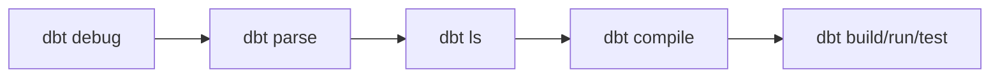

CHAPTER 05

디버깅, artifacts, runbook, anti-patterns

문제를 좁히는 순서, 실패 실험, 정답표와 워크북, 반복되는 실수까지 한 번에 묶는다.

| 핵심 개념 → 사례 → 운영 기준 | 설명을 먼저 충분히 풀고, 이후 장에서 예제 케이스북과 플랫폼 플레이북으로 다시 가져간다. |
| --- | --- |

실무에서 가장 큰 차이를 만드는 것은 “정답을 미리 아는 능력”보다 “문제를 빨리 좁히는 순서”를 갖는 능력이다. dbt는 debug, parse, ls, compile, build라는 관찰 명령을 따로 제공하고, target과 logs와 artifacts를 분리해서 남기기 때문에, 이 구조를 이해하면 같은 실패도 훨씬 빠르게 다룰 수 있다.

이 장은 실패 재현 랩, 5003 expected result, day1/day2 runbook, 안티패턴 아틀라스를 함께 넣어 단순한 설명서가 아니라 실제 훈련 자료처럼 읽히도록 구성한다. 여기서 익힌 관찰 순서는 뒤의 예제 케이스북과 플랫폼 플레이북에서도 그대로 반복된다.

디버깅과 실패 재현 랩

| 필수+ | 처음 읽는 사람은 장 끝의 ‘직접 해보기’를 반드시 해 본다. 이해가 아니라 손의 감각을 남기는 것이 목표다. |
| --- | --- |

| 이 장에서 배우는 것 • 문제 유형을 설치/연결/구조/SQL/데이터 품질로 나눠 본다. • target/compiled, target/run, logs/dbt.log, manifest.json, run_results.json의 역할을 이해한다. • 실패 재현 랩을 통해 ‘망가뜨리고 고치는’ 경험을 한다. | 완료 기준 • 문제가 생겼을 때 전체 build를 반복하는 대신 범위를 줄이는 루틴을 쓸 수 있다. • 어떤 파일을 먼저 열어야 하는지 감이 생긴다. • source not found, ref not found, test failure, fanout bug를 재현하고 해결할 수 있다. |
| --- | --- |

*그림 12-1. 문제를 좁히는 순서를 먼저 고정하면 불필요한 재실행이 크게 줄어든다*

12-1. 디버깅은 명령 순서가 핵심이다

초보자가 가장 많이 시간을 잃는 순간은 설치 문제, YAML 문제, SQL 문제를 한 번에 잡으려 할 때다. 그래서 디버깅은 정답을 맞히는 기술보다 순서를 지키는 습관에 가깝다. debug는 연결, parse는 구조, ls는 선택 범위, compile은 SQL, run/build는 실제 실행이라는 계단을 만든다.

12-2. target과 logs, artifacts를 구분해 보기

| 위치 | 무엇이 있나 | 언제 보나 |
| --- | --- | --- |
| target/compiled | Jinja가 풀린 compiled SQL | 매크로·ref·조건문이 실제로 어떻게 해석됐는지 볼 때 |
| target/run | 실행에 사용된 SQL | materialization이나 adapter 동작이 궁금할 때 |
| logs/dbt.log | 오류 메시지, 쿼리 로그 | 콘솔보다 더 자세한 실패 맥락이 필요할 때 |
| manifest.json | 전체 프로젝트 메타데이터 | state selection, docs, lineage, config 확인 |
| run_results.json | 실행된 노드의 status와 timing | 느린 모델, 실패 노드, 실행 이력 파악 |
| sources.json | source freshness 결과 | freshness 실행 후 상태를 기록 |

failure lab 1 source not found

| 재현 방법 1. labs/01_source_not_found/broken_stg_orders.sql을 현재 stg_orders.sql 대신 복사한다. 2. dbt parse를 실행한다. 3. source 이름이 왜 끊겼는지 sources.yml과 SQL을 함께 본다. |
| --- |

| 체크 순서 1) models/sources.yml 의 source name / table name 2) 해당 모델 SQL 의 source() 인자 3) dbt parse 결과 4) target/manifest.json 에 source 노드가 잡혔는지 |
| --- |

failure lab 2 ref not found

모델 이름을 바꾸었는데 ref('예전이름')를 그대로 두면 ref not found가 난다. 이때는 실제 파일명, 모델 name, disabled 여부, selector 범위를 함께 봐야 한다.

failure lab 3 relationships / singular test 실패

테스트 실패는 곧바로 SQL 전체를 갈아엎으라는 신호가 아니다. 실패한 테스트가 어떤 가정을 말하는지 먼저 읽고, 관련 모델과 upstream 데이터를 좁혀 들어가야 한다. singular test는 실패 행을 직접 보여 주기 때문에 원인을 파악하기 더 쉽다.

failure lab 4 fanout bug

labs/03_fanout_bug에는 일부러 grain을 틀린 상태의 mart 예제가 들어 있다. row count와 gross_revenue 합계를 비교해 보고, intermediate로 조인을 끌어올린 이유를 다시 확인해 보자.

failure lab 5 incremental backfill 문제

labs/05_incremental_backfill은 updated_at 기준만으로는 과거 수정이 누락될 수 있음을 보여 준다. 이 랩은 ‘incremental은 더 복잡한 설계’라는 사실을 몸으로 익히게 해 준다.

| 막혔을 때 스스로에게 던질 질문 • 이건 연결 문제인가, 구조 문제인가, SQL 문제인가? • 현재 선택 범위가 너무 넓지 않은가? • compiled SQL을 실제로 확인했는가? • 실패 테스트가 말하는 가정을 정확히 이해했는가? • direct relation 이름을 써서 lineage를 깨뜨린 것은 아닌가? |
| --- |

| 안티패턴 에러가 나자마자 SQL을 새로 쓰기 시작하는 것. 먼저 debug/parse/ls/compile로 범위를 줄이는 편이 훨씬 빠르다. |
| --- |

| 직접 해보기 1. companion ZIP의 labs/01_source_not_found를 재현하고 dbt parse로 해결한다. 2. 다음으로 labs/03_fanout_bug를 재현한 뒤 row count와 gross_revenue 합계를 비교한다. 3. 마지막으로 run_results.json이 어떤 정보를 담는지 한 번 열어 본다. 정답 확인 기준: 오류가 났을 때 바로 전체 build를 반복하지 않고, 어떤 계단에서 멈췄는지 설명할 수 있으면 성공이다. |
| --- |

| 완료 체크리스트 • □ 디버깅 사다리의 순서를 기억한다. • □ target, logs, artifacts의 차이를 안다. • □ failure lab 하나 이상을 스스로 재현하고 고쳤다. |
| --- |

문제 해결 체크리스트

실패가 났을 때 제일 먼저 좁히는 순서를 다시 확인한다.

1. 가상환경이 활성화되어 있는가

2. dbt --version에서 adapter가 함께 보이는가

3. dbt debug가 통과하는가

4. profile 이름과 profiles.yml 최상위 키가 같은가

5. 실패 범위를 -s model_name까지 좁혔는가

6. dbt ls -s...로 선택 결과를 확인했는가

7. dbt parse로 구조 오류를 먼저 확인했는가

8. dbt compile -s...로 compiled SQL을 보았는가

9. target/run과 target/compiled를 구분해서 보고 있는가

10. logs/dbt.log를 열어 보았는가

11. 직접 relation 이름 하드코딩으로 lineage를 깨뜨리지 않았는가

12. 테스트 실패를 데이터 품질 문제와 로직 문제로 분리해서 보고 있는가

| 중요한 원칙 전체 실행을 반복하기 전에, 문제 범위를 줄이고 compiled SQL과 관련 artifacts를 보는 것이 가장 큰 시간 절약이다. |
| --- |

따라하기 워크북 모드

companion pack을 실제 실습서처럼 사용할 때의 step-by-step runbook.

| 이 appendix를 이렇게 쓰세요 • 처음 따라칠 때는 README보다 이 부록의 단계 표를 먼저 펼쳐 둔다. 명령, 기대 결과, 막히면 먼저 볼 곳이 한 번에 모여 있다. • 주문 5003을 기준점으로 삼아 raw → staging → intermediate → mart → snapshot 값이 연결되는지 확인한다. • 값이 다르면 workbook/5003_trace_summary.csv 와 reference_outputs/ 를 바로 대조한다. 이 부록의 표는 companion ZIP의 workbook/ 폴더 내용과 1:1로 맞춰 두었다. |
| --- |

F-1. day1/day2 8단계 runbook

| 단계 | 실행 명령 | 여기서 확인할 것 | 5003 기대 결과 | 막히면 먼저 볼 곳 |
| --- | --- | --- | --- | --- |
| 0 | venv 생성 + dbt 설치profile 복사 | CLI와 adapter 준비 | 아직 데이터 없음 | .venv / profiles.example.yml |
| 1 | python scripts/load_raw_to_duckdb.py--database ./dbt_book_lab.duckdb --day day1 | raw 스키마 4개 테이블 생성 | status=paidshipping_fee=2.5total_amount=18.5 | scripts/load_raw_to_duckdb.pyDuckDB 파일 경로 |
| 2 | dbt debug | profile·adapter 인식 | 연결 통과 | ~/.dbt/profiles.ymlprofile 이름 |
| 3 | dbt seed | seed_data relation 생성 | country_codes / segment_mapping 생성 | dbt_project.ymlseed-paths |
| 4 | dbt build -s staging | rename / cast / 표준화 | order_status=paidorder_date=2026-03-04 | models/sources.ymlstg_orders.sql |
| 5 | dbt build -s intermediate | line grain 유지 | 5003이 2행8.5 + 7.5 = 16.0 | join keyint_order_lines.sql |
| 6 | dbt build -s marts | 주문 grain 1행으로 재집계 | gross_revenue=16.0order_amount=18.5item_count=3 | fanout 여부fct_orders.sql |
| 7 | dbt source freshnessdbt docs generatedbt show --select fct_orders | sources.json과 lineage 확인 | raw→stg→int→fct 노선이 보임 | sources.yml freshnesstarget/sources.json |
| 8 | python scripts/load_raw_to_duckdb.py--database ./dbt_book_lab.duckdb --day day2dbt snapshot | late change + snapshot 이력 | cancelled 버전 추가총 2행 기대 | snapshots/orders_snapshot.ymlupdated_at/check_cols |

F-2. 5003 expected result 정답표

| 층/시점 | 핵심 값 | 왜 이렇게 되나 | 빠른 비교 파일 |
| --- | --- | --- | --- |
| raw day1 | status=paidshipping_fee=2.5total_amount=18.5 | 원천 입력값 그대로 | raw_data/day1/orders.csv |
| stg_orders day1 | order_status=paidline_total=16.0total_amount=18.5 | rename + cast + 표준화 | reference_outputs/stg_orders_day1.csv |
| int_order_lines day1 | 2행line_amount=8.5 / 7.5 | line grain을 유지한 reusable join | reference_outputs/int_order_lines_day1.csv |
| fct_orders day1 | gross_revenue=16.0order_amount=18.5item_count=3 | 주문 grain 1행으로 다시 집계 | reference_outputs/fct_orders_day1.csv |
| raw/stg day2 | status=cancelledshipping_fee=0.0total_amount=0.0 | late change 반영 | raw_data/day2/orders.csvreference_outputs/stg_orders_day2.csv |
| fct_orders day2 | gross_revenue=16.0order_amount=16.0 | business rule 예시: 취소 주문 총액 재정의 | reference_outputs/fct_orders_day2.csv |
| snapshot after day2 | paid 버전 1행 + cancelled 버전 1행 | 이력 구조이므로 같은 key의 여러 행이 의도적으로 생김 | workbook/orders_snapshot_expected_5003.csv |

| 정답이 하나가 아닌 부분 • 5003의 order_amount를 day2에 0.0으로 둘지 16.0으로 다시 계산할지는 business rule의 영역이다. • 중요한 것은 어떤 규칙을 선택했는지와, 그 규칙을 test와 docs로 남겼는지다. |
| --- |

F-3. 실패 증상 → 먼저 볼 곳 매트릭스

| 증상 | 가장 먼저 볼 곳 | 흔한 원인 | 빠른 복구 |
| --- | --- | --- | --- |
| Profile not found | ~/.dbt/profiles.ymlprofiles.example.yml | profile 이름 불일치 | project의 profile 값과 profiles.yml 최상위 키를 맞춘다 |
| source not found | models/sources.ymldbt parse | source/table 이름 오타 | source() 인자와 YAML 이름을 동일하게 맞춘다 |
| ref not found | dbt ls -s ...대상 모델 파일 | 모델 rename / disabled / 오타 | ref 대상 모델 이름과 selector 범위를 다시 본다 |
| relationships 실패 | dimension build 결과upstream raw 키 | missing key 또는 join 문제 | upstream build 후 missing customer_id를 찾는다 |
| gross_revenue가 두 배 | int_order_lines vs fct_orders row count | grain 누락 / fanout | intermediate에서 line grain 고정 후 mart에서 집계한다 |
| snapshot 행 수가 늘지 않음 | snapshots/orders_snapshot.yml | updated_at 또는 check_cols 설정 누락 | snapshot config를 다시 보고 day2 데이터를 재적재한다 |

| BASHdbt debugdbt parsedbt ls -s fct_orders+dbt compile -s fct_ordersdbt build -s fct_orders+ |
| --- |

초보자 안티패턴 아틀라스

시간이 갈수록 비용이 커지는 대표 패턴을 먼저 본다.

| 빠르게 읽는 법 • 지금 겪는 증상과 닮은 행이 보이면 해당 장으로 바로 돌아간다. • 안티패턴은 지식 부족의 증거가 아니라, 아직 규칙이 코드와 테스트로 고정되지 않았다는 신호다. |
| --- |

G-1. 자주 반복되는 안티패턴 8개

| 안티패턴 | 보이는 증상 | 왜 위험한가 | 돌아갈 장 |
| --- | --- | --- | --- |
| giant SQL 만능론 | rename, join, 집계, KPI가 한 파일에 다 섞여 있다 | 변경 지점과 테스트 위치가 흐려진다 | 01, 07 |
| raw relation 하드코딩 | from raw.orders가 여기저기 보인다 | lineage와 source 계약이 약해진다 | 05 |
| grain 없이 바로 join | row 수가 늘고 금액이 두 배가 된다 | fanout이 생겨도 원인을 설명하기 어렵다 | 07, 12 |
| 항상 전체 build | 작은 수정에도 시간이 오래 걸린다 | 실패 범위를 좁히지 못한다 | 06, 12 |
| premature incremental | 빨라졌지만 결과가 조용히 틀린다 | 새 행/수정 행/backfill 규칙이 비어 있다 | 08 |
| macro 과잉 추상화 | SQL보다 템플릿을 더 오래 읽게 된다 | 온보딩과 디버깅이 어려워진다 | 11 |
| 눈대중 검증만 하기 | 이번엔 맞아 보여도 다음 배치에서 다시 확인할 수 없다 | 가정이 테스트로 남지 않는다 | 09 |
| dev / prod 같은 schema 쓰기 | 실습 중 공용 자산이 덮어써진다 | 개발과 배포 규칙이 뒤섞인다 | 13 |

G-2. 좋은 흐름을 기억하는 다섯 문장

| 좋은 흐름 요약 • 원천을 읽는 첫 모델은 source()에서 시작한다. • join 전에 각 모델의 grain을 문장으로 적는다. • giant SQL이 보이면 intermediate로 역할을 나눈다. • 전체 build보다 ls / run / test로 범위를 좁힌다. • 규칙은 사람의 기억이 아니라 docs와 tests에 남긴다. |
| --- |

G-3. 스스로 진단해 보기

| 질문 | 예 / 아니오 | 메모 |
| --- | --- | --- |
| 최근에 raw relation 이름을 직접 적은 적이 있는가? | □ 예   □ 아니오 |  |
| join 전에 grain을 쓰지 않고 바로 SQL을 짜는 편인가? | □ 예   □ 아니오 |  |
| 작은 수정에도 습관처럼 전체 build를 돌리는가? | □ 예   □ 아니오 |  |
| 테스트 없이 눈으로만 확인하고 넘어간 모델이 있는가? | □ 예   □ 아니오 |  |
| incremental인데 full-refresh 기준을 팀 규칙으로 정하지 않았는가? | □ 예   □ 아니오 |  |
| dev와 prod의 schema 분리 원칙을 문장으로 설명하기 어려운가? | □ 예   □ 아니오 |  |

| 복습 미션 • 위 표에서 “예”가 나온 항목 둘을 골라, 그것을 줄이는 팀 규칙을 한 문장씩 적어 본다. • 각 항목이 다시 나타났을 때 어디로 돌아갈지 장 번호를 같이 적는다. |
| --- |

다음 단계에서 해볼 것

| 이제부터는 “학습용 프로젝트”를 “현업 온보딩 교재”로 바꿉니다 • APPENDIX H에서는 실제 요청 문장을 dbt 변경 작업으로 번역하는 실무 시나리오 5개를 다룬다. • APPENDIX I에서는 언제 view / table / incremental / snapshot / macro / intermediate를 쓰는지 결정표로 정리한다. • APPENDIX J에서는 01~15장을 질문으로 다시 묶어 1분 퀴즈와 자기 점검으로 복습한다. 책을 한 번 읽은 뒤에는 H → I → J 순서로 다시 훑으면 현업 적용 감각이 훨씬 빨라진다. |
| --- |

5003과 실패 재현 랩을 같이 쓰는 법

companion ZIP의 5003 expected result 표는 단순한 정답지가 아니다. source에서 읽은 값이 staging에서 어떻게 정리되고, intermediate에서 어떤 line grain으로 풀리며, mart와 snapshot에서 어떤 결과로 이어지는지를 단계별로 보여 준다. 실패 재현 랩과 함께 보면 “무엇이 기대값이었는지”와 “어디서부터 어긋났는지”를 동시에 확인할 수 있어 디버깅 훈련 자료로 매우 좋다.

5003 trace 시각화

안티패턴 아틀라스를 읽는 자세

안티패턴은 “틀린 예시 모음”이 아니라 비용이 커지는 방향을 미리 보는 지도다. giant SQL, 하드코딩, grain 미정 join, premature incremental, macro 남용 같은 실수는 처음에는 빠르게 보이지만 시간이 갈수록 디버깅과 협업 비용을 키운다. 그래서 안티패턴은 초반에 한 번 보고 끝내기보다, 예제 케이스북을 따라가며 같은 실수를 어디에서 피하고 있는지 비교해 보는 편이 더 효과적이다.
