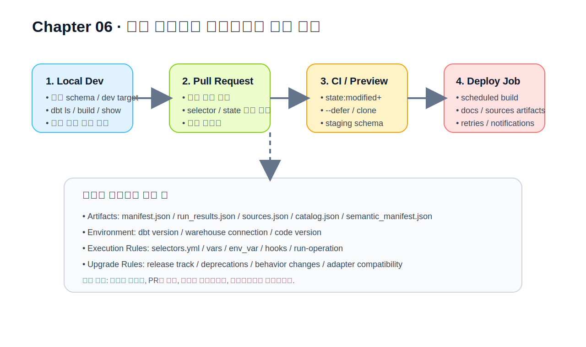
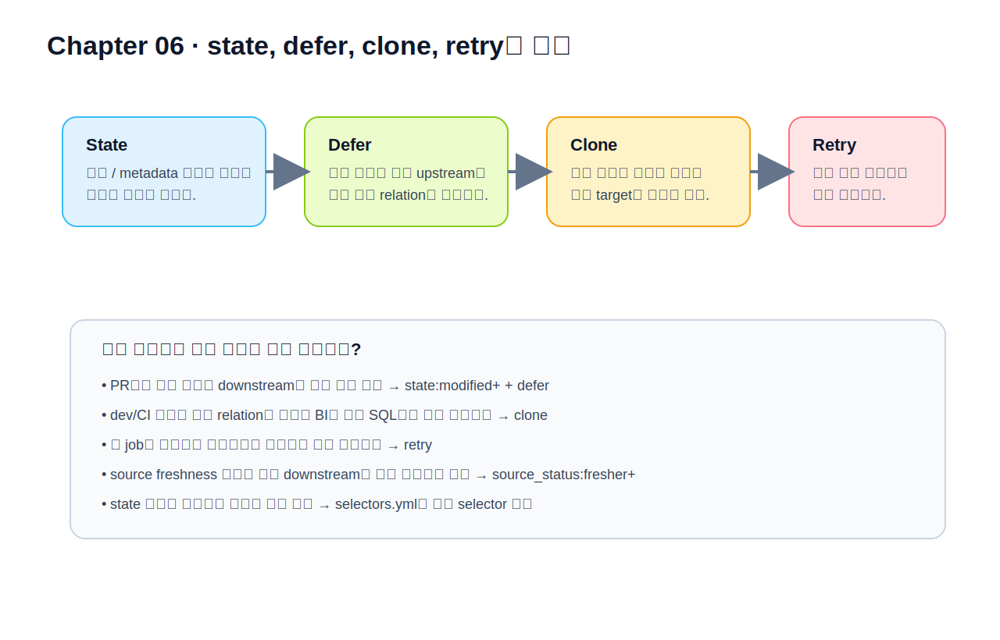

# CHAPTER 06 · 운영, CI/CD, state/defer/clone, vars/env/hooks, 업그레이드

> 개인 실습용 프로젝트를 팀이 계속 운영할 수 있는 프로젝트로 바꾸는 장이다.  
> 앞 장들에서 **모델을 만들고 품질을 검증하는 방법**을 익혔다면, 이제는 **누가, 어디서, 어떤 순서로, 무엇을 기준으로 실행할 것인가**를 정해야 한다.  
> 좋은 SQL이나 좋은 모델만으로는 좋은 운영이 되지 않는다. 운영은 **환경 분리**, **검증 범위 제어**, **공용 실행 규칙**, **비밀값 관리**, **업그레이드 절차**까지 포함한다.

운영을 별도 장으로 다루는 이유는 간단하다. dbt 프로젝트는 처음에는 한 사람이 로컬에서 `dbt run`을 돌리는 작은 프로젝트로 시작하지만, 어느 순간부터는 팀원 여러 명이 동시에 수정하고, PR을 올리고, CI에서 검증하고, 배포 환경에서 안정적으로 실행해야 하는 단계로 넘어간다. 이때 프로젝트를 살리는 것은 모델 개수보다 운영 규칙이다. 특히 `state:modified+`, `--defer`, `dbt clone`, `dbt retry`, `env_var()`, `run-operation`, release track 같은 기능은 “아는지 여부”보다 “언제 어떤 문제를 풀기 위해 쓰는지”를 이해해야 효과가 난다.

이 장은 네 개의 큰 흐름으로 진행된다.

1. 운영을 구조로 바라보는 방법  
2. state, defer, clone, retry, selectors로 실행 범위를 통제하는 방법  
3. vars, env_var, hooks, run-operation, packages, 업그레이드 규칙을 운영 관점으로 정리하는 방법  
4. Retail Orders / Event Stream / Subscription & Billing 세 예제가 실제 운영 단계에서 어떻게 달라지는지 보는 방법



*그림 6-1. 로컬 개발에서 배포까지의 운영 루프*

---

## 6.1. 운영을 따로 배워야 하는 이유

운영은 “마지막에 붙이는 부가 기능”이 아니다. 오히려 프로젝트가 커질수록 모델 품질을 지키는 첫 번째 방어선이 된다. 예를 들어 두 개발자가 같은 스키마를 쓰고 있고, 변경 범위를 확인하지 않은 채 전체 빌드를 반복하며, secret을 코드에 직접 적고, 업그레이드를 배포 직전에만 떠올린다면 프로젝트는 빠르게 불안정해진다. 반대로 운영 규칙이 잘 잡혀 있으면 모델이 다소 늘어나더라도 프로젝트는 예측 가능한 방식으로 성장한다.

운영을 생각할 때 가장 먼저 구분해야 하는 것은 다음 다섯 가지다.

- **개발 환경과 배포 환경은 목적이 다르다.**
- **PR 검증과 정식 배포는 속도와 안정성의 우선순위가 다르다.**
- **모든 변경을 전체 재빌드로 검증할 필요는 없다.**
- **환경별 차이는 코드 안의 하드코딩이 아니라 선언된 설정으로 관리해야 한다.**
- **업그레이드는 버전 번호를 바꾸는 행위가 아니라 운영 절차다.**

### 6.1.1. 개인 실습과 팀 운영의 차이

혼자 공부할 때는 모델 하나가 잘 만들어지고 결과가 맞으면 큰 진전을 느낀다. 하지만 팀 프로젝트에서는 같은 기준으로는 부족하다. 팀 운영에서는 다음 질문에 대답할 수 있어야 한다.

- 이 변경은 어느 범위까지 영향을 주는가?
- 이 PR에서 최소 무엇을 검증해야 하는가?
- 이 모델이 dev에는 있는데 prod에는 아직 없는가?
- 이 오류는 코드 문제인가, 환경 문제인가, secret 문제인가?
- 지난달과 이번달에 같은 job이 왜 다르게 실행됐는가?

즉, 개인 실습은 “한 번 성공하는 경험”이 중요하고, 팀 운영은 “매번 같은 원리로 성공과 실패를 설명할 수 있는 상태”가 중요하다.

### 6.1.2. 환경은 보통 세 층으로 생각하면 편하다

운영을 처음 배울 때는 환경을 너무 세세하게 쪼개기보다 아래 세 층으로 생각하는 편이 이해하기 쉽다.

| 층 | 대표 환경 | 목적 | 핵심 질문 |
| --- | --- | --- | --- |
| 개발 층 | 로컬 CLI, Studio IDE, 개인 schema | 빠른 수정과 반복 실험 | 내가 바꾼 모델을 가장 짧게 검증하려면? |
| 검증 층 | CI, staging, preview schema | PR 검증, slim CI, 회귀 방지 | 이번 변경이 다른 모델을 깨뜨리지 않았는가? |
| 배포 층 | production job, scheduled deployment | 안정적 재현과 사용자 제공 | 정해진 시간에 예측 가능한 결과를 만들었는가? |

여기서 중요한 것은 “개발 환경은 빠름”, “검증 환경은 집중”, “배포 환경은 안정”이라는 목적 차이다. 목적이 다르기 때문에 실행 명령도 같을 필요가 없다.

### 6.1.3. dbt platform의 environment를 어떻게 읽을까

dbt platform의 environment는 단순한 접속 설정이 아니다. 운영 관점에서 environment는 최소 세 가지를 동시에 정한다.

1. 어떤 dbt 버전/엔진으로 실행할 것인가  
2. 어떤 warehouse/database/schema/role에 연결할 것인가  
3. 어떤 코드 버전을 실행할 것인가

즉, environment는 “어디에 연결할까?”만이 아니라 “무엇으로, 어떤 코드를 실행할까?”까지 함께 정한다. 로컬 CLI에서는 이 세 요소가 각각 Python/dbt 설치, `profiles.yml`, Git branch처럼 흩어져 있지만, dbt platform에서는 environment 단위로 더 명시적으로 관리된다.

### 6.1.4. PR 검증과 배포는 다른 문제를 푼다

PR 검증의 목표는 **빠른 피드백**이다. 그래서 보통 바뀐 모델과 그 downstream 정도만 빠르게 확인하는 slim CI 패턴이 잘 맞는다.

반면 배포 job의 목표는 **안정적인 재현**이다. 배포에서는 스케줄, retries, 알림, docs/source artifacts, 권한, 실패 후 복구까지 함께 생각해야 한다.

이 둘을 같은 명령으로 통일하려는 습관은 운영을 오히려 무겁게 만든다. 예를 들어 PR에서 매번 전체 프로젝트를 재빌드하면 느리고 비싸며, 배포에서 매번 최소 범위만 돌리면 누적 드리프트나 숨은 의존성을 놓칠 수 있다.

### 6.1.5. 운영 초기에 먼저 정할 최소 규칙

아주 작은 팀이라도 아래 규칙은 초반부터 정해두는 편이 좋다.

- 개인 개발은 개인 schema 또는 분리된 dev target에서 실행한다.
- PR 검증은 변경 범위 중심으로 빠르게 수행한다.
- 배포 환경은 dev와 다른 schema/role/credentials를 사용한다.
- 비밀값은 `env_var()`로 분리한다.
- 실행 패턴은 CLI 한 줄이 아니라 `selectors.yml`, scripts, job 정의로 남긴다.
- 업그레이드는 production이 아니라 development 환경에서 먼저 검증한다.

---

## 6.2. state, defer, clone, retry를 한 흐름으로 이해하기

앞 장에서 `--select`, `dbt ls`, DAG, layered modeling을 배웠다면, 운영 단계에서는 “무엇을 선택해서 어떻게 실행할 것인가”를 더 정교하게 다룰 수 있어야 한다. 여기서 핵심이 state, defer, clone, retry다.

많은 사람이 이 네 기능을 별개의 옵션으로 외우려 하지만, 실제로는 아래와 같이 한 흐름으로 이해하는 편이 훨씬 쉽다.

- **state**: 무엇이 바뀌었는지 비교한다.
- **defer**: 지금 환경에 없는 upstream은 기준 환경 것을 참조한다.
- **clone**: 기준 환경의 객체를 실제로 가져와서 내 환경에 만들어 둔다.
- **retry**: 직전 실행이 중간에서 깨졌다면 거기서 이어 달린다.



*그림 6-2. state, defer, clone, retry의 관계*

### 6.2.1. artifacts가 없으면 state도 없다

state 기반 운영의 출발점은 artifacts다. 특히 다음 파일을 자주 보게 된다.

| artifact | 역할 | 운영에서 중요한 이유 |
| --- | --- | --- |
| `manifest.json` | 프로젝트 그래프와 node metadata | 변경 비교, docs, selector 해석의 기준 |
| `run_results.json` | 실행 결과와 상태 | `dbt retry`, 실패 분석, duration 해석 |
| `sources.json` | source freshness 결과 | `source_status:fresher+` selector의 기반 |
| `catalog.json` | relation/column 메타데이터 | docs와 metadata 확인 |
| `semantic_manifest.json` | semantic layer metadata | metric/semantic validation의 기준 |

실무에서는 “어제의 prod manifest와 오늘의 PR branch를 비교한다”는 식으로 artifacts를 비교 기준으로 삼는다. 그래서 운영 job에서는 artifacts를 언제, 어디에 저장하고 다시 사용할지를 함께 설계해야 한다.

### 6.2.2. `state:modified+`는 “이번 PR에서 바뀐 곳”을 좁히는 기본기다

가장 널리 쓰는 패턴은 다음과 같다.

```bash
dbt parse
dbt ls --select state:modified+ --state path/to/prod_artifacts
dbt build --select state:modified+ --defer --state path/to/prod_artifacts
```

이 패턴의 의미는 다음과 같다.

1. 현재 코드와 기준 manifest를 비교한다.
2. 변경된 노드와 그 downstream을 선택한다.
3. 지금 내 dev/CI 환경에 없는 upstream은 기준 환경의 relation을 참조한다.

이렇게 하면 PR 단계에서 전체를 다시 만들지 않고도 “내가 바꾼 영역이 downstream을 깨뜨리는지”를 빠르게 볼 수 있다.

다만 state는 완전무결하지 않다. 예를 들어 아래 같은 상황은 별도 판단이 필요하다.

- `env_var()` 값만 바뀌었는데 코드 diff는 작은 경우
- warehouse 바깥에서 테이블이 drop됐지만 코드에는 변화가 없는 경우
- seed 외부 입력 데이터가 바뀌었는데 manifest 차이만으로는 충분하지 않은 경우

즉, state selector는 운영의 강력한 기준이지만, 도메인 상식과 보완 규칙이 함께 있어야 한다.

### 6.2.3. `source_status:fresher+`는 데이터 쪽 변화를 끌어온다

코드만 바뀌는 것이 아니라 source freshness 결과가 달라지는 경우도 있다. 이럴 때는 `dbt source freshness`로 만든 `sources.json`을 활용해 다음과 같이 실행할 수 있다.

```bash
dbt source freshness
dbt build --select source_status:fresher+ --state path/to/source_artifacts
```

이 패턴은 “코드 변경은 없지만 upstream source가 새 데이터를 받았으니 다시 계산해야 하는 모델만 선택하고 싶다”는 요구에 잘 맞는다.

### 6.2.4. defer는 “없는 upstream을 prod에 기대는” 기능이다

defer를 쓰면 지금 target에 없는 upstream relation을 기준 state의 relation로 대신 참조하게 된다. 이게 특히 유용한 순간은 다음과 같다.

- dev schema에 전체 upstream을 만들고 싶지 않을 때
- PR 검증에서 바뀐 모델만 빠르게 보고 싶을 때
- 무거운 mart를 전부 재생성하지 않고 downstream 검증만 하고 싶을 때

예를 들어 내가 `fct_orders`만 수정했는데 그 upstream 전체를 dev에 만들고 싶지는 않다면, `--defer --state prod_artifacts` 조합이 큰 힘을 발휘한다.

```bash
dbt build \
  --select state:modified+ \
  --state path/to/prod_artifacts \
  --defer
```

defer는 대개 clone보다 더 싸고 간단하다. 다만 defer는 **실제 relation을 내 schema에 복제하는 것**이 아니므로, dbt 밖의 도구(BI, notebook, external SQL)에서 바로 확인해야 한다면 clone이 더 나을 수 있다.

### 6.2.5. clone은 “참조” 대신 “실체를 만든다”

`dbt clone`은 기준 state의 selected nodes를 현재 target으로 복제한다. 데이터 플랫폼이 zero-copy clone을 지원하면 매우 빠르게 작동할 수 있고, 그렇지 않은 경우 단순 pointer view로 구현될 수 있다.

```bash
dbt clone --select tag:heavy --state path/to/prod_artifacts
```

clone이 특히 유용한 경우는 다음과 같다.

- 무거운 incremental 모델을 CI/dev에서 full refresh 없이 다뤄야 할 때
- BI 도구에서 내 dev schema를 직접 보며 확인해야 할 때
- blue/green 또는 shadow validation 같은 운영 전략을 쓸 때

반대로 단순 PR 검증이라면 defer가 더 단순할 때가 많다. clone은 편리하지만 target에 실제 객체를 만들기 때문에 관리 비용을 함께 생각해야 한다.

### 6.2.6. retry는 중간 실패 뒤의 복구 시간을 줄여 준다

긴 job이 거의 끝나갈 때 한 노드가 실패하면 처음부터 다시 돌리는 것이 가장 답답하다. `dbt retry`는 바로 이런 상황을 줄여 준다. `run_results.json`을 기준으로 마지막 명령의 실패 지점부터 다시 시도한다.

```bash
dbt build --select tag:nightly
# 중간에 실패
dbt retry
```

retry를 쓸 때 기억할 점:

- 직전 명령이 일부 노드를 실행한 뒤 실패해야 의미가 있다.
- warehouse 권한 문제처럼 초반에 바로 실패했다면 retry가 할 일이 없을 수 있다.
- retry 전에 **실패 원인을 먼저 고친 뒤** 다시 실행해야 한다.

### 6.2.7. selectors.yml은 팀의 공용 실행 패턴을 저장소 안에 남긴다

운영 지식이 사람 머릿속에만 있으면 팀이 커질수록 불안정해진다. 그래서 반복되는 선택 패턴은 `selectors.yml`로 승격하는 편이 좋다.

```yaml
selectors:
  - name: slim_ci
    description: "PR에서 변경된 노드와 downstream만 검증"
    definition: "state:modified+"

  - name: source_refresh
    description: "freshness가 갱신된 source downstream만 계산"
    definition: "source_status:fresher+"

  - name: nightly_heavy
    description: "야간에 무거운 모델만 선택"
    definition: "tag:nightly,tag:heavy"
```

이렇게 해 두면 CI 스크립트와 job 정의에서 다음처럼 더 짧고 명확한 호출이 가능하다.

```bash
dbt build --selector slim_ci --state path/to/prod_artifacts --defer
```

### 6.2.8. 로컬 CLI와 dbt platform state-aware orchestration은 같은가?

같은 부분도 있고 다른 부분도 있다.

로컬 CLI에서 `state:modified+`, `source_status:fresher+`, `--state`, `--defer`를 사용하는 방식은 **artifact 기반**이다. 특정 시점의 artifacts를 비교 기준으로 둔다.

반면 dbt platform의 state-aware orchestration은 environment 차원의 **공유 상태**를 바탕으로 무엇을 다시 빌드할지를 더 지속적으로 판단한다. 이 개념은 비슷하지만, 실행 주체와 상태 저장 방식이 더 중앙집중적이다.

그래서 실무에서는 이렇게 생각하면 편하다.

- 로컬/CLI: “이번 한 번의 실행에서 artifacts를 기준으로 똑똑하게 좁힌다.”
- state-aware orchestration: “환경 단위의 공유 상태를 바탕으로 job이 자동으로 덜 빌드하도록 최적화한다.”

---

## 6.3. vars, env_var, hooks, run-operation, packages를 운영 관점으로 묶기

이 절의 기능들은 겉보기에는 서로 다르다. 하지만 운영 관점에서 보면 모두 “코드만으로는 다 표현되지 않는 실행 차이”를 관리하는 도구다.

### 6.3.1. `var()`는 실험 파라미터와 기능 분기를 코드 바깥으로 뺀다

`var()`는 프로젝트 안에서 기본값을 정의하고, 실행 시점에 값을 덮어쓸 수 있게 한다. beginner 단계에서는 잘 안 보이지만, 운영 단계에서는 특정 기간만 다시 계산하거나, preview 기능을 켜거나, semantic refresh 대상을 분기할 때 유용하다.

```sql
select *
from {{ ref('stg_orders') }}
where order_date >= {{ var('start_date', "'2026-01-01'") }}
```

실행할 때는 이렇게 넘길 수 있다.

```bash
dbt build --vars '{"start_date": "'\''2026-03-01'\''"}'
```

주의할 점은 var를 **비밀값 저장소처럼 쓰지 말아야 한다**는 점이다. var는 파라미터용이고, 비밀값은 `env_var()`가 맞다.

### 6.3.2. `env_var()`는 환경별 차이와 secret을 분리한다

운영에서 비밀값을 코드에 직접 넣는 것은 피해야 한다. dbt는 `env_var()`를 통해 환경 변수 값을 읽게 할 수 있다.

```yaml
password: "{{ env_var('DBT_ENV_SECRET_SNOWFLAKE_PASSWORD') }}"
```

운영에서 `env_var()`가 중요한 이유는 두 가지다.

1. secret을 Git에 남기지 않는다.
2. dev / staging / prod의 연결 정보 차이를 코드 바깥에서 제어할 수 있다.

단, `env_var()`도 남용하면 코드가 불투명해진다. 비즈니스 규칙까지 environment variable로 밀어 넣지 말고, secret 또는 명백한 환경 차이만 여기에 두는 편이 좋다.

### 6.3.3. `target`은 현재 내가 어느 환경에서 뛰는지 알려 준다

`target`은 현재 활성화된 target의 정보(database, schema, name 등)를 읽게 해 준다. 예를 들어 schema naming이나 branch별 실험을 다르게 하고 싶을 때 유용하다.

```sql
{{ config(schema=target.schema) }}
```

다만 `target.name == 'prod'` 같은 분기를 지나치게 많이 쓰면 코드가 복잡해진다. 환경 차이는 우선 profile/environment 설정으로 해결하고, 모델 로직을 과도하게 갈라야 할 때만 신중하게 쓰는 것이 좋다.

### 6.3.4. hooks는 built-in config로 해결되지 않을 때만 쓴다

hooks는 강력하다. 하지만 강력하다는 말은 “자주 써도 된다”는 뜻이 아니다. 다음 순서로 생각하는 편이 좋다.

1. grants, contracts, persist_docs, materialization, config로 해결 가능한가?
2. 해결이 안 된다면 hook가 필요한가?
3. hook가 필요하다면 최소 범위로 작성했는가?

예를 들어 통계 갱신, 권한 부여, warehouse별 analyze 작업은 hook 후보가 될 수 있다.

```yaml
models:
  my_project:
    marts:
      +post-hook:
        - "analyze table {{ this }} compute statistics"
```

운영에서 hook의 위험은 “어디서 무슨 SQL이 추가로 돌았는지 모르게 되는 것”이다. 그래서 hook는 적고, 짧고, 명확해야 한다.

### 6.3.5. `run-operation`은 모델이 아닌 운영 작업을 코드화한다

모델은 relation을 만들기 위한 것이고, `run-operation`은 **모델이 아닌 관리 작업**을 위한 도구다. 오래된 dev schema 정리, grants 재적용, audit row 삽입, migration helper 등이 대표적이다.

```bash
dbt run-operation grant_reporter_access --args '{"role": "reporter"}'
dbt run-operation cleanup_old_schemas --args '{"prefix": "dbt_"}'
```

이 기능을 잘 쓰면 “운영 절차가 위키 문서에만 있는 상태”를 줄이고, dbt project 안에 실행 가능한 형태로 남길 수 있다.

### 6.3.6. packages는 재사용 자산이고, project dependencies는 운영 경계다

운영 초반에는 패키지 사용만으로도 충분한 경우가 많다. 예를 들어 `dbt_utils` 같은 패키지는 매크로와 tests를 재사용하게 해 준다.

```yaml
packages:
  - package: dbt-labs/dbt_utils
    version: [">=1.2.0", "<2.0.0"]
```

반면 ownership 경계가 생기고, 다른 팀 프로젝트의 published asset을 참조해야 하는 규모라면 project dependencies와 mesh를 별도로 생각할 시점이 온다. 이 책에서는 mesh 자체는 다음 장에서 더 자세히 다루지만, 여기서는 packages와 운영 경계가 다르다는 정도만 먼저 잡아두면 충분하다.

---

## 6.4. 업그레이드와 release track을 운영 절차로 보기

업그레이드는 “버전 번호를 올린다”가 아니라 “새 동작을 어디에서 먼저 검증하고 언제 production에 반영할지 정한다”는 절차다.

### 6.4.1. 업그레이드를 production에서 처음 하면 안 되는 이유

dbt 버전이 바뀌면 다음 요소가 함께 흔들릴 수 있다.

- parser 동작
- selector/state 비교 방식
- artifacts 스키마 버전
- adapter 지원 범위
- package 호환성
- behavior change defaults

그래서 업그레이드는 보통 다음 순서가 안전하다.

1. development 환경에서 parse/build/test/docs를 먼저 확인한다.
2. slim CI 또는 staging 환경에서 변경 범위를 검증한다.
3. production job에 반영하기 전에 deprecations와 behavior change를 점검한다.
4. artifacts 호환성과 state 기준 파일을 새 버전으로 다시 정리한다.

### 6.4.2. release track은 “릴리스 리듬”을 정한다

dbt platform에서는 version pinning 대신 release track 관점으로 운영할 수 있다. 중요한 점은 모든 팀이 같은 리듬을 택할 필요가 없다는 것이다.

- 빠른 기능 수용이 중요하면 Latest 쪽
- 좀 더 완만한 cadence가 필요하면 Compatible / Extended
- production은 더 보수적이고, development는 더 빠르게 실험할 수도 있다

핵심은 “개발과 배포를 같은 릴리스 리듬으로 반드시 묶어야 한다”가 아니라, **업그레이드 검증이 가능한 cadence**를 택하는 것이다.

### 6.4.3. behavior change flags는 migration window다

behavior change는 일반 deprecation과 다르다. 코드가 곧장 깨지는 것이 아니라, 런타임 동작이 바뀌는 전환 구간을 제공한다. 운영 관점에서 behavior change를 볼 때 중요한 질문은 다음이다.

- 이 플래그는 dev에서 먼저 켜 볼 것인가?
- CI에서 legacy/new behavior를 어느 시점까지 병행 확인할 것인가?
- production 반영 시점은 언제인가?
- package와 adapter가 이 동작을 감당하는가?

### 6.4.4. 업그레이드 체크리스트

아래 네 단계를 매번 반복하는 체크리스트로 두면 좋다.

1. `dbt deps`, `dbt parse`, `dbt build`가 development에서 통과하는가  
2. packages, adapter, artifacts schema가 새 버전과 호환되는가  
3. behavior change / deprecation warning이 있는가  
4. production용 state artifacts와 CI 기준 경로를 새 버전 기준으로 갱신했는가

---

## 6.5. 세 예제 트랙에서 운영이 어떻게 달라지는가

이제 앞에서 설명한 원리를 세 예제 트랙에 연결해 보자. 이 절의 목적은 “운영 기능을 많이 아는 것”이 아니라, **같은 운영 원리가 도메인마다 어떤 다른 압력으로 나타나는지**를 이해하는 데 있다.

### 6.5.1. Retail Orders: 안정성과 설명 가능성이 우선인 운영

Retail Orders 트랙에서는 보통 다음 요구가 핵심이다.

- 주문/매출 관련 지표가 매일 같은 방식으로 산출되어야 한다.
- downstream BI와 리포트가 안정적이어야 한다.
- 변경이 있어도 설명 가능해야 한다.

그래서 Retail Orders에서는 다음 운영 패턴이 잘 맞는다.

- PR에서는 `state:modified+ --defer`로 변경된 mart와 downstream만 빠르게 검증한다.
- 배포에서는 핵심 fact/dim에 대해 좀 더 보수적인 `dbt build`를 유지한다.
- source freshness나 daily batch의 도착 시점이 분명하다면 `source_status:fresher+`를 보조적으로 활용한다.
- grants, docs, contracts 같은 “소비자 신뢰” 관련 운영 규칙이 중요해진다.

예를 들어 `fct_orders`를 수정하는 PR이라면:

```bash
dbt build --select state:modified+ --state path/to/prod_artifacts --defer
```

이 명령만으로도 upstream 전부를 dev에 만들지 않고 downstream 회귀를 빠르게 볼 수 있다.

### 6.5.2. Event Stream: 비용·속도·증분 처리 압력이 큰 운영

Event Stream 트랙은 append-heavy, volume-heavy 경향이 강하므로 운영에서 특히 중요한 것은 다음이다.

- incremental/full refresh 판단
- 무거운 모델을 매번 다시 만들지 않는 전략
- data arrival 지연과 backfill 대응
- CI 비용 통제

이 트랙에서는 clone과 state 전략의 체감 가치가 더 크다. 예를 들어 무거운 sessionization mart를 PR마다 full refresh하면 너무 비싸다면, production artifacts를 기준으로 clone 후 변경된 downstream만 검증하는 패턴을 고려할 수 있다.

```bash
dbt clone --select tag:heavy --state path/to/prod_artifacts
dbt build --select state:modified+ --state path/to/prod_artifacts --defer
```

또한 vars를 이용해 개발 시점에는 작은 시간 창만 계산하는 것도 자주 쓰인다.

```bash
dbt build --vars '{"start_date": "'\''2026-04-01'\''"}'
```

### 6.5.3. Subscription & Billing: 환경 차이와 버전 안정성이 더 민감한 운영

Subscription & Billing 트랙은 상태 변화, billing logic, lifecycle transition이 얽혀 있어 “동일한 로직을 얼마나 안정적으로 반복 재현할 수 있는가”가 중요하다.

이 트랙에서는 특히 다음 운영 요소가 중요하다.

- var와 env_var를 통한 기간/환경/secret 분리
- snapshot 및 semantic layer 이후의 변경 영향 추적
- upgrade 시 behavior change가 billing logic에 미치는 영향 검토
- run-operation으로 migration helper나 grants를 코드화하는 전략

예를 들어 billing cutoff date를 var로 주입하고, credentials는 env_var로 분리하는 패턴은 실무에서 꽤 흔하다.

```sql
where billing_month >= {{ var('billing_month_start', "'2026-01-01'") }}
```

```yaml
password: "{{ env_var('DBT_ENV_SECRET_BILLING_PASSWORD') }}"
```

이 트랙은 “코드는 적게 바꿨는데 결과 의미는 크게 바뀌는” 사례가 많기 때문에, 업그레이드와 behavior change를 dev/staging에서 먼저 검증하는 규율이 특히 중요하다.

---

## 6.6. 운영 runbook: 상황별로 어디부터 볼까

운영 단계에서 자주 만나는 상황을 짧은 runbook으로 정리하면 다음과 같다.

### 상황 1. PR 검증이 너무 느리다
먼저 볼 것:
- 전체 빌드를 돌리고 있지 않은가
- `state:modified+`와 `--defer`를 쓸 수 없는가
- `selectors.yml`로 slim CI를 공용 패턴으로 만들었는가

### 상황 2. dev에 없는 upstream 때문에 downstream 검증이 어렵다
먼저 볼 것:
- `--defer --state prod_artifacts`를 쓸 수 있는가
- BI/외부 도구에서 직접 확인이 필요하다면 clone이 더 나은가

### 상황 3. 긴 야간 배치가 중간에서 실패했다
먼저 볼 것:
- `run_results.json`이 남아 있는가
- 실패 원인을 고친 뒤 `dbt retry`가 가능한가
- 같은 문제가 반복된다면 selector를 더 쪼개야 하는가

### 상황 4. secret과 환경 차이가 뒤섞여 있다
먼저 볼 것:
- hard-coded password나 schema가 없는가
- `env_var()`와 profile/environment 설정으로 분리할 수 있는가
- 비즈니스 규칙까지 env_var로 감추고 있지는 않은가

### 상황 5. 업그레이드가 두렵다
먼저 볼 것:
- development 환경에서 먼저 검증하고 있는가
- deprecations와 behavior changes를 따로 보고 있는가
- CI 기준 artifacts와 production artifacts가 새 버전에 맞는가

---

## 6.7. 운영 안티패턴 아틀라스

운영 장에서는 “무엇을 해야 하는가”만큼 “무엇을 피해야 하는가”도 중요하다.

### 안티패턴 1. dev와 prod를 같은 schema에서 돌린다
문제:
- 우발적 overwrite
- 설명 불가능한 결과
- 재현성 붕괴

### 안티패턴 2. PR에서도 항상 전체 build를 돌린다
문제:
- 느리고 비싸다
- 실패 범위를 좁히기 어렵다
- slim CI의 이점을 놓친다

### 안티패턴 3. state selector만 맹신한다
문제:
- 외부 데이터 변화나 env 차이를 놓칠 수 있다
- 운영 상식과 병행하지 않으면 맹점이 생긴다

### 안티패턴 4. env_var에 비즈니스 로직을 숨긴다
문제:
- 코드 리뷰로 판단하기 어려워진다
- 환경 재현성이 떨어진다

### 안티패턴 5. hook를 만능 도구처럼 쓴다
문제:
- 실제 실행 SQL이 숨어버린다
- grants, docs, contracts 같은 built-in config를 우회하게 된다

### 안티패턴 6. 업그레이드를 production에서 처음 검증한다
문제:
- 실패 시 영향 범위가 가장 크다
- deprecation/behavior change를 늦게 발견한다

---

## 6.8. 직접 해보기

### 실습 1. slim CI selector 만들기
`codes/04_chapter_snippets/ch06/selectors.yml`을 열어 `slim_ci`, `source_refresh`, `nightly_heavy` selector를 읽고, 내 프로젝트 이름에 맞게 정의를 조정해 본다.

### 실습 2. defer와 clone 비교하기
아래 두 명령을 각각 읽고, “실제 객체를 만들지 않는 것”과 “실제 객체를 만들어 두는 것”의 차이를 설명해 본다.

```bash
dbt build --select state:modified+ --state path/to/prod_artifacts --defer
dbt clone --select tag:heavy --state path/to/prod_artifacts
```

### 실습 3. env_var와 var를 구분해 보기
`start_date`는 var로, password는 env_var로 분리해야 하는 이유를 한 문단으로 적어 본다.

### 실습 4. 업그레이드 순서 작성하기
내 팀이 development → staging → production 순서로 업그레이드한다면, 각 단계에서 어떤 명령을 최소로 돌릴지 네 줄로 적어 본다.

---

## 6.9. 완료 체크리스트

- [ ] 개발 환경, 검증 환경, 배포 환경의 목적 차이를 설명할 수 있다.
- [ ] `state`, `defer`, `clone`, `retry`가 각각 어떤 문제를 푸는지 말할 수 있다.
- [ ] `var`, `env_var`, `target`의 역할을 구분할 수 있다.
- [ ] hook보다 built-in config를 먼저 고려해야 하는 이유를 이해한다.
- [ ] packages와 운영 경계를 섞지 않아야 하는 이유를 안다.
- [ ] 업그레이드를 production에서 처음 하면 안 되는 이유를 설명할 수 있다.
- [ ] Retail Orders / Event Stream / Subscription & Billing 세 예제에서 운영 압력이 어떻게 다른지 구분할 수 있다.

---

## 6.10. 이 장의 핵심 정리

이 장의 핵심은 기능 이름을 외우는 것이 아니다. 운영은 결국 다음 한 줄로 요약된다.

> **개발은 빠르게, PR은 좁게, 배포는 안정적으로, 업그레이드는 단계적으로.**

dbt 프로젝트가 커질수록 중요한 것은 “더 많은 명령을 아는가”보다, **어떤 환경에서 무엇을 기준으로 어디까지 실행할지 결정하는 감각**이다. state/defer/clone/retry, var/env_var/hook/run-operation, environments/jobs/release tracks는 모두 그 감각을 구현하는 서로 다른 도구다. 다음 장에서는 이 운영 기반 위에 governance, contracts, versions, metadata 같은 더 강한 팀 경계를 얹는다.
