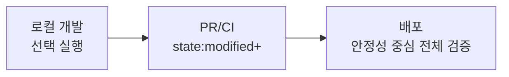

CHAPTER 06

운영, CI/CD, state/defer/clone, vars/env/hooks, 업그레이드

개인 실습을 팀 운영으로 끌고 갈 때 필요한 실행 전략을 한 흐름으로 묶는다.

| 핵심 개념 → 사례 → 운영 기준 | 설명을 먼저 충분히 풀고, 이후 장에서 예제 케이스북과 플랫폼 플레이북으로 다시 가져간다. |
| --- | --- |

dbt 프로젝트가 팀 단위로 커지기 시작하면 “좋은 모델”만으로는 충분하지 않다. dev/prod 분리, PR 검증, slim CI, state selector, defer, clone, env_var, hooks, run-operation, release track 같은 운영 요소가 함께 들어와야 프로젝트가 계속 살아남는다.

이 장은 로컬 검증 루틴에서 시작해 state-aware 실행, CI job 설계, vars와 target을 이용한 환경 분기, 업그레이드 체크리스트까지 이어지는 운영 흐름을 한 챕터로 묶는다. dbt platform의 environments/jobs 관점도 여기에서 함께 읽어 둔다.

운영·배포·협업

| 선택 | 처음 읽는 사람은 장 끝의 ‘직접 해보기’를 반드시 해 본다. 이해가 아니라 손의 감각을 남기는 것이 목표다. |
| --- | --- |

| 이 장에서 배우는 것 • dev/prod 분리와 개인 스키마의 필요성을 이해한다. • PR 검증과 배포 실행의 목적이 다르다는 점을 배운다. • state:modified+, --defer, dbt clone, dbt retry를 초보자 시각으로 정리한다. | 완료 기준 • 로컬 개발 → PR → CI → 배포 흐름을 설명할 수 있다. • slim CI가 왜 빠른지와 defer의 핵심을 이해한다. • 실무 도입 초기에 어떤 운영 규칙을 먼저 정해야 하는지 말할 수 있다. |
| --- | --- |

*그림 13-1. 로컬 검증은 좁게, PR은 빠르게, 배포는 안정적으로*

13-1. 개인 실습과 팀 운영의 가장 큰 차이

혼자 배울 때는 모델이 돌아가기만 해도 충분히 기쁘다. 하지만 팀 프로젝트에서는 반복 가능성, 리뷰 가능성, 배포 안정성이 더 중요해진다. 따라서 일정 수준을 넘기면 좋은 SQL만으로는 부족하고, 브랜치 전략, PR 리뷰, 환경 분리, 문서 유지가 함께 들어온다.

13-2. dev / prod를 머릿속에서 먼저 분리하자

| 환경 | 목적 | 권장 습관 |
| --- | --- | --- |
| dev | 개인 실험과 빠른 수정 | 개인 schema를 쓰고 선택 실행 위주로 개발 |
| prod | 공용 분석 자산 제공 | 더 엄격한 테스트와 권한 정책 적용 |

13-3. slim CI를 너무 어렵게 생각하지 않기

slim CI의 핵심은 ‘바뀐 영역만 빠르게 검증한다’는 데 있다. state:modified+는 현재 프로젝트와 기준 manifest를 비교해 새로 추가되거나 변경된 리소스를 찾고, --defer는 현재 환경에 없는 upstream 모델을 기준 환경의 relation로 참조하게 해 준다.

| BASH dbt parse dbt build --select state:modified+ --defer --state ./state_artifacts |
| --- |

프로젝트가 작을 때는 이 패턴이 과하게 느껴질 수 있다. 그 경우에는 핵심 mart나 변경 도메인만 고르는 단순한 CI로 시작해도 된다. 중요한 것은 ‘PR 단계의 목적은 빠른 피드백’이라는 점이다.

13-4. dbt clone과 dbt retry는 언제 떠올리나

| 명령 | 언제 유용한가 | 초보자 한 줄 해석 |
| --- | --- | --- |
| dbt clone | 큰 테이블을 CI/dev 환경으로 빠르게 가져오고 싶을 때 | 실제 재생성 대신 clone materialization을 활용한다 |
| dbt retry | 직전 실행의 실패 노드만 다시 돌리고 싶을 때 | 대형 배치에서 복구 시간을 줄여 준다 |

13-5. 운영 초기에 먼저 정할 규칙

• 원천을 읽는 첫 모델은 source()를 쓴다.

• 핵심 키 컬럼에는 generic test를 기본으로 붙인다.

• staging에서는 집계하지 않고 marts에서 최종 KPI를 만든다.

• PR 설명에 변경된 모델과 영향 범위를 적는다.

• 민감 정보는 env_var()로 분리한다.

• docs와 설명은 모델 추가와 동시에 갱신한다.

| 작게 시작하는 것이 낫다 운영 장이라고 해서 처음부터 완벽한 거버넌스를 요구할 필요는 없다. 개인 schema 분리, PR 리뷰, 핵심 테스트, 문서화, slim CI의 뼈대만 잡아도 초기 시행착오가 크게 줄어든다. |
| --- |

| 안티패턴 개발과 배포를 같은 schema에서 처리하고, 에러가 나면 warehouse 크기나 스레드 수부터 키우는 것. |
| --- |

| 직접 해보기 1. 우리 팀에 dev와 prod를 어떻게 나눌지 스키마 이름 예시와 함께 적어 본다. 2. ‘PR 단계에서 최소 무엇을 돌릴까?’를 한 줄 명령으로 적어 본다. 3. state:modified+와 --defer가 각각 어떤 문제를 푸는지 한 문장씩 써 본다. 정답 확인 기준: 운영의 핵심이 기능 개수보다 규칙과 목적의 분리라는 점을 이해하면 성공이다. |
| --- |

| 완료 체크리스트 • □ dev/prod 분리를 설명할 수 있다. • □ PR CI와 배포 실행의 목적이 다르다는 것을 안다. • □ state, defer, clone, retry를 어디서 쓸지 감이 생겼다. |
| --- |

Artifacts · State · Slim CI

| 구분 | 로컬 | dbt platform | 핵심 메모 |
| --- | --- | --- | --- |
| 장 16 | state selection, defer, clone, retry 가능 | state-aware orchestration, CI jobs, job metadata와 연결됨 | 같은 개념이 로컬과 플랫폼에서 모두 쓰이지만 자동화 강도는 플랫폼 쪽이 더 높다. |

16-1. artifacts를 읽으면 dbt가 “무슨 생각을 했는지” 보인다

dbt는 실행할 때마다 프로젝트 상태를 artifacts로 남긴다. 입문 단계에서는 target/compiled만 보아도 도움이 되지만, 팀 운영 단계로 넘어가면 manifest.json, run_results.json, sources.json, catalog.json을 함께 보는 편이 훨씬 강력하다. 이 파일들은 단순 부산물이 아니라, state comparison, docs, source freshness, CI 재시도와 같은 기능의 기반이 된다.

운영 단계에서 자주 보는 artifact

| artifact | 주로 어디에 쓰는가 |
| --- | --- |
| manifest.json | 프로젝트 그래프, node metadata, state comparison, docs의 중심 메타데이터 |
| run_results.json | 어떤 node가 성공/실패/스킵되었는지, 소요 시간이 얼마나 걸렸는지 확인 |
| sources.json | source freshness 결과와 source_status selector의 입력 |
| catalog.json | dbt docs에서 relation/column 메타데이터 탐색에 사용 |

16-2. state selector는 “무엇이 바뀌었는가”를 코드 기준으로 좁힌다

state selection은 현재 프로젝트를 이전 manifest와 비교해 새로 생기거나 수정된 리소스를 찾는 기능이다. 로컬 개발에서는 “내가 지금 바꾼 것만 빠르게 검증”하는 데 쓰고, CI에서는 modified 영역과 그 downstream만 빌드하는 slim CI의 핵심이 된다. 다만 vars나 env_var 값의 변경처럼 정적 비교로 완전히 잡히지 않는 경우가 있으므로, state만 맹신하지 말고 도메인 상식과 selector를 함께 써야 한다.

| dbt ls --select state:modified+dbt build --select state:modified+dbt build --select source_status:fresher+# prod artifact를 비교 기준으로 사용할 때# dbt build --select state:modified+ --state path/to/prod_artifacts |
| --- |

16-3. defer, clone, retry는 큰 프로젝트의 체감 속도를 바꾼다

defer는 현재 환경에 없는 upstream relation을 비교 기준 환경의 relation로 대신 참조하게 하여, 일부 모델만 샌드박스에서 검증하도록 돕는다. clone은 선택한 노드를 state 기준 환경에서 대상 schema로 복제해, 무거운 incremental/table 모델을 굳이 재계산하지 않고도 테스트 환경을 빠르게 마련하게 해 준다. retry는 마지막 명령이 node 일부를 실행한 뒤 중간에서 실패했을 때, 실패 지점부터 다시 이어서 실행하도록 도와 준다.

| dbt build --select state:modified+ --defer --state path/to/prod_artifactsdbt clone --select tag:heavy --state path/to/prod_artifactsdbt retry |
| --- |

16-4. selectors.yml로 팀의 공용 실행 패턴을 코드화한다

selector 문법을 매번 CLI에 길게 적는 대신 selectors.yml에 “slim_ci”, “nightly_heavy”, “semantic_refresh” 같은 이름으로 저장하면 팀 공통 실행 패턴을 코드처럼 관리할 수 있다. 이렇게 해 두면 리뷰와 운영 지식이 사람이 아니라 저장소 안에 남는다. beginner 단계에서는 --select를 손으로 익히고, intermediate 이후부터는 공용 selector로 승격하는 식이 가장 자연스럽다.

| selectors:  - name: slim_ci    definition: "state:modified+"  - name: nightly_heavy    definition: "tag:heavy,tag:nightly"  - name: semantic_refresh    definition: "path:models/semantic+" |
| --- |

실무 체크포인트: state는 “코드 차이”, defer는 “upstream 대체 참조”, clone은 “비용을 아끼는 빠른 실체 복제”, retry는 “중간 실패 뒤 이어 달리기”라고 기억하면 헷갈림이 크게 줄어든다.

Vars · Env · Hooks · Operations · Packages

| 구분 | 로컬 | dbt platform | 핵심 메모 |
| --- | --- | --- | --- |
| 장 17 | var, env_var, run-operation, packages 가능 | dbt CLI와 Studio IDE에서도 같은 개념을 사용 | packages는 어디서나 쓰지만 project dependencies는 다음 장의 별도 제약을 따른다. |

17-1. var, env_var, target: “환경별로 다르다”를 프로젝트 안에 선언하는 세 가지 축

var()는 프로젝트 기본값과 실행 시점 오버라이드를 연결하고, env_var()는 비밀값과 환경별 설정을 외부에서 주입하며, target은 현재 연결된 환경의 database/schema/warehouse 정보를 읽게 해 준다. beginner 단계에서는 profile과 schema 이름 정도만 다루지만, intermediate 이후에는 샘플 기간, feature flag, semantic refresh 여부 같은 것도 var로 제어하는 편이 유용하다.

| {{ config(schema=target.schema) }}where order_date >= {{ var('start_date', '2026-01-01') }}password: "{{ env_var('DBT_ENV_SECRET_SNOWFLAKE_PASSWORD') }}" |
| --- |

17-2. hook는 강력하지만, 먼저 built-in config로 해결할 수 없는지 확인한다

pre-hook, post-hook, on-run-start, on-run-end는 표준 materialization과 config만으로 표현하기 어려운 작업을 붙일 때 유용하다. 다만 grants, persist_docs, contracts처럼 이미 dbt가 공식 설정을 제공하는 영역은 hook보다 built-in config를 우선하는 편이 유지보수에 좋다. hook는 “dbt 바깥의 작업을 억지로 우겨 넣는 마법”이 아니라, 꼭 필요한 warehouse-specific 작업을 최소 범위로 수행하는 도구라고 보는 편이 안전하다.

| models:  my_project:    marts:      +post-hook:        - "analyze table {{ this }} compute statistics"on-run-end:  - "grant usage on schema {{ schema }} to role reporter;" |
| --- |

17-3. run-operation은 “모델이 아닌 작업”을 위한 도어다

run-operation은 매크로를 직접 호출해 maintenance SQL이나 관리 작업을 실행할 때 쓴다. 예를 들어 오래된 schema 정리, warehouse 통계 수집, audit 테이블 기록, 버전 전환용 view 재생성 같은 작업이 여기에 해당한다. 모델과 테스트의 책임을 흐리지 않고도 운영 작업을 코드로 남길 수 있다는 점이 장점이다.

| dbt run-operation grant_reporter_access --args '{role: reporter}'dbt run-operation cleanup_old_schemas --args '{prefix: dbt_}' |
| --- |

17-4. packages.yml과 dependencies.yml을 구분해 생각한다

packages는 재사용 가능한 독립 dbt 프로젝트를 가져와 모델·매크로·tests를 내 프로젝트의 일부처럼 쓰게 해 준다. 반면 project dependencies는 mesh나 cross-project ref처럼 다른 프로젝트를 “소비”하는 관계를 표현하는 데 더 적합하다. 작은 팀에서는 packages만으로도 충분하지만, 프로젝트가 커져 ownership 경계가 생기기 시작하면 dependencies.yml을 고려할 시점이 온다.

| packages:  - package: dbt-labs/dbt_utils    version: [">=1.2.0", "<2.0.0"]# dependencies.yml 예시projects:  - name: finance_core    version: ">=1.0.0" |
| --- |

17-5. 패키지·매크로·UDF·모델의 경계를 어떻게 잡을까

같은 SQL 조각이 세 번 반복되면 macro 후보, 여러 도구에서 반복 사용할 계산이면 UDF 후보, 결과 relation 자체를 재사용해야 하면 모델 후보, 여러 프로젝트가 함께 써야 하면 package 후보라고 보면 출발점으로 충분하다. “공유할 것”을 무엇으로 공유할지 분류하는 감각이 생기면 프로젝트가 덜 꼬인다.

• 패키지는 문제 영역 단위로 재사용한다. 작은 개인 취향 매크로 모음은 package보다 root project가 낫다.

• env_var는 secret과 환경별 차이를 관리하는 도구지, 비즈니스 규칙을 숨기는 도구가 아니다.

• hook는 built-in config보다 우선순위가 낮다. grants·persist_docs·contracts를 hook로 대체하지 않는다.

버전/트랙 메모: package와 semantic 관련 기능은 dbt 버전·engine에 따라 문법과 지원 범위가 달라질 수 있으므로, companion pack의 예시는 개념과 뼈대를 익히는 용도로 보고 실제 도입 전에는 현재 사용 중인 track 문서를 다시 확인하는 편이 안전하다.

dbt platform 작업환경 가이드

dbt platform의 environment / job / interface를 도구 설명이 아니라 운영면으로 읽는다.

N-1. environment는 세 가지를 정한다

| environment가 정하는 것 | 설명 | 초보자 메모 |
| --- | --- | --- |
| dbt 실행 버전/엔진 | 어떤 dbt version 또는 release track, 어떤 engine으로 실행할지 | 로컬과 플랫폼 결과가 다르면 여기부터 본다. |
| warehouse 연결 정보 | database/schema/role/credentials 등 실행 대상 | dev/prod 분리의 핵심이다. |
| 실행할 코드 버전 | 어느 branch/commit의 프로젝트를 실행할지 | CI와 배포에서 중요하다. |

dbt platform에서는 Development 환경과 Deployment 환경을 구분해서 생각하는 것이 중요하다. Deployment 환경 안에서도 production / staging / general 성격이 갈릴 수 있으므로, “잡(job)이 어떤 환경을 바라보는가”를 먼저 이해해야 한다.

N-2. 어떤 인터페이스를 언제 쓸까

| 도구 | 가장 잘하는 일 | 주의점 |
| --- | --- | --- |
| Studio IDE | 브라우저에서 바로 build/test/run, Catalog와의 왕복, platform-native 개발 | 로컬 편집기와의 습관 차이를 인정해야 한다. |
| dbt CLI | 로컬 터미널에서 dbt 명령과 MetricFlow 명령을 동일한 리듬으로 실행 | dbt_cloud.yml 또는 profiles.yml 등 인증 흐름을 먼저 맞춘다. |
| VS Code extension | Fusion 기반 LSP, 인라인 오류, 리팩터링, hover 정보 | Fusion 전용이며 Core CLI 단독과는 다르다. |
| Catalog | 동적 문서/lineage/협업 메타데이터 탐색 | dbt Docs 정적 사이트와 목적이 다르다. |
| dbt Docs | 정적 사이트 생성·호스팅이 쉬운 문서 출력 | 최신 메타데이터 경험은 Catalog 쪽이 더 풍부하다. |
| Canvas | 시각적 모델 작성과 빠른 초안 제작 | Enterprise 계열 기능이며 모든 팀에 필수는 아니다. |

N-3. job 설계는 “얼마나 자주, 얼마나 넓게, 누가 소비하나”로 정한다

• CI job: PR 변경분과 downstream만 좁게 build/test한다.

• Deploy job: production metadata를 남기며 안정적으로 전체 또는 상태 기준 범위를 실행한다.

• Documentation/metadata job: Catalog를 더 풍부하게 쓰려면 job에서 문서 metadata를 남기는 습관이 필요하다.

• Semantic export/cache job: saved query exports와 caching을 운영하려면 주기와 freshness를 함께 본다.

| 선택 기준• local-only: 비용 제어와 자유도가 가장 크지만, 문서/CI/공유 메타데이터는 직접 구축해야 한다.• hybrid: 로컬 개발 + platform 배포/문서/CI를 섞는 가장 현실적인 형태다.• platform-first: Studio/Catalog/Jobs/Canvas를 한 흐름으로 쓰는 팀에 잘 맞는다. |
| --- |

업그레이드·릴리스 트랙·행동 변화 체크리스트

버전 변화와 behavior change를 운영 절차로 다룬다.

P-1. 먼저 support 상태를 읽는 법

| 상태 | 뜻 | 운영 메모 |
| --- | --- | --- |
| Active | 일반 버그 수정과 보안 패치가 이어지는 지원 구간 | 가능하면 이 구간을 기준으로 학습/운영한다. |
| Critical | 보안·설치 이슈 중심의 제한적 지원 구간 | 당장 못 올리더라도 업그레이드 계획을 세워야 한다. |
| Deprecated | 문서는 남아 있어도 유지보수 기대치가 크게 떨어지는 구간 | 새 기능을 기대하지 말고 마이그레이션을 준비한다. |
| End of Life | 패치가 더 이상 나오지 않는 구간 | 실운영 장기 유지 대상으로는 피해야 한다. |

P-2. dbt platform release track을 고르는 기준

| release track | 성격 | 누가 먼저 고려하나 |
| --- | --- | --- |
| Latest Fusion | 새 엔진의 최신 build를 가장 먼저 받는 축 | Fusion 실험과 최신 기능 추적이 중요한 팀 |
| Latest | dbt platform의 최신 기능을 가장 빠르게 받는 축 | 새 기능을 빨리 쓰고 싶은 팀 |
| Compatible | 최근 dbt Core 공개 버전과의 호환성을 더 중시하는 월간 cadence | Core와 platform을 함께 쓰는 hybrid 팀 |
| Extended | Compatible보다 한 단계 더 완만한 cadence | 변화 흡수가 느린 엔터프라이즈 팀 |
| Fallback | 가장 느린 cadence 계열 | 변경 리스크를 최소화해야 하는 팀 |

P-3. behavior changes와 deprecations는 같은 것이 아니다

behavior change flags는 새 기본 동작으로 넘어가기 전의 이행 창구에 가깝고, deprecations는 앞으로 제거될 문법/행동을 경고하는 신호에 가깝다. 둘 다 “나중에 보자”로 미루기 쉬운데, 실제로는 버전 업그레이드 품질의 절반이 여기서 갈린다.

# dbt_project.yml

flags:

require_generic_test_arguments_property: true

state_modified_compare_more_unrendered_values: true

• 업그레이드는 dev 환경에서 먼저 시도하고, selectors로 범위를 좁혀 smoke test를 돈다.

• deprecation 경고는 릴리스 직전이 아니라 분기 초반에 정리해야 팀 전체 비용이 낮다.

• packages와 adapter의 require-dbt-version 조건도 함께 확인한다.

운영 장을 읽을 때의 관점

운영 파트는 기능을 더 붙이는 장이 아니라, 이미 만든 프로젝트를 어떻게 느리게 망가지지 않게 만들 것인가를 다루는 장이다. state/defer/clone은 속도를, vars/env/hooks는 환경 분기를, release track과 upgrade checklist는 변화 관리를, dbt platform 작업환경은 팀의 실행면을 설명한다. 뒤의 플랫폼 플레이북에서는 같은 운영 원칙이 각 플랫폼에서 어떤 형태로 구현되는지도 함께 다시 본다.

| 운영 질문 | 먼저 확인할 장치 |
| --- | --- |
| PR에서 필요한 것만 빠르게 검증하고 싶다 | state:modified+, defer, clone, selectors.yml |
| 환경별 schema/target을 깔끔하게 분리하고 싶다 | target, var, env_var, profiles / platform environments |
| 업그레이드 때 어디가 깨질지 두렵다 | release track, deprecations, behavior changes checklist |
| 동일한 실행 패턴을 팀 공용 규칙으로 만들고 싶다 | selectors.yml, job templates, run-operation helpers |
