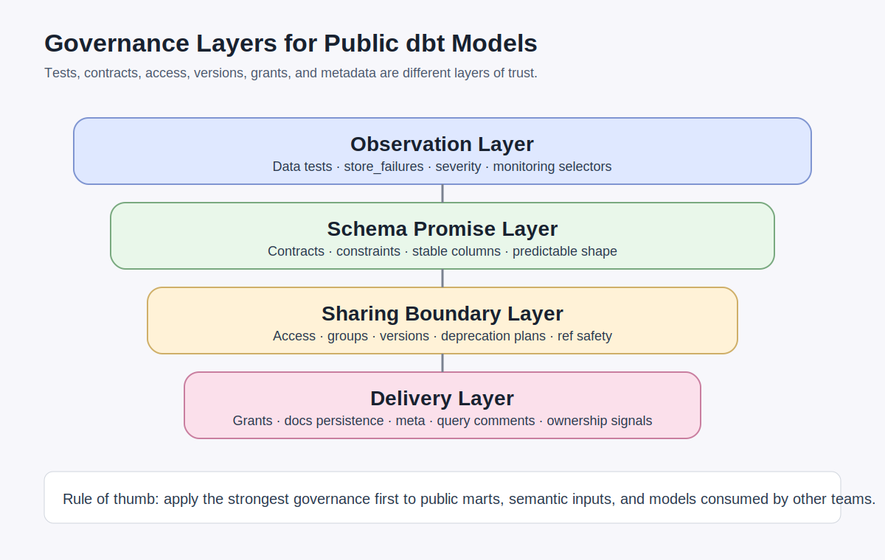
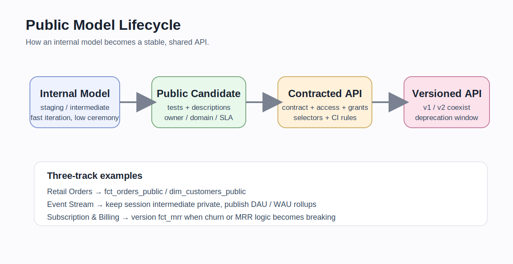

# CHAPTER 07 · Governance, Contracts, Versions, Grants, Quality Metadata

> 프로젝트를 “돌아가는 SQL 묶음”에서 “신뢰 가능한 공용 API 묶음”으로 바꾸는 장.
>
> 이 장은 tests, contracts, versions, grants, access, groups, metadata를 한 덩어리로 다룬다. 이유는 단순하다. 팀이 커질수록 중요한 질문은 “이 모델이 만들어지는가?”가 아니라 “이 모델을 **믿고 참조해도 되는가**?”가 되기 때문이다.



거버넌스는 관리 부서의 절차가 아니라, **공유 가능한 데이터 제품을 만드는 기술적 장치**다. 모델의 shape를 고정하고, 누가 참조할 수 있는지 정하고, 깨지는 변경을 안전하게 공개하고, 설명과 운영 정보를 코드에 남겨야 한다. 이 모든 것이 합쳐져야 다른 팀이나 미래의 내가 모델을 **공용 인터페이스**처럼 다룰 수 있다.

초기 프로젝트에서는 tests와 description만으로도 충분해 보일 수 있다. 하지만 public mart가 생기고, semantic 입력 모델이 늘어나고, 여러 팀이 같은 모델을 읽기 시작하면 상황이 달라진다. 그때 필요한 것이 access, groups, contracts, versions, grants, meta, persist_docs 같은 거버넌스 레버들이다.

이 장은 다음 순서로 진행한다.

1. 거버넌스를 왜 따로 배워야 하는지 설명한다.
2. tests / contracts / constraints / grants / versions / metadata의 역할을 분리한다.
3. public model을 어떻게 설계하는지 절차와 판단 기준을 제시한다.
4. Retail Orders / Event Stream / Subscription & Billing 세 예제에서 이 장의 원리가 어떻게 적용되는지 보여 준다.
5. 마지막에 운영 체크리스트와 안티패턴을 정리한다.

---

## 7.1. 왜 거버넌스를 따로 배워야 하는가

dbt 프로젝트가 작을 때는 “잘 돌아가는 모델”이 곧 좋은 모델처럼 보인다. 하지만 팀이 커지고 소비자가 늘어나면 좋은 모델의 조건이 달라진다.

이때 등장하는 질문은 대체로 아래와 같다.

- 이 모델은 외부 팀이 `ref()`해도 되는가?
- 컬럼 타입이 바뀌면 build를 막아야 하는가?
- v1과 v2를 일정 기간 함께 운영할 수 있는가?
- BI 팀에게 읽기 권한은 자동으로 줄 수 있는가?
- 설명과 소유자 정보, SLA, PII 여부를 코드에 남길 수 있는가?
- 테스트 실패가 모두 배포 차단이어야 하는가, 일부는 경고로 남겨야 하는가?

이 질문들은 서로 비슷해 보여도 모두 다른 기능이 답한다.

### 7.1.1. 거버넌스 레버를 먼저 분리하자

| 레버 | 무엇을 보장하는가 | 핵심 질문 |
| --- | --- | --- |
| data tests | 데이터 상태가 가정과 맞는가 | null, duplicate, orphan row가 있는가 |
| contracts | 모델 shape가 약속과 같은가 | 열 이름, 타입, 순서가 바뀌지 않았는가 |
| constraints | 데이터 플랫폼이 물리적으로 검증하는가 | NOT NULL, PK/FK를 플랫폼이 강제하는가 |
| access | 누가 이 모델을 `ref()`할 수 있는가 | private / protected / public인가 |
| groups | 어떤 소유 경계 안에 있는가 | 같은 group 안에서만 private ref가 가능한가 |
| versions | 깨지는 변경을 안전하게 공개하는가 | v1과 v2를 함께 두고 이행 기간을 줄 수 있는가 |
| grants | relation 권한이 맞는가 | 누가 select / insert / update할 수 있는가 |
| meta / docs / comments | 설명과 운영 메타데이터가 남는가 | owner, domain, pii, sla를 코드로 남겼는가 |

핵심은 **서로 대체하지 않는다는 점**이다.  
예를 들어 `not_null` test가 있다고 해서 contract가 필요 없어지는 것은 아니다. 반대로 contract가 있다고 해서 데이터 품질 테스트를 생략할 수 있는 것도 아니다.

### 7.1.2. public model과 internal model은 다르게 대하자

모든 모델에 같은 수준의 거버넌스를 적용할 필요는 없다. 오히려 그렇게 하면 유지보수 비용이 지나치게 올라간다.

이 장의 기본 원칙은 다음과 같다.

- `staging`, `intermediate`는 대체로 **internal**
- 공용 fact/dim, semantic 입력 모델, 외부 패키지/프로젝트가 읽는 모델은 **public candidate**
- public candidate가 되면 tests만이 아니라 contracts, access, group, versions, grants를 검토한다

이 원칙을 적용하면 governance를 “프로젝트 전체에 얇게”가 아니라 **공유 면적이 넓은 모델에 좁고 강하게** 적용할 수 있다.

---

## 7.2. Tests, Contracts, Constraints를 어떻게 구분할까

### 7.2.1. tests는 데이터 상태를 본다

data test는 실제 데이터 결과를 보고 판단한다.  
예를 들어 아래 질문에 답한다.

- `order_id`에 null이 있는가
- `customer_id`가 차원 테이블에 존재하는가
- 최근 7일의 활성 구독 수가 음수가 아닌가
- `event_type`이 허용된 값 집합에 속하는가

즉 tests는 “지금 들어온 데이터가 우리가 기대하는 상태에 있는가”를 점검한다.

```yaml
version: 2

models:
  - name: fct_orders
    columns:
      - name: order_id
        data_tests:
          - not_null
          - unique

      - name: customer_id
        data_tests:
          - relationships:
              to: ref('dim_customers')
              field: customer_id
```

### 7.2.2. contracts는 모델 shape를 본다

contracts는 결과 relation의 **shape**를 강제한다.  
열 이름, 타입, 순서, 정의가 바뀌는 것을 build 단계에서 차단하는 장치에 가깝다.

public model에서는 이 기능이 특히 중요하다. 이유는 downstream 소비자가 SQL을 바꾸지 않고도 안정적으로 같은 shape를 기대하기 때문이다.

```yaml
version: 2

models:
  - name: fct_orders_public
    config:
      contract:
        enforced: true
    columns:
      - name: order_id
        data_type: bigint
      - name: customer_id
        data_type: bigint
      - name: gross_revenue
        data_type: numeric
      - name: order_status
        data_type: varchar
```

contract는 “열이 이 타입과 이름으로 존재해야 한다”는 약속이고,  
test는 “그 열의 값이 기대 범위에 있는가”를 보는 장치다.

### 7.2.3. constraints는 플랫폼이 강제하는 규칙이다

constraints는 데이터 플랫폼이 실제로 강제할 수도 있고, 문서 수준으로만 남을 수도 있다.  
즉, **지원 범위와 enforcement 수준은 adapter마다 다르다.**

그래서 실무 원칙은 다음과 같이 잡는 편이 안전하다.

1. public model에서는 먼저 contract를 고려한다.
2. 핵심 컬럼에는 data tests를 붙인다.
3. 사용하는 플랫폼이 강제 가능한 constraint를 지원하면 추가한다.
4. constraint 지원이 약한 플랫폼이어도 tests + contract 조합은 유지한다.

```yaml
version: 2

models:
  - name: fct_orders_public
    config:
      contract:
        enforced: true
    columns:
      - name: order_id
        data_type: bigint
        constraints:
          - type: not_null
      - name: customer_id
        data_type: bigint
      - name: gross_revenue
        data_type: numeric
```

### 7.2.4. 세 기능의 차이를 한 줄로 요약하면

- **tests**: 이상 징후를 탐지한다
- **contracts**: 잘못된 shape를 build 시점에 차단한다
- **constraints**: 플랫폼이 물리적으로 값을 강제한다

public model을 운영한다면 셋 중 하나만 고르는 문제가 아니라, **각 층위의 역할을 분리해서 함께 설계하는 문제**다.

---

## 7.3. Access, Groups, Versions를 public API 관점으로 이해하기



### 7.3.1. access는 ref 가능한 범위를 정한다

`access`는 “누가 이 모델을 참조할 수 있는가”를 나타낸다.

- `private`: 같은 group 내에서만 참조
- `protected`: 같은 project/package 범위에서 참조
- `public`: 어떤 group, package, project에서도 참조 가능

실무적으로는 이렇게 생각하면 쉽다.

- staging / intermediate → private
- 안정화 중인 shared mart → protected
- 외부 팀과 semantic consumer가 보는 mart → public

```yaml
version: 2

models:
  - name: int_order_lines
    config:
      access: private
      group: finance

  - name: fct_orders_public
    config:
      access: public
      group: finance
```

### 7.3.2. group은 소유 경계를 만든다

group은 단순 태그가 아니다.  
같은 group 안에서는 private model을 참조할 수 있지만, 다른 group에서는 막힌다.

따라서 group은 아래 역할을 동시에 한다.

- 소유 팀 표시
- private ref 경계
- 모델 카탈로그에서의 정렬 기준
- 메타데이터와 권한 관리의 기초 단위

팀 구조를 생각하지 않고 group을 만들면 금방 혼란스러워진다.  
도메인 또는 운영 책임 단위로 작게 시작하는 것이 좋다.

### 7.3.3. versions는 깨지는 변경을 안전하게 공개한다

public model이 이미 소비되고 있다면, 열 이름을 바꾸거나 grain을 바꾸는 것은 “단순 리팩토링”이 아니라 **API 변경**이다. 이때 버전이 필요하다.

예를 들어 Subscription & Billing 트랙에서 `fct_mrr`의 정의가 바뀌어, cancellation 처리 규칙이 달라졌다고 하자. 기존 소비자에게는 breaking change가 된다. 그럴 때 v1을 유지한 채 v2를 추가하고, `latest_version`과 `deprecation_date`를 통해 소비자에게 이행 시간을 준다.

```yaml
version: 2

models:
  - name: fct_mrr
    latest_version: 2
    versions:
      - v: 1
        deprecation_date: 2026-12-31
      - v: 2
```

버전 전략의 기본 원칙은 이렇다.

- breaking change가 아니면 새 버전보다 기존 버전 유지/소폭 수정이 낫다
- breaking change면 새 버전을 만든다
- `latest_version`을 올릴 때는 migration 기간과 deprecation 계획을 같이 쓴다
- downstream은 필요하면 일시적으로 `ref('fct_mrr', v=1)`처럼 pinning할 수 있다

### 7.3.4. versioning을 언제 시작해야 할까

버전은 강력하지만 공짜가 아니다.  
v1과 v2를 동시에 운영하는 동안 테스트, 문서, grants, semantic 입력, dashboard ref까지 다 같이 관리해야 한다.

따라서 초반 원칙은 다음 정도가 현실적이다.

- internal model에는 버전을 남발하지 않는다
- public model이 실제 소비되기 시작한 뒤에만 버전을 검토한다
- v1과 v2의 공존 기간, 종료일, migration 주체를 명확히 둔다

---

## 7.4. Grants는 config로, schema 보조 작업은 최소 hook로

### 7.4.1. relation grants는 config가 기본이다

읽기 권한 같은 relation-level 권한은 `grants` config로 선언하는 편이 가장 읽기 쉽다.

```yaml
version: 2

models:
  - name: fct_orders_public
    config:
      grants:
        select: ["reporter", "bi_reader"]
```

이 방식의 장점은 명확하다.

- 모델 정의 가까이에 권한이 있어 이해가 쉽다
- build 후 object grants를 일관되게 맞출 수 있다
- debug logs에서 어떤 grant/revoke가 실행됐는지 확인할 수 있다

### 7.4.2. schema usage는 아직 hook가 필요한 경우가 많다

relation grants와 달리 schema `usage`는 운영 SQL 또는 hook가 필요한 경우가 있다.  
그래서 실무에서는 아래처럼 hybrid 패턴이 자주 쓰인다.

```yaml
on-run-end:
  - "grant usage on schema {{ schema }} to role reporter;"
```

원칙은 단순하다.

- relation 권한 → `grants`
- schema 사용권한 같은 보조 작업 → 최소 hook
- hook는 가능한 짧고 예측 가능하게
- hook가 길어질수록 별도 macro/operation으로 분리

### 7.4.3. platform별로 무엇이 달라질까

여기서는 상세 플레이북 대신 핵심 감각만 잡자.

- **Snowflake / BigQuery / Postgres**: grants와 comments, metadata 운용이 비교적 자연스럽다
- **DuckDB**: 로컬 학습 환경이라 정교한 권한 모델 체감은 약하다
- **ClickHouse / Trino / NoSQL + SQL Layer**: relation 권한과 메타데이터 관찰 방식이 warehouse형 플랫폼과 다를 수 있다
- 어떤 플랫폼이든 schema-level 보조 작업은 운영 SQL을 함께 볼 필요가 있다

---

## 7.5. 고급 테스트 운영: 실패를 어떻게 남길지 설계한다

기본 테스트만으로도 시작은 가능하지만, 운영 단계에선 “실패 여부”만이 아니라 **실패를 어떻게 처리할지**가 중요하다.

### 7.5.1. severity, warn_if, error_if

어떤 실패는 배포를 즉시 막아야 하고, 어떤 실패는 경고로만 남겨 triage하면 된다.

```yaml
version: 2

models:
  - name: fct_dau
    data_tests:
      - dbt_utils.expression_is_true:
          expression: "active_users >= 0"
          config:
            severity: warn
```

또는 실패 건수/비율에 따라 warn/error를 다르게 두는 접근도 가능하다.

### 7.5.2. where, limit, fail_calc

운영 데이터는 커진다. 그러면 테스트도 현실적으로 다뤄야 한다.

- `where`: 최근 N일만 검사
- `limit`: 실패 샘플 수 제한
- `fail_calc`: 실패 판단식 조정

예를 들어 Event Stream 트랙에서 전체 이벤트를 항상 다 검사하기보다, 최근 3일의 sessionized 결과만 검사하는 식이 더 현실적일 수 있다.

### 7.5.3. store_failures

문제 행을 triage 테이블로 남기고 싶다면 `store_failures`를 쓴다.

```yaml
version: 2

models:
  - name: fct_orders_public
    columns:
      - name: order_id
        data_tests:
          - unique:
              config:
                store_failures: true
```

이 기능은 “실패했다”에서 끝나지 않고, **어떤 행이 실패했는지 운영 루프로 연결**할 때 유용하다.

---

## 7.6. 문서화와 메타데이터를 운영 정보까지 확장하기

### 7.6.1. description만으로는 부족하다

문서화는 “이 모델은 주문 매출 테이블이다” 한 줄로 끝나지 않는다.  
운영에 필요한 정보도 함께 남겨야 한다.

예를 들어 이런 정보가 자주 필요하다.

- owner
- domain
- pii 여부
- freshness 기대치
- semantic 입력 여부
- dashboard / exposure 연결 여부

### 7.6.2. meta는 운영 힌트를 코드에 남긴다

`meta`는 프로젝트 밖 문서에 흩어지던 정보를 코드로 끌어오는 데 좋다.

```yaml
version: 2

models:
  - name: fct_orders_public
    config:
      meta:
        owner: finance_analytics
        domain: retail
        contains_pii: false
        sla: "daily 08:00 KST"
        serving_tier: public
```

이런 메타데이터는 manifest, Catalog, 내부 운영 도구, 문서 사이트에서 재사용하기 좋다.

### 7.6.3. persist_docs는 database comments와 연결된다

설명을 warehouse object comments로도 남기고 싶다면 `persist_docs`를 고려할 수 있다.

```yaml
models:
  my_project:
    marts:
      +persist_docs:
        relation: true
        columns: true
```

다만 support와 동작 방식은 adapter마다 차이가 있다.  
그래서 실제 채택 전에는 사용하는 플랫폼의 지원 범위와 mixed-case, relation/column comment 제약을 확인하는 게 좋다.

### 7.6.4. docs blocks와 긴 설명 재사용

column마다 긴 설명을 반복해야 한다면 docs block을 쓰는 것이 낫다.  
예를 들어 “gross_revenue는 세금 제외, 환불 제외, 주문 단위 집계” 같은 설명이 여러 모델에 반복된다면 `docs` block으로 분리해 재사용할 수 있다.

### 7.6.5. query comment와 비용/감사 추적

특히 BigQuery 쪽에서는 query comment와 labels를 함께 써서 job 추적에 도움을 받을 수 있다.  
즉 문서화는 정적 설명에만 머무르지 않고, **실행 흔적과 운영 추적**으로 이어질 수 있다.

---

## 7.7. selectors.yml과 governance 운영 루틴

거버넌스 장에서는 selector도 같이 생각하는 편이 좋다. 이유는 public model, critical tests, semantic inputs를 **반복 가능한 규칙으로 실행**해야 하기 때문이다.

### 7.7.1. CI selector를 코드로 남긴다

```yaml
selectors:
  - name: ci_public_contracts
    definition:
      union:
        - method: group
          value: finance
          indirect_selection: buildable
        - method: tag
          value: public_api
          indirect_selection: cautious
```

이런 selector를 두면 아래 같은 흐름이 가능하다.

```bash
dbt ls --selector ci_public_contracts
dbt build --selector ci_public_contracts
```

### 7.7.2. indirect_selection은 테스트 폭을 통제한다

- `eager`: 연결된 테스트를 적극적으로 포함
- `cautious`: 보수적으로 포함
- `buildable`: 실제 build 가능한 범위를 기준으로 포함

개인 개발 중에는 eager가 편하지만, CI에서는 buildable/cautious가 더 예측 가능한 경우가 많다.

### 7.7.3. 추천 운영 패턴

- public model selector
- semantic input selector
- incremental heavy model selector
- slow/expensive test selector
- migration/version rollout selector

이렇게 selector를 분리해 두면 governance는 문서가 아니라 **실행 가능한 운영 규칙**이 된다.

---

## 7.8. 세 예제 트랙 안에서 거버넌스를 어떻게 적용할까

이제 이 장의 개념을 세 예제에 연결해 보자.

### 7.8.1. Retail Orders

Retail Orders 트랙에서는 보통 아래 흐름이 자연스럽다.

- `stg_orders`, `stg_order_items` → private
- `int_order_lines` → protected 또는 private
- `fct_orders_public`, `dim_customers_public` → public + contract + grants

추천 포인트:

1. `fct_orders_public`에 contract를 붙인다
2. `gross_revenue`, `order_status` 컬럼을 description과 meta로 명확히 남긴다
3. dashboard exposure가 읽는 모델을 public으로 승격한다
4. BI 역할에 `select` grants를 설정한다

### 7.8.2. Event Stream

Event Stream은 raw volume이 크고 intermediate 로직이 자주 바뀌므로 public 범위를 더 좁게 잡는 편이 좋다.

- raw / staging / sessionization intermediate → private
- `fct_daily_active_users`, `fct_weekly_active_users` → public candidate
- expensive tests는 warn + selector 분리

추천 포인트:

1. session intermediate는 private 유지
2. public은 rollup 결과로 좁힌다
3. 최근 3일/7일 기준 where test를 적극 활용한다
4. 실패 행 저장을 통해 triage 테이블을 만든다

### 7.8.3. Subscription & Billing

이 트랙은 versioning 교육에 가장 적합하다.  
MRR, churn, plan upgrade 계산은 비즈니스 정의가 바뀌기 쉽기 때문이다.

- `stg_subscriptions`, `int_billing_periods` → internal
- `fct_mrr`, `fct_churn`, `dim_plan` → public candidate
- breaking change 시 versioning 적용

추천 포인트:

1. `fct_mrr`는 versioned public model 후보
2. `deprecation_date`를 운영 캘린더와 맞춘다
3. `meta.owner`, `meta.sla`, `meta.financial_reporting_tier`를 남긴다
4. semantic 입력 모델이라면 contract를 더 엄격히 둔다

---

## 7.9. Public Model 설계 절차

public model을 하나 승격한다고 가정하고, 실제 절차를 정리해 보자.

### 7.9.1. 1단계: public 후보를 좁힌다

아래 질문에 “예”가 많을수록 public 후보일 가능성이 높다.

- 외부 팀이 직접 참조하는가
- dashboard / semantic 모델의 핵심 입력인가
- 숫자 정의가 보고 체계에 직접 연결되는가
- 변경 시 downstream 영향이 큰가

### 7.9.2. 2단계: contract 초안을 만든다

- 출력 컬럼 목록
- 타입
- 필수 컬럼
- 제거/추가 시 breaking 여부

### 7.9.3. 3단계: tests와 constraints를 붙인다

- PK/비즈니스키 → `not_null`, `unique`
- 참조 키 → `relationships`
- 값 범위 → `accepted_values`, expression tests
- 지원되면 constraints도 추가

### 7.9.4. 4단계: access/group/grants/meta를 붙인다

- `access: public`
- `group: finance` 혹은 적절한 소유 그룹
- `grants.select`
- `meta.owner`, `meta.domain`, `meta.sla`

### 7.9.5. 5단계: 버전 전략이 필요한지 평가한다

- 지금 이미 소비되고 있는가
- 열 삭제/rename이 예정돼 있는가
- grain 변화가 있는가
- migration 기간을 줄 수 있는가

### 7.9.6. 6단계: selector와 runbook에 넣는다

public model은 단순히 YAML만 추가하고 끝나지 않는다.  
CI selector, 배포 절차, 변경 공지 방식까지 운영 루프에 연결해야 한다.

---

## 7.10. 안티패턴 아틀라스

### 7.10.1. 안티패턴: 모든 모델에 contract를 건다

문제:
- 초반 변화가 많은 모델에서 유지비 폭증
- 리팩토링 속도 저하

대안:
- public mart, semantic 입력, 외부 ref 모델부터 좁게 적용

### 7.10.2. 안티패턴: tests만 있으면 충분하다고 생각한다

문제:
- shape change를 build 전에 막지 못함
- downstream이 런타임에서 깨질 수 있음

대안:
- public model에는 contract를 같이 검토

### 7.10.3. 안티패턴: grants를 hook만으로 처리한다

문제:
- 권한 규칙이 모델 정의에서 멀어짐
- 추적이 어려워짐

대안:
- relation 권한은 grants config, schema 보조 작업만 최소 hook

### 7.10.4. 안티패턴: versioning 없이 breaking change를 바로 반영한다

문제:
- downstream 대시보드와 프로젝트가 조용히 깨짐

대안:
- public model에서는 v1/v2 공존 기간과 deprecation 계획을 둔다

### 7.10.5. 안티패턴: meta를 아무 키나 마음대로 만든다

문제:
- owner, domain, pii, sla 같은 핵심 키가 프로젝트마다 달라져 재사용이 어려움

대안:
- 팀 표준 meta key 세트를 먼저 정한다

---

## 7.11. 직접 해보기

### 실습 1. Retail Orders의 public mart를 contract model로 승격하기
1. `fct_orders_public` YAML을 만든다
2. `contract.enforced: true`를 넣는다
3. 핵심 컬럼 4개에 data_type을 적는다
4. `not_null`, `unique`, `relationships` tests를 붙인다
5. `meta.owner`, `meta.domain`, `meta.sla`를 넣는다

### 실습 2. Event Stream의 expensive test를 warn으로 바꾸기
1. 최근 3일만 검사하는 where 조건을 넣는다
2. severity를 `warn`으로 둔다
3. `store_failures: true`를 켠다
4. 결과 triage relation을 확인한다

### 실습 3. Subscription & Billing의 MRR 모델을 versioned public model로 만들기
1. `latest_version: 2`를 둔다
2. `versions: [v1, v2]` 구조를 만든다
3. v1에 `deprecation_date`를 둔다
4. downstream에서 `ref('fct_mrr', v=1)` 또는 latest ref를 어떻게 쓸지 적어 본다

---

## 7.12. 체크리스트

### 개념 체크
- [ ] tests / contracts / constraints의 역할 차이를 설명할 수 있다
- [ ] access / groups / versions가 왜 public API 개념과 연결되는지 설명할 수 있다
- [ ] grants와 hook를 언제 구분해야 하는지 설명할 수 있다
- [ ] meta / persist_docs / query comment가 왜 운영 메타데이터와 연결되는지 이해한다

### 설계 체크
- [ ] 우리 프로젝트에서 public candidate model이 무엇인지 고를 수 있다
- [ ] public model에 contract 초안을 쓸 수 있다
- [ ] versioning이 필요한 breaking change를 구분할 수 있다
- [ ] selector로 public/critical 모델 실행 규칙을 만들 수 있다

### 운영 체크
- [ ] 실패 triage를 위해 store_failures를 설계할 수 있다
- [ ] owner/domain/sla meta key 표준을 정할 수 있다
- [ ] public model 변경 시 migration plan을 함께 쓸 수 있다

---

## 7.13. 이 장의 핵심 요약

1. 거버넌스는 절차 문서가 아니라 **공용 모델을 안전하게 공유하는 기술적 장치**다.
2. tests / contracts / constraints / access / groups / versions / grants / meta는 서로 대체제가 아니다.
3. 모든 모델에 거버넌스를 적용하지 말고, **public mart와 semantic 입력 모델부터 좁고 강하게** 적용하자.
4. Retail Orders는 contract/grants 교육에, Event Stream은 테스트 운영과 triage에, Subscription & Billing은 versioning 교육에 특히 좋다.
5. public model은 단순한 테이블이 아니라, **문서화된 데이터 API**라고 생각하면 이 장 전체가 훨씬 잘 이해된다.

---

## 7.14. 참고 코드와 다음 연결

이 장과 함께 보면 좋은 코드 조각은 아래 경로에 있다.

- `../codes/04_chapter_snippets/ch07/public_marts.yml`
- `../codes/04_chapter_snippets/ch07/public_mrr_versions.yml`
- `../codes/04_chapter_snippets/ch07/grants_and_hooks.yml`
- `../codes/04_chapter_snippets/ch07/quality_gate_tests.yml`
- `../codes/04_chapter_snippets/ch07/selectors.ci.yml`
- `../codes/04_chapter_snippets/ch07/query_comment_bigquery.yml`
- `../codes/04_chapter_snippets/ch07/docs_blocks.md`

다음 장에서는 이 장의 public model 관점 위에서, Semantic Layer / Python / UDF / Mesh / Performance / dbt platform / AI까지 연결한다.
