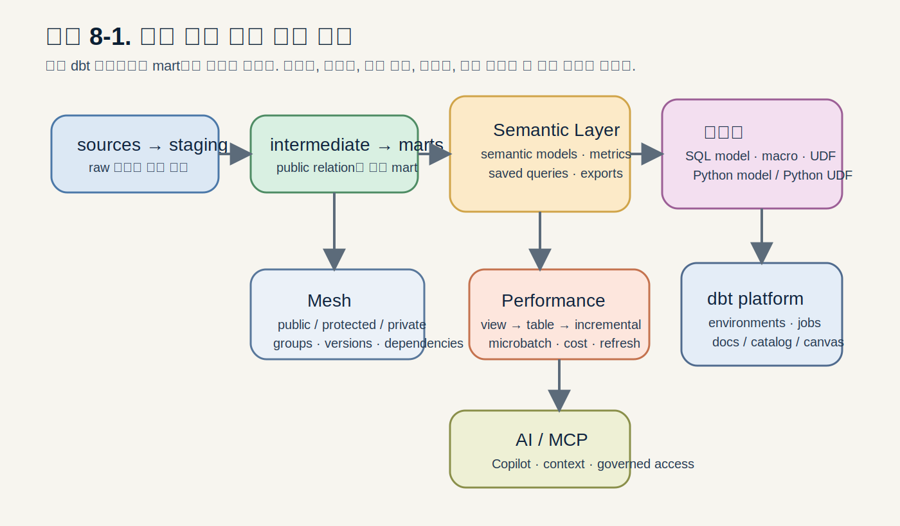
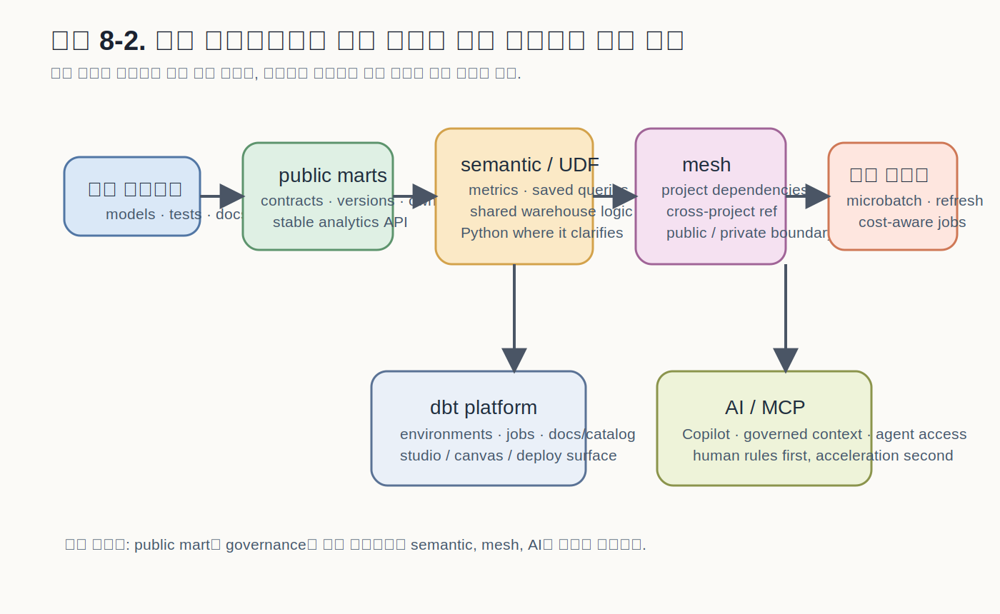

# CHAPTER 08 · Semantic Layer, Python/UDF, Mesh, Performance, dbt platform, AI

> 이 장의 목표는 고급 기능을 “기능 백과사전”처럼 나열하는 것이 아니라,  
> **모델 위에 어떤 공용 분석 표면을 올리고, 그것을 여러 팀·플랫폼·실행 환경으로 확장하는가**라는 하나의 질문으로 묶어 이해하는 데 있다.



## 8.1. 왜 이 장의 여섯 주제를 한 장에서 함께 다루는가

앞선 장들에서 우리는 dbt 프로젝트를 **구조화된 모델링 계층**으로 이해했다.  
`source()`와 `ref()`를 통해 의존성을 선언하고, layered modeling으로 책임을 나누고, tests·contracts·docs·CI로 신뢰성을 붙였다.  
이제 남은 질문은 그 위에 무엇을 더 올릴 것인가이다.

초보 단계에서 dbt는 “SQL을 더 잘 관리하는 프로젝트 도구”로 보인다.  
하지만 조직이 커지고 소비자가 늘어나면 dbt는 다음과 같은 역할까지 요구받는다.

1. **의미를 표준화하는 층**  
   같은 gross revenue, DAU, MRR를 도구마다 다르게 계산하지 않게 해야 한다.
2. **표현 수단을 넓히는 층**  
   SQL만으로는 표현하기 어색한 로직을 Python model이나 UDF로 다뤄야 할 때가 생긴다.
3. **팀 경계를 관리하는 층**  
   한 프로젝트 안에 모든 것을 넣는 대신, 공개 API처럼 모델을 배포해야 할 때가 온다.
4. **비용과 실행 전략을 제어하는 층**  
   실시간에 가까운 freshness, 대용량 처리, 반복 질의 비용을 통제해야 한다.
5. **소비 표면을 넓히는 층**  
   BI, Catalog, platform jobs, AI assistant, MCP 같은 새로운 소비자가 생긴다.

이 장의 여섯 주제는 각각 따로 배우면 무질서해 보이지만, 사실은 같은 질문의 다른 면이다.

- **Semantic Layer**는 “무엇이 질문 가능한가”를 정의한다.
- **Python model / UDF**는 “어떤 구현 방식이 가장 명확한가”를 선택하게 해 준다.
- **Mesh**는 “누가 무엇을 공개하고 누가 그것을 의존해도 되는가”를 정한다.
- **Performance / cost / real-time**은 “이 구조를 얼마의 비용으로 얼마나 자주 운영할 것인가”를 다룬다.
- **dbt platform**은 “어디서 실행하고 어떤 메타데이터 표면으로 보여 줄 것인가”를 다룬다.
- **AI / Copilot / MCP**는 “이 자산을 사람이 아닌 에이전트와도 어떻게 연결할 것인가”를 다룬다.

이 장을 읽을 때는 기능 이름을 외우기보다,  
**모델 → 의미 → 운영 → 소비**라는 확장 축을 머릿속에 유지하는 것이 좋다.

## 8.2. Semantic Layer: 모델 위에 “질문 가능한 의미”를 한 겹 더 올리기

### 8.2.1. semantic layer는 무엇을 해결하는가

좋은 fact table을 만들었다고 해서 의미 문제가 자동으로 해결되지는 않는다.  
예를 들어 `fct_orders`가 있다고 해도 사람들은 여전히 서로 다른 방식으로 질문한다.

- revenue를 order status와 함께 볼 것인가?
- discount를 포함한 금액인가, 제외한 금액인가?
- order_date 기준인가, shipped_date 기준인가?
- customer segment는 현재 상태인가, 주문 시점 상태인가?

mart는 **좋은 입력 relation**을 제공한다.  
semantic layer는 그 relation 위에서 **어떤 질문이 허용되고, 어떤 조합이 표준인가**를 정의한다.

즉, semantic layer는 모델을 대체하는 층이 아니라  
**신뢰 가능한 public mart를 더 잘 소비하게 만드는 정의층**이다.

### 8.2.2. semantic model의 최소 단위: entities, dimensions, measures

semantic model을 설계할 때는 먼저 중심이 되는 entity를 고정해야 한다.  
그리고 그 entity를 기준으로 시간 축과 slice 축, 합산 가능한 measure를 분리한다.

예를 들어 Retail의 `fct_orders`는 다음처럼 읽을 수 있다.

- 중심 entity: `order`
- 외부 참조 entity: `customer`
- time dimension: `order_date`
- categorical dimension: `order_status`, `customer_segment`
- measure: `gross_revenue`, `order_count`, `item_count`

여기서 중요한 점은 semantic model이 relation을 새로 만드는 것이 아니라  
**이미 있는 mart를 더 엄격한 분석 API로 승격**시키는 작업이라는 것이다.

### 8.2.3. metric과 saved query는 “반복 질문”을 이름 붙이는 장치다

measure는 데이터 측면의 합산 재료다.  
metric은 그 재료를 business-friendly한 질문 단위로 끌어올린 것이다.

- Retail: `revenue`, `orders`, `average_order_value`
- Event: `dau`, `wau`, `session_count`
- Subscription: `mrr`, `active_subscriptions`, `churned_accounts`

saved query는 여기서 한 발 더 나아간다.  
metric + dimension + filter 조합을 반복해서 쓰는 경우, 그 질문 자체를 이름으로 저장한다.

예를 들어 다음은 “질문 템플릿”에 가깝다.

- 최근 90일간 월별 segment별 revenue
- 최근 28일간 platform별 DAU
- 월별 plan별 MRR와 churn rate

이렇게 해 두면 BI, notebooks, CLI, AI 질의가 모두 같은 의미 정의를 공유하기 쉬워진다.

### 8.2.4. exposure와 semantic layer는 서로 경쟁하지 않는다

많은 팀이 exposure와 semantic layer를 서로 대체재처럼 오해한다.  
하지만 역할은 다르다.

- **exposure**는 “누가 이 모델을 소비하는가”를 문서화한다.
- **semantic layer**는 “이 소비자가 어떤 metric/dimension 조합으로 질문할 수 있는가”를 정의한다.

하나는 downstream lineage를 풍부하게 만들고,  
다른 하나는 reusable meaning layer를 제공한다.

따라서 좋은 구조는 다음과 같다.

1. public mart를 만든다.
2. 그 mart 위에 semantic model과 metric을 얹는다.
3. dashboard / app / notebook을 exposure로 연결한다.

### 8.2.5. semantic layer를 언제 도입해야 하는가

semantic layer는 프로젝트 첫 주에 넣을 기능은 아니다.  
먼저 다음 조건이 갖춰져야 한다.

1. public mart의 grain이 안정적이다.
2. 핵심 컬럼과 measure가 테스트와 docs로 신뢰 가능하다.
3. metric을 둘 이상의 소비자(BI, finance, product 등)가 공유한다.
4. 같은 질문을 매번 새 SQL로 짜는 비용이 커지고 있다.

반대로 다음 상태에서는 semantic layer를 서두르지 않는 편이 좋다.

- mart grain이 아직 자주 바뀐다.
- contracts/versioning 없이 public API를 급히 만들고 있다.
- metric 이름과 정의가 아직 팀 안에서도 합의되지 않았다.

### 8.2.6. 세 예제 트랙에서 semantic layer가 자리 잡는 방식

#### Retail Orders
Retail은 semantic layer를 붙이기 가장 쉬운 도메인이다.  
이미 `fct_orders`와 `dim_customers`가 안정적이라면, revenue와 order_count를 metric으로 끌어올리고, status·segment·order_date를 기준으로 saved query를 만들 수 있다.

이때 핵심은 “금액 정의”를 숨기지 않는 것이다.  
예를 들어 gross revenue와 net revenue를 같은 revenue로 뭉개지 말고,  
measure와 metric 이름을 분리해 business meaning을 명시적으로 드러내야 한다.

#### Event Stream
Event는 semantic layer가 특히 유용하지만, 동시에 가장 어렵기도 하다.  
이유는 entity와 time grain이 금방 흔들리기 때문이다.

- user를 중심 entity로 볼 것인가?
- session을 중심 entity로 볼 것인가?
- event time을 기준으로 할 것인가, session start time을 기준으로 할 것인가?

따라서 Event 트랙에서는 semantic layer를 서두르기보다  
먼저 `fct_sessions`와 `fct_daily_active_users` 같은 public mart를 안정화한 뒤  
그 위에서 DAU, WAU, session_count를 정의하는 식으로 가는 것이 안전하다.

#### Subscription & Billing
Subscription 도메인은 semantic layer의 장점이 가장 크게 드러난다.  
MRR, expansion MRR, contraction MRR, churn rate 같은 지표는 finance·ops·exec가 동시에 쓰기 때문이다.

다만 이 도메인은 상태 변화와 시점 기준이 중요하므로,  
semantic layer 전에 snapshot·versioning·contract가 먼저 안정되어야 한다.  
즉, semantic layer가 먼저가 아니라 **좋은 상태 모델링이 먼저**다.

### 8.2.7. semantic starter 코드

아래 코드는 Retail 트랙의 semantic starter 예시다.

```yaml
# codes/04_chapter_snippets/ch08/retail_semantic.yml
semantic_models:
  - name: orders_semantic
    model: ref('fct_orders')
    defaults:
      agg_time_dimension: order_date
    entities:
      - name: order
        type: primary
        expr: order_id
      - name: customer
        type: foreign
        expr: customer_id
    dimensions:
      - name: order_date
        type: time
        type_params:
          time_granularity: day
      - name: order_status
        type: categorical
      - name: customer_segment
        type: categorical
    measures:
      - name: gross_revenue
        agg: sum
        expr: gross_revenue
      - name: order_count
        agg: count_distinct
        expr: order_id

metrics:
  - name: revenue
    label: Revenue
    type: simple
    type_params:
      measure:
        name: gross_revenue

saved_queries:
  - name: monthly_revenue_by_segment
    query_params:
      metrics: [revenue]
      group_by:
        - TimeDimension('order_date', 'month')
        - Dimension('customer_segment')
```

## 8.3. Python models와 UDFs: SQL이 부족한 곳이 아니라, 더 명확한 표현이 필요한 곳



### 8.3.1. Python model을 쓰는 이유를 먼저 좁혀야 한다

dbt의 기본 언어는 여전히 SQL이다.  
협업, 문서화, lineage, contract, review, warehouse portability를 생각하면  
대부분의 변환 로직은 SQL model이 가장 읽기 쉽다.

그래서 Python model은 “할 수 있으니 쓴다”가 아니라  
**SQL보다 Python이 더 명확한 경우에만 쓰는 것**이 원칙이다.

대표적인 경우는 다음과 같다.

1. 복잡한 문자열 파싱, JSON flattening, 라이브러리 사용
2. DataFrame 기반 변환이 SQL보다 훨씬 읽기 쉬운 경우
3. 세션화, 이벤트 stitching, 모델 입력용 feature engineering
4. 데이터 과학용 중간 relation 생성

반대로 다음은 SQL model이 더 낫다.

- public mart
- contract를 붙일 핵심 모델
- 팀 전체가 리뷰해야 하는 핵심 비즈니스 로직
- 단순한 joins, filters, aggregations

### 8.3.2. macro와 UDF는 재사용 단위가 다르다

macro는 dbt 컴파일 단계의 텍스트 재사용 장치다.  
UDF는 warehouse에 실제 함수 객체를 만들어 두고,  
dbt 밖의 SQL 클라이언트나 BI 도구에서도 다시 쓸 수 있게 하는 장치다.

이 차이는 생각보다 중요하다.

- **macro**: dbt 안에서만 재사용되는 SQL 템플릿
- **UDF**: warehouse 전체에서 재사용되는 계산 함수

따라서 “이 계산을 BI 도구, notebook, ad hoc SQL에서도 똑같이 써야 하는가?”가  
UDF를 선택하는 가장 좋은 질문이다.

### 8.3.3. Python model vs SQL model vs macro vs UDF

#### SQL model
relation을 만든다.  
중간 결과나 최종 mart를 만들어 downstream이 읽게 하고 싶을 때 가장 기본이 되는 선택지다.

#### macro
같은 SQL 패턴이 여러 파일에 반복될 때 쓴다.  
하지만 과도하면 compiled SQL 가독성이 떨어지고, 온보딩 난도가 올라간다.

#### SQL/Python UDF
warehouse function을 만든다.  
dbt 밖의 도구에서도 같은 계산을 공유해야 할 때 적합하다.

#### Python model
relation을 만들지만, 구현 언어가 Python이다.  
데이터 처리 라이브러리와 DataFrame 연산을 써야 할 때 강하다.

### 8.3.4. 세 예제 트랙에서 Python과 UDF가 들어오는 지점

#### Retail Orders
Retail에서는 주소 정규화, product code cleaning, phone formatting 같이  
“여러 도구가 함께 쓰는 검증/정규화 로직”에는 UDF가 잘 맞는다.

반면 order mart 자체를 Python으로 쓰는 건 대개 과하다.  
핵심 mart는 SQL + contract + tests로 남기고,  
부가적인 정규화 로직만 UDF로 공유하는 편이 자연스럽다.

#### Event Stream
Event는 Python model이 가장 빛나는 트랙이다.  
sessionization, raw event unpacking, user-agent parsing처럼  
Python이 더 읽기 쉬운 경우가 많다.

다만 public fact table은 여전히 SQL로 승격하는 편이 좋다.  
즉, Python model은 **내부 구현**에 가깝고, public mart는 SQL API에 가깝다.

#### Subscription & Billing
Subscription 트랙에서는 complex billing proration이나 plan classification을  
UDF로 공유할 가치가 생긴다.  
finance SQL, dbt model, notebook이 같은 계산을 호출해야 하기 때문이다.

하지만 snapshot, contracts, MRR mart 같은 핵심 모델은  
SQL + contract + tests 중심으로 남기는 것이 유지보수에 유리하다.

### 8.3.5. Python model과 UDF 예시

Python model:

```python
# codes/04_chapter_snippets/ch08/event_sessions.py
def model(dbt, session):
    dbt.config(materialized="table")

    events = dbt.ref("stg_events")

    # 실제 구현에서는 adapter별 DataFrame API를 맞춰야 한다.
    # 여기서는 "세션 단위 relation을 만든다"는 구조를 보여 주기 위한 starter 예시다.
    sessions = (
        events
        .groupBy("user_id", "session_id")
        .agg(
            {"event_at": "min"}
        )
    )

    return sessions
```

SQL UDF:

```sql
-- codes/04_chapter_snippets/ch08/functions_is_valid_plan_code.sql
create or replace function {{ this }}(value string)
returns boolean
as (
  regexp_like(value, '^[A-Z]{2,8}_[0-9]{2}$')
);
```

함수 YAML:

```yaml
# codes/04_chapter_snippets/ch08/functions_schema.yml
functions:
  - name: is_valid_plan_code
    description: "플랜 코드가 TEAM_01 같은 규칙을 만족하는지 검사"
```

## 8.4. Mesh와 cross-project ref: 프로젝트를 나누는 일은 기술보다 계약의 문제다

### 8.4.1. 언제 프로젝트를 쪼개야 하는가

모든 조직이 dbt Mesh를 해야 하는 것은 아니다.  
프로젝트를 나누기 시작하는 대표 신호는 다음과 같다.

1. 팀마다 배포 주기와 review 기준이 달라졌다.
2. public API처럼 오래 유지해야 하는 모델이 생겼다.
3. ownership이 분명히 갈라지고, 한 팀이 다른 팀 모델을 소비한다.
4. monorepo에서 변경 영향과 권한 경계가 너무 넓어졌다.

반대로 다음 조건이라면 하나의 프로젝트가 더 단순하고 생산적일 수 있다.

- 팀이 작고, 공통 규칙을 유지할 수 있다.
- public/private 경계가 아직 뚜렷하지 않다.
- 배포 cadence가 거의 같다.
- versioning 비용보다 통합 운영의 이점이 더 크다.

### 8.4.2. packages와 project dependencies는 목적이 다르다

작은 조직에서는 packages만으로 충분할 때가 많다.  
하지만 packages는 코드 재사용에 더 가깝고,  
project dependencies는 cross-project ref와 mesh 운영에 더 가깝다.

- **package**: 코드를 가져와 내 프로젝트 안에서 함께 빌드한다.
- **project dependency**: 다른 프로젝트가 공개한 public/protected model을 계약된 방식으로 참조한다.

즉, packages는 “가져와 합치는” 느낌이고,  
project dependencies는 “공개 API를 소비하는” 느낌이다.

### 8.4.3. mesh는 governance discipline이 없으면 커진 monolith에 불과하다

cross-project ref만 열어 두고 access, contracts, versions, ownership을 붙이지 않으면  
실제로는 더 큰 monolith를 여러 저장소로 나눈 것과 크게 다르지 않다.

진짜 mesh는 다음이 함께 있어야 한다.

1. **group**: 소유 팀이 누구인가
2. **access**: 누구까지 ref해도 되는가
3. **contract**: public model의 shape를 보장하는가
4. **version**: 깨지는 변경을 새 버전으로 관리하는가

즉, mesh는 저장소를 나누는 기술이 아니라  
**공개 API를 운영하는 규율**에 가깝다.

### 8.4.4. 세 예제 트랙을 mesh로 나누면 어떤 모습이 되는가

#### Retail Orders
`finance_core`가 `fct_orders`, `dim_customers`를 공개하고,  
`bi_dashboard`가 그것을 소비하는 구조를 상상할 수 있다.

이 경우 public API는 주문 매출, 고객 세그먼트, 일자 기준 revenue 질의다.  
원시 정규화 로직이나 staging detail은 private로 남겨야 한다.

#### Event Stream
`product_analytics`가 `fct_daily_active_users`, `fct_sessions`를 공개하고,  
`growth_dashboard`나 `experimentation` 프로젝트가 그것을 소비할 수 있다.

이 도메인에서는 freshness와 event_time 기준이 중요하므로  
public mart의 time grain을 바꾸는 일은 versioning 없이 하면 안 된다.

#### Subscription & Billing
`revenue_core`가 `fct_mrr_v1`, `fct_mrr_v2` 같은 public 모델을 공개하고,  
FP&A와 exec dashboard가 이를 소비하는 구조가 잘 맞는다.

여기서는 MRR 정의 변경이 즉시 경영지표에 영향을 주기 때문에  
contracts와 versions가 특히 중요하다.

### 8.4.5. mesh starter 코드

```yaml
# codes/04_chapter_snippets/ch08/dependencies.yml
packages:
  - package: dbt-labs/dbt_utils
    version: 1.3.0

projects:
  - name: finance_core
    version: ">=1.2.0"
```

```sql
# codes/04_chapter_snippets/ch08/cross_project_ref_example.sql
select *
from {{ ref('finance_core', 'fct_orders_v2') }}
```

## 8.5. Performance, cost, real-time: 구조가 안정된 뒤에야 최적화가 의미를 가진다

### 8.5.1. 성능 튜닝의 기본 순서

많은 팀이 성능 문제를 너무 빨리 incremental이나 warehouse-native 기능으로 해결하려 한다.  
하지만 구조가 안정되기 전에 최적화를 넣으면 문제를 더 오래 숨길 수 있다.

가장 실용적인 순서는 이렇다.

1. 먼저 view로 시작한다.
2. 조회가 너무 느리면 table로 승격한다.
3. 빌드가 너무 느리면 incremental을 고려한다.
4. 정말 자동 refresh가 필요하면 materialized view나 dynamic table 같은 warehouse-native 기능을 검토한다.

즉, 최적화는 **기능 추가가 아니라 실행 전략의 변경**이다.

### 8.5.2. incremental은 데이터의 도착 방식을 보고 고른다

incremental 전략을 고를 때는 먼저 데이터가 어떻게 도착하는지부터 봐야 한다.

- append-only인가?
- updates가 있는가?
- late-arriving data가 있는가?
- time-series인가?
- 동일 unique key를 신뢰할 수 있는가?

단순 append-only라면 기본 incremental이 자연스럽다.  
대형 시간계열이라면 microbatch가 더 안정적일 수 있다.  
updates가 많고 merge semantics가 중요하면 merge 계열 전략이 더 적합하다.

### 8.5.3. microbatch는 이벤트형 데이터에서 특히 강력하다

microbatch는 큰 time-series 데이터를 여러 batch로 나누어 처리하는 전략이다.  
이벤트 스트림처럼 event_time이 분명하고 데이터량이 큰 경우 특히 잘 맞는다.

다만 다음 전제가 필요하다.

1. event_time이 명확하다.
2. late-arriving data를 얼마나 되돌아볼지 결정했다.
3. 전체 팀이 “몇 분/시간 지연까지 허용 가능한가”를 숫자로 합의했다.

즉, microbatch는 기술적 옵션이면서 동시에 SLA 합의이기도 하다.

### 8.5.4. warehouse-native refresh를 언제 검토할까

materialized view, dynamic table, auto refresh 계열 기능은 편리하다.  
하지만 편리하다는 이유만으로 먼저 넣으면 운영 복잡도가 커질 수 있다.

다음 질문을 먼저 하자.

- batch build로 충분하지 않은가?
- freshness 목표가 몇 분/몇 시간인가?
- 비용 상한선은 얼마인가?
- refresh를 dbt job이 책임질 것인가, warehouse가 책임질 것인가?

즉, 이 기능들은 “더 빠른 옵션”이 아니라  
**코드 배포와 데이터 갱신의 책임을 어디에 둘 것인가**에 대한 선택이다.

### 8.5.5. 세 예제 트랙에서 성능/비용 압력이 다르게 나타나는 방식

#### Retail Orders
Retail은 보통 시간 단위 또는 하루 단위 배치면 충분한 경우가 많다.  
따라서 핵심은 real-time이 아니라 **재현 가능하고 신뢰 가능한 배치**다.

#### Event Stream
Event는 가장 먼저 비용과 freshness 압박을 받는다.  
scan cost, incremental strategy, batch size, lookback이 실전 이슈가 된다.  
따라서 selector, microbatch, warehouse-native 옵션을 가장 먼저 검토하는 트랙이다.

#### Subscription & Billing
Subscription은 실시간보다 “시점 정확성”이 중요하다.  
snapshot, versioning, 월말 정산 정확성이 핵심이므로  
무조건 빠른 갱신보다 **정확한 상태 이력과 재현성**이 우선이다.

### 8.5.6. performance starter 코드

```sql
# codes/04_chapter_snippets/ch08/microbatch_events.sql
{{
  config(
    materialized='incremental',
    incremental_strategy='microbatch',
    event_time='event_at',
    batch_size='day',
    lookback=2,
    concurrent_batches=false
  )
}}

select
  user_id,
  session_id,
  event_at,
  event_type
from {{ ref('stg_events') }}
```

## 8.6. dbt platform: 실행 환경과 메타데이터 소비 표면을 함께 보는 눈

### 8.6.1. dbt platform은 “CLI의 대체재”라기보다 실행면의 확장이다

로컬에서 dbt를 잘 돌리는 것과, 조직에서 반복 가능하게 운영하는 것은 다르다.  
dbt platform은 이 차이를 메운다.

대표적인 역할은 다음과 같다.

1. environments: 어떤 버전, 어떤 연결 정보, 어떤 코드 버전으로 실행할 것인가
2. jobs: 어떤 명령을 언제 어떤 환경에서 돌릴 것인가
3. docs / catalog / discovery 표면: 결과를 어떻게 탐색하게 할 것인가
4. Studio / Canvas / Copilot: 개발 경험을 어떻게 보조할 것인가

즉, dbt platform은 기능을 더 넣는 도구가 아니라  
**반복 실행과 메타데이터 소비를 운영 가능한 표면**으로 바꾸는 층이다.

### 8.6.2. environments를 “세 변수”로 읽는 습관

환경(environment)을 볼 때는 세 가지만 먼저 보면 된다.

1. 실행할 dbt 버전
2. warehouse connection과 target 설정
3. 실행할 코드 버전

이 세 가지를 분리해서 생각하면  
development, CI, deployment 환경이 왜 나뉘는지 이해하기 쉬워진다.

### 8.6.3. jobs와 docs의 역할

jobs는 단지 스케줄러가 아니다.  
deploy job, CI job, merge job, docs job은 목적이 다르다.

- CI job: 변경이 기존 자산을 깨지 않는지 확인
- deploy job: production 자산을 빌드
- docs job: metadata/catalog surface를 갱신
- merge/state-aware job: 좁은 범위의 빠른 검증

이때 핵심은 “같은 명령도 목적에 따라 맥락이 다르다”는 것이다.  
`dbt build`라는 명령 하나라도 로컬 개발, PR CI, production deploy에서 의미가 다르다.

### 8.6.4. 세 예제 트랙에서 platform이 실제로 필요한 순간

#### Retail Orders
초기에는 로컬 DuckDB만으로 충분하다.  
하지만 finance dashboard와 exec reporting이 연결되기 시작하면  
docs/catalog과 deploy job이 필요해진다.

#### Event Stream
Event는 CI와 deploy의 차이가 빨리 드러난다.  
변경 범위를 좁혀 빠르게 검증하고, freshness를 지키면서 배포해야 하기 때문이다.  
여기서 state-aware job, defer, selector discipline의 가치가 커진다.

#### Subscription & Billing
Subscription은 승인과 재현 가능성이 중요하다.  
월말 close와 관련된 job은 ad hoc 실행보다 versioned, reviewed, documented pipeline에 가까워야 한다.  
따라서 environments와 release discipline이 더 엄격해진다.

## 8.7. AI, Copilot, MCP: 사람이 정한 규칙을 더 빨리 소비하게 만드는 층

### 8.7.1. AI는 구조를 대신 만들지 않는다

AI 표면을 볼 때 가장 중요한 기준은  
“무엇을 대신하는가?”보다 **“무엇과 연결되는가?”**이다.

AI가 잘하는 일은 초안을 빠르게 만드는 것이다.

- 문서 생성
- test 초안
- semantic model 초안
- metric/YAML 초안
- SQL 초안
- 프로젝트 검색과 컨텍스트 탐색

하지만 AI가 잘 못하는 일은 프로젝트 규칙을 스스로 설계하는 것이다.

- 올바른 grain 결정
- public/private 경계 설정
- contract/versioning 전략
- cost-aware selector 설계
- ownership과 governance 합의

즉, AI는 사람의 규칙을 대체하는 층이 아니라  
**사람이 정한 규칙을 더 빨리 적용하고 탐색하게 하는 소비 표면**이다.

### 8.7.2. Copilot과 MCP를 어떻게 다르게 볼까

Copilot은 생성과 수정의 보조자에 가깝다.  
반면 MCP는 에이전트가 dbt-managed asset을 안전하게 탐색하게 하는 인터페이스에 가깝다.

- Copilot: docs/tests/SQL/semantic YAML 초안 생성
- MCP: 모델, metric, lineage, freshness 같은 자산을 AI 애플리케이션이 안전하게 질의할 수 있게 함

둘 다 편리하지만, 둘 다 사람의 규칙 밖에서 autonomous truth를 만들 수는 없다.  
결국 source/ref/test/docs/contracts가 먼저고, AI는 그 위에 붙는 가속 장치다.

### 8.7.3. 세 예제 트랙에서 AI를 붙일 때의 현실적 순서

#### Retail Orders
먼저 docs, column descriptions, basic tests, semantic starter를 사람이 고정한다.  
그 다음 Copilot으로 설명과 테스트 보강 초안을 빠르게 만드는 것이 자연스럽다.

#### Event Stream
이벤트 프로젝트는 정의가 복잡하므로 AI가 생성한 SQL을 그대로 merge하면 위험하다.  
대신 lineage 탐색, model discovery, docs draft에 AI를 쓰는 편이 안전하다.

#### Subscription & Billing
finance-sensitive logic이 많기 때문에 AI는 문서화와 review assist 쪽이 적합하다.  
MRR/churn 정의 자체를 AI에 위임하기보다, 이미 합의된 규칙을 빠르게 문서와 metric YAML로 옮기는 데 쓰는 편이 좋다.

## 8.8. 확장 개발자 트랙: custom test, materialization, package author 관점

### 8.8.1. 가장 좋은 첫 확장 포인트는 custom generic test다

고급 기능을 공부할 때 많은 사람이 custom materialization부터 보려 하지만,  
대부분의 팀에게 더 현실적인 첫 확장 포인트는 custom generic test다.

이유는 다음과 같다.

1. 팀 규칙을 재사용 가능한 품질 규칙으로 승격할 수 있다.
2. 프로젝트 실행 모델을 이해하기 쉽다.
3. 운영 리스크가 낮다.
4. public contract와 테스트 전략을 자연스럽게 연결할 수 있다.

### 8.8.2. materialization을 읽을 줄 아는 것과 직접 많이 만드는 것은 다르다

custom materialization은 분명 고급 기능이다.  
하지만 직접 자주 만들지 않더라도, built-in materialization이 macro 조합이라는 사실을 이해하면  
dbt가 relation을 어떻게 만들고 바꾸는지 더 깊게 읽을 수 있다.

즉, “당장 만들 것인가”보다  
**“내가 쓰는 built-in materialization이 어떤 실행 모델인지 읽을 수 있는가”**가 더 중요하다.

### 8.8.3. package author 관점에서 먼저 챙길 것

package를 만드는 사람은 기능보다 호환성 문서를 먼저 써야 한다.

- 지원 dbt version
- 지원 adapter 범위
- require-dbt-version
- example project
- README와 migration notes
- behavior change 대응 전략

이는 단순한 친절이 아니라,  
장기 유지보수를 위한 계약이다.

## 8.9. 세 예제 트랙을 이 장 전체 관점에서 다시 묶기

지금까지 이 장은 semantic, Python/UDF, mesh, performance, platform, AI를 따로 설명했다.  
이제 세 트랙이 그 기능을 어떤 순서로 흡수하는지 다시 묶어 보자.

### 8.9.1. Retail Orders
Retail은 가장 안정적인 business mart를 갖고 있으므로  
semantic starter, UDF 기반 정규화, finance-core public API, deploy docs, basic Copilot assist까지  
고르게 붙이기 좋은 트랙이다.

이 트랙의 핵심은 “정의가 흔들리지 않는가”다.  
복잡한 real-time보다, revenue 정의와 public mart의 신뢰성이 우선이다.

### 8.9.2. Event Stream
Event는 이 장의 기능 대부분이 가장 빨리 필요해지는 트랙이다.

- microbatch / incremental strategy
- Python model
- saved query / cache
- state-aware CI
- AI-assisted lineage navigation

하지만 동시에 이 트랙은 grain과 cost가 가장 빨리 망가지는 곳이기도 하다.  
따라서 semantic과 performance는 반드시 public mart가 안정된 뒤에 붙여야 한다.

### 8.9.3. Subscription & Billing
Subscription은 governance·snapshot·versions와 가장 강하게 연결되는 트랙이다.  
semantic layer와 mesh도 중요하지만, 그 전에 상태 변화와 public contract가 안정되어야 한다.

이 트랙의 핵심은 “빠름”보다 “정확함”이다.  
월말 close, revenue recognition, churn 해석은 실시간성보다 시점 일관성과 변경 관리가 더 중요하다.

## 8.10. 직접 해보기

1. Retail 트랙의 `fct_orders`를 기준으로 semantic starter YAML을 작성해 본다.
2. Event 트랙에서 어떤 로직은 SQL model보다 Python model이 더 읽기 쉬운지 한 가지 골라 본다.
3. Subscription 트랙에서 어떤 계산은 macro보다 UDF가 더 적합한지 한 가지 정해 본다.
4. 세 트랙 중 하나를 producer project / consumer project 구조로 나눠 보고, public model 두 개만 골라 `dependencies.yml`과 cross-project `ref()` 예시를 적어 본다.
5. Event 트랙에서 append-only fact 하나를 골라 microbatch starter config를 붙여 본다.
6. 지금 팀의 작업 방식이 local CLI, dbt platform, AI assist 중 어디까지 필요한지 체크해 본다.

## 8.11. 이 장의 체크리스트

- semantic layer를 “모델 대체재”가 아니라 “질문 정의층”으로 설명할 수 있는가?
- Python model과 UDF, macro, SQL model의 재사용 단위를 구분할 수 있는가?
- packages와 project dependencies의 목적 차이를 설명할 수 있는가?
- performance 최적화 순서를 view → table → incremental → warehouse-native refresh로 설명할 수 있는가?
- environment를 dbt version / connection / code version의 세 변수로 읽을 수 있는가?
- AI/Copilot/MCP를 사람 규칙을 대체하는 층이 아니라 소비 표면으로 설명할 수 있는가?

## 8.12. 마지막 정리

이 장이 다루는 고급 기능을 한 줄로 묶으면 이렇다.

- **semantic**은 정의층
- **Python/UDF**는 표현층
- **mesh**는 경계 관리
- **performance**는 비용 관리
- **dbt platform**은 실행면
- **AI/MCP**는 소비 표면

각각을 따로 외우기보다,  
**좋은 모델 위에 어떤 공용 분석 표면을 올리고, 그것을 어떻게 여러 팀과 도구와 실행 환경으로 확장하는가**라는 질문으로 묶어 이해하는 편이 훨씬 오래 간다.

다음 장부터 이어지는 케이스북에서는 기능을 새로 소개하지 않는다.  
대신 지금까지 배운 기능이 Retail Orders, Event Stream, Subscription & Billing 안에서  
어떤 순서로 자리 잡고 어떤 우선순위로 도입되는지를 도메인별로 다시 묶어 보게 된다.
