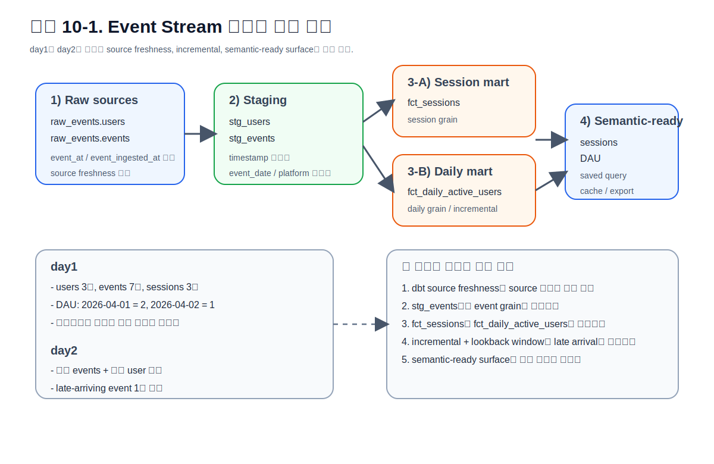
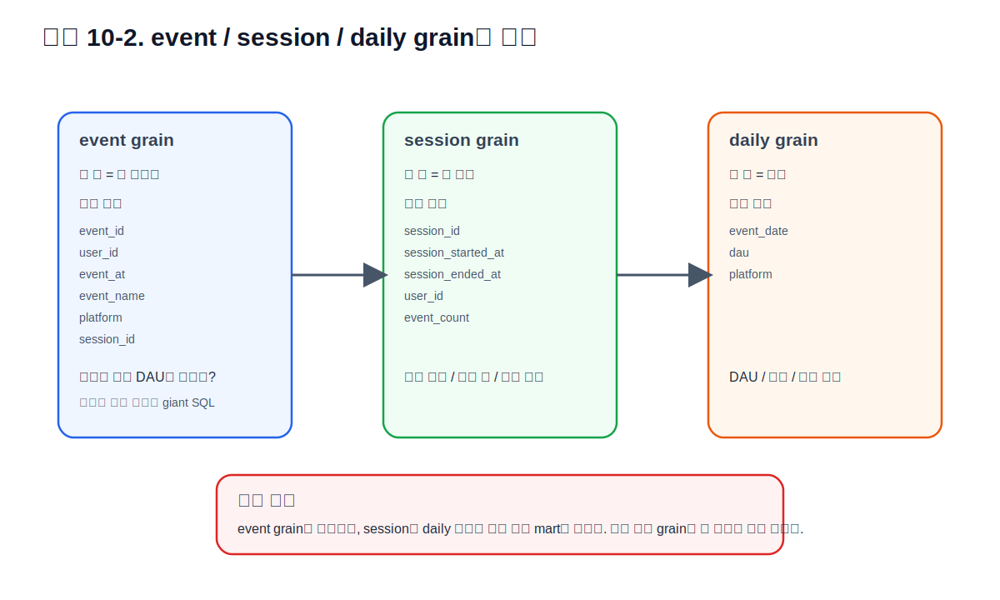
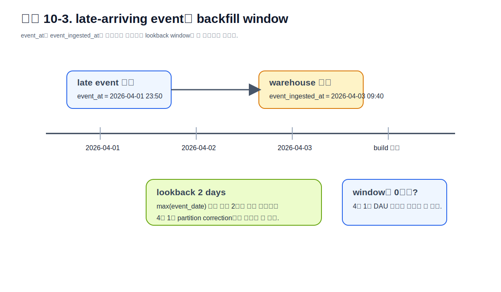

# CHAPTER 10 · Casebook II · Event Stream

> append-only 이벤트 데이터를 **event grain → session grain → daily grain**으로 확장하면서  
> incremental, late-arriving data, source freshness, semantic-ready 설계를 실제로 체험하는 장이다.  
> 이 장은 기능 목록을 나열하지 않는다. 먼저 이벤트 도메인의 전반 구조를 충분히 설명하고,  
> 그 다음에 우리 예제 안에서 그 구조가 어떻게 구체적인 모델과 운영 루틴으로 바뀌는지 따라간다.

Event Stream 예제는 `Retail Orders`와 성격이 다르다.  
주문 데이터는 비교적 명확한 주문 단위와 금액 집계가 중심이었다면, 이벤트 데이터는 다음 특성이 앞에 나온다.

1. 이벤트는 보통 **append-only**로 계속 쌓인다.
2. 질문의 grain이 자주 바뀐다.  
   이벤트 자체를 보고 싶을 때도 있고, 세션으로 묶고 싶을 때도 있고, 날짜 단위 활성 사용자(DAU)처럼 다시 집계하고 싶을 때도 있다.
3. **late-arriving data**가 흔하다.  
   실제 이벤트 발생 시각(`event_at`)과 웨어하우스에 들어온 시각(`event_ingested_at`)이 다를 수 있다.
4. 전체 재계산이 금방 비싸진다.  
   그래서 incremental, backfill window, state-aware run 같은 운영 장치가 빠르게 필요해진다.
5. 반복 질문이 많다.  
   sessions, DAU, platform별 active users, cohort/retention 류의 질문이 계속 반복되므로 semantic-ready 설계가 일찍부터 가치가 생긴다.

이 장의 목표는 단순히 이벤트 테이블을 하나 더 만드는 것이 아니다.  
이벤트 도메인에서 **왜 grain을 분리해야 하는지**, **왜 incremental을 서둘러 쓰면 안 되면서도 결국 필요해지는지**,  
**왜 source freshness와 semantic layer가 붙기 좋은지**를 하나의 사례 안에서 끝까지 보는 것이다.



## 10.1. 이 예제에서 무엇을 만들 것인가

이 장에서 우리가 만드는 핵심 리소스는 다음 네 덩어리다.

### 10.1.1. raw source
- `raw_events.users`
- `raw_events.events`

### 10.1.2. staging
- `stg_events`
- `stg_users`

### 10.1.3. marts
- `fct_sessions`
- `fct_daily_active_users`

### 10.1.4. semantic-ready surface
- session count
- daily active users
- platform / country 기준 반복 질의

이 구조는 “작은 예제라서 단순하게 만든 것”이 아니다.  
오히려 이벤트 도메인에서는 이렇게 나누지 않으면 곧바로 giant SQL이 되고,  
session 질문과 DAU 질문이 서로 섞이면서 fanout이나 잘못된 집계가 생기기 쉽다.

## 10.2. day1 / day2 시나리오를 먼저 이해하자

이 예제는 정적인 샘플 하나로 끝나지 않는다.  
**day1**과 **day2** 두 상태를 일부러 분리해 두었다.

### 10.2.1. day1
day1에는 안정된 초기 상태만 있다.

- 사용자 3명
- 이벤트 7건
- session 3개
- DAU는 2026-04-01과 2026-04-02 두 날짜만 계산됨

### 10.2.2. day2
day2에는 두 종류의 변화가 들어온다.

1. **정상적인 신규 이벤트**
   - 2026-04-03의 새 사용자/새 세션/새 이벤트

2. **늦게 도착한 이벤트**
   - 실제 `event_at`는 2026-04-01인데  
     `event_ingested_at`는 2026-04-03인 레코드  
   - 즉, 현재 날짜 파티션만 새로 보면 놓치게 되는 이벤트

이 late-arriving data가 왜 중요한지 이해해야 incremental의 의미가 분명해진다.  
이벤트 도메인에서 증분 모델이 어려운 이유는 “새 행만 보면 된다”가 아니라  
“**과거 파티션이 다시 바뀔 수 있다**”가 자주 사실이기 때문이다.

### 10.2.3. 이 장에서 끝까지 추적할 질문

이 장은 다음 질문을 계속 추적한다.

1. day1 기준 DAU는 얼마인가?
2. day2 적용 후 DAU는 어떻게 바뀌는가?
3. late-arriving event를 놓치지 않으려면 어떤 backfill window가 필요한가?
4. session grain과 daily grain은 왜 따로 계산해야 하는가?
5. 어떤 시점부터 semantic metric으로 올리는 것이 자연스러운가?

## 10.3. 이벤트 도메인에서 가장 먼저 잡아야 할 전반 구조

### 10.3.1. event grain은 기본 층이다
이벤트 원본의 가장 작은 단위는 보통 **event grain**이다.  
한 행이 한 이벤트를 뜻하고, `event_id`, `user_id`, `event_at`, `event_name`, `platform`, `session_id` 같은 컬럼이 붙는다.

이때 가장 흔한 실수는 이벤트 원본에서 바로 DAU나 sessions를 만들어 버리는 것이다.  
그렇게 하면 쿼리는 빨리 나와도, 질문이 하나만 바뀌어도 다시 원본에서 큰 집계를 반복해야 한다.

### 10.3.2. session grain은 첫 번째 재사용 계층이다
세션은 이벤트를 묶어 사용자 행동 흐름을 보는 grain이다.  
한 세션 안에는 여러 이벤트가 들어갈 수 있다.

- session start
- session end
- event count
- user id
- platform

이 grain은 세션 길이, 전환 수, 사용자 세션 수 같은 질문의 출발점이 된다.

### 10.3.3. daily grain은 질문용 집계 계층이다
DAU는 세션 grain과 다르다.  
하루 안에 사용자 한 명이 이벤트를 20번 발생시켜도 active user는 1명이다.

즉, DAU는 `event grain`도 아니고 `session grain`도 아니다.  
**daily grain**으로 다시 묶은 별도 집계 계층이다.



### 10.3.4. fanout이 왜 여기서 특히 위험한가
이벤트 도메인에서는 raw events 행 수가 가장 많고, session이나 user dimension과 조인이 매우 자주 발생한다.  
이때 잘못된 순서로 조인하고 다시 집계하면 다음 문제가 생긴다.

- 세션 수가 이벤트 수만큼 부풀려짐
- 사용자 수가 이벤트 수 기준으로 중복 집계됨
- 기간별 비용 계산이 실제보다 커짐

그래서 이 장에서는 다음 원칙을 고정한다.

1. **staging에서는 event grain을 보존한다.**
2. session 질문은 `fct_sessions`에서 푼다.
3. DAU 질문은 `fct_daily_active_users`에서 푼다.
4. 서로 다른 grain을 한 모델에서 한 번에 해결하려 하지 않는다.

## 10.4. source와 freshness는 왜 이 예제에서 더 중요해지는가

이벤트 예제에서는 source freshness가 단순한 부가 기능이 아니다.  
이유는 명확하다. 이벤트 데이터는 자주 들어오고, 지연 적재도 흔하기 때문이다.  
따라서 “모델이 잘 만들어졌는가”만큼이나 “소스가 제때 들어오고 있는가”를 확인해야 한다.

이 장에서는 `raw_events.events`에 freshness를 붙인다.

- `loaded_at_field = event_ingested_at`
- `warn_after = 6 hours`
- `error_after = 24 hours`

핵심은 `event_at`가 아니라 `event_ingested_at`를 freshness 기준으로 본다는 점이다.  
실제 발생 시각은 과거일 수 있지만, warehouse로 들어온 시각은 지금이기 때문이다.  
이 구분을 놓치면 늦게 도착한 데이터가 “낡은 데이터”처럼 오해될 수 있다.

### 10.4.1. 왜 `sources.yml`이 중요한가
이벤트 도메인에서 테이블명을 직접 쓰면 당장은 빠르다.  
하지만 다음 순간부터 문제가 생긴다.

- `raw_events.events`가 다른 catalog/schema로 바뀌면 모델을 다 찾아서 수정해야 한다.
- docs lineage에 source node가 보이지 않는다.
- freshness를 테이블 단위로 붙이기 어렵다.
- selector에서 `source:raw_events.events+` 같은 흐름을 쓰기 어렵다.

따라서 이 장에서는 source를 먼저 선언하고 그 위에서 modeling을 시작한다.

코드:
- [`events_sources.yml`](../codes/04_chapter_snippets/ch10/events_sources.yml)

### 10.4.2. 이 장에서 실제로 확인할 명령
```bash
dbt source freshness --select source:raw_events.events
dbt build --select source:raw_events.events+
```

`dbt source freshness`를 돌리면 `target/sources.json`이 생성된다.  
이 artifact는 이후 state-aware selector와 문제 분석에도 쓸 수 있다.  
이 예제는 data modeling 장이지만, 동시에 **운영 감각을 같이 익히는 casebook**이어야 한다.

## 10.5. staging: 이벤트를 질문 가능한 형태로 표준화하기

staging의 목표는 작다.  
이벤트 원본을 **질문 가능한 표준 형태**로 만들 뿐이다.

이 장의 `stg_events`에서는 다음만 한다.

1. `event_at`와 `event_ingested_at`를 timestamp로 정리
2. `event_date` 파생
3. `event_name`, `platform` 문자열 표준화
4. `session_id`가 비어 있으면 안전한 대체 로직 적용
5. downstream에서 반복 사용할 컬럼만 남김

이 단계에서 session 집계나 DAU 집계를 하지 않는 이유는 명확하다.  
이 두 질문은 서로 다른 grain을 요구하기 때문이다.

코드:
- [`stg_events.sql`](../codes/04_chapter_snippets/ch10/stg_events.sql)
- [`events_properties.yml`](../codes/04_chapter_snippets/ch10/events_properties.yml)

### 10.5.1. staging에서 꼭 붙일 테스트
이벤트 도메인에서 최소한 다음 테스트는 빠지면 안 된다.

- `event_id`: `not_null`, `unique`
- `user_id`: `not_null`
- `event_name`: `accepted_values`
- `platform`: `accepted_values`

추가로 singular test를 하나 두는 것도 좋다.  
예를 들면 “`event_ingested_at`가 `event_at`보다 너무 과거일 수는 없다” 같은 규칙이다.

코드:
- [`assert_event_time_not_future.sql`](../codes/04_chapter_snippets/ch10/assert_event_time_not_future.sql)

## 10.6. marts: session grain과 daily grain을 따로 만든다

### 10.6.1. `fct_sessions`
이 모델은 session grain을 만든다.

한 세션당 한 행이 나오고, 다음 질문을 받기 쉽게 만든다.

- 세션 길이
- 세션당 이벤트 수
- 사용자별 세션 수
- platform별 세션 수

코드:
- [`fct_sessions.sql`](../codes/04_chapter_snippets/ch10/fct_sessions.sql)

### 10.6.2. `fct_daily_active_users`
이 모델은 날짜 grain을 만든다.

한 날짜당 한 행이 나오고, DAU와 같은 반복 질문의 기초가 된다.  
여기서는 `count(distinct user_id)`가 핵심이다.

중요한 점은 이 모델이 **incremental**이라는 점이다.  
이벤트가 계속 들어오고, 날짜 집계는 매일 다시 계산되기 때문이다.

코드:
- [`fct_daily_active_users.sql`](../codes/04_chapter_snippets/ch10/fct_daily_active_users.sql)

### 10.6.3. 왜 두 모델을 합치지 않는가
둘 다 events에서 시작하니 한 모델에 넣고 싶어질 수 있다.  
하지만 그렇게 하면 질문과 grain이 섞인다.

- session 수를 보고 싶은가?
- active user 수를 보고 싶은가?
- platform/session 조합을 보고 싶은가?
- 날짜별 추세를 보고 싶은가?

이 질문들은 모두 다르다.  
그래서 이 장은 “한 raw → 여러 mart” 구조를 일부러 드러낸다.

## 10.7. incremental, lookback, late-arriving data

Event Stream 예제의 핵심은 여기다.  
주문 예제에서는 incremental이 성능 최적화의 성격이 강했다면,  
이벤트 예제에서는 incremental이 거의 **기본 설계 요소**가 된다.

### 10.7.1. 왜 전체 재계산이 금방 비싸지는가
이벤트는 매일 늘어난다.  
전체 raw events를 매일 다시 읽어서 daily aggregate를 만들면 처음엔 괜찮아 보여도 곧 비용과 시간이 커진다.

### 10.7.2. 그렇다고 새 날짜만 보면 안 되는 이유
late-arriving event 때문이다.  
day2에 들어온 레코드가 실제로는 day1 날짜에 속할 수 있다.  
즉, 가장 최근 날짜만 다시 계산하면 과거 날짜 집계가 틀릴 수 있다.

이 예제에서는 일부러 이런 상황을 만든다.

- `event_at = 2026-04-01 23:50:00`
- `event_ingested_at = 2026-04-03 09:40:00`

이벤트는 4월 1일 활동으로 집계돼야 하지만, 웨어하우스에는 4월 3일에 들어왔다.  
그래서 DAU를 올바르게 계산하려면 최근 파티션 몇 개를 함께 다시 봐야 한다.



### 10.7.3. 이 장의 기본 전략: lookback 2 days
이 장의 canonical runnable path는 DuckDB 기준으로 `lookback 2 days`를 사용한다.  
즉, `max(event_date)`만 다시 보는 것이 아니라 그 이전 2일까지 함께 다시 읽는다.

이 방식은 다음 장점이 있다.

- late-arriving correction을 흡수할 수 있다.
- microbatch를 도입하기 전에도 충분히 단순하다.
- 코드를 읽는 초보자가 incremental의 의미를 이해하기 쉽다.

### 10.7.4. microbatch는 언제 고려하는가
microbatch는 time-series 데이터에서 큰 테이블을 batch 단위로 처리하는 전략이다.  
이 장에서는 개념을 소개하고 예시 파일을 함께 주지만, **첫 runnable path의 기본값으로 강요하지는 않는다**.

왜냐하면 먼저 명확해야 하는 것이 따로 있기 때문이다.

1. event grain이 안정적인가
2. late-arriving window가 정의되었는가
3. `event_time` 컬럼이 분명한가
4. batch 순서를 병렬로 돌려도 되는가

코드:
- [`fct_events_microbatch.sql`](../codes/04_chapter_snippets/ch10/fct_events_microbatch.sql)

### 10.7.5. `concurrent_batches=false`가 필요한 경우
누적 계산이나 batch 순서에 민감한 로직은 병렬 batch 실행이 오히려 위험할 수 있다.  
세션화 자체는 보통 upstream 정렬 로직과 window 정의가 더 중요하지만,  
cumulative metric이나 ordering-sensitive logic이 섞이면 `concurrent_batches=false`를 고려해야 한다.

## 10.8. 이 예제를 semantic-ready surface로 키우는 법

이벤트 도메인은 semantic layer의 가치가 빨리 드러나는 쪽이다.  
세션 수, DAU, platform별 active users, country별 sessions 같은 질문이 반복되기 때문이다.

여기서 중요한 점은 semantic layer가 marts를 대체하는 것이 아니라는 점이다.  
오히려 잘 만든 marts가 있어야 semantic model이 깔끔해진다.

### 10.8.1. 먼저 공용 fact를 안정화한다
이 장에서는 다음 두 개를 semantic-ready surface의 출발점으로 본다.

- `fct_sessions`
- `fct_daily_active_users`

### 10.8.2. 그 다음 semantic model과 metric을 붙인다
가장 먼저 붙이기 좋은 metric은 다음 두 개다.

- total sessions
- daily active users

코드:
- [`event_metrics.yml`](../codes/04_chapter_snippets/ch10/event_metrics.yml)

### 10.8.3. saved query는 언제 가치가 커지는가
아래 질문이 반복되기 시작하면 saved query가 바로 가치가 생긴다.

- 일자별 sessions
- 일자 × platform별 sessions
- 일자별 DAU
- 국가별 active users 추세

코드:
- [`saved_queries.yml`](../codes/04_chapter_snippets/ch10/saved_queries.yml)

## 10.9. day1 / day2를 실제로 어떻게 시험할 것인가

### 10.9.1. day1 루틴
1. bootstrap SQL 실행
2. `dbt source freshness --select source:raw_events.events`
3. `dbt build --select events`
4. `dbt show --select fct_daily_active_users`
5. expected CSV와 비교

코드:
- [`day1_bootstrap_excerpt.sql`](../codes/04_chapter_snippets/ch10/day1_bootstrap_excerpt.sql)
- [`runbook_event_stream.sh`](../codes/04_chapter_snippets/ch10/runbook_event_stream.sh)
- [`expected_dau_day1.csv`](../codes/04_chapter_snippets/ch10/expected_dau_day1.csv)

### 10.9.2. day2 루틴
1. day2 SQL 적용
2. late-arriving event가 실제로 어느 날짜에 속하는지 확인
3. `dbt build --select fct_daily_active_users+`
4. 결과가 과거 날짜까지 보정되는지 확인
5. 필요하면 lookback window를 조정

코드:
- [`apply_day2_late_arrival.sql`](../codes/04_chapter_snippets/ch10/apply_day2_late_arrival.sql)
- [`expected_dau_day2.csv`](../codes/04_chapter_snippets/ch10/expected_dau_day2.csv)

### 10.9.3. state-aware 운영 감각까지 연결하기
이 장은 casebook이지만 운영 감각도 같이 익힌다.

```bash
dbt source freshness --select source:raw_events.events
dbt build --select "source_status:fresher+" --state target
```

이 루틴은 “소스가 갱신된 경우에만 downstream을 다시 빌드하고 싶다”는 요구와 맞닿아 있다.  
즉, Event Stream 예제는 modeling 예제이면서 동시에 **운영 장치가 왜 필요한지 설명하는 예제**이기도 하다.

## 10.10. 플랫폼으로 넘길 때의 생각법

이 장의 본문은 DuckDB 기준 runnable path를 중심으로 설명하지만,  
이 예제는 뒤쪽 플랫폼 플레이북으로 자연스럽게 이어진다.

### 10.10.1. BigQuery
이벤트 도메인에서는 날짜 기준 partitioning과 clustering이 거의 필수에 가깝다.  
전체 재계산을 줄이지 않으면 비용이 빠르게 커진다.

### 10.10.2. ClickHouse
session / DAU는 ClickHouse가 강한 문제이지만, 그만큼 `ORDER BY`, `PARTITION BY`, engine 선택이 중요해진다.  
microbatch나 append-only 운영도 더 적극적으로 고려하게 된다.

### 10.10.3. Snowflake
warehouse 크기와 실행 전략이 곧 비용 통제가 된다.  
전체 refresh보다 incremental과 selector 통제가 중요하다.

### 10.10.4. Trino
source freshness와 incremental 설계는 가능하지만, 실제 성능과 쓰기 전략은 connector / catalog 성격에 크게 영향을 받는다.  
특히 Iceberg와 함께 쓸 때는 운영 배치 감각이 중요하다.

이 장의 본문은 플랫폼별 비교표를 반복하지 않는다.  
대신 여기서 만든 개념을 뒤쪽 플레이북이 받아서 “실제 플랫폼에서 어떻게 달라지는가”를 이어 받는다.

## 10.11. 이 장에서 반드시 피해야 할 안티패턴

1. **raw events에서 바로 DAU를 만들기**  
   → session, retention, platform 분석으로 확장하기 어려워진다.

2. **event grain과 daily grain을 같은 모델에 섞기**  
   → 질문이 바뀔수록 giant SQL이 된다.

3. **late-arriving data를 무시한 incremental**  
   → 과거 날짜 집계가 quietly wrong 상태가 된다.

4. **microbatch를 먼저 도입하기**  
   → grain과 event_time 계약이 불안정하면 문제를 더 복잡하게 만든다.

5. **freshness를 event_at 기준으로 보기**  
   → 실제 적재 상태를 잘못 해석할 수 있다.

## 10.12. 직접 해보기

### 10.12.1. 미션 A
day1만 적재한 뒤 `fct_daily_active_users`를 만들고 expected CSV와 비교하라.

### 10.12.2. 미션 B
day2를 적용한 뒤 late-arriving event 때문에 어떤 날짜의 DAU가 바뀌는지 확인하라.

### 10.12.3. 미션 C
`events_dau_lookback_days`를 0, 1, 2로 바꿔 보면서 어떤 결과 차이가 생기는지 확인하라.

### 10.12.4. 미션 D
`saved_queries.yml`을 읽고 “일자 × platform별 sessions” 같은 반복 질문을 semantic-ready surface로 올릴 수 있는지 검토하라.

## 10.13. 이 장의 체크리스트

다음 항목을 설명할 수 있으면 이 장을 제대로 이해한 것이다.

- 왜 이벤트 도메인에서는 grain 분리가 더 중요한가?
- 왜 `fct_sessions`와 `fct_daily_active_users`를 따로 두는가?
- 왜 `event_at`와 `event_ingested_at`를 구분하는가?
- 왜 source freshness를 `loaded_at_field` 기준으로 잡는가?
- 왜 incremental에 lookback window가 필요한가?
- 왜 microbatch는 나중에 붙여도 되는가?
- 왜 semantic-ready surface는 marts 위에서 시작하는가?

---

## 이 장에서 함께 보는 파일

### Chapter file
- `chapters/ch10_casebook-ii-event-stream.md`

### Images
- `chapters/images/ch10_event-stream-casebook-flow.svg`
- `chapters/images/ch10_event-grain-map.svg`
- `chapters/images/ch10_late-arrival-window.svg`

### Code snippets
- `codes/04_chapter_snippets/ch10/events_sources.yml`
- `codes/04_chapter_snippets/ch10/events_properties.yml`
- `codes/04_chapter_snippets/ch10/stg_events.sql`
- `codes/04_chapter_snippets/ch10/fct_sessions.sql`
- `codes/04_chapter_snippets/ch10/fct_daily_active_users.sql`
- `codes/04_chapter_snippets/ch10/fct_events_microbatch.sql`
- `codes/04_chapter_snippets/ch10/event_metrics.yml`
- `codes/04_chapter_snippets/ch10/saved_queries.yml`
- `codes/04_chapter_snippets/ch10/day1_bootstrap_excerpt.sql`
- `codes/04_chapter_snippets/ch10/apply_day2_late_arrival.sql`
- `codes/04_chapter_snippets/ch10/assert_event_time_not_future.sql`
- `codes/04_chapter_snippets/ch10/runbook_event_stream.sh`
- `codes/04_chapter_snippets/ch10/expected_dau_day1.csv`
- `codes/04_chapter_snippets/ch10/expected_dau_day2.csv`
