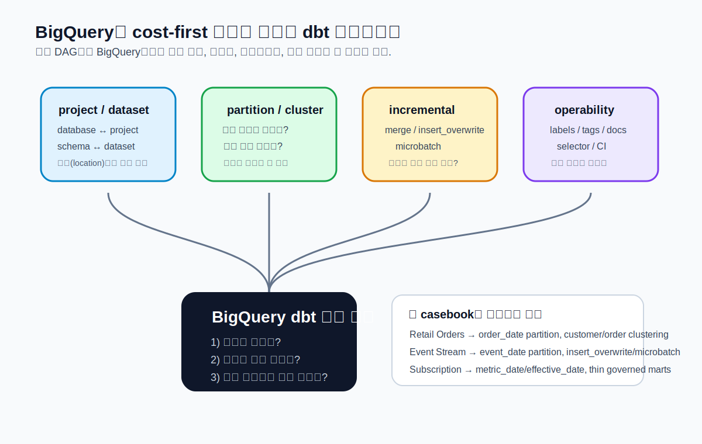
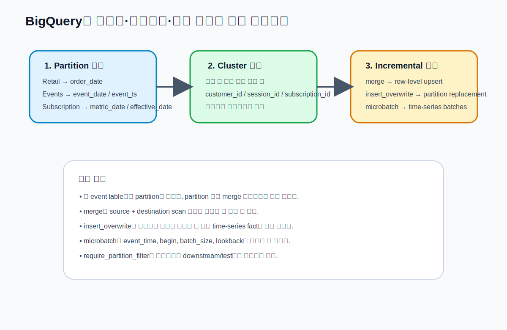
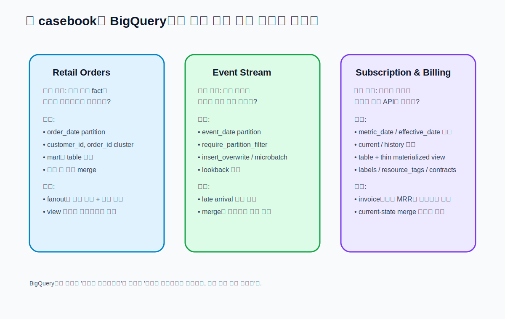

# CHAPTER 15 · Platform Playbook · BigQuery

BigQuery는 이 책에서 가장 중요한 **관리형 DW 플레이북**이다.  
DuckDB가 개념을 빠르게 익히는 기준 플랫폼이라면, BigQuery는 같은 개념이 **비용·파티션·클러스터링·실행 범위**와 직접 연결되는 운영 플랫폼이다.  
즉, BigQuery에서는 “dbt로 만들 수 있는가?”보다 먼저 “얼마를 다시 읽고, 얼마를 다시 쓰는가?”를 묻게 된다.



## 15.1. 왜 BigQuery를 별도 플레이북으로 다뤄야 하는가

BigQuery는 서버리스 DW다. 서버를 직접 관리하지 않아도 되기 때문에 시작은 빠르지만, 그만큼 모델 설계가 **스캔 비용과 바로 연결**된다.  
같은 `source()`, `ref()`, `incremental`, `snapshot`이라도 BigQuery에서는 아래 질문이 먼저 나온다.

1. 이 모델은 어느 **dataset**에 써야 하는가  
2. 어떤 컬럼으로 **partition**할 것인가  
3. 어떤 컬럼으로 **cluster**할 것인가  
4. 이 모델은 `merge`가 맞는가, `insert_overwrite`가 맞는가  
5. 개발 중 매번 전체를 빌드하면 얼마를 다시 스캔하는가  
6. 이 테이블은 `require_partition_filter`를 켜야 하는가  
7. 운영 메타데이터를 `labels`와 `resource_tags`로 어떻게 남길 것인가  

dbt 문서도 BigQuery에서 `schema`는 `dataset`, `database`는 `project` 개념과 대응된다고 설명하고, `partition_by`, `cluster_by`, `require_partition_filter`, `partition_expiration_days`, `insert_overwrite`, `copy_partitions`, `labels`, `resource_tags`, `materialized_view` 같은 BigQuery 전용 surface를 별도 설정으로 다룬다.  
즉, BigQuery 플레이북은 단순 연결법이 아니라 **비용을 포함한 데이터 제품 설계법**이다.

### 15.1.1. BigQuery가 특히 잘 맞는 경우

- append-only 또는 near-append에 가까운 이벤트 데이터
- 일/월 단위 파티션을 명확히 설계할 수 있는 사실 테이블
- 여러 팀이 공용 dataset을 안전하게 나눠 쓰는 환경
- semantic-ready mart와 governed API를 공유해야 하는 환경
- batch와 ad-hoc 조회가 동시에 많은 조직

### 15.1.2. BigQuery에서 특히 먼저 주의해야 하는 경우

- 파티션 기준이 아직 합의되지 않은 대형 테이블
- late-arriving data가 많지만 lookback/window 설계가 없는 이벤트 파이프라인
- `merge`를 무조건 기본값처럼 쓰는 습관
- 테스트나 downstream 모델이 partition filter 없이 넓게 테이블을 읽는 구조
- 개발 환경에서 production-sized dataset을 그대로 전체 스캔하는 작업 방식

---

## 15.2. BigQuery에서 먼저 잡아야 하는 정신 모델

### 15.2.1. project / dataset / location

BigQuery에서는 보통 다음처럼 생각하면 가장 덜 헷갈린다.

- **project** = dbt 문서의 `database`와 대응
- **dataset** = dbt 문서의 `schema`와 대응
- **location** = 작업이 실제로 수행되는 지역
- **table / view / materialized view** = relation의 물리 형태

따라서 `profiles.yml`에서 `project`와 `dataset`을 분리해 생각해야 하고, 한 프로젝트 안에 `raw`, `staging`, `analytics`, `sandbox` dataset을 나누는 방식이 흔하다.

### 15.2.2. BigQuery에서는 쿼리 성능 = 비용 감각이다

BigQuery에서는 웨어하우스 크기를 키워 해결하는 대신, 아래 다섯 축으로 비용과 성능을 함께 잡는다.

1. **partition pruning**
2. **clustering**
3. **incremental strategy**
4. **selector 범위 최소화**
5. **dataset / table lifecycle 관리**

이 중 첫 번째가 제일 중요하다.  
dbt 문서도 partition pruning은 **literal value**로 파티션을 필터링할 때 가장 잘 작동한다고 설명한다.  
즉, 파티션이 있어도 `where event_date in (select ...)`처럼 우회하면 기대한 만큼 비용이 줄지 않을 수 있다.

### 15.2.3. BigQuery에서 “좋은 모델”의 기준

BigQuery에서 좋은 모델은 SQL이 짧은 모델이 아니라 아래를 만족하는 모델이다.

- 읽는 범위가 좁다
- 쓰는 범위가 예측 가능하다
- 파티션 기준이 명확하다
- late-arriving data 처리 방식이 문서화돼 있다
- downstream 팀이 잘못된 전체 스캔을 하기 어렵다
- labels / tags / comments로 운영 흔적이 남는다

---

## 15.3. 연결, 인증, 첫 실행

### 15.3.1. 가장 기본적인 profile

아래 스니펫 파일을 함께 제공한다.

- [`profiles.bigquery.example.yml`](../codes/04_chapter_snippets/ch15/profiles.bigquery.example.yml)
- [`bigquery_preflight.sh`](../codes/04_chapter_snippets/ch15/bigquery_preflight.sh)

```yaml
my_bigquery:
  target: dev
  outputs:
    dev:
      type: bigquery
      method: service-account
      project: my-gcp-project
      dataset: analytics_dev
      keyfile: /path/to/keyfile.json
      location: asia-northeast3
      threads: 4
      priority: interactive
      retries: 1
      job_execution_timeout_seconds: 300
```

실무에서는 `method: oauth`로 로컬 개발을 시작하고, CI/배포 환경에서는 `service-account`로 전환하는 경우도 흔하다.  
다만 책의 기준선은 **service account 기반 reproducible profile**로 두는 편이 안정적이다.

### 15.3.2. 첫 실행 전에 반드시 확인할 것

1. 프로젝트 ID와 dataset 이름이 맞는가  
2. keyfile 경로가 맞는가  
3. location이 실제 dataset location과 일치하는가  
4. `dbt debug`가 통과하는가  
5. `bq ls`로 dataset이 보이는가  
6. `dbt run -s model_name` 대신 먼저 `dbt ls -s model_name`가 의도한 노드를 가리키는가

### 15.3.3. location mismatch는 자주 나는 초기 오류다

BigQuery는 region / multi-region 개념이 있기 때문에, profile의 `location`과 dataset 실제 위치가 다르면 예상치 못한 오류가 난다.  
책에서는 이걸 “연결 오류”가 아니라 **환경 설계 오류**로 구분해 다룬다.

---

## 15.4. BigQuery에서 테이블 설계를 시작하는 기준



### 15.4.1. partition_by

BigQuery는 `partition_by`를 통해 date / datetime / timestamp / int64 기준으로 파티션을 만들 수 있다.

```sql
{{ config(
    materialized='table',
    partition_by={
      "field": "order_date",
      "data_type": "date",
      "granularity": "day"
    }
) }}

select * from {{ ref('stg_orders') }}
```

이 장에서 가장 중요한 규칙은 단순하다.

- **Retail Orders**: `order_date`
- **Event Stream**: `event_date` 또는 `event_ts`
- **Subscription & Billing**: `metric_date`, `invoice_date`, `effective_date`

파티션 키는 “가장 자주 묻는 날짜”와 “가장 자주 재처리하는 날짜”가 겹치는 편이 좋다.

### 15.4.2. require_partition_filter

BigQuery에서는 `require_partition_filter=true`를 켜면 파티션 필터 없이 조회가 실패한다.  
대형 event 테이블에서는 매우 유용하지만, dbt 문서도 이 설정이 **다른 dbt 모델이나 테스트에도 영향**을 준다고 설명한다.  
따라서 다음 기준으로 생각하면 좋다.

켜기 좋은 경우:
- 사실 테이블이 매우 크다
- 조회 패턴이 날짜 필터 중심이다
- BI/adhoc 사용자에게 전체 스캔을 강하게 막고 싶다

조심할 경우:
- downstream 모델이나 테스트가 아직 partition-aware하지 않다
- prototype 단계라 전체 조회가 자주 필요하다

### 15.4.3. cluster_by

클러스터링은 파티션 안에서 관련 데이터를 가까이 모아 주는 장치다.  
Retail Orders에서는 `customer_id`, `order_id`, Event Stream에서는 `user_id`, `session_id`, Subscription에서는 `account_id`, `subscription_id`가 흔한 후보가 된다.

클러스터링은 파티션을 대체하지 않는다.  
보통은 **partition 먼저, cluster는 그 다음**이다.

### 15.4.4. partition_expiration_days와 hours_to_expiration

BigQuery는 partition expiration이나 table expiration을 둘 수 있다.  
이건 임시 중간 모델, short-lived aggregate, 검증용 테이블에 특히 유용하다.

예:
- raw-like temporary landing table: 짧은 만료
- QA용 intermediate table: 몇 시간 후 만료
- semantic-ready mart: 만료 없음

---

## 15.5. materialization 선택 기준

### 15.5.1. view

BigQuery view는 빠르게 정의를 바꾸기 좋지만, 읽을 때마다 원본을 다시 읽는다.  
소규모 staging이나 lightweight logic에는 괜찮지만, 큰 event source 위에 두꺼운 view를 여러 겹 얹으면 비용이 금방 커진다.

### 15.5.2. table

table은 비용을 “쓰기 시점”으로 당겨서 이후 조회를 안정화한다.  
Retail Orders의 `fct_orders`, Subscription의 `fct_mrr` 같은 mart는 대개 table이 더 안정적이다.

### 15.5.3. incremental + merge

`merge`는 BigQuery의 기본 incremental 전략이지만, dbt 문서도 이 방식은 **모델 SQL이 읽는 source와 destination을 모두 스캔**하므로 데이터가 커질수록 느리고 비싸질 수 있다고 설명한다.  
즉, “변경 row를 업데이트하니 무조건 효율적”이라고 생각하면 안 된다.

`merge`가 잘 맞는 경우:
- 변경된 행이 비교적 적다
- `unique_key`가 명확하다
- destination table 크기가 아직 충분히 관리 가능하다
- 복잡한 파티션 교체보다 row-level upsert가 자연스럽다

### 15.5.4. incremental + insert_overwrite

BigQuery에서 대형 time-series 테이블은 `insert_overwrite`가 자주 더 좋다.  
이 전략은 전체 row를 비교하는 대신 **파티션 단위로 교체**한다.  
단, 파티션이 반드시 정의되어 있어야 하고, 어떤 파티션을 교체할지 모델이 분명해야 한다.

Event Stream은 이 전략이 가장 BigQuery다운 예시다.

### 15.5.5. microbatch

dbt 문서는 microbatch를 큰 time-series 데이터셋을 효율적으로 처리하는 incremental 전략으로 설명하고, BigQuery adapter에서는 내부적으로 `insert_overwrite`를 사용한다고 안내한다.  
BigQuery에서 microbatch를 쓰려면 `partition_by`가 필요하고, `event_time`, `begin`, `batch_size`, `lookback`을 명시해야 한다.

```sql
{{ config(
    materialized='incremental',
    incremental_strategy='microbatch',
    event_time='event_ts',
    begin='2026-01-01',
    batch_size='day',
    lookback=2,
    full_refresh=false,
    partition_by={
      "field": "event_date",
      "data_type": "date",
      "granularity": "day"
    }
) }}

select *
from {{ ref('stg_events') }}
```

### 15.5.6. materialized_view

BigQuery는 `materialized_view`도 지원한다.  
반복 조회가 많고 SQL이 상대적으로 안정적인 집계 surface에는 좋지만, 모든 로직을 materialized view로 해결하려 하면 관리가 어려워진다.  
Subscription & Billing에서는 `daily_mrr_summary`처럼 읽기 중심의 얇은 집계면에 더 잘 맞는다.

---

## 15.6. BigQuery에서 운영 메타데이터를 남기는 방법

### 15.6.1. labels

labels는 테이블/뷰에 도메인, 소유 팀, 민감도 같은 메타데이터를 남기는 좋은 방법이다.

```sql
{{ config(
    materialized='table',
    labels={
      'domain': 'finance',
      'contains_pii': 'yes'
    }
) }}
```

### 15.6.2. query comment + job labels

dbt 문서는 query comment를 통해 BigQuery job에 labels를 붙일 수 있다고 설명한다.  
이건 비용 추적, job 분류, dbt 메타데이터 연결에 매우 유용하다.

관련 스니펫:
- [`query_comment.sql`](../codes/04_chapter_snippets/ch15/query_comment.sql)
- [`dbt_project.bigquery_labels.yml`](../codes/04_chapter_snippets/ch15/dbt_project.bigquery_labels.yml)

### 15.6.3. resource_tags

`resource_tags`는 labels보다 더 governance 쪽에 가깝다.  
IAM 정책과 연결되는 태그이므로, 대형 조직에서는 “production / sensitive / restricted” 같은 통제축에 붙이기 좋다.

---

## 15.7. BigQuery에서 Python model을 볼 때의 기준

BigQuery는 Python model 실행 표면도 제공하지만, 이 장에서 중요한 건 “쓸 수 있다”보다 **어디에 맞는가**다.

- SQL이 더 자연스러운 집계면: SQL로 유지
- ML feature engineering이나 Python 라이브러리 의존성이 큰 경우: Python 고려
- Dataproc / BigFrames / serverless 같은 execution surface는 추가 운영 요소가 붙으므로, 책의 기본선은 여전히 SQL 중심

즉, BigQuery는 Python을 지원하지만, 플레이북의 기본선은 **partition-aware SQL modeling**이다.

---

## 15.8. 세 casebook를 BigQuery에서 어떻게 운영할 것인가



## 15.8.1. Retail Orders

Retail Orders는 BigQuery에서 가장 이해하기 쉬운 casebook다.

추천 기준:
- raw / staging: 가볍게, 불필요한 중복 view 피하기
- `fct_orders`: `order_date`로 partition
- `cluster_by`: `customer_id`, `order_id`
- `merge`보다 table + 좁은 rebuild 또는 작은 merge부터 시작
- semantic-ready mart는 너무 일찍 넓히지 말고 `gross_revenue`, `item_count`, `order_count` 중심으로 시작

여기서 핵심은 **fanout을 BigQuery 비용 문제로도 읽는 감각**이다.  
잘못된 join 하나는 숫자만 틀리는 게 아니라, 읽는 양도 늘리고 downstream 비용도 키운다.

## 15.8.2. Event Stream

Event Stream은 BigQuery와 가장 잘 맞는 casebook다.

추천 기준:
- raw events는 `event_date` partition이 사실상 기본
- `require_partition_filter=true` 적극 검토
- session / daily aggregate는 `insert_overwrite` 또는 `microbatch`
- late-arriving data는 `lookback` 기준을 명시
- saved query나 semantic surface로 자주 묻는 질문을 좁게 묶기

여기서 BigQuery다운 감각은 단순하다.  
**한 번의 이벤트 쿼리가 며칠치만 읽도록 설계하라.**

## 15.8.3. Subscription & Billing

Subscription 도메인은 append-only가 아니므로 BigQuery에서 설계가 조금 더 섬세해야 한다.

추천 기준:
- subscription current state와 history를 분리
- snapshot/history는 `effective_date`나 `snapshot_date` 기준으로 파티션을 생각
- `fct_mrr`는 일 단위 mart + semantic-ready surface
- 변동 잦은 current-state 테이블은 무거운 merge를 피할 수 있는 구조를 먼저 생각
- 재무 질의용 얇은 materialized view는 좋은 선택이 될 수 있음

여기서는 “BigQuery는 이벤트엔 강하지만, 상태 모델링은 설계가 더 중요하다”는 감각을 익히면 된다.

---

## 15.9. BigQuery에서 자주 나오는 실패 패턴

### 15.9.1. 파티션 없는 대형 이벤트 테이블

증상:
- 처음엔 돌아가지만 점점 느리고 비싸짐
- 테스트와 문서 생성도 부담스러워짐

원인:
- `event_date`나 `created_at` 기준이 있는데도 partition이 없음

대응:
- 먼저 staging 또는 intermediate부터 partition candidate를 명확히 드러냄
- mart에서 억지로 해결하려 하지 말고 upstream grain부터 다시 본다

### 15.9.2. `merge`를 모든 incremental의 기본값처럼 쓰기

증상:
- row-level upsert는 되지만 빌드 시간이 계속 늘어남
- destination scan 비용이 커짐

대응:
- time-series면 `insert_overwrite` 또는 `microbatch` 검토
- 변경 패턴이 truly row-level인지 확인
- cluster_by와 partition_by를 같이 다시 본다

### 15.9.3. `require_partition_filter`만 켜고 downstream은 안 고치기

증상:
- BI나 downstream dbt 모델에서 조회 실패
- 테스트가 예상보다 자주 깨짐

대응:
- partition-aware selector와 테스트를 함께 설계
- 거대한 public mart에서만 이 옵션을 먼저 사용

### 15.9.4. location을 신경 쓰지 않고 dataset을 섞기

증상:
- 실행 오류
- 환경마다 다르게 깨짐

대응:
- dev/staging/prod dataset의 location을 문서화
- profile 템플릿에서 location을 명시
- 팀 공통 bootstrap 스크립트에 dataset create 규칙을 넣기

### 15.9.5. full scan을 만드는 테스트

증상:
- 모델은 빨리 끝나는데 test가 느림
- 비용이 테스트에 숨어 있음

대응:
- singular test SQL도 partition filter를 의식
- 필요한 경우 최근 N일 범위로 테스트를 제한
- casebook 단계에서부터 테스트 grain을 명시

---

## 15.10. BigQuery에서의 runbook

### 15.10.1. 첫 연결

```bash
dbt debug
dbt ls -s stg_orders
dbt run -s stg_orders
dbt test -s stg_orders
```

### 15.10.2. Retail Orders 첫 루프

```bash
dbt seed
dbt run -s stg_orders+ 
dbt test -s fct_orders
dbt docs generate
```

### 15.10.3. Event Stream 대형 루프

```bash
dbt build -s stg_events+
dbt run -s fct_events_daily
dbt run -s fct_events_daily --full-refresh --event-time-start "2026-04-01" --event-time-end "2026-04-07"
dbt retry
```

### 15.10.4. Subscription & Billing 운영 루프

```bash
dbt build -s snapshot_subscriptions+
dbt run -s fct_mrr
dbt test -s fct_mrr
```

---

## 15.11. 이 장에서 기억할 핵심 기준

1. BigQuery에서는 설계가 곧 비용이다  
2. `project`와 `dataset`을 명확히 분리해 생각한다  
3. 대형 사실 테이블은 partition 기준부터 정한다  
4. `merge`는 기본값일 뿐, 항상 최선은 아니다  
5. Event Stream은 BigQuery에서 `insert_overwrite`/`microbatch`가 특히 강하다  
6. `require_partition_filter`는 강력하지만 downstream까지 고려해야 한다  
7. labels / resource_tags / query comments로 운영 흔적을 남긴다  
8. 세 casebook를 BigQuery에 올릴 때는 “SQL이 돌아간다”보다 “얼마를 다시 읽는가”를 먼저 본다

---

## 15.12. 직접 해보기

### 15.12.1. Retail Orders
- `fct_orders`를 `order_date` 기준 partitioned table로 바꿔본다
- `cluster_by=['customer_id', 'order_id']`를 추가해 본다
- 같은 쿼리를 전체 스캔 버전과 비교해 본다

### 15.12.2. Event Stream
- `fct_events_daily`를 `insert_overwrite`로 바꿔본다
- `require_partition_filter=true`를 켜고 downstream 쿼리가 어떻게 달라지는지 본다
- `lookback=2`와 `lookback=7`을 비교해 본다

### 15.12.3. Subscription & Billing
- `fct_mrr`를 table로 먼저 만들고, 얇은 materialized view를 하나 추가해 본다
- labels와 resource_tags를 나눠 붙여 본다
- semantic-ready mart와 finance-facing mart를 분리해 본다

---

## 15.13. 제공 스니펫

이 장과 함께 제공하는 파일:

- [`profiles.bigquery.example.yml`](../codes/04_chapter_snippets/ch15/profiles.bigquery.example.yml)
- [`bigquery_preflight.sh`](../codes/04_chapter_snippets/ch15/bigquery_preflight.sh)
- [`retail_fct_orders_partitioned.sql`](../codes/04_chapter_snippets/ch15/retail_fct_orders_partitioned.sql)
- [`events_daily_insert_overwrite.sql`](../codes/04_chapter_snippets/ch15/events_daily_insert_overwrite.sql)
- [`events_sessions_microbatch.sql`](../codes/04_chapter_snippets/ch15/events_sessions_microbatch.sql)
- [`subscription_mrr_materialized_view.sql`](../codes/04_chapter_snippets/ch15/subscription_mrr_materialized_view.sql)
- [`query_comment.sql`](../codes/04_chapter_snippets/ch15/query_comment.sql)
- [`dbt_project.bigquery_labels.yml`](../codes/04_chapter_snippets/ch15/dbt_project.bigquery_labels.yml)

BigQuery 플레이북의 목표는 단순하다.  
**같은 dbt 프로젝트를 BigQuery 위에 올렸을 때, 무엇을 먼저 설계해야 하는지 체감하게 만드는 것**이다.
