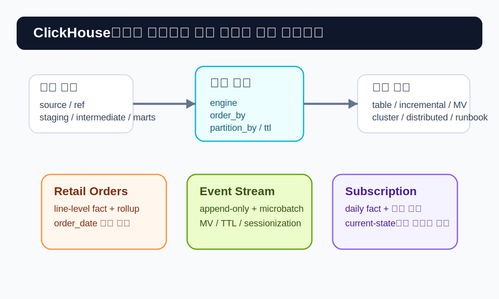
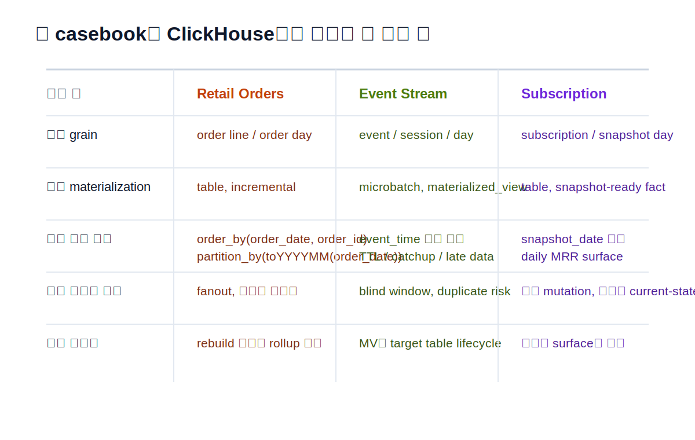
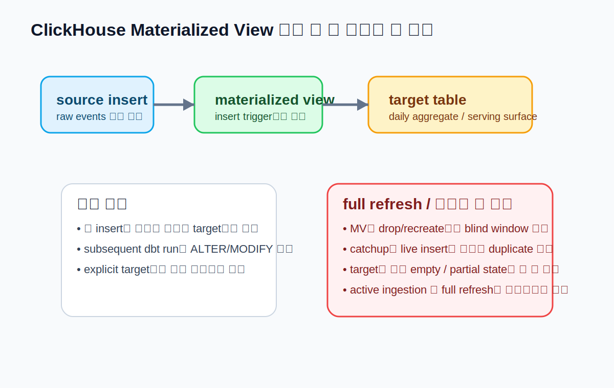

# CHAPTER 16 · Platform Playbook · ClickHouse

ClickHouse는 단순히 “SQL이 빠른 데이터베이스”가 아니다.  
이 플랫폼에서는 **모델링과 물리 설계가 함께 움직인다.**  
같은 `select` 문을 써도 `engine`, `order_by`, `partition_by`, `ttl`, `cluster`, `materialized_view`를 어떻게 잡느냐에 따라 실행 성능, 적재 패턴, 운영 위험이 크게 달라진다.

그래서 이 장은 앞에서 이미 배운 `source`, `ref`, layered modeling, tests, snapshots, contracts, semantics를 다시 설명하지 않는다.  
대신 그 원리들이 **ClickHouse라는 엔진 위에서 어떻게 다르게 구현되는지**를 보여준다.  
핵심은 다음 세 가지다.

1. ClickHouse에서는 **물리 설계가 모델의 일부**다.  
2. append-only 이벤트, line-level fact, 시계열 집계처럼 읽기 패턴이 선명할수록 ClickHouse의 장점이 커진다.  
3. `SET` 문, cluster, distributed table, materialized view, TTL 같은 기능은 강력하지만, **무턱대고 섞으면 오히려 운영 난도가 올라간다.**



---

## 16.1. 왜 ClickHouse를 별도 플랫폼 플레이북으로 다뤄야 하는가

DuckDB, PostgreSQL, BigQuery 같은 플랫폼도 물론 각자의 물리 특성이 있다.  
하지만 ClickHouse는 그 특성이 더 전면에 드러난다.

예를 들어 다음 질문은 ClickHouse에서 특히 중요하다.

- 이 모델은 `view`로 둘까, `table`로 둘까, `incremental`로 둘까, `materialized_view`로 둘까?
- `MergeTree` 계열 중 어떤 engine이 맞을까?
- `order_by`는 어떤 조회 패턴을 최적화해야 할까?
- `partition_by`는 월 단위가 맞을까, 일 단위가 맞을까?
- raw 이벤트는 얼마나 오래 보존할까? TTL을 걸까?
- cluster 환경이라면 `ON CLUSTER`와 read-after-write 일관성을 어떻게 맞출까?

즉, ClickHouse에서는 “dbt 모델이 SQL로 컴파일된다”는 사실보다  
“그 결과가 어떤 저장 구조로 배치되는가”가 더 중요해지는 구간이 많다.

dbt-clickhouse는 현재 기준으로 contracts, docs generate, seeds, sources, snapshots, tests를 지원하고, materialization도 `table`, `view`, `incremental`, `microbatch incremental`, `ephemeral`을 지원한다. 따라서 기능 부족 때문에 ClickHouse를 못 쓰는 경우보다는, **어떤 기능을 어디까지 사용할지의 판단**이 더 중요하다.

### 16.1.1. ClickHouse가 특히 잘 맞는 경우

다음과 같은 패턴은 ClickHouse와 궁합이 좋다.

- append-only 또는 append-mostly 이벤트 로그
- line-level fact를 오래 쌓고 빠르게 집계해야 하는 분석
- 고카디널리티 이벤트에서 필터 + 집계를 자주 수행하는 쿼리
- time-series 데이터의 대용량 스캔, sessionization, funnel, rollup
- 빠른 대시보드 조회를 위해 쿼리 비용을 insert 시점으로 옮기고 싶은 경우

반대로 다음과 같은 상황에서는 신중해야 한다.

- 행 단위 업데이트가 매우 잦고, 최신값 정합성이 절대적으로 중요한 OLTP성 워크로드
- 자주 바뀌는 dimension을 복잡한 join으로 매 실행마다 다시 계산해야 하는 경우
- 팀이 아직 `engine` / `order_by` / `partition_by` / cluster 운영을 충분히 이해하지 못한 상태
- “우선은 개념만 익히고 싶다”는 단계인데 너무 일찍 분산/복제/TTL까지 함께 도입하려는 경우

---

## 16.2. 연결과 첫 실행: profile을 어떻게 잡아야 하는가

ClickHouse profile은 단순해 보이지만, 몇 가지 포인트가 있다.

- ClickHouse에는 전통적인 의미의 `database.schema.table` 구조가 없다.
- dbt-clickhouse에서는 `schema`를 ClickHouse의 database 개념으로 사용한다.
- `default` 데이터베이스를 계속 쓰기보다, 책 실습이나 팀 프로젝트용 database를 별도로 두는 편이 낫다.
- HTTP 연결과 native 연결이 모두 가능하지만, 팀 표준을 정해 두는 것이 좋다.

대표 예시는 아래 파일로 같이 넣어 두었다.

- [`profiles.clickhouse.example.yml`](../codes/04_chapter_snippets/ch16/profiles.clickhouse.example.yml)
- [`first_run_clickhouse.sh`](../codes/04_chapter_snippets/ch16/first_run_clickhouse.sh)
- [`clickhouse_preflight.sql`](../codes/04_chapter_snippets/ch16/clickhouse_preflight.sql)

### 16.2.1. profile에서 특히 봐야 할 것

1. `driver`
   - 보통 `http` 또는 `native`
2. `schema`
   - ClickHouse database 개념
3. `cluster`
   - 분산 환경에서 `ON CLUSTER`를 붙일지 결정
4. `threads`
   - 무작정 올리기 전에 read-after-write 특성을 확인
5. `custom_settings`
   - 세션 설정을 pre-hook의 `SET`에 의존하지 말고 여기서 관리
6. `secure`, `verify`, `client_cert`
   - TLS/HTTPS 환경에서 필요

### 16.2.2. pre-hook에서 `SET` 하지 말아야 하는 이유

ClickHouse 문서에서도 강조하는 주의점이 있다.  
다수 환경에서는 `SET` 문으로 ClickHouse 설정을 모든 dbt 쿼리에 걸쳐 유지하려는 시도가 신뢰하기 어렵고, 특히 HTTP + 로드밸런서 환경에서는 예기치 않은 실패를 낳을 수 있다.  
따라서 `pre-hook`에서 `SET max_threads = ...` 같은 식으로 관리하기보다, 필요한 설정은 가능하면 **profile의 `custom_settings`**로 두는 편이 낫다.

### 16.2.3. seeds를 쓴다면 `quote_columns`를 명시하라

ClickHouse에서는 seed를 쓸 때 `quote_columns`를 명시적으로 적지 않으면 경고를 만날 수 있다.  
작은 참조 데이터라도 seed를 쓴다면 아래처럼 프로젝트 설정에 미리 넣어 두는 편이 안전하다.

```yaml
seeds:
  +quote_columns: false
```

---

## 16.3. ClickHouse에서 가장 중요한 것: 물리 설계가 모델링의 일부다

ClickHouse에서 `stg_events`, `int_sessions`, `fct_orders`, `fct_mrr` 같은 모델 이름은 여전히 중요하다.  
하지만 그보다 더 중요한 질문이 있다.

> “이 모델을 어떤 물리 객체로 만들고, 어떤 읽기 패턴에 맞춰 정렬할 것인가?”

### 16.3.1. `engine`

가장 기본은 `MergeTree()`다.  
입문과 실습, 그리고 대부분의 fact/mart 출발점은 여기서 시작해도 된다.

그 다음에 필요에 따라 고민한다.

- `ReplacingMergeTree`
  - 중복 제거/최신값 대체 패턴이 필요할 때
- `SummingMergeTree`
  - 누적/가산 집계 결과를 저장할 때
- `AggregatingMergeTree`
  - aggregate states를 다루는 고급 패턴
- `ReplicatedMergeTree`
  - 복제 환경에서 사용
- `Distributed`
  - 분산 질의를 위한 테이블 계층

중요한 건 **엔진을 기능 이름처럼 선택하지 말고 데이터의 갱신 방식과 읽기 패턴으로 선택**해야 한다는 점이다.

### 16.3.2. `order_by`

ClickHouse에서 `order_by`는 단순 정렬 옵션이 아니라, 희소 인덱스를 만드는 핵심 수단이다.  
자주 쓰는 필터/집계 패턴을 기준으로 잡아야 한다.

잘못된 접근:
- “일단 PK처럼 id만 두자”
- “특별한 생각 없이 tuple()로 두자”

더 나은 접근:
- Retail Orders: `(order_date, order_id, line_id)`
- Event Stream: `(event_date, event_time, user_id, session_id)`
- Subscription & Billing: `(snapshot_date, subscription_id)` 또는 `(customer_id, plan_id, snapshot_date)`

### 16.3.3. `partition_by`

`partition_by`는 “조회가 빨라지는 옵션”이 아니라 **데이터 lifecycle과 운영 단위**를 정하는 옵션에 가깝다.  
너무 잘게 쪼개면 파티션 수가 폭증하고, 너무 크게 잡으면 유지관리 이점이 줄어든다.

보통 다음처럼 생각하면 된다.

- 월 단위 fact: `toYYYYMM(order_date)`
- 일 단위 이벤트: `toDate(event_time)` 또는 월 단위 + `order_by` 세분화
- 구독 상태 이력: `toYYYYMM(snapshot_date)` 또는 `toYYYYMM(valid_from)`

### 16.3.4. TTL

ClickHouse TTL은 단순 삭제만이 아니라, 오래된 데이터를 이동하거나 롤업하는 데도 쓸 수 있다.  
이건 Event Stream처럼 raw 로그가 오래 누적되는 사례에서 특히 중요하다.

예:
- raw 이벤트 90일 보관 후 삭제
- 1년 지난 데이터는 요약 테이블로만 남기고 세부 행은 제거
- hot/warm/cold 스토리지 이동

다만 TTL은 “나중에 정리할게”가 아니라 **처음 설계할 때 의도적으로 넣을지 말지**를 판단하는 것이 좋다.



---

## 16.4. Materialization을 ClickHouse에서 다시 읽기

ClickHouse에서 materialization은 단순한 dbt 옵션이 아니라 **물리 운영 전략**이다.

### 16.4.1. `view`

언제 쓰나:
- 아주 얇은 staging
- 빈번히 바뀌는 탐색용 논리 레이어
- 물리 저장보다 가독성이 중요한 경우

주의:
- 무거운 집계를 `view`에 오래 두면 조회 시점 비용이 그대로 남는다.

### 16.4.2. `table`

언제 쓰나:
- 최종 fact/dim
- 반복 조회가 많고 결과 shape가 안정적인 모델
- `engine`, `order_by`, `partition_by`를 명확히 설계할 수 있는 경우

대부분의 ClickHouse 플레이북은 결국 `table` 설계로 수렴한다.

### 16.4.3. `incremental`

언제 쓰나:
- line-level fact를 매 실행 전체 재생성하기엔 비싸고
- 새 데이터 중심으로 지속 적재할 수 있으며
- late-arriving data 범위를 명확히 잡을 수 있을 때

ClickHouse에서는 incremental을 “dbt에서 편해서”가 아니라, **대용량 fact에 대한 운영 비용을 낮추기 위해** 쓴다.

### 16.4.4. `microbatch incremental`

Event Stream처럼 시간 축이 분명한 대형 fact에서는 microbatch가 잘 맞는다.  
한 번에 한 배치를 처리하도록 모델 SQL을 쓰고, dbt가 `event_time`, `begin`, `batch_size`, `lookback`에 따라 여러 쿼리로 나눠 실행하게 하는 방식이다.

장점:
- 거대한 backfill을 더 안전하게 나눌 수 있다.
- late-arriving data를 `lookback`으로 흡수하기 쉽다.
- 실패 배치만 다시 다루기 좋다.

주의:
- 배치 크기와 lookback을 운영 SLA에 맞게 잡아야 한다.
- upstream ref 중 auto-filter가 걸리는 모델과 그렇지 않은 모델을 구분해야 한다.

### 16.4.5. `materialized_view`

ClickHouse의 `materialized_view`는 매우 강력하다.  
이건 단순한 “결과 캐시”라기보다, **source insert를 target table로 밀어 넣는 트리거형 변환 계층**으로 보는 편이 더 정확하다.

장점:
- insert 시점에 계산을 옮겨 SELECT를 빠르게 만들 수 있다.
- 이벤트성 집계에 특히 잘 맞는다.
- 명시적 target table 패턴을 쓰면 운영 제어력이 좋아진다.

주의:
- `catchup=True`와 target table의 재적재 설정을 같이 쓰면 중복 위험이 있다.
- `--full-refresh` 시 materialized view가 잠깐 drop/recreate되면 “blind window”가 생길 수 있다.
- active ingestion 중 full refresh는 데이터 손실/중복 위험을 동반한다.

### 16.4.6. `distributed_table` / `distributed_incremental` (experimental)

cluster 환경에서 sharding을 전면적으로 쓰는 경우 실험적으로 사용할 수 있다.  
다만 이건 “책 실습에서 기본으로 쓰는 수준”이 아니라 **운영 고급 패턴**이다.

- cluster profile이 필요하다.
- `insert_distributed_sync = 1` 영향으로 insert 속도가 느려질 수 있다.
- 로컬 테이블과 distributed 테이블의 역할을 함께 이해해야 한다.

---

## 16.5. Casebook I · Retail Orders를 ClickHouse에서 어떻게 가져갈 것인가

Retail Orders는 ClickHouse의 대표 use case처럼 보이지 않을 수 있다.  
하지만 line-level fact가 크고 조회가 반복된다면 충분히 잘 맞는다.

### 16.5.1. 어디를 ClickHouse에 맡길까

좋은 후보:
- `int_order_lines`
- `fct_orders`
- 카테고리/상품/일자 rollup
- 대시보드용 일별/월별 매출 집계

덜 적합한 후보:
- 자주 업데이트되는 작은 reference dimension
- row-level mutation이 매우 잦은 테이블

### 16.5.2. 추천 구조

- staging: `view`
- order line fact: `table`
- 최종 집계: `table`
- 자주 반복되는 집계: 경우에 따라 `materialized_view`

대표 예시는 다음 파일에 넣어 두었다.

- [`retail_order_lines_clickhouse.sql`](../codes/04_chapter_snippets/ch16/retail_order_lines_clickhouse.sql)

이 예시에서는 line-level fact를 `MergeTree` 테이블로 만들고,
`order_date`, `order_id`, `line_id`를 기준으로 `order_by`를 잡는다.  
이렇게 하면 날짜 범위 + 주문 단위 조회가 반복되는 패턴에서 꽤 안정적인 성능을 얻을 수 있다.

### 16.5.3. Retail Orders에서의 안티패턴

- `order_by`를 `order_id` 하나만 두는 것
- `partition_by`를 주문번호처럼 고카디널리티 키로 두는 것
- line-level fact를 `view`로 두고 매번 무거운 집계를 다시 계산하는 것
- 작은 reference update 패턴까지 모두 ClickHouse에 몰아넣는 것

---

## 16.6. Casebook II · Event Stream은 ClickHouse와 가장 잘 맞는다

세 casebook 중 Event Stream이 ClickHouse와 가장 자연스럽게 맞물린다.  
append-only, time-series, 세션화, 고속 집계라는 특성이 ClickHouse의 장점과 정확히 겹치기 때문이다.

### 16.6.1. 기본 레이어

- `stg_events`: 타입 정리, `event_time`, `event_date`, `event_type` 표준화
- `int_sessions`: session grain으로 재구성
- `fct_events_daily`: 일 단위 fact
- semantic-ready surface: active users, sessions, purchases, retention

### 16.6.2. microbatch로 세션 테이블 만들기

- [`events_sessions_microbatch.sql`](../codes/04_chapter_snippets/ch16/events_sessions_microbatch.sql)

이 예시는 `event_time`, `begin`, `batch_size`, `lookback`을 기준으로 session grain 모델을 microbatch incremental로 만드는 패턴이다.  
핵심은 SQL을 “한 배치만 처리하는 관점”으로 쓰는 것이다.  
dbt가 배치를 나누고, 각 배치를 ClickHouse 테이블에 반영한다.

### 16.6.3. materialized view로 일별 집계 만들기

Event Stream에서는 raw events → daily aggregate로 가는 반복 집계가 아주 흔하다.  
이때 ClickHouse `materialized_view`가 강력하다.

같이 넣은 예시:
- [`events_daily_target.sql`](../codes/04_chapter_snippets/ch16/events_daily_target.sql)
- [`events_daily_mv.sql`](../codes/04_chapter_snippets/ch16/events_daily_mv.sql)

여기서는 target table을 명시적으로 두고,
materialized view가 새 insert를 target으로 밀어 넣게 하는 구조를 보여준다.

### 16.6.4. `catchup`, blind window, 중복의 관계

ClickHouse materialized view는 insert trigger처럼 동작한다.  
그래서 full refresh나 재생성 시점에는 아래 위험을 이해해야 한다.

- MV가 drop/recreate되는 동안 새로 들어온 row는 놓칠 수 있다.
- `catchup=True`로 backfill하면서 동시에 live insert가 들어오면 중복 위험이 생길 수 있다.
- explicit target table을 재생성할 때도 target이 비거나 partial state가 될 수 있다.

즉, Event Stream에서 materialized view를 쓸 때는 **성능 이득과 운영 블라인드 윈도우를 같이 이해해야 한다.**



### 16.6.5. TTL은 Event Stream에서 특히 중요하다

raw 이벤트를 무기한 full-detail로 들고 가면 결국 보관 비용과 운영 복잡성이 커진다.  
ClickHouse에서는 TTL로 다음 전략을 고민할 수 있다.

- raw는 90일만 유지
- daily aggregate는 2년 유지
- 아주 오래된 raw는 rollup 후 삭제

이건 dbt 한 모델의 설정이라기보다, **플랫폼 설계의 일부**다.

---

## 16.7. Casebook III · Subscription & Billing은 “시계열 관찰” 쪽에 강점이 있다

구독/청구 도메인은 ClickHouse의 첫 번째 추천 플랫폼은 아닐 수 있다.  
하지만 usage event, 상태 이력, daily MRR snapshot처럼 **시간에 따라 누적되는 분석 표면**은 충분히 잘 맞는다.

### 16.7.1. 어떤 부분이 잘 맞는가

- usage events
- 일별 MRR 스냅샷
- plan/change history 집계
- cohort / retention / churn 관찰

### 16.7.2. 어떤 부분은 단순하게 가져가야 하는가

- 계약/회계 로직이 매우 복잡한 current-state dimension
- row-level mutation이 많은 최신 상태 테이블
- 매우 잦은 upsert와 strict point correctness가 필요한 서빙 레이어

### 16.7.3. 추천 접근

- raw invoice / subscription status는 staging에서 표준화
- current 상태보다 **daily snapshot fact** 중심으로 설계
- `fct_mrr_daily` 같은 테이블은 `MergeTree` 기반 table로 두고
- semantic surface는 여기서 파생

같이 넣은 예시:
- [`subscription_mrr_table.sql`](../codes/04_chapter_snippets/ch16/subscription_mrr_table.sql)
- [`subscription_status_snapshot.sql`](../codes/04_chapter_snippets/ch16/subscription_status_snapshot.sql)

### 16.7.4. Subscription 케이스에서의 ClickHouse 포지셔닝

Subscription & Billing은 보통 “정답 플랫폼”보다 “좋은 보조 플랫폼”으로 보는 편이 낫다.  
즉, 운영계/원장계 정합성을 ClickHouse에 모두 맡기기보다, **관찰·분석·시계열 집계 표면**을 ClickHouse에 싣는 방식이 더 자연스럽다.

---

## 16.8. cluster, distributed, 일관성: 운영 단계에서 꼭 알아야 할 것

ClickHouse를 단일 노드에서 벗어나 cluster로 쓰기 시작하면, dbt 운영 감각도 바뀐다.

### 16.8.1. `cluster`

profile에 `cluster`를 두면 일부 DDL/테이블 작업이 `ON CLUSTER` 절과 함께 수행된다.  
다만 replicated engine은 내부적으로 replication을 관리하므로 동일하게 동작하지 않는다.

### 16.8.2. distributed table

분산 읽기/쓰기 계층을 만들려면 `distributed_table` materialization을 고려할 수 있다.  
하지만 이건 실험적 기능이고, shard/local table/distributed table의 역할을 모두 이해해야 한다.

### 16.8.3. read-after-write consistency

dbt는 read-after-insert 일관성에 의존한다.  
replica가 여러 개인 cluster에서 이 보장이 깨지면, 방금 만든 relation을 다음 단계가 즉시 읽지 못하는 문제가 생길 수 있다.

운영 원칙:
- Cloud에서는 문서가 권장하는 `select_sequential_consistency` 같은 설정을 profile `custom_settings`로 관리
- self-hosted cluster는 sticky session / replica-aware routing으로 같은 replica를 유지
- threads를 올리기 전에 consistency 전략을 먼저 확인

### 16.8.4. 운영 전 사전 점검

같이 넣은 파일:
- [`clickhouse_preflight.sql`](../codes/04_chapter_snippets/ch16/clickhouse_preflight.sql)

이 파일에는 다음 확인이 들어 있다.

- `currentDatabase()`
- server version
- target database 존재 여부
- 주요 table engine / part 상태
- row count / last update 검증용 샘플 쿼리

---

## 16.9. 세 casebook을 ClickHouse에 올릴 때의 권장 순서

1. DuckDB나 단일 노드 ClickHouse에서 개념을 먼저 맞춘다.  
2. Retail Orders로 `table + order_by + partition_by` 감각을 익힌다.  
3. Event Stream에서 incremental / microbatch / materialized_view를 연습한다.  
4. Subscription & Billing은 current-state보다 snapshot / daily fact 중심으로 올린다.  
5. 그 다음에야 cluster, distributed, TTL, refreshable MV를 검토한다.

이 순서를 거꾸로 가면, ClickHouse의 강력한 기능 때문에 오히려 설계가 불안정해질 수 있다.

---

## 16.10. ClickHouse에서 자주 나오는 안티패턴

### 16.10.1. “dbt 모델을 그냥 SQL 번역하듯 옮기기”
ClickHouse에서는 그보다 **저장 구조를 먼저** 생각해야 한다.

### 16.10.2. `SET`을 pre-hook로 남발하기
문서가 권장하는 대로 필요한 설정은 profile `custom_settings`로 옮기는 편이 좋다.

### 16.10.3. Event Stream에 무조건 `table`만 쓰기
일별/시간별 반복 집계가 뚜렷하면 materialized view가 더 자연스러울 수 있다.

### 16.10.4. MV full refresh 시 blind window를 무시하기
live ingestion이 있는 시스템에서 이걸 무시하면 누락/중복을 만난다.

### 16.10.5. `order_by`와 `partition_by`를 아무 생각 없이 복붙하기
가장 흔한 실수다. 쿼리 패턴과 보관 정책을 먼저 적고 설계해야 한다.

---

## 16.11. 직접 해보기

### 16.11.1. 최소 실행 루프

```bash
dbt debug --target dev
dbt run --select stg_orders
dbt run --select fct_order_lines_clickhouse
dbt test --select fct_order_lines_clickhouse
```

### 16.11.2. Event Stream 확인 루프

```bash
dbt run --select events_sessions_clickhouse
dbt run --select events_daily_target events_daily_mv
dbt test --select events_daily_target
```

### 16.11.3. 운영 검증 루프

```bash
dbt ls --select tag:clickhouse
dbt compile --select events_daily_mv
dbt run --select events_daily_mv --full-refresh
```

full refresh는 특히 materialized view blind window와 catchup 동작을 이해한 다음에 수행해야 한다.

---

## 16.12. 이 장의 핵심 정리

- ClickHouse에서는 **물리 설계가 모델링의 일부**다.
- `engine`, `order_by`, `partition_by`, `ttl`은 부가 옵션이 아니라 핵심 설계 축이다.
- Retail Orders는 line-level fact와 rollup, Event Stream은 microbatch와 MV, Subscription은 snapshot/daily fact 중심으로 가져가는 편이 자연스럽다.
- `SET`을 pre-hook로 남발하지 말고 `custom_settings`를 우선 검토하라.
- cluster와 distributed는 강력하지만, 단일 노드 패턴이 안정화된 뒤에 올리는 것이 좋다.

---

## 16.13. 다음으로 이어지는 것

ClickHouse를 이해했다면, 다음 장의 Snowflake에서는 전혀 다른 감각이 나온다.  
ClickHouse가 **저장 구조와 질의 패턴**을 강하게 의식하게 만드는 플랫폼이라면, Snowflake는 **warehouse, role, 비용, merge 중심 운영**을 더 의식하게 만든다.

즉, 두 플랫폼 모두 강력하지만 “무엇을 먼저 고민해야 하는가”가 다르다.
