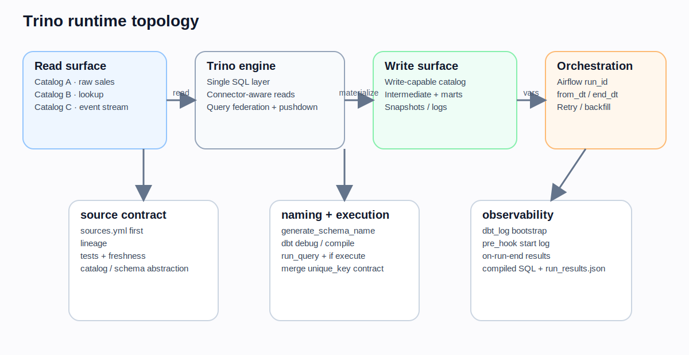
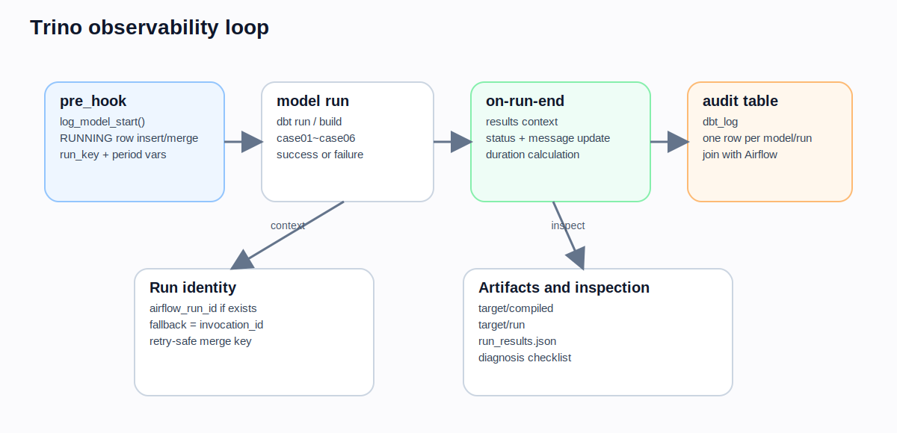
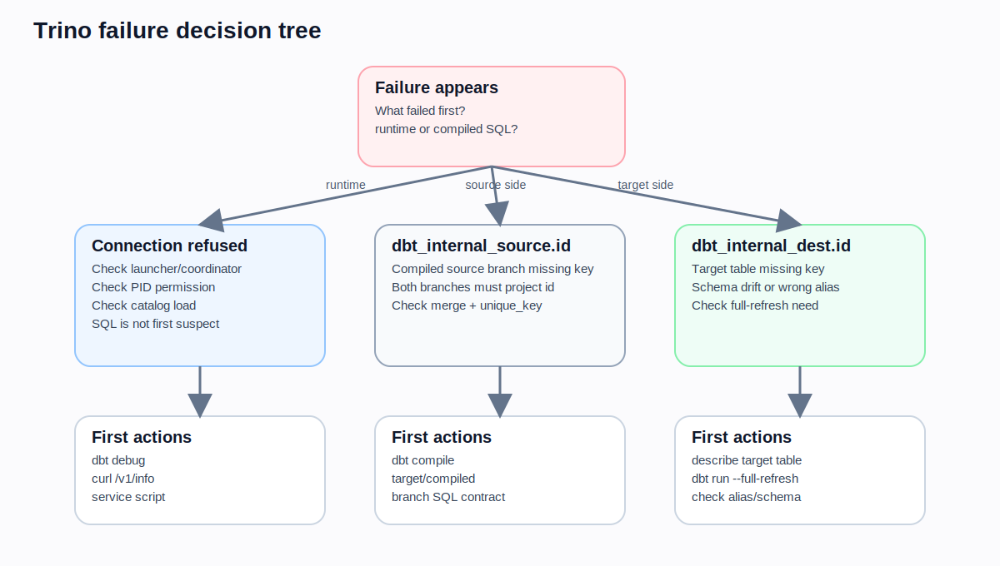

# CHAPTER 18 · Platform Playbook · Trino

Trino는 하나의 저장소에 접속해서 테이블을 만드는 전통적인 데이터웨어하우스보다 **여러 catalog 위의 데이터를 한 SQL 계층에서 읽고 조합하는 분산 query engine**에 가깝다.  
따라서 Trino를 dbt로 다룰 때는 "어떤 SQL을 쓸까"보다 먼저 **어디에서 읽고, 어디에 쓰고, 어떤 naming rule과 orchestration contract를 쓸 것인가**를 정해야 한다.

이 장의 목표는 앞서 학습한 `source()`, `ref()`, layered modeling, tests, incremental, hooks, vars, artifacts, CI 개념이  
**Trino / Iceberg / Airflow** 조합에서 어떻게 실제 운영 패턴으로 바뀌는지 끝까지 설명하는 것이다.



## 18.1. 왜 Trino는 별도 플레이북이 필요한가

DuckDB, PostgreSQL, BigQuery, Snowflake는 "target platform 자체가 저장과 실행의 중심"인 경우가 많다.  
반면 Trino는 다음 특징 때문에 별도 플레이북이 필요하다.

1. **catalog가 곧 데이터 위치의 힌트**다. `database`가 일반적인 "하나의 DB 이름"이 아니라 Trino catalog를 뜻한다.
2. source와 target이 **같은 위치일 필요가 없다.**
3. 읽기 가능한 connector와 쓰기 가능한 connector가 다를 수 있다.
4. SQL은 하나처럼 보여도, 실제 성능/권한/파일 포맷/메타데이터는 connector에 의해 좌우된다.
5. Airflow 같은 외부 orchestrator와 함께 쓰는 운영 패턴이 많다.

즉, Trino 장에서는 "문법"보다 **runtime boundary**를 먼저 이해해야 한다.

## 18.2. Trino를 시작할 때 먼저 정해야 할 네 가지

### 18.2.1. 어떤 catalog에서 읽을 것인가

예를 들어 raw 입력이 `iceberg.sample_db.raw_sales`라면:

- `iceberg`는 catalog
- `sample_db`는 schema
- `raw_sales`는 table

Trino에서는 이 세 층을 항상 의식해야 한다.  
특히 source가 여러 catalog에 흩어져 있으면, source contract를 YAML로 먼저 선언하는 편이 훨씬 안전하다.

### 18.2.2. 어떤 catalog/schema에 쓸 것인가

Trino는 여러 catalog를 읽을 수 있지만, **모든 connector가 쓰기에 강한 것은 아니다.**  
따라서 intermediate, marts, snapshots를 실제로 어떤 catalog에 materialize할지 먼저 정해야 한다.

실무에서는 자주 이렇게 나뉜다.

- 입력: 여러 catalog / 여러 lakehouse table
- 출력: 한 write-capable catalog (예: Iceberg)
- 운영 로그: 별도 schema 또는 별도 catalog

### 18.2.3. naming rule을 어떻게 둘 것인가

Trino / Iceberg 환경에서는 `target.schema`와 model config의 `schema`가 겹칠 때 relation naming이 어색해질 수 있다.  
기본 naming rule을 유지할지, `generate_schema_name` override로 단순화할지 정해야 한다.

### 18.2.4. orchestration run과 dbt run을 어떻게 연결할 것인가

Airflow가 있다면 최소한 아래 변수는 표준화하는 것이 좋다.

- `airflow_run_id`
- `from_dt`
- `end_dt`

이 세 가지가 있으면 backfill, retry, audit logging, 기간 기반 실행을 모두 연결하기 쉬워진다.

## 18.3. first-run: profile부터 coordinator 상태까지 한 번에 확인하기

아래는 Trino 실습/운영에서 사용할 수 있는 최소 profile 예시다.

```yaml
trino_test:
  target: dev
  outputs:
    dev:
      type: trino
      method: none
      user: "{{ env_var('DBT_TRINO_USER', 'dbt') }}"
      host: "{{ env_var('DBT_TRINO_HOST', 'localhost') }}"
      port: "{{ env_var('DBT_TRINO_PORT', '8080') | int }}"
      database: "{{ env_var('DBT_TRINO_CATALOG', 'iceberg') }}"
      schema: "{{ env_var('DBT_TRINO_SCHEMA', 'sample_db') }}"
      threads: 4
      prepared_statements_enabled: true
      retries: 3
      timezone: Asia/Seoul
```

관련 파일:
- `../codes/04_chapter_snippets/ch18/trino/profiles.trino.sample.yml`

### 18.3.1. 여기서 자주 헷갈리는 것

- `database`는 Trino의 catalog다.
- `schema`는 catalog 아래 schema다.
- `dbt debug`가 YAML 문법과 연결 자격을 일부 확인해 주더라도, **coordinator가 죽어 있으면 run은 실패한다.**
- `prepared_statements_enabled`는 seed에서 특히 영향이 크다.
- `retries`는 일시적 네트워크 문제에는 도움이 되지만, coordinator가 완전히 죽어 있으면 해결되지 않는다.

### 18.3.2. Connection refused가 나오면 SQL보다 먼저 볼 것

업무 로그에서 대표적으로 나온 오류는 `localhost:8080` connection refused였다.  
이건 모델 SQL보다 **Trino launcher / coordinator / PID 권한**을 먼저 봐야 하는 신호다.

실전 점검 순서:

1. `dbt debug`
2. `curl http://localhost:8080/v1/info`
3. Trino launcher 상태 확인
4. PID 파일 권한 확인
5. 필요한 catalog가 로딩됐는지 확인

관련 파일:
- `../codes/04_chapter_snippets/ch18/trino/trino_service_first_run.sh`
- `../codes/04_chapter_snippets/ch18/trino/diagnosis_checklist.sh`

## 18.4. Trino에서는 source contract를 더 빨리 세워야 한다

업무 메모에서도 `sources.yml`을 먼저 만드는 이유를 강조하고 있었다.  
Trino에서는 relation을 직접 `iceberg.sample_db.raw_sales`처럼 하드코딩하기 쉽지만, 그렇게 하면 다음 문제가 생긴다.

1. raw 입력이 lineage에 드러나지 않는다.
2. catalog/schema가 바뀌면 SQL 파일 전체를 수정해야 한다.
3. source-level test/freshness로 확장하기 어렵다.
4. 여러 catalog를 섞는 순간 relation 하드코딩이 빠르게 퍼진다.

예시:

```yaml
version: 2

sources:
  - name: my_source
    database: iceberg
    schema: sample_db
    tables:
      - name: raw_data
      - name: raw_sales
      - name: raw_sales2
      - name: country
```

```sql
select
    sale_id,
    product_name,
    amount,
    current_timestamp at time zone 'Asia/Seoul' as last_updated
from {{ source('my_source', 'raw_sales') }}
```

관련 파일:
- `../codes/04_chapter_snippets/ch18/trino/sources.trino.sample.yml`

### 18.4.1. source 선언으로 얻는 것

- lineage
- source-level tests
- freshness check
- 환경 분리
- catalog/schema rename 비용 절감

### 18.4.2. 세 casebook에 어떻게 연결되는가

**Retail Orders**  
`raw_sales`, `country`, `raw_order_items` 같은 입력을 source로 선언하면 lookup과 fact 흐름이 선명해진다.

**Event Stream**  
append-only event log에서 freshness와 late-arrival을 분리해서 볼 수 있다.

**Subscription & Billing**  
현재 상태 테이블과 billing lookup 테이블을 contract 관점에서 관리하기 쉽다.

## 18.5. Schema naming과 `generate_schema_name` override

업무 메모의 가장 실무적인 부분 중 하나가 이 매크로였다.  
Trino / Iceberg 환경에서는 target schema와 custom schema가 같은 이름으로 겹치면 relation naming이 길고 어색해질 수 있다.

예:

- target schema = `sample_db`
- model config schema = `sample_db`

기본 naming rule을 그대로 두면 `sample_db_sample_db` 같은 이름이 생길 수 있다.

이를 피하려고 아래 macro를 둘 수 있다.

```sql

    
        {{ target.schema }}
    
        {{ custom_schema_name | trim }}
    

```

관련 파일:
- `../codes/04_chapter_snippets/ch18/trino/generate_schema_name.sql`

### 18.5.1. 이 매크로의 성격

이건 편의성 macro가 아니라 **프로젝트 전역 naming rule override**다.  
따라서 아래를 먼저 확인해야 한다.

- 개인 dev schema 분리 전략과 충돌하지 않는가
- prod naming convention과 충돌하지 않는가
- schema를 model 단위로 직접 지정하는 팀 규칙과 맞는가

### 18.5.2. 언제 쓰는가

- target.schema와 custom schema가 자주 겹치는 구조
- catalog/schema naming을 짧고 명확하게 유지해야 하는 경우
- Trino write target이 명확히 고정돼 있는 경우

### 18.5.3. 언제 보수적으로 접근하는가

- 사람마다 dev schema를 다르게 써야 하는 경우
- schema prefix를 environment isolation에 적극 활용하는 경우
- 이미 naming convention이 조직 전반에서 굳어 있는 경우

## 18.6. Logging table, hooks, `results`를 이용한 운영 가시성

Trino / Airflow 환경에서는 "모델이 실패했다"보다 **어느 run에서 어떤 모델이 얼마나 오래 걸렸고 왜 실패했는가**가 더 중요할 때가 많다.  
그래서 업무 메모의 `dbt_log`, `log_model_start`, `log_run_end` 패턴은 교재에 넣을 가치가 높다.



### 18.6.1. bootstrap SQL

```sql
create table if not exists iceberg.sample_db.dbt_log (
    invocation_id  varchar,
    model_name     varchar,
    status         varchar,
    start_dt       timestamp(6) with time zone,
    end_dt         timestamp(6) with time zone,
    duration       varchar,
    error_message  varchar,
    run_info       varchar
)
with (
    format = 'PARQUET'
);
```

관련 파일:
- `../codes/03_platform_bootstrap/trino/dbt_log_bootstrap.sql`

### 18.6.2. 왜 `pre_hook + on-run-end` 조합이 좋은가

`post_hook`는 개별 모델 성공 뒤에만 기대하기 쉽다.  
반면 `on-run-end`는 전체 실행 결과 목록인 `results`를 훑을 수 있어서, 성공/실패/오류 메시지를 run 단위로 정리하기 좋다.

여기서 핵심은 세 가지다.

1. 모델 시작 시점에는 `RUNNING`을 남긴다.
2. 종료 시점에는 `results`를 순회하며 상태를 갱신한다.
3. `airflow_run_id`가 있으면 orchestration run과 dbt run을 연결한다.

### 18.6.3. 일반화한 logging macro

이 장에서는 업무 메모를 그대로 복사하지 않고, 아래처럼 조금 일반화해서 제안한다.

- log relation을 `var()`로 지정 가능
- timezone을 `var()`로 지정 가능
- `airflow_run_id`가 없으면 `invocation_id` fallback
- `results`는 on-run-end context에서 인자로 받음

관련 파일:
- `../codes/04_chapter_snippets/ch18/trino/log_utils.sql`
- `../codes/04_chapter_snippets/ch18/trino/dbt_project_hooks.example.yml`

### 18.6.4. 운영 팁

- duration을 문자열로 저장할지, 초 단위 숫자로 저장할지 먼저 정한다.
- error_message는 길이 제한을 둔다.
- 로그 테이블을 business mart와 같은 schema에 두지 않는다.
- retry 시 중복 로그를 막으려면 `airflow_run_id`를 merge key로 활용하는 것이 좋다.

## 18.7. 업무 case01~case06을 Trino 운영 패턴으로 다시 읽기

이 절은 "실무 메모에 있던 예제를 교재의 언어로 다시 해석"하는 부분이다.

### 18.7.1. case01 · 전체 재적재형 배치

`incremental` + `append` + `pre_hook delete all` 조합은 이름만 보면 incremental 같지만, 의미상으로는 **truncate-insert 배치**에 가깝다.

언제 유용한가:

- 대상 테이블이 작다
- 완전 재계산이 더 단순하다
- 정확성이 성능보다 중요하다
- legacy batch를 dbt 안으로 옮기는 초기 단계다

주의점:

- 대형 fact에는 부적합
- 재실행 비용이 크다
- "incremental을 쓴다"는 말만 보고 merge/upsert와 동일시하면 안 된다

관련 파일:
- `../codes/04_chapter_snippets/ch18/trino/case01_truncate_insert.sql`

### 18.7.2. case02 · lookup 기반 분기 제어

`run_query()`로 작은 lookup 값을 읽고 분기하는 패턴이다.

이 패턴이 useful한 경우:

- 실행 모드 플래그가 아주 작다
- 제어 테이블을 통해 SQL branch를 나누고 싶다
- side effect 없이 조회성 분기만 필요하다

주의점:

- `run_query()`는 live connection이 있으면 `dbt compile`, `dbt docs generate`에서도 실행될 수 있다
- 따라서 DML이나 side effect 쿼리를 넣지 않는다
- `if execute`와 fallback 값을 반드시 둔다

관련 파일:
- `../codes/04_chapter_snippets/ch18/trino/case02_branch_query.sql`

### 18.7.3. case03 · 데이터 존재 여부 기반 분기

row count가 0일 때도 **최종 스키마를 유지**해야 한다는 점이 핵심이다.  
특히 merge incremental에서는 source와 target 모두에서 `unique_key`가 살아 있어야 한다.

즉, 분기문 양쪽이 모두 다음 계약을 지켜야 한다.

- 최종 SELECT shape가 안정적일 것
- `unique_key` 컬럼이 빠지지 않을 것
- 0건일 때도 valid SQL일 것

관련 파일:
- `../codes/04_chapter_snippets/ch18/trino/case03_branch_query_fixed.sql`

### 18.7.4. case04 · 의도적 실패와 로그 전달

Trino의 `fail()`을 이용해 의도적 오류를 발생시키고, `on-run-end` 훅에서 메시지를 남기는 패턴이다.

이 패턴이 useful한 경우:

- 사전 조건이 깨졌을 때 명시적 실패를 내고 싶다
- 운영자가 에러 메시지를 로그 테이블에서 바로 보고 싶다
- 조용한 빈 결과보다 loud failure가 더 안전하다

주의점:

- execute 단계에서만 실패를 발생시켜야 한다
- compile용 fallback query를 둔다

관련 파일:
- `../codes/04_chapter_snippets/ch18/trino/case04_raise_except.sql`

### 18.7.5. case05 · vars 기반 배치 모드 전환

`from_date`, `to_date`가 있으면 range batch, 없으면 daily batch처럼 동작시키는 패턴이다.

장점:

- Airflow backfill
- 수동 rerun
- ad hoc 기간 실행
- daily schedule

을 하나의 모델에서 흡수할 수 있다.

주의점:

- 날짜 포맷을 팀 표준으로 고정한다
- vars 이름을 프로젝트 전체에서 통일한다

관련 파일:
- `../codes/04_chapter_snippets/ch18/trino/case05_use_parameter.sql`

### 18.7.6. case06 · loop 기반 동적 SQL

작은 제어 집합을 읽어서 `UNION ALL` 쿼리를 만드는 패턴이다.

언제 useful한가:

- 국가 코드, 서비스 코드, channel 코드처럼 제어 집합이 작다
- 반복되는 projection을 생성하고 싶다

주의점:

- raw relation을 직접 하드코딩하지 말고 `source()`로 읽는다
- 제어 집합이 커지면 loop보다 모델링 구조를 다시 봐야 한다
- loop는 SQL 생성 도구이지, orchestration 대체재가 아니다

관련 파일:
- `../codes/04_chapter_snippets/ch18/trino/case06_loop.sql`

## 18.8. 세 casebook를 Trino에 올리면 무엇이 달라지는가

### 18.8.1. Retail Orders

- 입력: `raw_sales`, `country`, `raw_order_items`
- target: write-capable Iceberg catalog
- 주의점: lookup join보다 먼저 catalog/schema 정합성을 맞춘다
- 추천 흐름: source 선언 → staged cleanup → mart write → logging hooks

### 18.8.2. Event Stream

- 입력: append-only event log
- target: incremental 또는 append + downstream rollup
- 주의점: event key, window, target catalog write 성능
- 추천 흐름: raw source → window filter → incremental target → freshness / slim CI

### 18.8.3. Subscription & Billing

- 입력: current-state 테이블 + history 보강 입력
- target: merge형 current state + snapshot/history layer
- 주의점: `unique_key`, target schema, naming rule
- 추천 흐름: current-state mart → snapshot / history → contract / semantic-ready surface

## 18.9. Trino에서 자주 만나는 장애와 1차 대응



### 18.9.1. `Connection refused`

먼저 볼 것:

1. coordinator / launcher
2. PID 파일 권한
3. `curl`로 health 확인
4. catalog 로딩

나중에 볼 것:

- model SQL
- Jinja
- selector

### 18.9.2. `dbt_internal_source.id` cannot be resolved

이건 merge incremental에서 **source 최종 SELECT에 `unique_key`가 없을 때** 자주 발생한다.

먼저 볼 것:

1. compiled SQL
2. 분기 로직 양쪽 SELECT
3. `unique_key` 컬럼 존재 여부

### 18.9.3. `dbt_internal_dest.id` cannot be resolved

이건 target relation에 `id`가 실제로 없거나, schema drift가 생겼을 때 자주 발생한다.

먼저 볼 것:

1. target table DDL
2. full refresh 필요 여부
3. 모델 alias/schema가 바뀌지 않았는지

### 18.9.4. 왜 Chapter 05 디버깅 장과 연결해야 하는가

이 장은 Trino 사례를 보여 주지만, 실제 해결은 결국 다음 순서를 따른다.

1. `dbt debug`
2. `dbt parse`
3. `dbt compile`
4. `target/compiled` 확인
5. `target/run` 확인
6. `run_results.json` 확인
7. 그 다음 platform/runtime 확인

관련 파일:
- `../codes/04_chapter_snippets/ch18/trino/diagnosis_checklist.sh`

## 18.10. Trino 플레이북 체크리스트

- source catalog / target catalog를 먼저 정했는가
- write-capable connector를 확인했는가
- `sources.yml`을 만들어 lineage를 살렸는가
- naming override가 dev/prod 분리와 충돌하지 않는가
- `airflow_run_id`, `from_dt`, `end_dt`를 표준화했는가
- logging hooks를 start/end 역할로 분리했는가
- `run_query()`는 조회성 분기로만 제한했는가
- merge incremental의 `unique_key`가 source/target 양쪽에 존재하는가
- connection refused를 SQL 문제로 오해하지 않는가
- compiled SQL과 runtime 문제를 구분해서 보는가

## 18.11. 같이 보면 좋은 코드 경로

- `../codes/04_chapter_snippets/ch18/trino/profiles.trino.sample.yml`
- `../codes/04_chapter_snippets/ch18/trino/sources.trino.sample.yml`
- `../codes/04_chapter_snippets/ch18/trino/generate_schema_name.sql`
- `../codes/03_platform_bootstrap/trino/dbt_log_bootstrap.sql`
- `../codes/04_chapter_snippets/ch18/trino/log_utils.sql`
- `../codes/04_chapter_snippets/ch18/trino/dbt_project_hooks.example.yml`
- `../codes/04_chapter_snippets/ch18/trino/case01_truncate_insert.sql`
- `../codes/04_chapter_snippets/ch18/trino/case02_branch_query.sql`
- `../codes/04_chapter_snippets/ch18/trino/case03_branch_query_fixed.sql`
- `../codes/04_chapter_snippets/ch18/trino/case04_raise_except.sql`
- `../codes/04_chapter_snippets/ch18/trino/case05_use_parameter.sql`
- `../codes/04_chapter_snippets/ch18/trino/case06_loop.sql`
- `../codes/04_chapter_snippets/ch18/trino/trino_service_first_run.sh`
- `../codes/04_chapter_snippets/ch18/trino/diagnosis_checklist.sh`

## 18.12. 마무리

Trino 장의 핵심은 "여러 저장소를 한 SQL로 읽을 수 있다"는 장점 자체가 아니다.  
진짜 핵심은 그 장점을 **source contract, target boundary, naming rule, hook logging, orchestration vars**로 통제하는 데 있다.

정리하면 Trino에서의 dbt는 다음 순서로 안정화된다.

1. source를 선언한다.
2. target catalog/schema를 고정한다.
3. naming rule을 결정한다.
4. orchestration 변수와 logging을 연결한다.
5. `run_query` 분기와 loop는 작고 조회성인 경우에만 사용한다.
6. merge incremental의 `unique_key` 계약을 source/target 모두에서 보장한다.
7. 장애가 나면 SQL보다 runtime과 compiled SQL을 먼저 분리해서 본다.

그 감각이 생기면 Trino는 "까다로운 플랫폼"이 아니라  
**여러 catalog를 통제 가능한 방식으로 묶는 dbt 실행면**으로 바뀐다.
