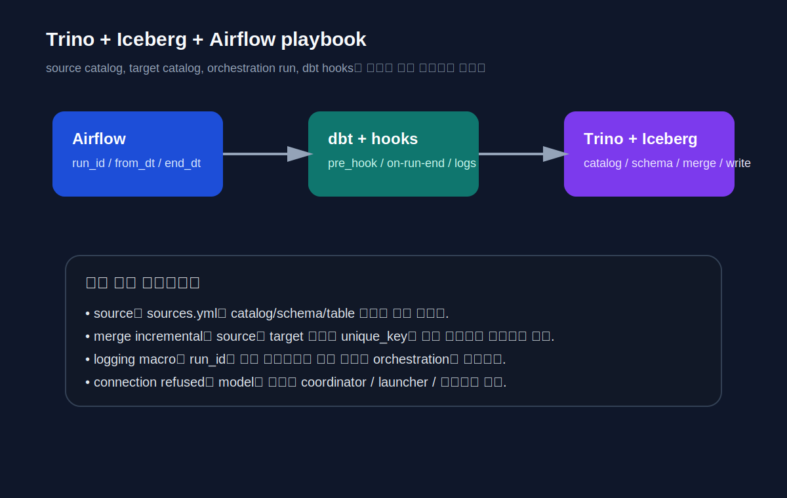

# CHAPTER 18 · Platform Playbook · Trino

> Trino는 “단일 데이터베이스 하나에 접속하는 adapter”라기보다, 여러 catalog 위에서 SQL을 조합하고 그 결과를 materialize하는 **분산 query engine**에 가깝다.  
> 이 장은 Trino를 dbt 관점에서 실제로 어떻게 다뤄야 하는지, 그리고 앞 장에서 배운 개념이 Trino / Iceberg / Airflow 환경에서는 어떻게 달라지는지를 사례 중심으로 정리한다.

Chapter 12~17의 다른 플랫폼 플레이북이 storage engine과 warehouse를 중심으로 설명되었다면, Trino 장은 먼저 **query engine / connector / catalog / write surface**라는 관점부터 잡아야 한다.  
Trino는 같은 SQL 문법을 통해 여러 catalog를 읽고 조합할 수 있지만, 이 장점은 곧 **source 위치와 target 위치를 의식적으로 분리해서 설계해야 한다**는 뜻이기도 하다.



## 18.1. Trino가 특히 잘 맞는 상황

Trino는 다음과 같은 경우에 특히 강점을 가진다.

1. 여러 저장소를 한 SQL 계층에서 읽고 조합하고 싶을 때
2. Iceberg 같은 lakehouse table format 위에 dbt 모델을 쌓고 싶을 때
3. Airflow 등 외부 orchestrator와 함께 배치 파이프라인을 만들고 싶을 때
4. source는 여러 catalog에서 읽되, 최종 mart는 하나의 write-capable catalog에 정리하고 싶을 때

반대로 아래 상황에서는 설계가 더 중요해진다.

- federation join이 많아지며 latency와 cost가 커지는 경우
- connector는 읽기만 잘 되고 쓰기 지원이 약한 경우
- target relation이 여러 catalog에 흩어져 naming/권한이 복잡해지는 경우

## 18.2. 먼저 잡아야 할 네 가지 질문

Trino에서 dbt 프로젝트를 시작할 때 가장 먼저 물어야 할 질문은 다음 네 가지다.

### 18.2.1. 어디에서 읽을 것인가
source data를 읽는 catalog와 schema를 먼저 정한다.  
예: `iceberg.sample_db.raw_sales`

### 18.2.2. 어디에 쓸 것인가
mart나 intermediate를 실제로 남길 write-capable catalog/schema를 정한다.  
읽기는 가능하지만 쓰기는 어렵거나 비효율적인 connector를 target으로 삼으면 운영이 흔들린다.

### 18.2.3. 어떤 relation naming rule을 쓸 것인가
기본 `generate_schema_name` 규칙을 그대로 둘지, `sample_db_sample_db` 같은 이름을 피하려고 override할지 정한다.

### 18.2.4. orchestration run과 dbt run을 어떻게 연결할 것인가
Airflow 같은 외부 orchestrator가 있다면 `airflow_run_id`, `from_dt`, `end_dt` 같은 변수를 어떤 이름으로 넘길지 정한다.

## 18.3. 최소 profile과 first-run 현실 체크

실무형 최소 profile 예시는 다음과 같다.

```yaml
trino_test:
  target: dev
  outputs:
    dev:
      type: trino
      method: none
      user: dbt
      host: localhost
      port: 8080
      database: iceberg
      schema: sample_db
      threads: 1
      prepared_statements_enabled: true
      retries: 3
      timezone: Asia/Seoul
```

### 18.3.1. 여기서 자주 헷갈리는 것
- `database`는 Trino catalog다.
- `schema`는 그 catalog 아래 schema다.
- `iceberg.sample_db.table_name` 형태를 source와 target 모두에서 분리해서 생각해야 한다.
- `dbt debug`가 profile 문법을 봐 줘도, coordinator가 내려가 있으면 `dbt run`은 여전히 실패할 수 있다.

### 18.3.2. connection refused가 나오면 먼저 어디를 볼까
업무 로그에서 대표적으로 나온 오류는 `localhost:8080`에 대한 connection refused였다.  
이건 model SQL보다 Trino coordinator/launcher 상태를 먼저 봐야 하는 신호다.

- coordinator가 떠 있는가
- launcher PID 파일 권한이 맞는가
- 필요한 catalog가 로딩되었는가

관련 점검 스크립트는 `../codes/04_chapter_snippets/ch02/trino/trino_service_first_run.sh`에 넣어 두었다.

## 18.4. Source 계약을 먼저 세우는 것이 Trino에선 더 중요하다

업무 메모의 `sources.yml` 샘플을 그대로 교재형으로 옮기면 아래와 같다.

```yaml
version: 2

sources:
  - name: my_source
    database: iceberg
    schema: sample_db
    tables:
      - name: raw_data
      - name: raw_sales
      - name: raw_sales2
      - name: country
```

Trino에서는 relation을 직접 `iceberg.sample_db.raw_sales`처럼 하드코딩하기 쉽지만, 그렇게 하면 다음 문제가 생긴다.

- lineage에 raw 입력이 끊긴다.
- database/schema가 바뀌면 SQL 파일 전체를 찾아야 한다.
- source-level test/freshness로 확장하기 어렵다.

따라서 Trino에선 오히려 더 빨리 `sources.yml`을 만드는 것이 좋다.

## 18.5. Schema naming과 `generate_schema_name` override

Trino / Iceberg 환경에서 `target.schema`와 model `schema`가 같은 이름으로 겹치면, 기본 naming 규칙 때문에 relation 이름이 길고 어색해질 수 있다.  
이를 피하려고 아래 macro를 프로젝트에 둘 수 있다.

```sql

    
        {{ target.schema }}
    
        {{ custom_schema_name | trim }}
    

```

하지만 이건 단순 편의 기능이 아니라 **프로젝트 전역 naming rule override**라는 점을 잊지 말자.  
개인별 dev schema 분리 전략과 충돌하지 않는지 반드시 확인해야 한다.

관련 파일:
- `../codes/02_reference_patterns/ch04/trino/generate_schema_name.sql`

## 18.6. Logging table과 hook 설계

업무 메모에는 `dbt_log` 테이블과 `log_model_start`, `log_run_end` 매크로가 함께 들어 있었다.  
Trino / Airflow 환경에서 이 패턴은 매우 유용하다. 이유는 다음과 같다.

- 각 model 시작 시점에 `RUNNING` 상태를 남길 수 있다.
- `on-run-end`에서 전체 `results`를 순회하며 성공/실패/오류 메시지를 갱신할 수 있다.
- `airflow_run_id`를 함께 남기면 orchestration run과 dbt run을 연결할 수 있다.

### 18.6.1. bootstrap SQL
- `../codes/03_platform_bootstrap/trino/dbt_log_bootstrap.sql`

### 18.6.2. macro / hooks 예시
- `../codes/04_chapter_snippets/ch06/trino/log_utils.sql`
- `../codes/04_chapter_snippets/ch06/trino/dbt_project_hooks.example.yml`

## 18.7. 업무 case01 ~ case06을 Trino 운영 패턴으로 다시 읽기

### 18.7.1. case01 · 전체 재적재형 배치
`incremental` + `append` + `pre_hook delete all` 조합은 incremental의 정석이라기보다, legacy batch를 dbt 안으로 옮기는 **truncate-insert형 운영 패턴**이다.

언제 유용한가:
- 작은 대상 테이블
- 정확성이 성능보다 중요할 때
- 하루 한 번 재적재형 배치

주의점:
- 대형 fact에는 부적합
- 재실행 비용 큼
- “incremental을 쓴다”는 말만 보고 merge/upsert와 동일시하면 안 됨

### 18.7.2. case02 · lookup 기반 분기
제어 값 하나를 읽고 분기하는 패턴이다.  
`run_query` + `if execute` 조합으로 구현할 수 있지만, compile 시 live connection이 있을 수 있으므로 side effect 없는 조회성 SQL로 제한하는 편이 좋다.

### 18.7.3. case03 · 데이터 존재 여부 기반 분기
row count가 0일 때도 최종 스키마를 유지해야 한다.  
특히 merge incremental을 쓰려면 `unique_key` 컬럼이 양쪽 분기에 모두 살아 있어야 한다.

### 18.7.4. case04 · 의도적 실패 전달
Trino의 `fail()`을 이용해 의도적 에러를 발생시키고, `on-run-end` 훅에서 로그 테이블에 실패 메시지를 남길 수 있다.  
단, compile 단계와 execute 단계를 분리해서 작성해야 한다.

### 18.7.5. case05 · vars 기반 배치 모드 전환
`from_date`, `to_date`가 있으면 range batch, 없으면 daily batch 같은 식의 패턴은 Airflow backfill과 수동 rerun에 특히 유용하다.

### 18.7.6. case06 · loop 기반 동적 SQL
country code 같은 작은 제어 집합을 읽어 union query를 생성할 수 있다.  
다만 raw 입력을 직접 relation으로 하드코딩하기보다 `source()`로 선언한 뒤 읽는 편이 더 좋다.

관련 코드는 `../codes/04_chapter_snippets/ch06/trino/` 아래에 넣어 두었다.

## 18.8. 세 예제 트랙에서 Trino는 어떻게 달라지는가

### Retail Orders
- source: Iceberg raw sales / country lookup
- mart: write-capable catalog에 fact/dim 정리
- 주의점: 국가 lookup과 sales join 시 fanout보다 먼저 catalog/schema 정합성을 본다.

### Event Stream
- source: append-only event log
- mart: incremental merge 또는 append + downstream rollup
- 주의점: event key와 partition 전략, microbatch 여부를 함께 본다.

### Subscription & Billing
- source: 현재 상태 테이블 + 변경 이력 보강
- mart: merge형 current state, snapshot/history 계층
- 주의점: `unique_key`와 target schema를 엄격하게 검증한다.

## 18.9. Trino에서 자주 부딪히는 장애와 1차 대응

### 18.9.1. `Connection refused`
- 먼저 볼 것: coordinator/launcher/PID 권한
- 나중에 볼 것: model SQL

### 18.9.2. `dbt_internal_source.id` cannot be resolved
- 먼저 볼 것: compiled SQL 최종 SELECT에 `id`가 있는가
- 나중에 볼 것: source-side 분기 로직

### 18.9.3. `dbt_internal_dest.id` cannot be resolved
- 먼저 볼 것: target relation에 `id` 컬럼이 실제로 존재하는가
- 나중에 볼 것: full refresh 필요 여부

## 18.10. Trino 플레이북 체크리스트

- source catalog / target catalog를 먼저 정했는가
- `sources.yml`을 만들어 lineage를 살렸는가
- naming rule override가 dev/prod 분리와 충돌하지 않는가
- `airflow_run_id`와 기간 vars를 표준화했는가
- logging hooks를 start/end 역할로 분리했는가
- merge incremental의 `unique_key`가 source/target 양쪽에 존재하는가
- 하드코딩 relation을 `source()` / `ref()`로 대체할 수 있는가

## 18.11. 같이 보면 좋은 코드 경로

- `../codes/04_chapter_snippets/ch02/trino/profiles.trino.sample.yml`
- `../codes/02_reference_patterns/ch03/trino/sources.trino.sample.yml`
- `../codes/02_reference_patterns/ch04/trino/generate_schema_name.sql`
- `../codes/03_platform_bootstrap/trino/dbt_log_bootstrap.sql`
- `../codes/04_chapter_snippets/ch05/trino/labs/01_connection_refused/diagnosis_checklist.sh`
- `../codes/04_chapter_snippets/ch05/trino/labs/02_merge_unique_key/broken_case03.sql`
- `../codes/04_chapter_snippets/ch05/trino/labs/02_merge_unique_key/fixed_case03.sql`
- `../codes/04_chapter_snippets/ch06/trino/log_utils.sql`
- `../codes/04_chapter_snippets/ch06/trino/case02_branch_query.sql`
- `../codes/04_chapter_snippets/ch06/trino/case03_branch_query_fixed.sql`
- `../codes/04_chapter_snippets/ch06/trino/case04_raise_except.sql`
- `../codes/04_chapter_snippets/ch06/trino/case05_use_parameter.sql`
- `../codes/04_chapter_snippets/ch06/trino/case06_loop.sql`
